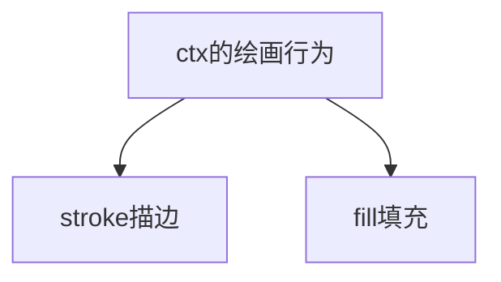
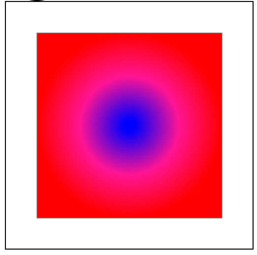
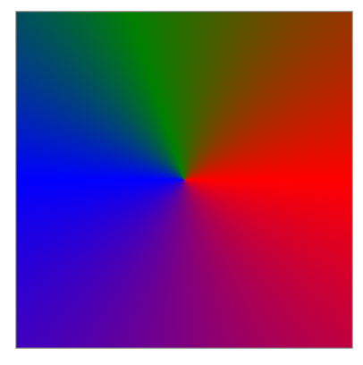
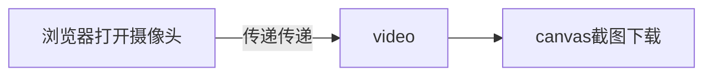
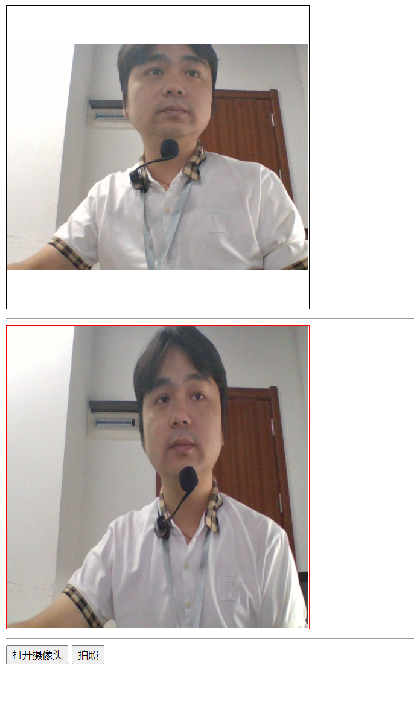

## canvas画布

canvas是html5里面新出的一个标签，它的中文意思是画布，程序员一把喜欢把它理解成一虚拟的屏幕

### 画布的创建

```html
<canvas id="c1" width="400" height="400"></canvas>
```

> 画布非常特殊，它只能通过width/height来设置宽高，不能通过style来进行设置

### 画笔的创建

画笔也叫绘画上下文，有了这个画笔以后，我们就可以在画布上面画任何自己所需要的东西了

```javascript
/** @type {HTMLCanvasElement} */
var c1 = document.querySelector("#c1");
var ctx = c1.getContext("2d");
```

现在在的我们已经可以得到画笔`ctx`，它是一个2d的画笔，有了这个画笔以后，我们就可以画任何我们所需要的东西了

但是在画东西之前，我有个事情要说清楚，ctx的画笔只有两种行为



描边出来的东西一定是空心的，填充出来的东西就一定是实心的

### ctx基本方法与属性

画笔的操作是有很多种情况的，不同的情况对应的方法与属性也不一样

1. `font`用于设置字体的大小与样式
2. `strokeText()`描边一个空心的文本
3. `fillText()`填充一个实心的文本
4. `strokeStyle`设置描边的颜色
5. `fillStyle`设置填充的颜色
6. `strokeRect()`描边一个空心的矩形，一次成形
7. `fillRect()`填充一个实心的矩形，一次成形
8. `clearRect`清除一块矩形的区域
9. `rect()`得到一个矩形的路径，后期可以通过描边`stroke`或`fill`来进行填充
10. `beginPath()`开始一个新的路径。相当于把笔在墨池里面蘸一下墨水
11. `moveTo(x,y)`将笔移动到一个指定的坐标
12. `lineTo(x,y)`画一条线条指定的坐标
13. `stroke()`对之前的路径进行描边
14. `fill()`对之前的闭合区域进行填充
15. `lineWidth`代表细节的粗细
16. `lineCap`设置线条末端的形状
17. `textAlign`用于设置文字的水平排列，它有`left/center/right`或`start/center/end`
18. `textBaseline`用于设置的垂直排列，它有`top/middle/bottom/baseline`
19. `setLineDash([4,10])`设置线条为虚线
20. `arc(x,y,radius,start,end,direction)`画一个弧度，3点钟方向为弧度的起点

### 渐变设置

这里的渐变的原理与我们之前CSS里面渐变的原理是相同的

#### 线性渐变

```javascript
// 第一步：先得到c1的画布
/** @type {HTMLCanvasElement} */
var c1 = document.querySelector("#c1");
var ctx = c1.getContext("2d");

// ctx.strokeRect(50,50,300,100);
ctx.rect(50, 50, 300, 50);
ctx.stroke();
//能够将这个颜色设置成渐变
var gradient = ctx.createLinearGradient(0, 0, 300, 0);
gradient.addColorStop(0, "red");
gradient.addColorStop(0.5, "orange");
gradient.addColorStop(1, "blue");
//这个gradient就是我们所设置的线性渐变色
ctx.fillStyle = gradient;
ctx.fill();
```


除了填充的时候可以使用渐变，我们线条描边的时候也可以使用渐变

```javascript
ctx.beginPath();        //开始一个新路径
ctx.moveTo(0,300);
ctx.lineTo(400,300);
ctx.lineWidth = 50;
ctx.strokeStyle = gradient;
ctx.setLineDash([30,4]);
ctx.stroke();
```


#### 径向渐变

```javascript
// 第一步：先得到c1的画布
/** @type {HTMLCanvasElement} */
var c1 = document.querySelector("#c1");
var ctx = c1.getContext("2d");

ctx.rect(50, 50, 300, 300);
ctx.stroke();

var gradient2 = ctx.createRadialGradient(200, 200, 10, 200, 200, 150);
gradient2.addColorStop(0, "blue");
gradient2.addColorStop(0.5,"deeppink")
gradient2.addColorStop(1, "red");
ctx.fillStyle = gradient2;
ctx.fill();
```



#### 圆锥渐变

```javascript
// 第一步：先得到c1的画布
/** @type {HTMLCanvasElement} */
var c1 = document.querySelector("#c1");
var ctx = c1.getContext("2d");

ctx.rect(50, 50, 300, 300);
ctx.stroke();

//第一步:先创建渐变色
var gradient3 = ctx.createConicGradient(0, 200, 200);
gradient3.addColorStop(0, "red");
gradient3.addColorStop(0.5, "blue");
gradient3.addColorStop(0.7, "green");
gradient3.addColorStop(1, "red");
ctx.fillStyle = gradient3;
ctx.fill();
```



### 绘制图片

图片的绘制分为2种情况，一种是静态绘制，一种是动态绘制。

绘制图片调用的方法是`drawImage(图片对象,x,y,width,height)`

#### 绘制静态的图片

静态图片的绘制指的是绘制页面上面已经加载过了的图片（静态绘制就是绘制一个页面上面已经存在的东西）

```html
<body>
    
    <hr>
    <canvas id="c1" width="400" height="400"></canvas>
</body>
<script>
    /** @type {HTMLImageElement} */
    var img1 = document.querySelector("#img1");
    /** @type {HTMLCanvasElement} */
    var c1 = document.querySelector("#c1");
    var ctx = c1.getContext("2d");

    img1.onload = function () {
        //图片加载完成
        ctx.drawImage(img1, 0, 0, img1.clientWidth / 2, img1.clientHeight / 2);
    }
</script>
```

静态绘制是用得非常广泛的技术

**场景一：实现video的视频截图并下载保存**

```html
<body>
    <video id="v1" src="assets/全班一起歌唱祖国太好听了.mp4" controls></video>
    <canvas id="c1"></canvas>
    <hr>
    <button type="button" onclick="takePhoto()">截图</button>
</body>
<script>
    /** @type {HTMLVideoElement} */
    var v1 = document.querySelector("#v1");
    /** @type {HTMLCanvasElement} */
    var c1 = document.querySelector("#c1");
    var ctx = c1.getContext("2d");
    v1.onloadedmetadata = function () {
        c1.width = v1.clientWidth;
        c1.height = v1.clientHeight;
    }

    /**
     * 截图
     */
    function takePhoto() {
        // 本意是绘图，在这里是把视频里面的东西绘制到画面上面
        ctx.drawImage(v1, 0, 0, c1.width, c1.height);
        // 截图以后，将画布上面的图像信息转换成base64,DataURL指的就是base64
        var base64Str = c1.toDataURL("image/png");
        // 使用a标签下载
        var a = document.createElement("a");
        a.href = base64Str;
        a.download = "标哥的截图.png";
        a.click();
    }
</script>
```

> 1. `drawImage()`这个方法不仅可以绘制图片，还可以绘制视频的当前帧
> 2. `canvas`可以调用`toDataURL()`将画布上面的转变成base64
> 3. `a`是可以实现下载的

**场景二：摄像头拍照**

之前在讲video与浏览器对象的时候，我们讲过一点，可以利用浏览器对象打开摄像头，然后再将报像头的数据对接到video上面 



```html
<body>
    <video id="v1" controls></video>
    <hr>
    <canvas id="c1" width="400" height="400"></canvas>
    <hr>
    <button type="button" onclick="openCamera()">打开摄像头</button>
    <button type="button" onclick="takePhoto()">拍照</button>
</body>
<script>
    /** @type {HTMLCanvasElement} */
    var c1 = document.querySelector("#c1");
    var ctx = c1.getContext("2d");
    /** @type {HTMLVideoElement} */
    var v1 = document.querySelector("#v1");

    //打开摄像头
    function openCamera() {
        navigator.getUserMedia({
            video: true,
            audio: false
        }, function (stream) {
            console.log("成功");
            v1.srcObject = stream;
            v1.play();
        }, function (error) {
            console.log("失败");
            console.log(error);
        });
    }
    //拍照下载
    function takePhoto(){
        if(!v1.paused){
            //将视频里面的数据绘制在画布上面
            ctx.drawImage(v1,0,0,c1.width,c1.height);
            // 将画布上面的东西转换成base64
            var base64Str = c1.toDataURL("image/png");
            // 用a标签下载
            var a = document.createElement("a");
            a.href = base64Str;
            a.download = "照片.png";
            a.click();
        }
        else{
            alert("请先打开摄像头");
        }
    }
</script>
```



#### 绘制动态的图片

绘制一个页面上面已经存在的东西，我们静态绘制；动态绘制就是绘制一个页面上原本不存在的动态创建的东西


