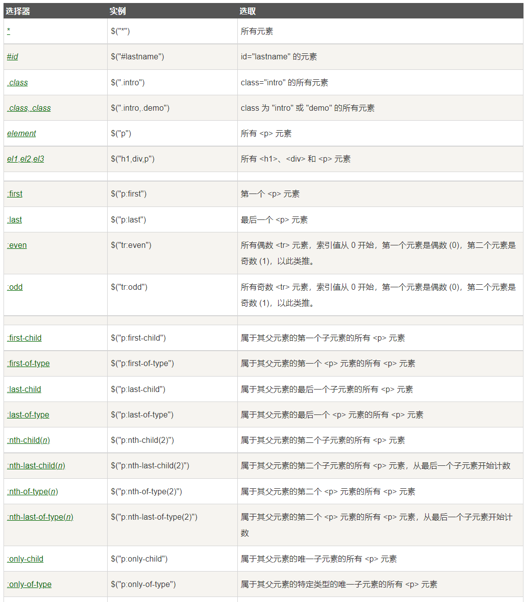
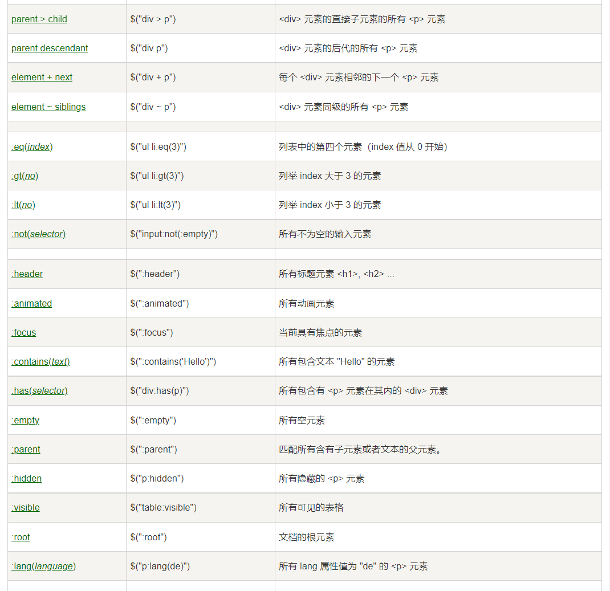
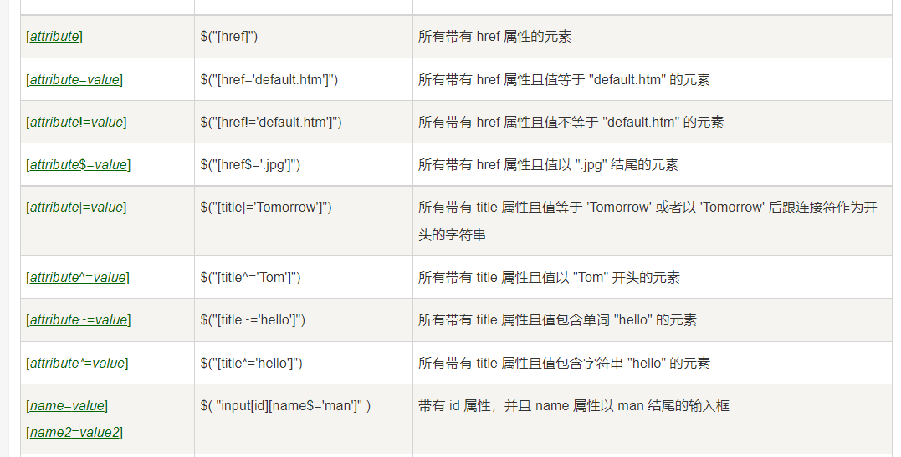
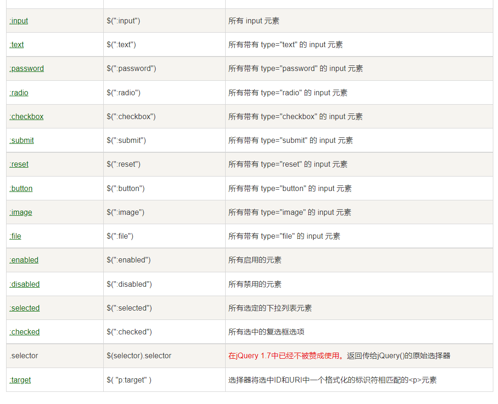
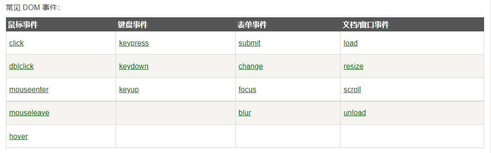
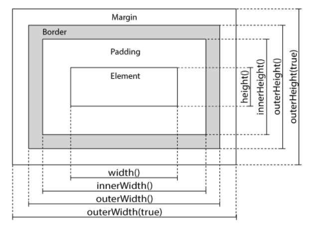
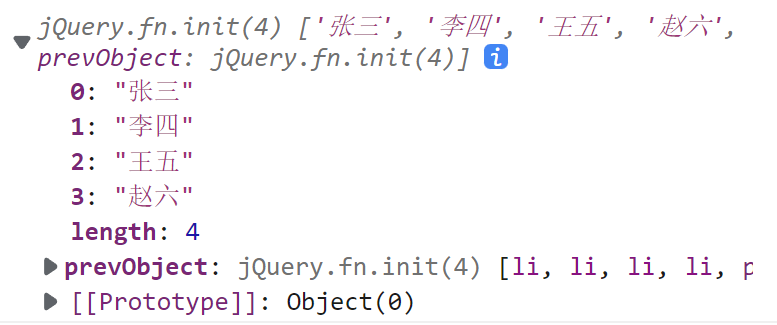
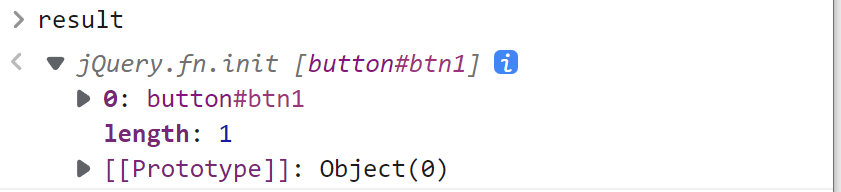
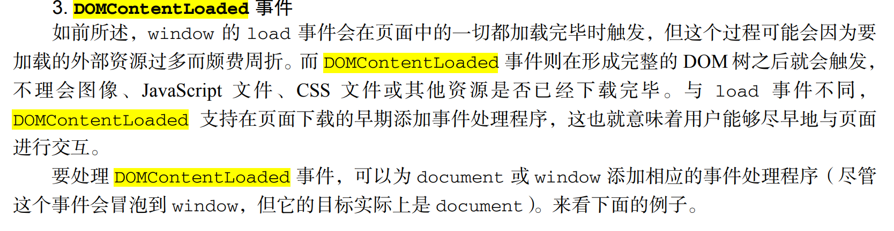

## jQuery

jQuery是一个快速、简洁的[JavaScript](https://baike.baidu.com/item/JavaScript/321142?fromModule=lemma_inlink)框架，是继Prototype之后又一个优秀的JavaScript代码库（框架）于2006年1月由[John Resig](https://baike.baidu.com/item/John Resig/6336344?fromModule=lemma_inlink)发布。jQuery设计的宗旨是“write Less，Do More”，即倡导写更少的代码，做更多的事情。它封装JavaScript常用的功能代码，提供一种简便的JavaScript[设计模式](https://baike.baidu.com/item/设计模式/1212549?fromModule=lemma_inlink)，优化[HTML](https://baike.baidu.com/item/HTML/97049?fromModule=lemma_inlink)文档操作、事件处理、动画设计和[Ajax](https://baike.baidu.com/item/Ajax/8425?fromModule=lemma_inlink)交互。

jQuery的核心特性可以总结为：具有独特的链式语法和短小清晰的多功能接口；具有高效灵活的[CSS选择器](https://baike.baidu.com/item/CSS选择器/2819686?fromModule=lemma_inlink)，并且可对[CSS](https://baike.baidu.com/item/CSS/5457?fromModule=lemma_inlink)选择器进行扩展；拥有便捷的插件扩展机制和丰富的插件。jQuery兼容各种主流浏览器，如[IE](https://baike.baidu.com/item/IE/69103?fromModule=lemma_inlink) 6.0+、FF 1.5+、[Safari](https://baike.baidu.com/item/Safari/597?fromModule=lemma_inlink) 2.0+、Opera 9.0+等。

jQuery的核心点和应用点

1. 优化HTML的文档操作（DOM操作）
2. 事件处理
3. 动画设计
4. Ajax交互

----

### jQuery的安装与导入 

jQuery的安装与导入是非常简单的 ，它就是一个单独的JS文件 ，通过`script`导入进去就可以了

**第一种方式：将jQuery的文件下载到本地，然后导入到项目**

```html
<script src="./js/jquery-3.6.1.js"></script>
```

**第二种方式：通过在线的CDN引入**

```html
<script src="http://libs.baidu.com/jquery/2.0.0/jquery.min.js"></script>
```

通过上面的2种方式我们都可以来导入jQuery，一旦导入jQuery以后就可以使用

> jQuery目前的版本是3.6.1，这个新版本是不兼容低版本的IE的，如果以后在工作当中要兼容低版要一的IE浏览器，建议将jQuery的版本降低到1.8以下。
>
> 工作当中jQuery的版本并不是越高越好，要根据自己的实际工作需求来选择

---

### jQuery的语法结构

jQuery的语法主要是由三个部分组成

1. 起始标志符`$`
2. 选择器
3. 方法

```javascript
//语法格式 
$(选择器).方法();

$(".btn").click();
$(".btn").html();
```


### jQuery的选择器

jQuery的选择器是通过`$`符号来快速的选择页面的元素的，这些选择器与我们之前所学习的CSS的选择保持一致，同时jQuery又扩展了一些新的选择器

**第一类：普通的CSS选择器**



**第二类：jQuery扩展的选择器**



**第三类：属性选择器的扩展**



**第四类：表单相关的选择器扩展**



### jQuery的方法

jQuery是一个优秀的`JS`库，它是一系列方法的集合，我们可以直接通过它所封装的方法来完成一些基本的操作

> jQuery所有的东西都是方法，只有一个属性`length`

```html
<button type="button" id="btn1">按钮1</button>
<ul class="ul1">
    <li>第1项</li>
    <li class="ccc">第2项</li>
    <li>第3项</li>
    <li>第4项</li>
    <li class="aaa">
        <div>第5项</div>
        <a id="a1" href="#">百度一下</a>
        <p>这是段落</p>
    </li>
    <li>第6项</li>
    <li>第7项</li>
    <li>第8项</li>
    <li class="bbb">第9项</li>
    <li>第10项</li>
</ul>
```

 现在我们就已上面的HTML代码为例子来实现我们的方法撑习

#### DOM方法

1. **向子级元素选取children(selector?)**

   ```javascript
   $(".ul1>li");				//获取所有的li
   $(".ul1").children();		//与上面相同
   
   $(".ul1>.aaa");
   $(".ul1").children(".aaa");		//children在选择的时候可以传入选择器进行二次选择
   ```

2. **向后代元素选取find(selector?)**

   ```javascript
   $(".ul1 p");
   $(".ul1").find("p");
   ```

3. **向父级元素选取**

   * `parent(selector?)`
   * `parents(selector?)`
   * `parentsUntil(selector?)`

   ```java
   //CSS的选择器是不能选父级的。这里只能用JS操作完成
   // id="a1"的父级
   $("#a1").parent(); 
   //找所有的父级，直到html元素
   $("#a1").parents();
   // 找所有的父级，直到unitl这个元素为止，但不包含这个until元素
   $("#a1").parentsUntil("body");
   ```

4. **向后面的元素选取**

   * `next(selector?)`
   * `nextAll(selector?)`
   * `nextUntil(selector?)`

   ```javascript
   //下一个元素
   $(".aaa").next();
   // 后面所有的元素
   $(".aaa").nextAll();
   // 所有的元素，直接到bbb为止，但不是包含bbb 
   $(".aaa").nextUntil(".bbb");
   ```

5. **向前面的元素选取**

   * `prev(selector)`
   * `prevAll(selector)`
   * `prevUntil(selector)`

   ```javascript
   //前一项
   $(".aaa").prev();
   //前面的所有
   $(".aaa").prevAll();
   //前面的直到.ccc停止 ,不包含.ccc
   $(".aaa").prevUntil(".ccc");
   ```

6. **兄弟元素选取siblings(selector)**

   ```javascript
   $(".aaa").siblings();
   $(".aaa").siblings(".bbb,.ccc");
   ```

7. **过滤选取filter(selector)**

   这个方法可以在已经选择的元素里面再次进行过滤

   ```javascript
   $(".ul1>li");
   // 在前抽选择的所有的元素里面,过滤符合要求的
   $(".ul1>li").filter(".ccc");
   ```

8. **排除选取not(selector)**

   这个方法可以在已经选择的元素里面，再次进行排除不符合要求的元素

   ```javascript
   $(".ul1>li").not(".aaa");		//在选中的li里面排除.aaa
   $(".ul1>li:not(.aaa)");			//与上面的效果一样
   ```

9. **指定索引选取**

   这个方法可以在已经选择的元素里面找到指定的索引选取

   ```java
   //第1项li
   $(".ul1>li:first-child");
   $(".ul1>li").first();
   //最后1项
   $(".ul1>li:last-child");
   $(".ul1>li").last();
   //第3项
   $(".ul1>li:nth-child(3)");
   $(".ul1>li").eq(2);		//注意eq的索引是从0开始的
   ```

10. **获取当前元素的索引**

    这个方法非常重要，一个元素可以通过这个方法来获取当前元素在父级里面的索引

    ```javascript
    $(".aaa").index();
    ```

---------

#### CSS样式方法

在之前的DOM里面，我们已经通过很多种方式来获取元素的CSS样式，以及操作元素的样式，其实在jQuery里面也有很多方法

1. `classList`
   * `add()`添加样式类
   * `remove()`移除样式类
   * `toggle()`如果有就删除，没有就添加，（切换）
2. `style`属性操作，赋值style样式
3. `window.getComputedStyle()`获取元素的样式

在jQuery里面，上面的操作演变成了下面的方法

1. `addClass()`添加一个样式类
2. `removeClass()`移除样式类
3. `toggleClass()`如果有就删除，没有就添加，（切换）
4. `css()`直接在元素的`style`上面设置

```html
<style>
    .aaa{
        border: 2px solid red;
        color: blue;
    }
    .bbb{
        width: 300px;
        height: 300px;
    }
</style>
<div id="div1" style="font-weight: bold;" class="aaa">盒子</div>
```

现在我们就已上面的代码为例子，来完成相关的操作过程

```javascript
$("#div1").addClass("bbb");					//添加class样式
$("#div1").removeClass("bbb");				//删除class样式
$("#div1").toggleClass("bbb");				//切换样式
```

除了使用上面的方法添加样式与删除样式以外，我们还可以通过`css()`来设置某个样式属性

```javascript
$("#div1").css("background-color","yellow");		//本质就是通过style去设置样式
//设置多个的时候就传入对象 
$("#div1").css({
     borderWidth:"10px",
     "text-decoration":"underline black solid",
     height:"100px"
 });
```

在通过`css`去设置样式的时候 ，一定要注意，如果原来的`CSS`属性名里面有`-`则要注意转义，当然如果不想转义也可以，那就加引号包裹

`css`方法不仅仅可以用来设置，还可以用来获取

```javascript
$("#div1").css("height");			//获取css当中的height属性
$("#div1").css("width");			//获取css当中的width属性
$("#div1").css("color");			//获取css当中的color属性
//这个东西的本质点就是window.getComputedStyle()来完成
```

----

#### 事件方法

在DOM的学习里面，我们已经给同学们提过很多遍，DOM的重点在DOM操作与事件里面，同样，在jQuery里面，也有相应的DOM的简化操作

在jQuery里面，**它将常用的DOM事件进行了封装，形成一些特有的方法**

```html
<body>
    <button type="button" class="btn">按钮1</button>
    <button type="button" class="btn">按钮2</button>
    <button type="button" class="btn">按钮3</button>
    <button type="button" class="btn">按钮4</button>
</body>
<script src="./js/jquery-3.6.1.js"></script>
<script>
    $(".btn").click(function(event){
        console.log(this);
    });
    $(".btn").mouseover(function(event){
        console.log("鼠标进来了")
    });
</script>
```



**注意**：jQuery只是把常用的事件封装成了一个事件方法，那么对于那些学中用的事件，那怎么办呢？

这个时候jQuery提供一个`on`的方法单独的所有的事件进行绑定

#### jQuery的on的事件绑定

所有的事件都可以通过`on`的方式来绑定

```javascript
$(".btn").on("click",function(event){
    console.log(this);
});
$(".btn").on("mouseover",function(event){
    console.log("鼠标进入了");
});
```

所有DOM元素的事件都 可以通过`on`来完成绑定，这一点就比较方便

#### jQuery同一个元素的多个事件绑定

在DOM的操作过程当中 ，我们经常会对同一个元素进行多个事件绑定，这个时候的jQuery就非常方便了

```javascript
$(".btn").on({
    click:function(event){
        console.log(this,"单击");
    },
    mouseover:function(event){
        console.log(this,"鼠标进入");
    }
});
```

#### jQuery中on的事件委托绑定

事件委托是DOM操作当中的重点，它利用了事件传播的特点，将本来应该是自己绑定的事件结果绑定在的它的外层元素，然后通过事件冒泡来触发事件

```html
 <ul class="ul1">
     <li>第一项</li>
     <li>第二项</li>
     <li>第三项</li>
</ul>
```

我们现在需要对`ul1`下面的所有`li`进行事件绑定

```javascript
$(".ul1>li").on("click",function(event){
    console.log(this);
});
```

通过上面的方式绑定以后，如果我们又新增了某些内容 ，这些新增的内容就不会有事件

```javascript
 $(".ul1").append("<li>新加入的项</li>");
```

为了解决这样的问题，我们之间的原生的DOM操作里面使用了事件委托 ，现在jQuery里面也有事件委托 

```javascript
$(".ul1").on("click","li",function(event){
    console.log(this);
});
```

> 在上面的代码里面，我们的事件仍然是绑定在了`ul1`上面，但是它判断了事件的触发者`li`，这就是典型的事件委托

----

#### jQuery中的one单次事件绑定

有时候我们希望某一些事件执行一次以后就解除绑定，这个时候的事件就只会触发一次。如果希望实现这样的效果，可以使用`one`来进行事件绑定

```javascript
$(".btn1").one("click", function (event) {
    console.log(this);
});
```

**注意事项**

```html
<body>
    <ul class="ul1">
        <li>第一项</li>
        <li class="aaa">第二项</li>
        <li>第三项</li>
        <li class="aaa">第四项</li>
        <li>第五项</li>
    </ul>
</body>
<script src="./js/jquery-3.6.1.js"></script>
<script>
    // 对.aaa做事件委托的单次绑定
    $(".ul1").one("click", ".aaa", function (event) {
        console.log(this);
    })
</script>
```

#### jQuery中的off移除事件

```html
<body>
    <button type="button" id="btn1">按钮</button>
</body>
<script src="./js/jquery-3.6.1.js"></script>
<script>
    function abc() {
        console.log("你好啊");
    }

    function def() {
        console.log("hello wolrd");
    }

    $("#btn1").on("click", abc);
    $("#btn1").on("click", def);

    // $("#btn1").off("click");        //移除了整个click事件
    $("#btn1").off("click", abc);       //只移除abc的这次事件监听 

    // var btn1 = document.querySelector("#btn1");
    // btn1.addEventListener("click",abc);
    // btn1.removeEventListener("click",abc);
</script>
```

----

#### 属性方法

属性方法主要用于操作DOM的属性，jQuery也封装了一些操作dom属性的方法

1. **html(value?)**方法，该方法用于获取或设置`innerHTML`的属性

   ```javascript
   // 没有放参数就是获取
   $("#div1").html();
   //如果放了一个参数就代表赋值
   $("#div1").html("<input type='text' />")
   ```

2. **text(value?)**方法，该方法用于获取或设置`innerText`的属性

   ```javascript
   //没有参数
   $("#div1").text();
   //如果放了参数就是对innerText赋值
   $("#div1").text("<input type='text' />");
   ```

3. **val(value?)**方法，该方法用于获取或设置表单元素的`value`属性

   ```javascript
   //没有参数就是取值
   $("#txt1").val();
   //有参数就是赋值
   $("#txt1").val("标哥哥");
   ```

4. **attr(name,value)**方法，该方法相当于DOM里面的`getAttribute`与`setAttribute`

   ```javascript
   //属性取值，相当于getAttribute("type")
   $("#txt1").attr("type");
   //属性赋值，相当于setAttribute("type","password")
   $("#txt1").attr("type","password");
   ```

5. **prop(name,value)**方法，用于获取或设置DOM里面单属性的值,也可以获取DOM对象上面的属性

   ```javascript
   $("#ck1").prop("checked");			//这就是获取checked的属性值
   $("#ck1").prop("checked",false);
   ```

6. **removeAttr(name)**删除一个属性，这个方法相当于DOM里面的`removeAttribute()`

   ```javascript
   $("#txt1").removeAttr("type")
   ```

7. **data()**方法，用于获取或设置以`data-`开头的自定义属性

   ```html
   <body>
       <div id="div1" data-age="18" ></div>
   </body>
   <script src="./js/jquery-3.6.1.js"></script>
   <script>
       $("#div1").attr("data-age");        //18
       $("#div1").data("age");             //18
   
       $("#div1").attr("data-age",50);     //设置为50
       $("#div1").attr("data-age");        //50
       $("#div1").data("age");             //18		问题就在这里
   </script>
   ```

   > 坑：data()方法获取的属性如果后期发生更改以后，这个值是不会自动更改的
   >
   > 请同学们慎用这个方法

------

 8. **remove()**删除元素自身 ，这个方法与DOM里面的remove保持一致

    ```javascript
    $(".ul1").remove();
    ```

 9. **empty()**清空所有的子元素

    ```javascript
    $(".ul1").empty();
    ```

 10. 新增元素

     - append() - 在被选元素的结尾插入内容，相当于参数`beforeEnd`
     - prepend() - 在被选元素的开头插入内容，相当于`afterBegin`
     - after() - 在被选元素之后插入内容m，相当于`afterEnd`
     - before() - 在被选元素之前插入内容，相当于`beforeBegin`

     ```javascript
     $(".ul1").append("<li>append</li>");
     $(".ul1").prepend("<li>prepend</li>");
     $(".ul1").before("<li>before</li>");
     $(".ul1").after("<li>after</li>");
     ```

     上面的方法不仅仅可以追加HTML的字符串，还可以追加元素

#### 尺寸方法

在之前学习DOM的时候，我们有一些方法用来获取dom元素的大小，如`offwetWidth/clientWidth/scrollWidth`，这些大小在 jQuery里面是可以快速的获取的



* `width()` 代表元素的大小
* `innerWidth()`元素的大小+内边距的大小
* `outerWidth()`元素大小+内边距大小+边框的大小
* `outerWidth(true)`元素大小+内边距大小+边框大小+外边距

#### 动画方法

jQuery里面的动画方法更多的情况下应该把它理解为CSS里面的过渡效果，它可以让元素在执行变化的时候有一个过渡的效果

1. `show(speed,callBack)/hide(speed,callBack)/toggle(speed,callBack)`隐藏与显示

   当然们如果想要隐藏一个元素或显示一个元素的时候就可以使用上面的方法。我们也看到了上面的方法里面可以接收参数

   如果没有写参数，则元素就是直接隐藏与显示，如果加了参数就代表元素会有一个速度进行过渡，它的速度值有以下几个

   * `slow`慢速的
   * `normal`正常的
   * `fast`快速的
   * `miniSeconds`毫秒

   ```javascript
   $(".box").hide();
   $(".box").show();
   $(".box").hide("slow");				//慢慢的隐藏掉
   $(".box").toggle(5000);				//在隐藏与显示的时候会有5秒的时长
   ```

2. `slideUp(speed,callBack)/slideDown(speed,callBack)/slideToggle(speed,callBack)`上拉与下滑

   这个里面的速度参数与上面的是一样的，如果不设置速度，默认就是`normal`

3. `fadeIn(speed,callBack)/fadeOut(speed,callBack)/fadeToggle(speed,callBack)/fadeTo(speed,opacity,callBack)`渐隐渐现

   这里面多了一个`fadeTo`，这个方法是将元素设置成指定的透明度

4. `animate(css属性,时间,callBack)`自定义动画方法

   ```javascript
   $(".box").animate({
       marginLeft:"100px",
       "border-radius":"50%"
   }, 5000);
   ```

   animate这个方法本质上面就是让元素在执行CSS样式变化的时候添加一个过渡的效果

5. `stop()`停止之前未完成的动画

> jQuery里面的动画内部是通过`setInterval/setTimeout`来实现的，所以它全部都是异步的

#### jQuery动画的回调函数

我们刚刚已经说过了，jQuery里面的动画内部是通过`setInterval/setTimeout`来实现的，所以它是异步，有了这个特点，我们就来看一看下面的代码

```javascript
$("#btn1").click(function(){
    $(".box").slideUp(5000);
    console.log("hello");
});
```

在上面的代码里面，虽然`slideUp`需要5000毫秒的时间，但是我们后面的代码`console.log()`并没有在5秒以后执行，而是立即执行，这就是因为`slideUp()`这个动画方法是异步的，而异步执行

**现有有这么个需求，需要某些代码必须在动画结束以后才可以执行，怎么办呢？**

```javascript
$("#btn1").click(function () {
    $(".box").slideUp(5000, function () {
        //这里就是回调函数
        console.log("hello");
    });
});
```

#### Ajax方法

在jQuery里面，我们发起一个`ajax`的请求是非常简单的

```javascript
 var str = "http://www.softeem.xin:8888/public/musicData/musicData.json";
$("#btn1").click(function () {
    $.ajax({
        method:"GET",
        url:str,
        dataType:"json",        //原生xhr对象里面的responseType
        success:function(result){
            //请求成功以后的回调
            console.log(result)
        },
        error:function(error){
            //请求失败以后的回调
            console.log(error);
        },
        complete:function(){
            // 请求完成以后的回调
            // 无论最终的结果是成功的，还是失败的，它都会完成
            console.log("请求完成")
        }
    });
});
```

上面的代码就是`ajax`最基本的jQuery封装代码，使用起来也非常方法

-----

jQuery也知道我们以后会频繁的去使用ajax请求，jQuery也知道目前使用得最多的2种请求分别是`get`请求和`post`请求，所以jQuery在内部对这2个东西做了从化

**get请求**

```javascript
var str = "http://www.softeem.xin:8888/public/musicData/musicData.json";
$("#btn1").click(function () {
    $.get(str, function (result) {
        console.log(result)
    });
});
```

**post请求**

```javascript
$.post(str,function(result){
   	//请求的结果 
});
```

-----

#### 其它方法

1. `each`遍历方法

   之前在数组里面有一个方法叫`forEach`，但是这个方法只有数组里面才有，其它的类数组里面可能没有，如果需要使用`forEach`就必须将类数组转换成数组

   jQuery直接提供了一个像这样的方法`each`来方便我们遍历

   ```javascript
   var arr = ["a","b","c","d","e"];
   $.each(arr,function(index,item){
       //index代表索引 ，item代表遍历的每一项
       console.log(index,item)
   })
   ```

   **还可以这样写**

   ```javascript
   $(arr).each(function(index,item){
       console.log(index,item);
   })
   ```

2. `map`遍历方法

   这个方法与之前的数组里面的`map`方法一样的，可以接收每一次回调函数的返回值

   ```html
   <body>
       <ul class="ul1">
           <li>张三</li>
           <li>李四</li>
           <li>王五</li>
           <li>赵六</li>
       </ul>
   </body>
   <script src="./js/jquery-3.6.1.js"></script>
   <script>
       var result = $(".ul1>li").map(function(index,item){
           // item仍然代表每一项dom
           return $(item).text();
       });
   </script>
   ```

   最终的结果如下

   

3. `toArray()`方法

   这个方法可以将类数组转换成数组

   ```html
   <body>
       <ul class="ul1">
           <li>张三</li>
           <li>李四</li>
           <li>王五</li>
           <li>赵六</li>
       </ul>
   </body>
   <script src="./js/jquery-3.6.1.js"></script>
   <script>
       // toArray可以将类数组转换成数组
       var result = $(".ul1>li");
       // 要把上面的jQuery对象的类数组转换成数组
       var result2 = Array.prototype.slice.call(result);
       // 在jQuery里面，更方法
   
       var result3 = $(".ul1>li").toArray();
   </script>
   ```

4. `makeArray()`方法

   这个方法与上面的方法保持一致，也是将类数组转换成数组

   ```javascript
   var result = $(".ul1>li");
   var result4 = $.makeArray(result);
   ```

-----

### jQuery的链式语法

在学链式语法之前，一定要弄清楚jQuery所有的操作都是设置或获取。<span style="color:red;text-decoration:underline blue double">但是jQuery执行的是批量设置，单个获取</span>

```html
<body>
    <button type="button" class="btn1">按钮1</button>
    <button type="button" class="btn1">按钮2</button>
    <button type="button" class="btn1">按钮3</button>
    <button type="button" class="btn1">按钮4</button>
    <button type="button" class="btn1">按钮5</button>
</body>
<script src="./js/jquery-3.6.1.js"></script>
<script>
// 批量设置
$(".btn1");     //选中3个按钮
// $(".btn1").html("标哥哥");			//所有的按钮都会变成标哥哥
// 单个获取
var str = $(".btn1").html();
</script>
```

通过上面的例子我们可以看到jQuery设置与获取操作是不一样的

通过 jQuery，可以把动作/方法链接在一起（仅限于设置操作）。如下所示

```html
<body>
    <button type="button" class="btn1">按钮1</button>
</body>
<script src="./js/jquery-3.6.1.js"></script>
<script>
    $(".btn1"); 
    // 将内容换成标哥哥
    // 将宽度设置成150px
    // 绑定一个单击事件
    $(".btn1").html("标哥哥");
    $(".btn1").css("width","150px");
    $(".btn1").on("click",function(event){
        console.log("你好");
    })
</script>
```

上面的代码虽然完成了功能 ，但是，并不完美，我们完全可以使用链式语法去完成

```javascript
//所谓的链式语法就是一次选择，多次设置
$("选择器").方法1().方法2().方法3();
//只要是设置的操作，可以一直添加
$(".btn1").html("标哥哥").css("width", "150px").on("click", function (event) {
    console.log("你好");
})
```

同时，jQuery的链式语法在DOM选取的时候也是可以进行的，如下所示

```html
<body>
    <ul>
        <li>第1项</li>
        <li class="aaa">第2项</li>
        <li>第3项</li>
        <li>
            <a href="#">第4项</a>
            <p>哈哈哈</p>
        </li>
        <li>第5项</li>
    </ul>
</body>
<script src="./js/jquery-3.6.1.js"></script>
<script>
    $(".aaa").parent().parent();   //body
    $(".aaa").next().next().children("p")
</script>
```

----

### DOM对象与jQuery对象的切换

#### jQuery对象转普通的DOM对象

我们可以通过`$(选择器)`的方式来得到jQuery选中以后的结果，这个结果它是一个包含了当前元素的类数组，如下所示

```javascript
var result = $("#btn1");
```



它不是dom对象，它是一个jQuery对象，如果你想获取里面的第0个元素，应该怎么办呢？如果想获取里面某一个真实的DOM怎么办呢？

```javascript
var btn1 = $("#btn1")[0];		//这个时候的btn就是真实的dom	
```

#### 普通的DOM对象如何转换成jQuery对象

当一个普通的DOM对象如果想转换成jQuery的对象，则可以直接用选择器选择

```javascript
var btn1 = document.querySelector("#btn1");
$(btn1);        //直接通过jQuery的选择器去完成操作
//所有后期经常会有一个这样的操作
$(this);
```

### jQuery的文档就绪函数

我们要弄清楚一点，jQuery是进行DOM操作，而DOM在加载的时候是需要时间的，如`img`标签它会加载一张图片，如果网络情况不是很好，加载就会变非常慢 。

 网页上面的内容加载完之前，我们不应该去操作网页，一定要等网页加载完以后再操作网页

```html
<!DOCTYPE html>
<html lang="zh">
<head>
    <meta charset="UTF-8">
    <meta http-equiv="X-UA-Compatible" content="IE=edge">
    <meta name="viewport" content="width=device-width, initial-scale=1.0">
    <title>加载</title>
    <script src="./js/jquery-3.6.1.js"></script>
    <script>
        $("#btn1").click(function(event){
            alert("你好啊");
        })
    </script>
</head>
<body>
    <button type="button" id="btn1">按钮1</button>
</body>

</html>
```

在上面的代码里面，我们的事件是不会绑定成功的，因为在进行元素的选择的时候，`button`按钮还没有被页面加载 

为了解决上面的问题，我们通常这么做

**第一种方式 ：通过window.onload事件来完成**

```html
<!DOCTYPE html>
<html lang="zh">

<head>
    <meta charset="UTF-8">
    <meta http-equiv="X-UA-Compatible" content="IE=edge">
    <meta name="viewport" content="width=device-width, initial-scale=1.0">
    <title>加载</title>
    <script src="./js/jquery-3.6.1.js"></script>
    <script>
        window.onload = function () {
            console.log("网页加载完成");
            $("#btn1").click(function (event) {
                alert("你好啊");
            })
        }
    </script>
</head>
<body>
    <button type="button" id="btn1">按钮1</button>
</body>

</html>
```

> 这的window.onload代表网页加载完成以后的事件，所以当网页加载完了以后，我再去进行DOM的操作，这个时候的页面上面应该是已经有了`button`按钮了，所以再对button进行事件绑定就不会有问题了

上面的方法好是好，但是有一个点不好，window.onload这个事件必须等待页面上面所有的元素都加载完成才会触发

```html

<audio src="./music/02.mp3"></audio>
<video src="./v/03.mp4"></video>
```

上面的代码里面有三个标签 ，而3个标签 都有`src`属性，有`src`属性就会有`onload`事件，所以如果`window.onload`的事件想要触发，必须要等上面的3个元素的全部加载完成

但是隐患非常大

```html
						<!--加载成功，触发onlaod-->
<audio src="./music/02.mp3"></audio>			<!--加载成功，触发onlaod-->
<video src="./v/03.mp4"></video>				<!--加载失败-->
```

如果有元素加载比较慢或加载失败，就会影响window.onload的执行

**通过DOMContentLoaded事件**



这个事件当网页一旦加载完成就可以立即触发

```html
<!DOCTYPE html>
<html lang="zh">

<head>
    <meta charset="UTF-8">
    <meta http-equiv="X-UA-Compatible" content="IE=edge">
    <meta name="viewport" content="width=device-width, initial-scale=1.0">
    <title>加载</title>
    <script src="./js/jquery-3.6.1.js"></script>
    <script>
        document.addEventListener("DOMContentLoaded", function (event) {
            console.log("网页文档加载完成了");
            $("#btn1").click(function (event) {
                alert("你好啊");
            })
        })
    </script>
</head>

<body>
    <button type="button" id="btn1">按钮1</button>
</body>

</html>
```

jQuery的内部其实也是通过这个来实现的文档就绪，所以jQuery也自己封装了文档就绪函数

```javascript
$(document).ready(function(event){
    console.log("jQuery的文档就绪事件");
})
```

上面文档就绪的函数可以简写

```javascript
$(function(){
    //文档就绪函数
});
```

