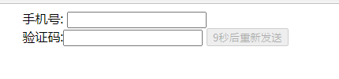

## 姓名：`___汤俊豪___________`

### 选择题

1.下面哪种不是jquery的选择器？【D 】

A.id选择器

B.元素选择器

C.类选择器

D.xpath选择器


2、有这样一个表单元素<form hidden="hidden">...</form>，想要找到这个表单元素，下面哪个选项是正确的？【 B】

A.$("[hidden='visible']")

B.$("form[hidden='hidden']")

C.$("form").visible()

D.$("form")hidden()


3.如果想在一个指定的元素后添加内容，下面哪个是实现该功能的？【 D】

A.append(content)

B.appendTo(content)

C.insertAfter(content)

D.after(content)


4.在jquey中，如果想要从DOM中删除所有匹配的元素，下面哪一个是正确的？【C 】

A.delete()

B.empty()

C.remove()

D.removeAll()


5.在jquery中，想要给一个指定的元素添加样式，要使用哪个jQuery方法？【 D】

A.first

B.eq(1)

C.css(name)

D.css(name,value)


6.在jquery中，如果想要获取当前**窗口可视区域**的宽度值，下面哪个是实现该功能的？【B 】

A.$(document.body).outerWidth(true)

B.$(window).width()

C.$(document).width()

D.$(document.body).width()


7.下面哪几个属于jquery的事件处理? 【 ABD】

A.bind(type)

B.click()

C.onchange()

D.one(type)


8.在jquery中指定一个类，如果存在就执行删除功能，如果不存在就执行添加功能，下面哪一个是可以直接完成该功能的？【 C】


A.removeClass()

B.deleteClass()

C.toggleClass(class)

D.addClass()


9. 在鼠标事件中，获取鼠标相对于当前窗口可视区域的纵向坐标，以下代码正确的是【 D】

A. event.offset().top

B. event.clientY

C. event.offsetTop

D. event.pageY


10. 关于JavaScript说法正确的是：【 CD】

    A. JavaScript与Java语法完全一样

    B. JavaScript要运行必须安装Java运行环境

    C. JavaScript一般用于在网页上实现数据验证及特效等

    D. JavaScript可于开发Windows应用程序


11.对方法声明中的错误代码：function Add(int i1,int i2) 分析正确的是【 A】

A. 参数不能指定数据类型

B. 没有指定返回类型

C. 没有指定访问

D. Function不是方法声明的关键字


12. 代码：document.bgColor="red" 的意思是【 C】

    A 设置网页的文字颜色为红色

    B 设置ID为document的标签的背景色为红色

    C 设置网页的背景色为红色

    D 语法错误


13. x={x:1};y={y:1};z=1;n='1',下面结果为true的是【D 】

    A. x === y

    B. x ==y

    C. z === n

    D. z == n


14.JavaScript的组成不包括【 D】

A ECMAScript

B DOM

C BOM

D document


15.以下代码执行后，分别弹出来的值是： 【 D】

```js
var num1=1;   
function testf1(){  
    num1=2;    
    var num1;  
    alert(num1); 
} 
function testf2(){  
    alert(num1); 
}   
testf1();   
testf2();
```

A  2,1

B  2,2

C  undefined,undefined

D  2，undefined


16.代码的输出结果是 【C 】

```js
function add(){ 
    var sum = 1 + 2;  
    console.log(sum); 
} 
console.log(sum) ;
```

A  输出两个3

B  输出一个3

C  程序报错

D  输出一个undefined


17.typeof null 检测出来的数据类型是【 C】

A null

B number

C object

D undefined


18.下面有关javascript常见事件的触发情况，描述错误的是？【D 】

A. onmousedown：某个鼠标按键被按下

B. onkeypress：某个键盘的字符键被按下或按住

C. onblur：元素获得焦点

D. onchange：用户改变域的内容


19.下面有关JavaScript中事件冒泡和事件捕获的描述，错误的是？【 D】

A. DOM2级事件处理程序可以添加到事件冒泡也可以添加到事件捕获

B. 事件冒泡是由最具体元素逐级向最不具体元素传播

C. 事件捕获是由最不具体元素逐级向最具体元素传播

D. DOM0级事件处理程序可以添加到事件冒泡也可以添加到事件捕获


20.请问以下函数里的this指向是谁【 A】

    var obj={};
    obj.test1=function (){ 
     	alert(this);
     }      
    var test2=obj.test1;
    var x = test2();

A.window   

B.docment   

C.body  

D.obj

21. 当DOM加载完成后要执行的函数,下面哪个是正确的?   【C 】

A、jQuery(expression, [context]) 

B、jQuery(html, [ownerDocument]) 

C、jQuery(callback) 

D、jQuery(elements)

22. `<a href="xxx.jpg" title="标哥哥出席学校...">新闻</a>,`获取`<a>`元素title的属性值。【C 】

A、$("a").attr("title").val();

B、$("#a").attr("title");

C、$("a").attr("title");

D、$("a").attr("title").value;

23. 在jquey中，如果想要从DOM中删除所有匹配的元素，下面哪一个是正确的    【 C】

A、delete()

B、empty()

C、remove()

D、removeAll()

24. `$('p').append('<b>快乐编程</b>');`     【A 】

A、`<p>找我想要的工作<b>过我想要的生活</b> </p>`

B、`<p><b>过我想要的生活</b>找我想要的工作</p>`

C、`<p>找我想要的工作</p><b>过我想要的生活`</b>

D、`<b>过我想要的生活</b><p>找我想要的工作</p>`


25. 关于bind( )方法与unbind( )方法说法正确的是(CD ) 【多选题】 

A、bind( )方法可用来移除单个或多个事件

B、unbind( )方法可以同时移除多个事件，但不能移除单个事件

C、使用bind( )方法可同时绑定鼠标事件和键盘事件

D、unbind( )方法是与bind( )方法对应的方法


26. 在jQuery中，下面的说法错误的是( C)    

A、$("ul li:first") 指选取`<ul>`下的第一个`<li>`子元素

B、$("ul li:gt(2)") 指选取`<ul>`下的索引从2开始的所有`<li>`子元素

C、$("ul li:eq(2)") 指选取`<ul>`下的索引为2的`<li>`子元素

D、$("ul li:not(:first)")指选取`<ul>`下的除了第一个`<li>`子元素的所有`<li>`子元素

27. 在Jquery中，下列选项中，不是表单选择器的是(C )   

A、:input

B、:select

C、:button

D、:radio


#### 填空题

defineProterty的属性值有哪些

```
value writable enumable
```

移动端常用事件有

```
 touchstart 触摸开始
 touchend 触发结束
 touchcancel 触摸取消
 touchmove 触摸滑动
```

在DOM操作的时候，我们可以通过哪个方法来获取计算后的元素样式信息

```
getComputeStyle()
```

DOM中用于获取元素的方法有

```
getElementById() getElementByClass() getElementByTag() querySelector() querySelectorAll()
```

#### 问答题

1. forEach，map和filter的区别？

   ```
   forEach不用return，map将return回的东西打包成数组，filter将满足条件(true)的return回来打包成数组
   ```

2. src和 href 的区别

   ```
   src是把资源拿过来用，（主场）自己可以进行很多操作
   href是自己去取资源，（客场）不能进行太多操作

3. body中的onload()函数和jQuery中的document.ready()有什么区别?

   ```
   onload要资源完全加载完成才会执行下一步操作，而ready是确定资源只要就绪，即使没完全加载完也会执行下一步操作

4. 使用jQuery将页面上的所有元素边框设置为2px宽的虚线?

   ```
   $("*").css({
   borderWidth:2px,
   borderStyle:dashed,
   borderColor:black
   })

#### 编程题

1. 完成下面验证码倒时计的效果，要求使用`setTimeout`及`setInterval`各实现一次

   

   ```
    var btn = document.querySelector("#btn");
   
       btn.addEventListener("click", function () {
           btn.disabled = true;
           setTimeout(function () {
               btn.innerText = 9 + "秒后重新发送";
           }, 1000)
           setTimeout(function () {
               btn.innerText = 8 + "秒后重新发送";
           }, 2000)
           setTimeout(function () {
               btn.innerText = 7 + "秒后重新发送";
           }, 3000)
           setTimeout(function () {
               btn.innerText = 6 + "秒后重新发送";
           }, 4000)
           setTimeout(function () {
               btn.innerText = 5 + "秒后重新发送";
           }, 5000)
           setTimeout(function () {
               btn.innerText = 4 + "秒后重新发送";
           }, 6000)
           setTimeout(function () {
               btn.innerText = 3 + "秒后重新发送";
           }, 7000)
           setTimeout(function () {
               btn.innerText = 2 + "秒后重新发送";
           }, 8000)
           setTimeout(function () {
               btn.innerText = 1 + "秒后重新发送";
           }, 9000)
           setTimeout(function () {
               btn.innerText = "发送";
               btn.disabled = false;
           }, 10000)
       })
       //第二种
       var btn = document.querySelector("#btn");
   
       btn.addEventListener("click", function () {
           btn.disabled = true;
           var i = 9;
           var re = setInterval(function () {
               btn.innerText = i + "秒后重新发送";
               if (i < 1) {
                   btn.innerText = "发送";
                   btn.disabled = false;
                   clearInterval(re);
               }
               i--;
           }, 1000)
       })
   ```

   

2. 使用你所知道的方法，编写出数组去重的方法

   ```
   function quchong(arr) {
           var arr2 = [];
           arr.forEach(function (item, index, arr1) {
               if (arr2.indexOf(item) == -1) {
                   arr2.push(item);
               }
           })
           return arr2;
       }
   ```

   

3. 写一个mul函数，使用方法如下:【提示：这一种情况叫“函数柯里化”】

   ```javascript
   var a = mul(2)(3)(4); 
   console.log(a); // output : 24 
   
   var b = mul(4)(3)(4)
   console.log(b); // output : 48
   ```

4. 判断一个字符串中出现次数最多的字符，并统计次数。

   ```
   function wordNum(str) {
           var str2 = str.split("");
           console.log(str2);
           str3 = {};
           str2.forEach(function (item, index) {
               if (item in str3 == false) {
                   str3[item] = 0;
               } else {
                   str3[item]++;
               }
           })
           var arr = Object.keys(str3);
           var maxstr;
           var max = 0;
           arr.reduce(function (pre, cur) {
               if (str3[cur] > str3[pre]) {
                   maxstr = cur;
                   max = str3[cur];
                   return cur;
               } else {
                   return pre;
               }
           }, arr[0])
           console.log(maxstr + "字最多");
           console.log("字数:", max);
       }
   ```

   

5. 现在几个动物分别小猫Cat和小狗Dog,Cat构造函数里面有性别（sex），年龄（age），昵称 （nickName）和体重（weight）四个属性，而Dog构造函数里面有性别，年龄，昵称 ，和身高 （height）四个属性，猫与狗有一个共同的方法叫sleep睡觉，但是猫有一个方法 `miao` ,狗有一个方法 叫 `wang `

   * 现在请列举出Cat与Dog的构造函数，并且提取公共部分使用继承 

   * 突然之间又有一个小动物，农家田园犬Pastoral，它也是属于狗的类别，也具备Dog所有的属性，但是它还有一个方法是看门 `janitor` 

   现在请创建 Pastoral 的构造函数，并实现继承关系【要求使用标哥最后教大家的组合继承与寄生继承来完成】

   ```
   function Animal(sex, age, nickName) {
           this.sex = sex;
           this.age = age;
           this.nickName = nickName;
           this.sleep = function () {
               console.log("睡觉");
           }
       }
   
       function Cat(sex, age, nickName, weight) {
           this.weight = weight;
           this.miao = function () {
               console.log("喵");
           }
           Animal.prototype.call(this, sex, age, nickName)
       }
   
       Cat.prototype = Object.create(Animal.prototype);
       Cat.prototype.constructor = Cat;
   
       function Dat(sex, age, nickName, height) {
           this.height = height;
           this.wang = function () {
               console.log("汪");
           }
           Animal.prototype.call(this, sex, age, nickName)
       }
   
       Dog.prototype = Object.create(Animal.prototype);
       Dog.prototype.constructor = Dog;
   
       function Peastoral(sex, age, nickName, height) {
           this.height = height;
           this.janitor = function () {
               console.log("看门");
           }
           Animal.prototype.call(this, sex, age, nickName)
       }
   
       Peastoral.prototype = Object.create(Dog.prototype);
       Peastoral.prototype.constructor = Peastoral;
   ```

   