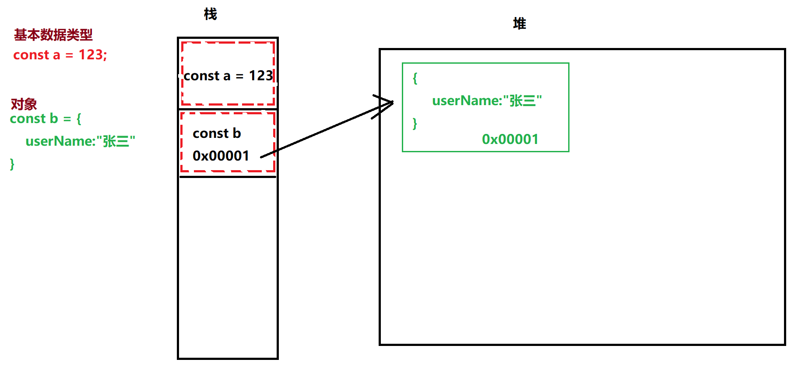
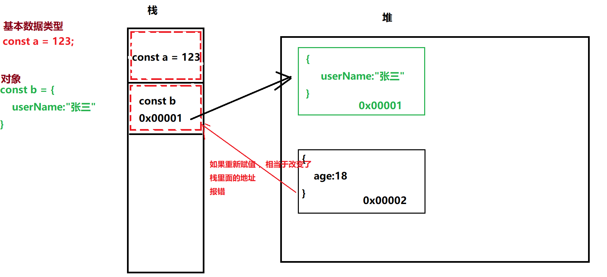
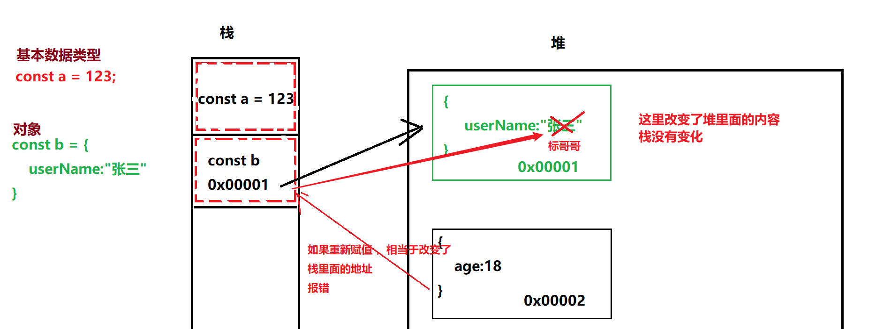
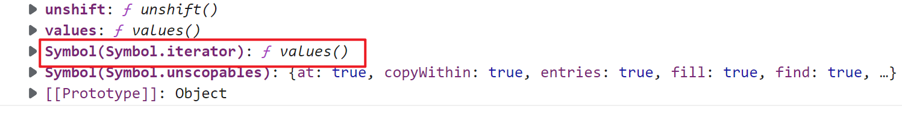
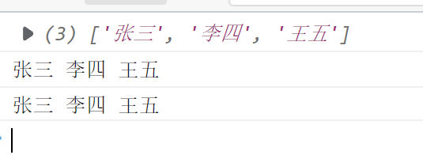

## ECMAScript 6

之前我们学习过ES5，ES的全称叫ECMAScript，它是JavaScript的一部分，ES主要包含了语法，关键字，流程控制 ，运行符，面向对象，数据类型等。

ES6的全称叫ECMAScript6 ，也叫ECMAScript 2015，它是2015年发布的，它是新一代的ECMAScript的语法标准与规则，只涉及到了ES的部分，不涉及任何的DOM与BOM

ES6主要的技术如下

1. 变量，常量
2. 取值与赋值，解构
3. 运算符的扩展，展开运算符，指数运算符
4. 字符串的扩展
5. 数组的扩展
6. 函数的扩展
7. Set单值集合
8. Map健值对集合
9. 对象的扩展及class/extends关键字
10. 生成器与迭代器及迭代器接口
11. 反射Reflect
12. 代理Proxy
13. Promise异步处理，`async`及`await`的使用
14. ES6的模块化处理ESModule
15. CommonJS模块化

-----

### let变量定义

在之前的ES5里面，如果我们想定义一个变量，我们可以使用`var`关键字来进行，关于`var`的特点，我们也知道以下几个

1. `var`没有数据类型
2. `var`有一个建立阶段
3. `var`定义的变量没有块级作用，只能通过函数才能形成作用域

```javascript
//var定义的变量有一个建立阶段，相当于变量提前声明
console.log(a);
var a = 123;


//这里不会报错，因为var定义的变量没有块级作用域
{
    var b = 456;
}
console.log(b);
```

> 针对上面的问题，其实就有很多不好的

为了解决上面的问题，ES6里面推出一个新的关键字叫`let`，这个关键字也是用来定义变量的

1. `let`定义的变量也是没有数据类型的

2. `let`定义的变量没有建立阶段，只有执行阶段，所以必须先定义，后使用

   ```javascript
   let a = 123;
   console.log(a);			//正常
   
   console.log(b);			//这里会报错，let没有建立阶段，在定义之前不可使用
   let b = "标哥哥";
   ```

3. `let`定义的变量是有块级作用域的，它有花括号为作用域

   ```javascript
   {
       let c = "标哥哥";
       console.log(c);         //正确的
   }
   console.log(c);         //报错，访问不到内部的c变量
   ```

4. 在同一个作用域不可以定义同名变量（变量名不能重复）

   ```javascript
   let c = 123;
   {
       let c = 456;
       console.log(c);		//因为在不同的作用域，不会报错
   }
   ```

   但是如果在同一个作用域里面就会报错

   ```javascript
   let c = 123;
   console.log(c);
   let c = 456;			//这里直接报错
   console.log(c);
   ```

   

#### 暂时性死区

let定义变量有它的特点 ，在使用的时候可能会因为一些使用不当照成一些错误

```javascript
let a = 123;
{
    console.log(a);			//这里的代码是没有问题的，因为内部作用域有就会从外部去找
}
```

如果这个代码写成这样，就会有问题

```javascript
 let a = 123;
{
    console.log(a);			//这里就形成了一个暂时性死区
    let a = 456;
}
```

> 暂时性死区是因为代码的书写不当造成的一个问题

----

### const常量

* 变量：可以变化的数据叫变量，它通过`var,let`来定义
* 常量：不会变化的数据叫常量，如`Math.PI`，通过`const`来定义

```javascript
//定义变量
let a  = 123;
console.log(a);
a = 456;
console.log(a);

//常量，不可更改
const b = "标哥哥";
console.log(b);
b = "帅哥哥";           //直接报错，常量一旦定久就不可更改
console.log(b);
```

**注意：**`const`关键字具备`let`关键字的所有特点，并且定义以后不可改变

**总结**：

1. 没有建立阶段，先定义，后使用
2. 会形成块级作用域，以花括号来隔离
3. 在一个作用域内，不允许重复定义
4. const定义的常量，一旦定义就不允许更改它的值

#### const锁栈与锁堆原理

const定义的常量，只锁栈，不锁堆

```javascript
const a = 123;
const b = {
    userName:"张三"
};
```



上面的图就是2个常量在内存当中的存储 ，我们可以看到， const仅仅只是把栈锁住了，堆没有锁住。现在我们就来看下面的代码是否正确

```javascript
a  = 456;			//报错
b = {
    age:18
}   //直接报错，因为修改了栈里面的内容
```




现在我们再考虑另外一个问题

```javascript
b.userName = "标哥哥";			//这么操作就不会有问题，因为栈没有变化，只改变了堆的内容
```



> 扩展：大多数的面试情况下，面试题目里面都会有问到`var,let,const`三者我区别
>
> 1. `var`没有块级作用域，而`let,const`是有块级作用域的
> 2. `var`有建立阶段，可以在定义之间来调用变量，而`let,const`没有建立阶段，不能在定义之间使用，应该先定义，后使用
> 3. `var`可以重复定义变量，而`let,const`不可以重复定义
> 4. `var,let`是定义变量，后面可以更改变量的值，而`const`定义的是常量，定义好以后，栈里的空间是不可以更改的

----

### let与const的闭包特性

现在先看下面的现象

```html
<body>
    <button type="button" class="btn">按钮0</button>
    <button type="button" class="btn">按钮1</button>
    <button type="button" class="btn">按钮2</button>
    <button type="button" class="btn">按钮3</button>
    <button type="button" class="btn">按钮4</button>
</body>
<script>
    var btns = document.querySelectorAll(".btn");
    for (var i = 0; i < btns.length; i++) {
        btns[i].addEventListener("click",function(event){
            console.log(i);
        });
    }
</script>
```

上面的代码是把所有的按钮都绑定了一个click事件，然后点击`click`事件以后执行`console.log(i)`，最后就想问一下大家，打印的结果是什么？

按照我们最初的理解，应该是第一个按钮打印0，最后一个打印4，但是结果确是每一个都打印5，这是什么原因呢？

**分析问题**：当循环进行的时候 ，i是从0~4在循环，所以会把所有的按钮都遍历一遍，然后在每个按钮上面添加一个绑定事件，事件的代码就是`console.log(i)`，关键点就在这个`i`。当循环结束，事件绑定也结果

当用户去点击按钮的时候 ，才会触发`click`事件，而`click`事件就会去调用方法执行`console.log(i)`,但是这个时候时候`i`在哪里？这里的i就是`var i`定义的变量，它没有区域性

**ES5闭包解决**

```javascript
var btns = document.querySelectorAll(".btn");
var i = 0;
for (; i < btns.length; i++) {
    btns[i].addEventListener("click",(function(j){
        return function(event){
            console.log(j)
        }
    })(i))
}
```

**ES6里面的let解决**

```javascript
var btns = document.querySelectorAll(".btn");
for (let i = 0; i < btns.length; i++) {
    btns[i].addEventListener("click", function(event){
        console.log(i);
    });
}
```

> **分析**：因为`l;et`定义的变量是有区域性的，所以每次入到一个{}就算进了个区域，上面的代码相当于循环了5次，定义了5个let i
>
> ```javascript
> {
>     let i=0;
> }
> {
>     let i=1;
> }
> {
>     let i=2;
> }
> //依次类堆，每个花括号都定义了一个i，因为每个花括号都是作用域，都不影响 外边
> ```

----

### 解构

解构与ES6里面的一个特色，它是一种特殊的取值与赋值方法，并关键字`var,let,const`没有任何关系

#### 解构取值

1. 针对数组的解构取值

   ```javascript
   let arr = ["标哥", "海丽"];
   
   // 我想把数组里面的2个元素取出来
   /*
   let a = arr[0];
   let b = arr[1];
   */
   
   let [a,b] = arr;
   
   console.log(a);
   console.log(b);
   ```

   解构取值的时候也是一一对应的，请看下面代码

   ```javascript
   let arr = ["标哥", "海丽"];
   let [a,b,c] = arr;
   
   console.log(a);
   console.log(b);
   console.log(c);         //当我们解构的时候如果发现没有这个值 ，那就是undefined
   ```

   对于复杂的数组我们可以实现深度的解构

   ```javascript
   let arr = ["标哥", ["曹方", "曹慧"]];
   //要求解构取值a,b,c三个值对应数组里面的三个人名
   // let [a,temp] = arr;
   // let [b,c] = temp;
   
   // console.log(a);
   // console.log(temp);
   // console.log(b,c);
   
   let [a,[b,c]] = arr;
   console.log(a,b,c);
   ```

   同时，解构还可以快速的交换变量

   ```javascript
   /**
    * 解构妙用
    */
   
   let a = 3;
   let b = 4;
   // 请同学们使用你们的方法，来交换变量的值
   
   //第三种方式
   // let arr = [a, b];
   // [b, a] = arr;
   [a, b] = [b, a];
   console.log(a,b);
   
   
   //第一种方式
   // let c = a;
   // a = b;
   // b = c;
   // console.log(a,b);
   
   
   //  第二种方式
   // a = a + b;          //a:7
   // b = a - b;          //a:7,b:3
   // a = a - b;          //a:4,b:3
   ```

2. 针对对象解构取值

   ```javascript
   let obj = {
       userName: "标哥哥",
       age: 18
   }
   //现在希望拿到2个属性值
   let userName = obj.userName;
   let age = obj.age;
   
   let {userName, age} = obj;
   console.log(userName,age);
   ```

   在解构对象的时候有一个注意事项,<span style="color:red;font-weight:bold">如无特殊必要，不要去解构方法</span>

   ```javascript
   let obj = {
       userName: "标哥哥",
       age: 18,
       sayHello:function(){
           console.log("大家好，我叫"+this.userName);
       }
   }
   
   let {userName,age,sayHello} = obj;
   
   sayHello();     //在解构的过程当中不要解构方法，因为this的指向会发生变化，除非你明确的知道this指向了谁
   ```

   对于复杂对象的解构，我们也是可以直接来进行的，如下所示

   ```javascript
   let stuInfo = {
       stuName:"张三",
       age:18,
       telphone:{
           price:1999,
           brand:"小米"
       }
   }
   
   //请解构出  stuName,age,price,brand四个属性
   
   // let {stuName,age,telphone} = stuInfo;
   // let {price,brand} = telphone;
   let  {
       stuName,
       age,
       telphone:{
           price,
           brand
       }
   } = stuInfo;
   
   console.log(stuName,age,price,brand);
   ```

#### 解构赋值

解构的赋值其实就是解构取值的反向操作，它是涉及到对象里面，数组不存在解构赋值

```javascript
let userName = "标哥";
let age = 18;
// 我们现在希望把这2个变量封装成一个对象叫userInfo

let userInfo = {
    userName: userName,
    age: age
};
```

在上面的代码里面，我们将2个变量封装成了一个对象，这个时候我们发现，它的属性名与属性值相同的时候，我们就可以简化成下面的操作

```javascript
let userInfo = {
    userName,
    age
}
console.log(userInfo);
```

----

### 展开运算符

它是ES6里面新出的一种运算符，并不是所有的东西都可以使用这个运算符，只有实现了`Iterable`接口的才可以使用展开运算符，在目前的系统里面，实现了`Iterbale`的数据类型有以下几种

1. 数组
2. `NodeList`
3. `HTMLCollection`
4. `Set`单值集合
5. `Map`键值对集合
6. `arguments`实参数组

> **仔细看：展开运算符到底是什么，什么又是`iterable`接口**
>
> 所有实现了`Iterable`接口的才有展开运算符，那么所有实现了`Iterbale`接口的都会有一个下面的方法
>
> 
>
> 如果发现一个对象上面有`Symbol.iterator`这个方法，就说明这个对象实现了`Iterable`的接口，所以它就可以使用迭代器，也就可以使用展开运算符

展开运算符在ES6里面使用`...`来表示,它会将一个集合展开。如下代码所示

```javascript
var arr = ["张三", "李四", "王五"];
console.log(arr);
console.log(...arr);
console.log(arr[0], arr[1], arr[2]);
```



在上面的效果图里在我们可以看到`...arr`就相当于下面的`arr[0], arr[1], arr[2]`这个操作，把里面的每个值都展开了

```javascript
let arr = [1, 8, 2, 3, 9, 7, 4, 6];

//求上面数组的最大值
// let max =Math.max(1, 8, 2, 3, 9, 7, 4, 6);
// console.log(max);

// 后面我们学了apply的方法
// let max = Math.max.apply(Math,arr);
// console.log(max);

let max = Math.max(...arr);
console.log(max);
```

上面的代码就是最典型的展开运算符的使用

**展开运算符实现数组的拷贝**

```javascript

let arr1 = ["张三","李四","王五"];
// 希望拷贝一个数组arr2,两个数组互不影响 

// let arr2 = arr1.slice();
// let arr3 = arr1.concat();

// console.log(arr1);
// console.log(arr2);


let arr2 = [...arr1];

console.log(arr2);
console.log(arr1===arr2);           ///false
```

**展开运算符将类数组转换成数组**

```javascript
let liList = document.querySelectorAll(".ul1>li");
// liList可以使用展开运算符
// 如果要把liList转换成数组
let liArr = Array.prototype.slice.call(liList);

let liArr2 = [...liList];		//现在我们就使用展开运算符来完成操作
```

**使用展开运算符来合并数组**

```javascript
let arr1 = ["张三", "李四"];
let arr2 = ["a", "b"];
let arr3 = ["标哥", "桃哥", "飞哥"];

// 希望将上面的三个数组合并成一个新的数组
let arr4 = arr1.concat(arr2).concat(arr3);

//使用展开运算符
let arr5 = [...arr1, ...arr2, ...arr3];
```

**使用展开运算符实现对象的拷贝**

```javascript
let obj1 = {
    userName: "张三",
    age: 18
}
//想得到一个obj2,与obj1相同，但互不影响 
let obj2 = {};
Object.assign(obj2, obj1);

// console.log(...obj1);        //报错

//ES6里面提供了一种特殊的场景 
let obj3 = {
    ...obj1
};
```

**使用展开运算符实现对象的合并**

```javascript
let obj1 = {
    userName:"张三",
    age:18
}

let obj2 = {
    sex:"男",
    address:"湖北武汉",
    userName:"李四"
}

// 现在希望将2个对象合并 

let obj3 = {
    ...obj2,
    ...obj1
};
```

> 如果属性出现了重复，后面的就是覆盖前面的

-----

### 指数运算符

它是ES6当是针对数字类型或`bigint`类型进行运算的,指数运算就是`**`的运算

```javascript
//假设，我们现在相求2的3次方，怎么办
// 求2的3次方
var a = 2 * 2 * 2;
var b = Math.pow(2,3);
var c = 2 ** 3;
console.log(a, b,c);
```

> **思考**：已经有了第2个方式，为什么还要第3种方式？

#### 关于BigInt数据类型

```javascript
let a = Math.pow(2, 53);
console.log(a);         //9007199254740992

let b = Math.pow(2, 53) + 1;
console.log(b);         //9007199254740992
```

在上面的代码里面我们可以的睦到，a,b的值竟然是一样的，这是因为JS只能够进行32位的运算，如果超过了们位数，计算的值就不准确。为了弥补这个的缺陷，ES6新推出了一个数据类型叫`BigInt`

```javascript
let a = 2172141653n;
let b = 15346349309n;
console.log(typeof a);			//bigint  这是一个新的数据类型 ，它的存储范围比number还要大

let a1 = 2172141653;
let b1 = 15346349309;

let c = a * b;
let c1 = a1 * b1;

console.log(c);			//33334444555566667777n
console.log(c1);		//33334444555566670000
```

所以我们可以看清楚的看到，如果使用`number`运算，超过了一个数值范围就计算不准备，这个时候为了保证数据的准备确，我们就要使用`bigint`的数据类型

`bitint`数据类型的定义非常简单，只需要在原来的数据后面加上`n`就可以了

现在再回到刚刚的问题，为什么有了`Math.pow`以后还需要指数运算符

```javascript
var a = Math.pow(2, 53);     //这个值不准备

// var b=  Math.pow(2n, 57n);           //这里会报错,因为Math.pow()只接收nubmer类型 

var c = 2n ** 57n;
console.log(c);         //144115188075855872n
```

