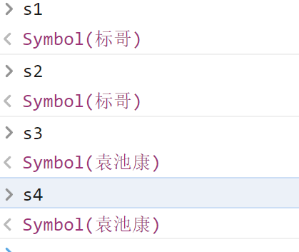
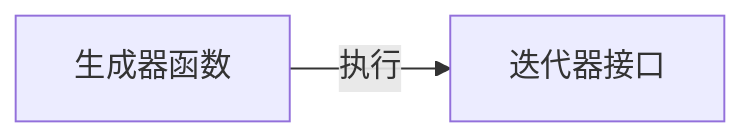
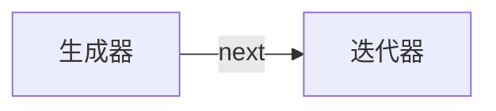

## ECMAScript 6-2

> 接上文

### WeakSet与WeakMap

这个东西与之前所学习的Map以及Set非常相似，只是有一些细微的区别，它们叫弱Map与弱Set

```javascript
let s1 = new Set();
s1.add("张三").add(123).add(true).add(null);
console.log(s1);


let s2 = new WeakSet();
s2.add({userName:"张三"})
s2.add(["12313"]);
s2.add(new Date());
s2.add(123);				//报错
console.log(s2);
```

> **代码分析**：
>
> s1是一个普通的Set集合，所以可以添加任何值到Set集合当中去，便是WeakSet是一个弱Set，它只允许添加引用类型（对象）进去，基本数据类型是不能添加进去的

```javascript
let m1 = new Map();

m1.set("a","张三").set("b","李四");
console.log(m1);

let m2 = new WeakMap();
m2.set(["a"],"张三");
m2.set("b","李四");         //报错
console.log(m2);
```

> **代码分析**：
>
> m1是一个正常的Map，所以它的键可以是任何类型
>
> 这一个报错的原因上面的原因是一样的，WeakMap的键也只能是引用类型(对象),不能是基本数据类型

<span style="color:red;font-size:32px">注意：WeakSet与WeakMap没有实现`Iterbale`接口，所以不能使用for...of遍历 ，也不能使用展开运算符</span>

----

### Symbol数据类型

Symbol是Es6当中堆出的一种新的数据类型，它的全称叫标识类型，通常叫做**全局唯一标识符**，这个东西对应的后端编程语言`UUID`或`GUID`

```javascript
//4c6b0921-3e3a-11ed-84ee-34298f73191b
let s1 =  Symbol();

//aacb0921-3e3a-11ed-84ee-34298f73191b
let s2 = Symbol();

typeof s1;
typeof s2;

console.log(s1===s2);    //false
```

Symbol数据类型的创建是要造Symbol()来创建的，它每次创建的标识符都是不一样的，所以上面的s1与s2就不相等

如果想得到相同的`Symbol`只能通过下面的方法来进行

```javascript
//4c6b0921-3e3a-11ed-84ee-34298f73191b
let s1 = Symbol();
let s2 = Symbol();
console.log(s1 === s2);         //false

//----------------------------------------------------

let s3 = Symbol.for("标哥");
let s4 = Symbol.for("标哥");
console.log(s3===s4);           //true
```

> 上面的代码我们可以这么理解，我们可以认为在”标哥“这个地方创建的标签是一样的

请注意下面的一个点

```javascript
let s1 = Symbol.for("标哥");
let s2 = Symbol.for("标哥");
console.log(s1===s2);           //true

//----------------------------------

let s3 = Symbol("袁池康");
let s4 = Symbol("袁池康");

console.log(s3===s4);           //false
```



> 上面的情况应该怎么去理解呢？
>
> `Symbol.for`相当于从谁哪里获取标签，`Symbol.for("标哥")`相当于从标哥那里得到了标签，所以,s1,s2都是从标签那里得到的标签 ，所以它们就相同
>
> `Symbol("袁池康")`相当于把标签贴在了袁池康的身上，这个时候我不能保证帖在袁池康身上的标签是相同的

#### Symbol的应用点

Symbol的应用点就在于它的唯一性，不重复，它一点正好与我们之前所学习的Set很像，如果我们想利用Map去实现Set的操作，怎么办呢

```javascript
let m1 = new Map();

m1.set(Symbol(), "张三");
m1.set(Symbol(), "李四");

let result1 = m1.get(Symbol())          //取不到。而我们之前讲Set的时候也说过，Set不能取值
console.log(result1);
```

上面的代码就是模拟了Set只能存，不能取的特点

除了上面的应用点，还有一个点应用点就是使用Symbol做为对象的属性名

```javascript
let obj1 = {
    userName: "张三",
    age: 18
}

let obj2 = {
    sex: "男",
    hobby: "看书",
    userName: "小四"
}

// 现在我想将这两个对象去合并 ，并保留所有的属性，怎么办呢

let obj3 = {
    ...obj1,
    ...obj2
}
```

因为上面的属性名在合并以后有重复，所以后面的`userName`就是覆盖前面的`userName`

```javascript
{ userName: '小四', age: 18, sex: '男', hobby: '看书' }
```

我们可以看到`userName`已经变成小四了，这谅说明属性冲突重复了

为了解决上面的问题，我们就会使用`Symbol`来做属性名，如下所示

```javascript
let obj1 = {
    [Symbol("userName")]: "张三",
    age: 18
}

let obj2 = {
    sex: "男",
    hobby: "看书",
    [Symbol("userName")]: "小四"
}

// 现在我想将这两个对象去合并 ，并保留所有的属性，怎么办呢

let obj3 = {
    ...obj1,
    ...obj2
};
console.log(obj3);
```

最终的结果如下

```javascript
{
  age: 18,
  sex: '男',
  hobby: '看书',
  [Symbol(userName)]: '张三',
  [Symbol(userName)]: '小四'
}
```

> 我们把不希望重复的属性名使用`Symbol`的数据类型去表示，这样就永远不会重复

####  Symbol做属性名

Symbol目前最大的优点就是用于做属性名，其实这个点我们在很早之前的ES5里面就接触到这个点

在之前讲面向对象的时候我们说过 ，如果想遍历一个对象的属性，我们应该用什么方法

1. `for....in`
2. `Object.keys()`
3. `Object.getOwnPropertyNames()`

当使用`Symbol`去做属性名的时候 ，如果想遍历这个属性就很困难，上面的三个方法通通不适用

```javascript
let obj = {
    age: 18,
    sex: '男',
    hobby: '看书',
    [Symbol("userName")]: '张三',
    [Symbol("userName")]: '小四'
}

//不可以
for(let i in obj){
    console.log(i);
}
//不可以
let keys = Object.keys(obj);
console.log(keys);

//不可以
let names = Object.getOwnPropertyNames(obj);
console.log(names);
```

如果想单独获取Symbol的属性名，只通过下面的方法来完成

```javascript
let symbolNames = Object.getOwnPropertySymbols(obj);
console.log(symbolNames);
```

最后一个点要注意,`JSON.stringify()`在序列化对象的时候，不会操作`Symbol`的属性。如下所示

```javascript
let obj2 = {
    age: 18,
    sex: '男',
    hobby: '看书',
    nickName:"张三",
    [Symbol("pwd")]:"123123"
}
let str2 = JSON.stringify(obj2);
console.log(str2);
```

结果如下,结果当中没有pwd这个属性

```js
{"age":18,"sex":"男","hobby":"看书","nickName":"张三"}
```

-----

### 生成器函数

> 生成器函数就是为了生成一个迭代器的，它的全称叫Generator Function

生成器函数是ES6里面新出一种函数类型 ，旨在解决迭代的问题

普通的函数如下所示

```javascript
function abc(){
    return 123;
}

let x = abc();
console.log(x);
```

在上面的代码里面，我们可以看到，我们的函数如果要返回一个值到外边，就只能通过`return`，并且只能返回一次，因为函数内部碰到return就结束了

**试想一下：如果我想一个函数可以返回多次的值，怎么办呢？**

#### 定义生成器函数

```javascript
function* def(){

}
```

生成器函数在定义的时候在`function`关键字的后面添加一个`*`就可以了，生成函数的内部是可以进行多次返回的，我们把这个返回的过程称之为迭代的过程

生成器的函数调以后，并不会立即执行代码体，它会返回一个迭代器对象



在生成器函数的内部，如果想要多次返回，我们要使用关键字`yield`来进行

```javascript
function* def(){
    // 在它的内部是可以多次返回的
    yield "a";
    yield "b";
    yield "c";
    return "曹方";
}

let x = def();			//x就是def函数执行以后返回的迭代器

x.next();				//{value: 'a', done: false}
x.next();				//{value: 'b', done: false}
x.next();				//{value: 'c', done: false}
x.next();				//{value: '曹方', done: true}
```

> 在上面的代码当中，yield代表的是返回，它返回了`a,b,c`三个东西，最后又返回了”曹方“

#### 生成器函数运行

我们上面可以的生成器函数在执行以后最终会返回一个迭代器，迭代器的内部是一个`next()`方法可以让程序运行到`yield`的地方拿到返回值然后暂停，直到继续`next()`进行下一步操作



```javascript
function* def() {
    let k1 = yield "a";
    console.log(k1);
    let k2 = yield "b";
    console.log(k2);            //李四
    let k3 = yield "c";
    console.log(k3);            //王五
    return "曹方";
}

let x = def();
let a1 = x.next("张三"); //{value: 'a', done: false}
let a2 = x.next("李四"); //
let a3 = x.next("王五"); //
```

我们可以看到生成器函数执行以后，张三没有打印，这是为什么呢


### 迭代器

迭代器也叫跌代器对象，它的内部有一些方法和状态，我们可以通过生成器函数来得到迭代器，也可以手动创建

1. 每个迭代器最初的状态都是suspended暂停，同时每一个迭代器里面都有一个方法叫`next()`,如果想让程序继续运行，我们要调用这个方法，程序会一直运行，直到遇到了`yield`停下来
2. yield返回的是一个对象 ，其中`value`代表返回的值，`done`代表这个迭代器是否执行完成了，如果是`false`代表迭代器现在还没有完成，可以继续向下向执行

#### 迭代器的状态

1. `suspended`暂停状态
2. `closed`关闭状态 ，说明迭代已经完成了