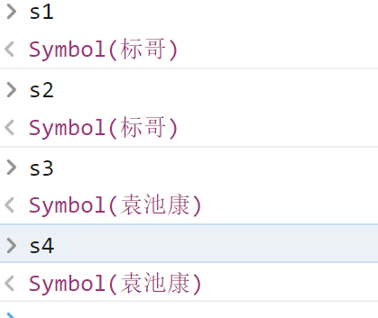

## ECMAScript 6-2

> 接上文

### WeakSet与WeakMap

这个东西与之前所学习的Map以及Set非常相似，只是有一些细微的区别，它们叫弱Map与弱Set

```javascript
let s1 = new Set();
s1.add("张三").add(123).add(true).add(null);
console.log(s1);


let s2 = new WeakSet();
s2.add({userName:"张三"})
s2.add(["12313"]);
s2.add(new Date());
s2.add(123);				//报错
console.log(s2);
```

> **代码分析**：
>
> s1是一个普通的Set集合，所以可以添加任何值到Set集合当中去，便是WeakSet是一个弱Set，它只允许添加引用类型（对象）进去，基本数据类型是不能添加进去的

```javascript
let m1 = new Map();

m1.set("a","张三").set("b","李四");
console.log(m1);

let m2 = new WeakMap();
m2.set(["a"],"张三");
m2.set("b","李四");         //报错
console.log(m2);
```

> **代码分析**：
>
> m1是一个正常的Map，所以它的键可以是任何类型
>
> 这一个报错的原因上面的原因是一样的，WeakMap的键也只能是引用类型(对象),不能是基本数据类型

<span style="color:red;font-size:32px">注意：WeakSet与WeakMap没有实现`Iterbale`接口，所以不能使用for...of遍历 ，也不能使用展开运算符</span>

----

### Symbol数据类型

Symbol是Es6当中堆出的一种新的数据类型，它的全称叫标识类型，通常叫做**全局唯一标识符**，这个东西对应的后端编程语言`UUID`或`GUID`

```javascript
//4c6b0921-3e3a-11ed-84ee-34298f73191b
let s1 =  Symbol();

//aacb0921-3e3a-11ed-84ee-34298f73191b
let s2 = Symbol();

typeof s1;
typeof s2;

console.log(s1===s2);    //false
```

Symbol数据类型的创建是要造Symbol()来创建的，它每次创建的标识符都是不一样的，所以上面的s1与s2就不相等

如果想得到相同的`Symbol`只能通过下面的方法来进行

```javascript
//4c6b0921-3e3a-11ed-84ee-34298f73191b
let s1 = Symbol();
let s2 = Symbol();
console.log(s1 === s2);         //false

//----------------------------------------------------

let s3 = Symbol.for("标哥");
let s4 = Symbol.for("标哥");
console.log(s3===s4);           //true
```

> 上面的代码我们可以这么理解，我们可以认为在”标哥“这个地方创建的标签是一样的

请注意下面的一个点

```javascript
let s1 = Symbol.for("标哥");
let s2 = Symbol.for("标哥");
console.log(s1===s2);           //true

//----------------------------------

let s3 = Symbol("袁池康");
let s4 = Symbol("袁池康");

console.log(s3===s4);           //false
```



> 上面的情况应该怎么去理解呢？
>
> `Symbol.for`相当于从谁哪里获取标签，`Symbol.for("标哥")`相当于从标哥那里得到了标签，所以,s1,s2都是从标签那里得到的标签 ，所以它们就相同
>
> `Symbol("袁池康")`相当于把标签贴在了袁池康的身上，这个时候我不能保证帖在袁池康身上的标签是相同的

#### Symbol的应用点

Symbol的应用点就在于它的唯一性，不重复，它一点正好与我们之前所学习的Set很像，如果我们想利用Map去实现Set的操作，怎么办呢

```javascript
let m1 = new Map();

m1.set(Symbol(), "张三");
m1.set(Symbol(), "李四");

let result1 = m1.get(Symbol())          //取不到。而我们之前讲Set的时候也说过，Set不能取值
console.log(result1);
```

上面的代码就是模拟了Set只能存，不能取的特点

除了上面的应用点，还有一个点应用点就是使用Symbol做为对象的属性名

```javascript
let obj1 = {
    userName: "张三",
    age: 18
}

let obj2 = {
    sex: "男",
    hobby: "看书",
    userName: "小四"
}

// 现在我想将这两个对象去合并 ，并保留所有的属性，怎么办呢

let obj3 = {
    ...obj1,
    ...obj2
}
```

因为上面的属性名在合并以后有重复，所以后面的`userName`就是覆盖前面的`userName`

```javascript
{ userName: '小四', age: 18, sex: '男', hobby: '看书' }
```

我们可以看到`userName`已经变成小四了，这谅说明属性冲突重复了

为了解决上面的问题，我们就会使用`Symbol`来做属性名，如下所示

```javascript
let obj1 = {
    [Symbol("userName")]: "张三",
    age: 18
}

let obj2 = {
    sex: "男",
    hobby: "看书",
    [Symbol("userName")]: "小四"
}

// 现在我想将这两个对象去合并 ，并保留所有的属性，怎么办呢

let obj3 = {
    ...obj1,
    ...obj2
};
console.log(obj3);
```

最终的结果如下

```javascript
{
  age: 18,
  sex: '男',
  hobby: '看书',
  [Symbol(userName)]: '张三',
  [Symbol(userName)]: '小四'
}
```

> 我们把不希望重复的属性名使用`Symbol`的数据类型去表示，这样就永远不会重复

####  Symbol做属性名

Symbol目前最大的优点就是用于做属性名，其实这个点我们在很早之前的ES5里面就接触到这个点

在之前讲面向对象的时候我们说过 ，如果想遍历一个对象的属性，我们应该用什么方法

1. `for....in`
2. `Object.keys()`
3. `Object.getOwnPropertyNames()`

当使用`Symbol`去做属性名的时候 ，如果想遍历这个属性就很困难，上面的三个方法通通不适用

```javascript
let obj = {
    age: 18,
    sex: '男',
    hobby: '看书',
    [Symbol("userName")]: '张三',
    [Symbol("userName")]: '小四'
}

//不可以
for(let i in obj){
    console.log(i);
}
//不可以
let keys = Object.keys(obj);
console.log(keys);

//不可以
let names = Object.getOwnPropertyNames(obj);
console.log(names);
```

如果想单独获取Symbol的属性名，只通过下面的方法来完成

```javascript
let symbolNames = Object.getOwnPropertySymbols(obj);
console.log(symbolNames);
```

最后一个点要注意,`JSON.stringify()`在序列化对象的时候，不会操作`Symbol`的属性。如下所示

```javascript
let obj2 = {
    age: 18,
    sex: '男',
    hobby: '看书',
    nickName:"张三",
    [Symbol("pwd")]:"123123"
}
let str2 = JSON.stringify(obj2);
console.log(str2);
```

结果如下,结果当中没有pwd这个属性

```js
{"age":18,"sex":"男","hobby":"看书","nickName":"张三"}
```

-----

### 生成器函数

> 生成器函数就是为了生成一个迭代器的，它的全称叫Generator Function

生成器函数是ES6里面新出一种函数类型 ，旨在解决迭代的问题

普通的函数如下所示

```javascript
function abc(){
    return 123;
}

let x = abc();
console.log(x);
```

在上面的代码里面，我们可以看到，我们的函数如果要返回一个值到外边，就只能通过`return`，并且只能返回一次，因为函数内部碰到return就结束了

**试想一下：如果我想一个函数可以返回多次的值，怎么办呢？**

#### 定义生成器函数

```javascript
function* def(){

}
```

生成器函数在定义的时候在`function`关键字的后面添加一个`*`就可以了，生成函数的内部是可以进行多次返回的，我们把这个返回的过程称之为迭代的过程

生成器的函数调以后，并不会立即执行代码体，它会返回一个迭代器对象


在生成器函数的内部，如果想要多次返回，我们要使用关键字`yield`来进行

```javascript
function* def(){
    // 在它的内部是可以多次返回的
    yield "a";
    yield "b";
    yield "c";
    return "曹方";
}

let x = def();			//x就是def函数执行以后返回的迭代器

x.next();				//{value: 'a', done: false}
x.next();				//{value: 'b', done: false}
x.next();				//{value: 'c', done: false}
x.next();				//{value: '曹方', done: true}
```

> 在上面的代码当中，yield代表的是返回，它返回了`a,b,c`三个东西，最后又返回了”曹方“

#### 生成器函数运行

我们上面可以的生成器函数在执行以后最终会返回一个迭代器，迭代器的内部是一个`next()`方法可以让程序运行到`yield`的地方拿到返回值然后暂停，直到继续`next()`进行下一步操作


```javascript
function* def() {
    let k1 = yield "a";
    console.log(k1);			//李四
    let k2 = yield "b";			 
    console.log(k2);             //王五	
    let k3 = yield "c";
    console.log(k3);             //赵六
    return "曹方";
}

let x = def();
let a1 = x.next("张三"); //{value: 'a', done: false}
let a2 = x.next("李四"); //
let a3 = x.next("王五"); //
let a4 = x.next("赵六"); //
```

我们可以看到生成器函数执行以后，张三没有打印，这是为什么呢

1. 遇到yield就暂停
2. 这一次next的参数会做为上一次yield的返回值接收

#### 生成器函数调用另一个生成器函数

```javascript
function* a(){
    yield "张三";
    yield "李四";
    return "标哥";
}


function* b(){
    yield "王五";
    //调用上面的一个生成器函数 ，怎么办？
    yield* a(); 
    yield "赵六";
    return "桃子";
}


let x = b();        //生成器函数返回了一个迭代器

let a1 =  x.next();
console.log(a1);

let a2 = x.next();
console.log(a2);

let a3 = x.next();
console.log(a3);

let a4= x.next();
console.log(a4);

let a5= x.next();
console.log(a5);
```

如果在生成器函数里面要调用另一个生成器函数，需要使用`yield* 函数名()`来完成

----

### 迭代器

迭代器也叫跌代器对象，它的内部有一些方法和状态，我们可以通过生成器函数来得到迭代器，也可以手动创建

1. 每个迭代器最初的状态都是suspended暂停，同时每一个迭代器里面都有一个方法叫`next()`,如果想让程序继续运行，我们要调用这个方法，程序会一直运行，直到遇到了`yield`停下来
2. yield返回的是一个对象 ，其中`value`代表返回的值，`done`代表这个迭代器是否执行完成了，如果是`false`代表迭代器现在还没有完成，可以继续向下向执行

#### 迭代器的状态

1. `suspended`暂停状态
2. `running`运行状态
3. `closed`关闭状态 ，说明迭代已经完成了

----

#### 迭代器遍历 

生成器函数可以生成迭代器，迭代器的遍历之前就已经了解过，它是通过`for...of`遍历的，所以可以看到下面的代码运行是成功的

```javascript
function* a(){
    yield "张三";
    yield "李四";
    yield "王五";
    yield "赵六";
}

let x = a();            //x是生成器函数a生成的一个迭代器

//x.next();           //{value:"",done:false}

// let temp = {};
// while((temp = x.next()).done==false){
//     console.log(temp.value);
// }

//趄正的迭代器是可以通过for...of来遍历的
for(let item of x){
    console.log(item);
}
```

#### 迭代器接口

在讲这个东西之前，我们先学2个单词

1. `Iterable`，可迭代的，代表一种能力
2. `Iterator`，迭代器

迭代就是把东西一个一人的拿出来，只能顺着拿（正向的拿），一旦结束了迭代了就不可以重新开始

迭代器是可以通过生成器函数得到？那什么是迭代器接口呢？

> 在系统当中，有一些对象它不是迭代器，但是它又可以实现遍历，还可以实现`for...of`的遍历，如`Array,Map,Set`等一系列对象 ，这是为什么呢？
>
> 一个对象如果可以迭代，它要么是一个迭代器，要么实现了迭代器的接口

**什么是接口？**

> 接口也叫规范，只要实现了这个接口就具备这个接口的能力，所以我们只要去实现了迭代器的接口，就实现了迭代器的能力，迭代器的接口就叫`Iterable`

**主动去实现器的接口**

```javascript
let obj = {
    0: "张三",
    1: "标哥",
    2: "李四",
    3: "王五",
    4: "赵六",
    length: 5
}
//上面是我们自定义的一个对象 ，它是一个类数组
for(let item of obj){
    console.log(item);
}
```

当我们去执行上面的代码的时候，就会报错，如下图


通过上面的代码我们就可以发现，如果想使用`for...of`遍历 ，那具备是具备可跌代的能力的

**之前我们就已经讲过，只要是实现了Iterabler接口的，在它的内部就会有如下的方法**


```javascript
/**
 * 迭代器接口的实现
 */

let obj = {
    0: "张三",
    1: "标哥",
    2: "李四",
    3: "王五",
    4: "赵六",
    length: 5,
    [Symbol.iterator]: function* () {
        let index = 0;
        while (index < this.length) {
            yield this[index];
            index++;
        }
    }
}
//上面是我们自定义的一个对象 ，它是一个类数组
for (let item of obj) {
    console.log(item);
}
```

最后强调一点，for...of遍历的时候是可以使用`break`与`continue`来完成操作的

----

### 函数的扩展

在之前的ES5的学习里面，我们已经接触过了很多函数

1. 普通函数
2. 构造函数
3. 立即执行函数
4. 函数表达式
5. 回调函数
6. 匿名函数
7. 递归函数

现在在ES6当中对函数又做了一些扩展

#### 无构造函数的函数

> 官方的说法叫成员函数，也叫属性函数

在之前的ES5里面，我们是通过`function`关键字来定义函数的，现在在ES6里面，ES希望尽量舍弃掉`function`,因为通过`function`所定义的函数既可以通过普通函数去调用`函数名+()`调用，也可以当成构造函数去调用`new 函数名()`

```javascript
let obj = {
    userName:"张三",
    sayHello:function(){
        console.log(`大家好，我叫${this.userName}`);
    }
}

obj.sayHello();
new obj.sayHello;
```

在上面的代码当中我们可以看到，对象`obj`里面的函数`sayHello`可以当成一个普通的成员函数去调用，也可以当成构造函数`new`调用，这样就显得非常的不严谨

ES6为了解决这样的岐义，它直接改变了对象内部的函数的定义方式 ，如下所示

```javascript
let obj2 = {
    userName: "李四",
    sayHello() {
        console.log(`大家好，我是第二个方法，我叫${this.userName}`);
    }
}

obj2.sayHello();			//正常调用
new obj2.sayHello;			//这样调用就会报错， obj2.sayHello is not a constructor
```

#### 箭头函数

之前在ES5里面我们已经学习过了函数的定义是通过`function`关键字来完成的，现在我们要慢慢的放弃掉`function`的关键字的，所以我们需要换一种试试去定义函数

首先我们先来回顾一下之前是怎么义函数的

```javascript
function sayHello(){
    console.log("大家好，我叫标哥");
}

var sayHello = function(){
    console.log("大家好，我叫标哥");
}
```

上面的2种方式对于同学们来说应该不陌生，在ES6里面对函数的定义做了新的规划 

#### 无参数的箭头函数

```javascript
const sayHello2 = ()=>{
    console.log("大家好，我叫标哥");
}
```

#### 有一个参数的箭头函数

```javascript
const sayHello2 = (userName) => {
    console.log(`大家好，我叫${userName}`);
}
```

如果只有一个参数，还可以写成下面的样式

```javascript
const sayHello3 = userName => {
    console.log(`大家好，我叫${userName}`);
}
```

#### 有多个参数的箭头函数

```javascript
function sayHello(userName,age){
    console.log(`大家好，我叫${userName},我的年龄是${age}`);
}
//ES6的箭头函数
const sayHello2 = (userName, age) => {
    console.log(`大家好，我叫${userName},我的年龄是${age}`);
}
```

如果有多个参数，则这个括号又不能省略

#### 箭头函数的返回值

```javascript
const a = () => {
    console.log("hello");
}

const b = () => console.log("hello");

```

> **代码分析**
>
> 在上面的代码当中，两个函数执行了相同的代码 ，所以看起来是没有任何区别的，这两个函数体里面只有一行代码，所以省略花括号也是可以的，这两个函数是没有区别的

请看下面代码

```javascript
const a = () => {
    return "张三";
}

//下面的箭头函数没有花括号，所以代表"李四"是一个返回值 ，它相当于`return "李四"`
const b = () => "李四";
```

如果一个箭头函数省略了花括号，则代表直接返回一个内容,上面的函数里面a,b两个函数的功能都是一样的

```javascript
let arr = [1, 4, 6, 8, 2, 3, 7];
// 要求使用filter得到里面的偶数

//第一种:常规写法
let result = arr.filter(function (item) {
    return item % 2 === 0;
});


//第二种:箭头函数写法
let result2 = arr.filter(item => {
    return item % 2 === 0;
});

//第三种:箭头函数再简化返回值
let result3 = arr.filter(item => item % 2 === 0); 
console.log(result3);
```

上面的写法就是箭头函数的写法，也是省略花括号的写法

#### 箭头函数的注意事项

1. 箭头函数不具备构造函数的特点，不能使用`new`来调用

2. 箭头函数的内部没有`arguments`

3. 箭头函数绑定的是外部的this,它的内部没有this指向（或者这么理解，箭头函数会跳过当前的作用域，去外边拿this)

   ```javascript
   let obj1 = {
       userName: "张三",
       sayHello() {
           console.log("我在外边打印的结果-----", this.userName);
           var that = this;
           setTimeout(function() {
               //想在这里拿到张三,怎么办?
               // console.log(this)   //指向了window
               console.log("我在里面打印----",that.userName);
           }, 2000);
       },
       sayHello2(){
           console.log("我在sayHello2的外部打印---",this.userName);
           setTimeout(()=>{
               // 箭头函数没有this,它拿的是外部的this
               console.log("我在sayHello2里面打印----",this.userName);
           },2000);
       }
   }
   ```

   同时请看下面的代码案例

   

在正同的场景下面是不允许使用箭头函数的

**第一种场景 ：成员函数里面**

```javascript
var userName = "标哥哥";
let obj1 = {
    userName:"张三",
    // 下面的写法是完全不允许的
    sayHello:()=>{
        console.log(this.userName);
    }
}

obj1.sayHello();
```

**第二种场景：事件绑定的回调函数**

```javascript
let btn1 = document.querySelector("#btn1");
btn1.addEventListener("click", event => {
    //DOM的事件绑定里面不要使用箭头函数
    console.log(this);
});
```

### ES6函数的参数

之前学习函数都知道，函数在定义的时候是有参数的，那么，我们现在看下面的代码

```javascript
//如果这个函数不传参数，默认值就是袁池康
const sayHello = (userName) => {
    console.log(`大家好，我叫${userName}`);
}


sayHello("标哥");
sayHello();
```

#### 函数的默认参数【可选参数】

**ES5里面的解决方法**

```javascript
//如果这个函数不传参数，默认值就是袁池康
const sayHello = (userName) => {
    userName = userName || "袁池康"
    console.log(`大家好，我叫${userName}`);
}


sayHello("标哥");
sayHello();
```

在ES6里面，如果想设置一个函数的默认值，非常简单

````javascript
const sayHello2 = (userName = "袁池康") => {
    console.log(`大家好，我叫${userName}`);
}


sayHello2("标哥哥");
sayHello2()
````

在上面的代码里面，我似可以看到`userName`在定义这个参数的时候给了一个默认值

**注意事项，默认参数只能放在最后**

```javascript
//如果这个函数不传参数，默认值就是袁池康
const sayHello3 = ( sex,userName="袁池康") => {
    console.log(`大家好，我叫${userName},我的性别是${sex}`);
}

sayHello3("男","标哥哥");
sayHello3("女");
```

#### 函数的剩余参数

在之前学习箭头函数的时候我们已经得到了一个结论，里面没有`arguments`，那么，如果我们想使用`arguments`的功能，应该怎么办?

```javascript
function getSum() {
    let sum = 0;
    for (let i = 0; i < arguments.length; i++) {
        sum += arguments[i];
    }
    return sum;
}


let x = getSum(11, 12, 14, 10);
console.log(x);
```

如果现在在ES6的箭头函数里面，怎么样去实现上面的功能呢？

现在没有`arguments`我们就必须想一个办法 把输入进去所有 数字全部接收到，怎么办呢？

```javascript
let getSum2 = (...num) => {
    //没有arguments，怎么办？
    // 这一个时候的num它就是一个数组了
    let sum = 0;
    for(let item of num){
        sum+=item;
    }
    return sum;
}
getSum2(11,12,13,10);
```

这个剩余参数的使用场景非常多，如下

```javascript
const sayHello = (userName, hobby) => {
    console.log(`大家好，我叫${userName},我的爱好是${hobby}`);
}

sayHello("杨标","看书");
```

现在考虑一个场景 ，如果这个人要是有多个爱好 ，怎么办？

```javascript
const sayHello2 = (userName, ...hobby) => {
    console.log(`大家好，我叫${userName},我的爱好是${hobby.toString()}`);
}
sayHello2("张三","看书","睡觉");
```

### 函数的补充call/apply/bind

这个点本身应该是在ES5里面去讲的，当时因为时间关系，并且用得比较少，所以没有讲，现在补充进来

````javascript
let obj1 = {
    userName:"张三",
    sayHello(){
        console.log(this.userName);
    }
}

let obj2 = {
    userName:"李四"
}


//呼叫谁过来调用自已，
obj1.sayHello.call(obj2);           //李四

//申请谁过来叫用自己
obj1.sayHello.apply(obj2);          //李四

//把sayHello的函数绑定在obj2上面
//它会生成一个新的方法，生成的这个新的方法this指向的就是你bind的对象
let aaa = obj1.sayHello.bind(obj2);
aaa();                             //李四 
````

上面的那种`bind`的用法，在ES6里面其实已经很少使用了，因为它已民经可以使用箭头函数来代替了

```javascript
/**
 * bind指代的就是箭头函数的特殊情况
 */

let obj1 = {
    userName: "张三",
    sayHello1() {
        console.log(this.userName);
        var that = this;
        setTimeout(function () {
            console.log("内部的----", that.userName);
        }, 2000);
    },
    sayHello2() {
        console.log(this.userName);
        setTimeout(() => {
            console.log("内部的----", this.userName);
        }, 2000);
    },
    sayHello3() {
        console.log(this.userName);
        /*
        function a(){
            console.log("内部的---",this.userName);
        }
        let b = a.bind(this);
        setTimeout(b,2000);
        */

        setTimeout(function () {
            console.log("内部的---", this.userName);
        }.bind(this), 2000);
    }
}

// obj1.sayHello1();
// obj1.sayHello2();


obj1.sayHello3();
```

>**面试点**：
>
>1. `call/apply/bind`有什么区别？
>2. 有哪些方法可以改变this指向
>3. 简单的说明一下`var that=this`的情况

----

### class关键字

在上面的函数的扩展里在，无论是成员函数还是箭头函数都不能已构造函数的形式`new`来调用，那么，我们样去创建构造函数呢

在ES6里在，新堆出了一个关键字叫`class`,如果想创建类似于ES5里面的构造函数，我们应该使用下面的方式来完成

#### 认识关键字`class`

class的关键在ES6里面是来创建构造函数的，如下,我们先看ES5里面的代码 

```javascript
function Student(userName,sex){
    this.userName = userName;
    this.sex = sex;
}

let s1 = new Student("张三","男");		//得到s1的对象
```

> 代码分析 ：在上面的代码里面，我们的`function`定义了一个函数`Student`，这是ES5里面的语法，这种定义方式是有岐义的，因为它既可以当成构造函数来调用，也可以当成普通函数来调用，这样就不严谨
>
> 在ES6里面，我们已经不在推荐使用`function`关键字来创建对象的原因就在这里，如果想创建普通函数可以使用箭头函数 ，如果想在对象里面创建函数直接使用属性函数（成员函数）的方式，如果想创建构造函数则使用关键字`class`

```javascript
class Student {

}

console.log(typeof Student);    //"function"
let s1 = new Student();
console.log(typeof s1);			//对象
```

上面的`Student`它就是构造函数，不能当成普通函数执行

如果我们直接通过`Student()`的方式去调用，就会报错，如下所示


#### 认识一下`constructor`

每一个`class`的内部都会有一个`constructor`，如果你不写系统会自动的给你创建一个，它的中文名称叫**构造器**，它的特点如下

1. 它是一个函数，这个名子不能更改
2. 如果不写，系统会自动给你创建一个，如果你写了，系统就不再给你创建
3. 你在`new`这一个`class`的一瞬间 ，这个`constructor`函数会自动调用
4. 它内部的this指向新对象

```javascript
class Student{
    constructor(){
        console.log("标哥哥,好帅");
    }
}

let s1 = new Student();
```

上面的代码会打印“标哥哥，好帅”。

现在我们再回到我们的本质点,怎么样在`class`里面接收参数

```javascript
function Student(userName,sex){
    this.userName = userName;
    this.sex = sex;
}
```

**ES6的代码**

```javascript
class Student {
    constructor(userName, sex) {
        this.userName = userName;
        this.sex = sex;
    }
}
// new 一个class的时候,constructor自动执行

let s1 = new Student("张三", "男");
console.log(s1.userName, s1.sex);
```

#### class里面定义方法

在之前我们讲过，对象里面是可以包含方法的，现在对比如下

**ES5的代码**

```javascript
function Student(userName, sex) {
    this.userName = userName;
    this.sex = sex;

    this.sayHello = function () {
        console.log(`大家好,我叫${this.userName}`);
    }
}
```

**ES6的代码**

```javascript
class Student {
    constructor(userName, sex) {
        this.userName = userName;
        this.sex = sex;
    }
    sayHello(){
        console.log(`大家好,我叫${this.userName}`);
    }
}
```

#### class里面的get/set访问器

在之前的ES5的学习当中我们已经了解过`get/set`的访问器属性，其实在ES6里面也可以，在ES6里面它换了一种方式来进行

```javascript
class Student {
    constructor(firstName, lastName) {
        this.firstName = firstName;
        this.lastName = lastName;
    }
    userName() {
        return this.firstName + this.lastName;
    }
}

let s1 = new Student("袁","池康");

let name1 = s1.userName();
console.log(name1);
```

在上面的代码里面，即使在没有访问器属性的情况下，我们也可以实现取值 ，但是我们应该有要一个属性，而不是方法

**ES6里面的方式**

```javascript
class Student {
    constructor(firstName, lastName) {
        this.firstName = firstName;
        this.lastName = lastName;
    }
    get userName() {
        return this.firstName + this.lastName;
    }
    set userName(v){
        console.log("你在赋值",v);
        //这个v代表就是赋的值
        this.firstName = v[0];
        this.lastName = v.slice(1);
    }
}

let s1 = new Student("袁", "池康");
s1.userName = "江海丽";         //在赋值的时候会自动触发 set方法
console.log(s1.userName);      //在取值的时候自动调用get方法
```

> 1. 在上面的代码里面，`get/set`共同的构造了一个访问在器性
> 2. `get`是在取值的时候自动调用，`set`在赋值的时候自动调用

<span style="color:red;font-size:22px">除了class里面使用get/set以外，普通的对象也是可以使用的</span>

```javascript
let obj = {
    firstName: "张",
    lastName: "三",
    get userName() {
        return this.firstName + this.lastName;
    },
    set userName(v) {
        console.log("你在赋值");
        this.firstName = v[0];
        this.lastName = v.slice(1);
    }
};

// console.log(obj.userName);
obj.userName = "江海丽";
```

---

#### class里面的static关键字

`static`关键字并不是JS里面独有的，其它的编程语言里面也有，它主要是用于构建静态的东西。在ES6里在，语法如下

```javascript

class Person{
    constructor(userName){
        this.userName = userName;
    }
    sayHello(){
        console.log(`我的名子叫${this.userName}`)
    }
    // 静态方法
    static sleep(){
        console.log(`这个人在睡觉`);
        console.log(this.age);		//10,静态的方法可以调用静态的属性
    }
    // 静态属性
    static age = 10;
}

// 如果想使用普通的方法或普通的属性,我们要定要通过构造函数得到对象 ,用对象来调用
let p1 = new Person("张三");
console.log(p1.userName);
p1.sayHello();

// 静态的东西，只有一个特点，不需要new,直接通过构造函数来调用
Person.sleep();
console.log(Person.age);
```

> **代码分析**：
>
> 1. 只需要在属性或方法的前面去添加`static`关键字就可以了
> 2. 静态方法或静态属性的调用不需要`new`，直接通过构造函数来调用
> 3. 静态的里面不要调用非静态的东西，但是静态的方法可以调用静态的属性

-----

### extends关键字

在Es5里面，如果我们要实现对象的继承会非常的麻烦，最后的一步推断里面，我们使用组合继承与寄生继承来完成了我们的操作，但是这样做非常麻烦 ，在ES6里面有了更好的方式 ，就是使用`extends`关键字

#### 无参数的继承

```javascript
class Person {
    sleep() {
        console.log("我在睡觉");
    }
}


class Student extends Person {
    sayHello() {
        console.log("我是学生，爱学习的学生");
    }
}

let s1 = new Student();
s1.sayHello();
s1.sleep();
```

> 在上面的代码里面，我们让Student继承了`Person`，同时这两个class我们都没有写构造函数`constructor`，我们让系统自动身生成了

**如果我想自己手动来写constructor，不要系统自动生成，怎么办呢**

```javascript
 class Person {
    constructor(){

    }
    sleep() {
        console.log("我在睡觉");
    }
}


class Student extends Person {
    constructor(){
        // 如果是继承，应该先调用父级，才有自己
        // 这里调用了父级的构造函数
        super();
    }
    sayHello() {
        console.log("我是学生，爱学习的学生");
    }
}

let s1 = new Student();
s1.sleep();
```

> **代码分析**：如果使用了`extends`继承，那么，在系统自动生成的构造函数里面会往动调用`super`,如果自已手写了`constructor`，一定不要忘记这里有一个`super`，这个关键字`super`指向的是父级对象

#### 有参数的继承

```javascript
/**
 * 无参数的继承
 */

class Person {
    constructor(userName, sex) {
        this.userName = userName;
        this.sex = sex;
    }
    sleep() {
        console.log(`${this.userName}在睡觉`);
    }
}

class Student extends Person {
    constructor(userName, sex, age) {
        super(userName, sex);
        this.age = age;
    }

    study() {
        console.log(`我是${this.sex}学生，我爱学习`);
    }
}

let s1 = new Student("江海丽", "女", 18);
s1.sleep();
s1.study();
```

> **注意事项**：this关键字只能放在`super`关键字的后面

#### 静态继承

在之前我们讲`class`的时候我们讲过，class会有静态的方法与静态的属性，现在我们需要了解一下`static`的东西是否可以继承

```javascript
class Person {
    constructor(userName, sex) {
        this.userName = userName;
        this.sex = sex;
    }
    sleep() {
        console.log(`${this.userName}在睡觉`);
    }
    //静态方法
    static sayHello(){
        console.log("我在打招呼");
         // 静态的方法是可以使用静态的属性的
        console.log(`我的爱好是${this.hobby}`);
    }
    //静态属性
    static hobby = "看书";
}

class Student extends Person {
    constructor(userName, sex, age) {
        super(userName, sex);
        this.age = age;
    }

    study() {
        console.log(`我是${this.sex}学生，我爱学习`);
    }
}

Person.sayHello();
Student.sayHello();
console.log(Person.hobby);
console.log(Student.hobby);
```

> 1. 静态的方法与属性也是可以继承的
> 2. 静态的与非静态的仍然处于隔离状态，不要相互调用
> 3. 静态的方法可以使用静态的属性

#### 方法的重写`override`

当一个对象继承另一个对象的时候，默认就可以使用父级对象所有的属性及方法，但是如果父级对象的方法不满足条件的时候我们会**重写**这个方法，这种现象在ES5当很常见，在ES6里面也常见，但是实现起来更简单了

```javascript
class Person {
    constructor(userName) {
        this.userName = userName;
    }
    sayHello() {
        console.log(`大家好，我叫${this.userName}`);
    }
}

class Student extends Person {
    constructor(userName, sex) {
        super(userName);
        this.sex = sex;
    }
    //重写了一个sayHello的方法
    sayHello() {
        console.log(`我的性别是${this.sex}`);
        // 在这里又调用了父级的sayHello方法
        super.sayHello();
    }
}


let s1 = new Student("江海丽", "女");
s1.sayHello();
```

