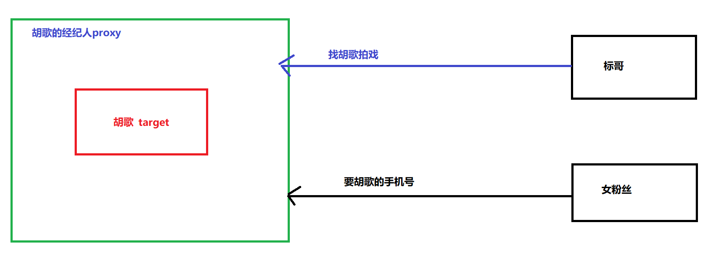
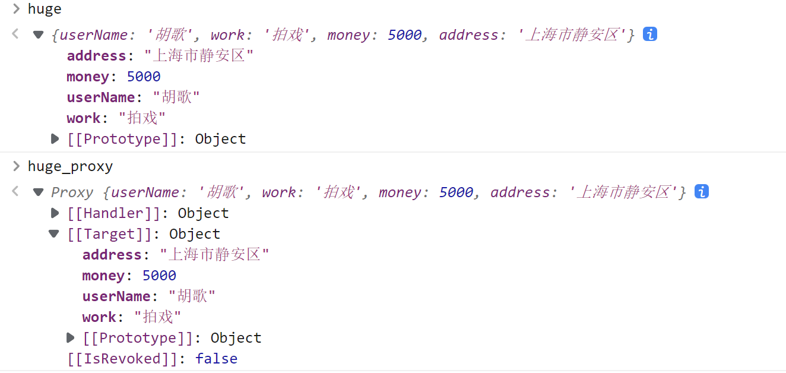
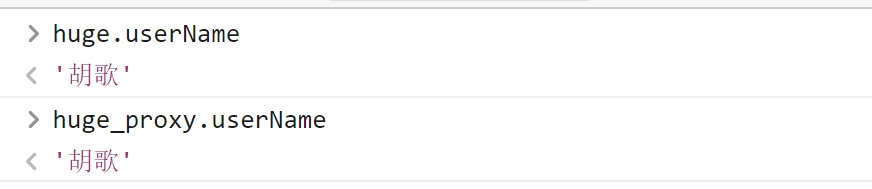
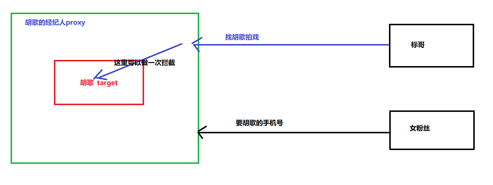

## ECMAScript6-3

> 接上往篇

### 面向对象的扩展

#### 不可扩展对象 

> 一级保护：不可扩展

在我们之前创建变量的时候 ，我们已经知道`const`定义的变量是不可更改的，但是`const`是锁栈不锁堆，所以通过`const`定义的基本数据类型是不可以更改的，但是定义的对象又可以更改堆里面的值

ES6为了更好的保护对象的内部，就堆出了新的技术

```javascript
const userInfo = {
    userName:"张三"
};


console.log(userInfo.userName);
userInfo.sex = "女";						//这里是正常的
console.log(userInfo);

userInfo = 123;			//肯定报错
```

在上面的代码里面我们可以看到，虽然我们通过`const`去定义了一个对象，这个对象不能直接赋值改变，但是我们可以在这个对象上面扩展新的属性

现在我们希望这个对象构造好了以后，不要再扩展新的属性了，怎么办了？

现在我们就要使用一级保持：不可扩展对象

```javascript
const userInfo = {
    userName:"张三"
};

//一级保持 ，阻止扩展
Object.preventExtensions(userInfo);

userInfo.sex = "女";            //这个时候的属性是添加不进去的
console.log(userInfo);
```

#### 密封对象

> 二级保护：密封，不可扩展 ，不可删除

```javascript
const userInfo = {
    userName:"张三"
};


//二级保护  密封 
Object.seal(userInfo);
userInfo.sex = "女";                //扩展失败

delete userInfo.userName;           //删除失败

console.log(userInfo);
```

#### 冻结对象

> 三级保护：冻结，不可扩展，不可删除，不可更改

```javascript
const obj = {
    userName:"张三"
}

// 开启三级保护  冻结
Object.freeze(obj);

obj.userName = "李四";          //不可更改
obj.sex = "男";                 //不可扩展
delete obj.userName;            //不可删除
console.log(obj);
```

#### Object.is()

在之前ES5的运算符里面，我们学过了`===`的全等操作，那么`Object.js()`其实就相当于这个操作，但是它比这个操作更加严格一点，它会深入到内存的当中去判断值是否相等，并且判断的是二进制值是否相等

```javascript
console.log("1" == 1);                 //true
console.log("1" === 1);                //false

console.log(Object.is(1, 1));          //true
console.log(Object.is("1", 1));        //false

//-----------------------
let obj1 = {
    userName: "张三"
};
let obj2 = obj1;                     //浅拷贝，栈里面的地址相同

let obj3 = {
    userName:"张三"
}
console.log(Object.is(obj1, obj2));        //true
console.log(Object.is(obj1,obj3));        //false
```

> 在上面的代码里面，我们可以看到，Object.is相当于是`===`的严格相等，在判断对象的时候，判断的是对象在内存当中栈的地址是否相同
>
> `Object.is()`会深入到内存当中去比较二进制

```javascript
console.log(0 == 0);          //true
console.log(0 === 0);         //true
console.log(-0 === +0);       //true

let result = Object.is(-0, +0);
console.log(result);          //false 它的二进制不相等

console.log(NaN===NaN);       //false

let result2 = Object.is(NaN,NaN);
console.log(result2);           //true
```

----

### Reflect反射

提到反射，你们就应该想到一个东西镜子，它可以反射出任何东西。在JS里面的反射我们可以理解为`Object`的镜子。

标哥的理解：反射是对象的另一种操作方式，它弥补了`Object`下面操作对象的不足，相当于个”照妖镜“，可以把对象内部所有的东西都照出来

```javascript
let obj = {
    nickName: "小花花",
    [Symbol("age")]: 18
}

Object.defineProperty(obj,"sex",{
    enumerable:false,
    value:"女"
});
 
let result1 = Object.keys(obj);               //["nickName"]
console.log(result1);

let result2 = Object.getOwnPropertyNames(obj);      //["nickName","sex"]
console.log(result2);

let result3 = Object.getOwnPropertySymbols(obj);        //[Symbol("age")]
console.log(result3);

//如果按照我们以前旧的方法，我们想获取这些属性是非常麻烦的
```

如果现在我们使用反射

```javascript
let result4 = Reflect.ownKeys(obj);
console.log(result4);           //[ 'nickName', 'sex', Symbol(age) ]
```

在上面的代码当中，我们可以很清楚的感觉到这一点，反射就是操作对象的另一种方式，我们可以通过`Reflect.ownKeys()`来获取对象内部的所有属性

**以下主是要反射的方法列表**

```javascript
declare namespace Reflect {
    function apply(target: Function, thisArgument: any, argumentsList: ArrayLike<any>): any;
    function construct(target: Function, argumentsList: ArrayLike<any>, newTarget?: Function): any;
    function defineProperty(target: object, propertyKey: PropertyKey, attributes: PropertyDescriptor & ThisType<any>): boolean;
    function deleteProperty(target: object, propertyKey: PropertyKey): boolean;
    function get(target: object, propertyKey: PropertyKey, receiver?: any): any;
    function getOwnPropertyDescriptor(target: object, propertyKey: PropertyKey): PropertyDescriptor | undefined;
    function getPrototypeOf(target: object): object | null;
    function has(target: object, propertyKey: PropertyKey): boolean;
    function isExtensible(target: object): boolean;
    function ownKeys(target: object): (string | symbol)[];
    function preventExtensions(target: object): boolean;
    function set(target: object, propertyKey: PropertyKey, value: any, receiver?: any): boolean;
    function setPrototypeOf(target: object, proto: object | null): boolean;
}

```

1. `apply`方法 ，这个就去相当于之前的方法名.apply的调用

   ```javascript
   
   let obj = {
       userName:"张三",
       sayHello(str){
           console.log(`大家好，我叫${this.userName}`);
           console.log(`我接收到的值是${str}`);
       }
   }
   // obj.sayHello("普通调用");
   // obj.sayHello.apply(obj,["applyy调用"]);
   Reflect.apply(obj.sayHello,obj,["Reflect调用"]);
   ```

2. `construct`方法，执行一个构造函数，相当于new了一个构造函数

   ```javascript
   class Student{
       constructor(userName){
           this.userName = userName;
       }
   }
   let s1 = new Student("张三");
   let s2 = Reflect.construct(Student,["李四"]);
   ```

3. `defineProperty`这个就是原来的`Object.defnieProperty`

   ```javascript
   let obj = {
       userName: "张三"
   }
   
   Object.defineProperty(obj, "sex", {
       configurable: false,
       value: "女"
   });
   
   Reflect.defineProperty(obj,"age",{
       value:18,
       configurable:false
   });
   ```

4. `deleteProperty`删除一个属性

   ```javascript
   let obj = {
       userName: "张三",
       sex:"女",
       age:18
   }
   
   delete obj.sex;         //删除一个属性
   Reflect.deleteProperty(obj,"age");          //删除age属性
   console.log(obj);
   ```

5. `get`获取某一个属性的属性值

   ```javascript
   let obj = {
       userName: "张三",
       sex: "女",
       age: 18
   };
   
   console.log(obj.userName);
   console.log(obj["sex"]);
   console.log(Reflect.get(obj, "age"));
   ```

6. `getOwnPropertyDescriptor`这个方法相当于对象里面的`Object.getOwnPropertyDescriptor()`

7. `getPrototypeOf`获取某一个对象的原型对象(也叫父级对象)，相当于获取`__proto__`

8. `has()`判断某一个对象上面是否有某一属性，相当于`hasOwnProperty()`方法

9. `isExtensible()`当前这个对象是否不可扩展（也就是是否处于一级保持）;

10. `ownKeys()`获取当前对象上面所有的属性名

11. `preventExtensions()`把某一个对象设置为不可扩展对象 ，相当于`Object.preventExtensions()`设置对象的一级保护

12. `set()`相当于对对象的某一个属性进行赋值

    ```javascript
    let obj = {
        userName:"张三",
        age:19
    }
    
    obj.userName = "李四";
    Reflect.set(obj,"age",20);
    ```

13. `setPrototypeOf()`设置某一个对象的原型

    ```javascript
    let obj1 = {
        userName:"张三"
    }
    let obj2 = {
        age:18
    }
    ob1.__prot__=obj2;
    Reflect.setPrototypeOf(obj1,obj2);
    ```

----

### Proxy代理

代理其实可以理解为明星的经纪人（代理人，律师），**在JS当中的代理指的是全局拦截**

#### 代理的概念

**场景**：一般的明星都有经纪人，明星的大部分工作与生活都与经纪人脱不开关系 ，也都是由经纪人来安排，我们就可以理解为经纪人就是这个明星的代理

如：现有一个明星叫胡歌，我做为它的粉丝，我向他写了一封信，劝它在拍戏之余多多注意一下息的自体，多拍一点好戏。这个信肯定是先到胡歌的经纪人手上，然后才有可能交给胡歌！

如：标哥是胡歌的粉丝，现在标哥赚钱了，发达了，想请胡歌拍电影 ，片筹200W，这个时候我并不需要直接与胡歌见面，找它的经纪人就可以了，不用与胡歌商量

如：某一个女粉丝约胡歌晚上去某个小酒吧喝酒，还要胡歌的微信及手机号，这时候胡歌的经纪人得到这个要求以后觉得这个要求不合理，可以直接拒绝，这个要求就不会传递给胡歌

----

在上面的场景里面，我们可以的到胡歌的大部分工作都由经纪人在代理，胡歌本身是一个目标，胡歌的经纪人我们就可以认为是胡歌的代理，**它可以代理胡歌的所有事情**

1. 代理的对象叫`proxy`
2. 目标对象叫`target`

一般情况下是`proxy`代理`target`

在上面的场景里面面`target`指的就是胡歌，而他的经纪人就是`proxy`



从上面的图当中我们可以看到，无论我们对胡歌进行什么操作都会先经过他的经纪人（代理对象）。这一种场景在JS里面就叫代理，所以JS里面的代理也叫“全局拦截”

#### 创建代理 

**在ES6里面如果要创建代理，我们就可以使用下面的方法**

```javascript

// 下面就是明星胡哥
let huge = {
    userName: "胡歌",
    work: "拍戏",
    money: 5000,
    address: "上海市静安区"
}

let huge_proxy = new Proxy(huge,{
    //handler这里决定了如果代理胡歌，怎么样操作胡歌的事情
});
```



在上面的图片当中，我们可以的到以下2点

1. `Handler`代表上体代理目标的哪些操作
2. `Target`代理的目标对象

我们在操作胡歌的代理对象`huge_proxy`的时候相当于就是在操作胡歌`huge`



现在我们可以看到，我们操作代理对象`proxy`与操作目标对象`target`结果是一样的，那我们为什么需要代理呢？

#### 代理的作用

从上一个部分我们可以看到，当我们需要去操作一个对象的时候，其实是可以操作它的代理对象的，代理对象是可以实现全局



在上图当中我们看到，当代理对象与目标对象沟通的时候可以做一次拦截，我们的重点应这一个拦截里面

```javascript
// 下面就是明星胡哥
let huge = {
    userName: "胡歌",
    work: "拍戏",
    money: 5000,
    address: "上海市静安区"
}

let huge_proxy = new Proxy(huge, {
    // 当要取值的时候触发
    get(target, p) {
        //target代表的是目标对象，也就是huge
        //p代表代要操作哪个属性
        if (p === "money") {
            return "胡歌的薪资保密";
        } else {
            return target[p];
        }
    },
    //当要赋值的时候就会触发set
    set(target,p,v){
        //target目标对象 huge
        //p属性值
        //v属性值
        if(p==="money"){
            console.log("经纪人贪污了，不给胡歌")
        }
        else{
            target[p] = v;
        }
    }
});
```

> 1. 在上面的代码里面，我们就可以看到代理的作用了，代理就是一个全局的拦截，我们可以拦截所有的操作
>
> 2. `get`是在取值的时候触发的，`set`是在赋值的时候触发了
> 3. `target`代表目录对象，p代表属性名，v代表属性值

#### 代理的应用点

我们刚刚已经看到了，对代理对象进行取值或赋值是会触发相应的操作的，这个操作有什么应用点呢？

**场景**：我们想创建一个对象 ，这个对象下面有`userName,pwd`两个属性，这两个属性里面只有`userName`可以取值,`pwd`不能取值

```javascript
let obj  = {
    userName:"张三",
    pwd:123456
}

let obj_proxy = new Proxy(obj,{
    get(target,p){
        if(p==="pwd"){
            return undefined;
        }
        else{
            return target[p];
        }
    }
});

console.log(obj_proxy.userName);
console.log(obj_proxy.pwd);
```

但是上面的场景是有隐患的，我们的目标对象还是暴露在全局

```javascript
console.log(obj.pwd);
```

**正常情况下：代理对象要包裹目标对象**

```javascript
let obj_proxy = new Proxy((() => {
    return {
        userName: "张三",
        pwd: 123456
    }
})(), {
    //代理的操作
    get(target, p) {
        if (p === "pwd") {
            return undefined;
        }
        else {
            return target[p];
        }
    }
});

console.log(obj_proxy.userName);
console.log(obj_proxy.pwd);
```

> 在上面的代码当中我们可以看到已不能访问目标对象了，因为目标对象通过立即执行函数进行了返回，这个时候我们间接的操作代理对象的时候就可以实现目标对象的全局理了
>
> 同时，我们已做了相应的限制条件 ，对于这个地方的`pwd`属性的访问只返回`undefined`

#### 通过代理实现属性私有化

```javascript
let student = {
    userName: "袁池康",
    sex: "男",
    age: 19,
    hobby: "读书，睡觉",
    tel: 18526374859,
    address: "湖北省武汉市江夏区关山大道华夏学院101宿舍上铺",
    IDCard: "420000200901011234"
}
```

我们希望实现一些私有化的属性，外部只可以访问 ，但是不能赋值，怎么办呢？

**场景**：我们现在希望`tel`和`IDCard`这两个属性只可以取值，不可以赋值，怎么办呢？

```javascript
let student = {
    userName: "袁池康",
    sex: "男",
    age: 19,
    hobby: "读书，睡觉",
    _tel: 18526374859,
    address: "湖北省武汉市江夏区关山大道华夏学院101宿舍上铺",
    _IDCard: "420000200901011234"
}
```

我们在需要私有化的属性有前面添加了一个`_`来表示，这个我们再通过代理去设置

```javascript
let student_proxy = new Proxy((() => {
    return {
        userName: "袁池康",
        sex: "男",
        age: 19,
        hobby: "读书，睡觉",
        _tel: 18526374859,
        address: "湖北省武汉市江夏区关山大道华夏学院101宿舍上铺",
        _IDCard: "420000200901011234"
    }
})(), {
    //赋值的会调用
    set(target, p, v) {
        if (p.startsWith("_")) {
            return;
        }
        else {
            target[p] = v;
        }
    },
    // 代理了删除属性的操作
    deleteProperty(target, p) {
        if (p.startsWith("_")) {
            return false;
        }
        else {
            return delete target[p];
        }
    }
});

student_proxy._tel = 12312312312;           //不会成功，会被拦下来
student_proxy.userName = "袁老大";           //成功
delete student_proxy._IDCard;               //制作 ，会被拉下来

console.log(student_proxy);
```

#### 代理的操作列表

```typescript
interface ProxyHandler<T extends object> {
    apply?(target: T, thisArg: any, argArray: any[]): any;
    construct?(target: T, argArray: any[], newTarget: Function): object;
    defineProperty?(target: T, property: string | symbol, attributes: PropertyDescriptor): boolean;
    deleteProperty?(target: T, p: string | symbol): boolean;
    get?(target: T, p: string | symbol, receiver: any): any;
    getOwnPropertyDescriptor?(target: T, p: string | symbol): PropertyDescriptor | undefined;
    getPrototypeOf?(target: T): object | null;
    has?(target: T, p: string | symbol): boolean;
    isExtensible?(target: T): boolean;
    ownKeys?(target: T): ArrayLike<string | symbol>;
    preventExtensions?(target: T): boolean;
    set?(target: T, p: string | symbol, newValue: any, receiver: any): boolean;
    setPrototypeOf?(target: T, v: object | null): boolean;
}
```

#### 可取消的代理

正常情况下 ，我们可以代理一个对象 ，但是如果不想代理这个对象了，也可以取消这个对象的代理

```javascript
let huge = {
    userName: "胡歌",
    work: "拍戏",
    money: 5000,
    address: "上海市静安区"
}

let huge_proxy = Proxy.revocable(huge, {
    get(target, p) {
        return target[p];
    },
    set(target, p, v) {
        target[p] = v;
    }
});

console.log(huge_proxy.proxy.money);
huge_proxy.revoke();        //撤销代理
console.log(huge_proxy.proxy.address);
```

上面的代码其实用解构会更好一些

```javascript
//proxy就是代理的对象 ，revoke就是取消代理的方法
let { proxy, revoke } = huge_proxy;
console.log(proxy.userName);
revoke();
console.log(proxy.address);
```

#### 代理小练习 

有一本书的属性为：{“name”:“《ES6基础系列》”, ”price”：56 }；要求使用Proxy对象对其进行拦截处理， name属性对外为“《ES6入门到懵逼》”,price属性为只读。（练习题）

```javascript
let book = new Proxy((() => {
    return {
        name: "《ES6基础系列》",
        price: 56
    }
})(), {
    get(target, p) {
        if (p === "name") {
            return "《ES6从入门到懵逼》";
        }
        else {
            return target[p];
        }
    },
    set(target, p, v) {
        if (p === "price") {
            return;
        }
        else {
            target[p] = v;
        }
    },
    deleteProperty(target, p) {
        if (p === "price") {
            return false;
        }
        else {
            return delete target[p];
        }
    }
})
```

