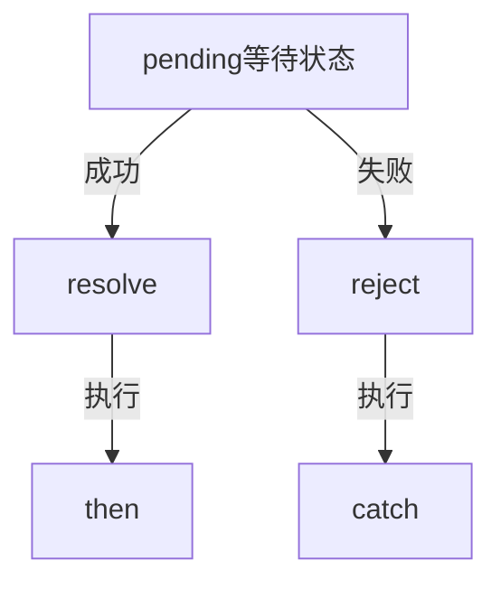
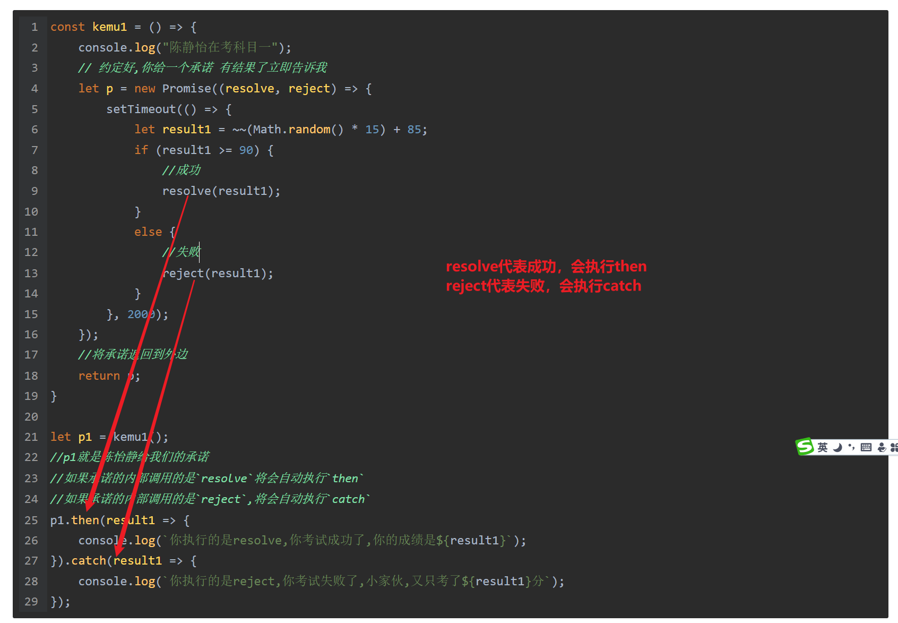

## ES6异步编程及模块化

### 异步编程

在之前的ES5时面，我们已经接触过异步的概念了，并且得到了一个非常好的口诀：同步等待，异步执行。

异步最大的缺点就是无法拿到返回值

在之前的ES5里面，如果我们想得到返回值 ，我们只能使用回调函数

```javascript
const abc = (callBack) => {
    setTimeout(() => {
        let num = ~~(Math.random() * 100)
        if (typeof callBack === "function") {
            callBack(num);
        }
    }, 2000);
}
abc(num => {
    console.log(`你的随机数的返回值是${num}`);
});
```

在ES6里面如果想解决异步，它连续推出了几种解决方案

1. 回调函数
2. 生成器函数
3. `Promise`
4. async/await

异步一直是ES6里面的难点，所以w3c一直在尝试对异步编程做好的解决方法

### 回调函数处理异步

在之前的ES5里面，最典型的异步场景有2个

1. `setTimeout/setInterval`
2. `ajax`

现在我们就使用定义器来模拟异步的场景，来模拟驾照考试的场景 

```javascript
// 假设陈怡静要考驾照
// 科目一的方法
const kemu1 = (callBack) => {
    console.log(`陈怡静在考科目一`);
    // 30分钟以后可以得到结果
    setTimeout(() => {
        //随机产生了一个成功
        let result1 = ~~(Math.random() * 15) + 85;
        if (typeof callBack === "function") {
            callBack(result1);
        }
    }, 2000);
}

//科目二的方法
const kemu2 = (callBack) => {
    console.log(`陈怡静在考科目二`);
    setTimeout(() => {
        let result2 = ~~(Math.random() * 30) + 70;
        if (typeof callBack === "function") {
            callBack(result2);
        }
    }, 2000);
}
// 科目三的方法
const kemu3 = (callBack) => {
    console.log(`陈怡静在考科目三`);
    setTimeout(() => {
        let result3 = ~~(Math.random() * 25) + 75;
        if (typeof callBack === "function") {
            callBack(result3);
        }
    }, 2000);
}


kemu1(result1 => {
    if (result1 >= 90) {
        console.log(`陈怡静的科目一的考度成绩为:${result1},请继续考试`);
        kemu2(result2 => {
            if (result2 >= 80) {
                console.log(`陈怡静科目二的考试成绩为${result2},请继续考试`);
                kemu3(result3 => {
                    if (result3 >= 90) {
                        console.log(`你的科目三的成绩为${result3},考试结束,拿到驾照`);
                    }
                    else {
                        console.log(`你的科三的成绩为${result3},成绩不合格,请回中心打印成绩单`);
                    }
                });
            }
            else {
                console.log(`陈怡静,科目考试成为线${result2},不合格,请回中心打印成绩单`)
            }
        });
    }
    else {
        console.log(`陈怡静,你的科目一的成绩不合格,请回中心打印成绩单`);
    }
});
```

使用回调来处理异步编程这是一个非常简单的，但是也容易产生一个很大的问题，它会形成**回调地狱**，每一次的回调都要形成一个嵌套

#### Promise异步处理

> 【重点，超重点，必考面，必面点】

Promise是ES6下面用来处理异步非常好的一个东西，全称叫“承诺”

承诺会有几个特点 

1. 承诺是一定会得到结果的

2. 承诺是有状态的，分别是三个状态

   * `pending`等待状态
   * `resolve/fulfilled`成功的状态
   * `reject`失败的状态

   **状态是不可逆的，如果状态一旦由等待变成一个状态，就不能再变回来。如就pending--->fulfilled成功状态就不可能再次变成`pending`状态，更不可能变为失败`reject`状态**




```javascript
const kemu1 = () => {
    console.log("陈静怡在考科目一");
    // 约定好,你给一个承诺 有结果了立即告诉我
    let p = new Promise((resolve, reject) => {
        setTimeout(() => {
            let result1 = ~~(Math.random() * 15) + 85;
            if (result1 >= 90) {
                //成功
                resolve(result1);
            }
            else {
                //失败
                reject(result1);
            }
        }, 2000);
    });
    //将承诺返回到外边
    return p;
}

let p1 = kemu1();
//p1就是陈怡静给我们的承诺
//如果承诺的内部调用的是`resolve`将会自动执行`then`
//如果承诺的内部调用的是`reject`,将会自动执行`catch`
p1.then(result1 => {
    console.log(`你执行的是resolve,你考试成功了,你的成绩是${result1}`);
}).catch(result1 => {
    console.log(`你执行的是reject,你考试失败了,小家伙,又只考了${result1}分`);
});
```



> **代码分析**：
>
> 1. Promise就是一个承诺 ，陈怡静现在去考科目一去了，它给了我们一个承诺 ，只要考试成功出来，立即告诉我们结果，所以最开始的时候`Promise`的状态只可能是`pending`等待状态
> 2. 定时器经过2s钟以后坐产生一个分数的结果，这个结果如果大于90分，我们就调用`resolve`成功的转换，这个时候这个承诺就会由`pending`的状态转换成成功的状态`fulfilled`
> 3. 如果这个分数小于90分，就调用`reject()`方法承诺的状态转换成失败状态
> 4. 如果成功以后，这个承诺会自动调用`then`的方法，如果失败以后，这个承诺会自动调用`catch`的方法

----

在上面的代码里面，如果我们有多个考试 ，怎么办呢？

```javascript
const kemu1 = () => {
    console.log("陈静怡在考科目一");
    let p = new Promise((resolve, reject) => {
        setTimeout(() => {
            let result1 = ~~(Math.random() * 15) + 85;
            if (result1 >= 90) {
                resolve(result1);
            }
            else {
                reject(result1);
            }
        }, 2000);
    });
    return p;
}

const kemu2 = () => {
    console.log("陈静怡在考科目二");
    let p = new Promise((resolve, reject) => {
        setTimeout(() => {
            let result2 = ~~(Math.random() * 25) + 75;
            if (result2 >= 80) {
                resolve(result2);
            }
            else {
                reject(result2);
            }
        }, 2000);
    });
    return p;
}


const kemu3 = () => {
    console.log("陈静怡在考科目三");
    let p = new Promise((resolve, reject) => {
        setTimeout(() => {
            let result3 = ~~(Math.random() * 15) + 85;
            if (result3 >= 90) {
                resolve(result3);
            }
            else {
                reject(result3);
            }
        }, 2000);
    });
    return p;
}

let p1 = kemu1();
p1.then(result1 => {
    console.log(`陈怡静科目一的成绩为:${result1}`);
    let p2 = kemu2();
    return p2;          //将这个承诺直接返回到外边
}).then(result2 => {
    console.log(`陈怡静科目二的结果为${result2}`);
    let p3 = kemu3();
    return p3;
}).then(result3 => {
    console.log(`陈怡静科目三的成绩为${result3},考试结束拿驾照`);
}).catch(error => {
    //所有的考试失败都会在这里
    console.log(`考试不合格,你的成绩为${error}`);
});
```

> 代码说明：
>
> 1. 每次的一科目考试 ，我们返回的都是一个承诺
> 2. `then`是在成功以后会调用的，`catch`是在失败以后才会调用的， 所以进入到`then`就说明这次考试是成功的，我们就可以进行下一次的考试

----

#### async/await异步处理

