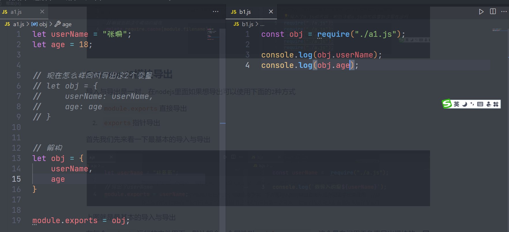
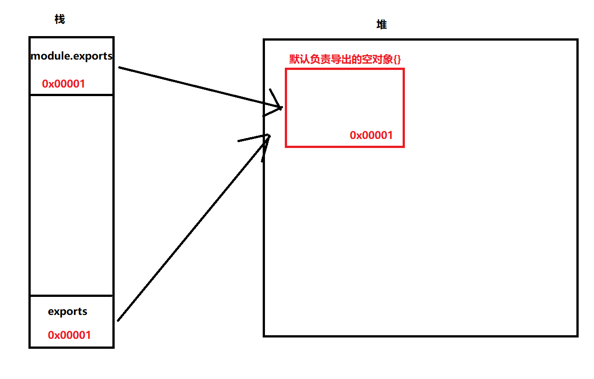
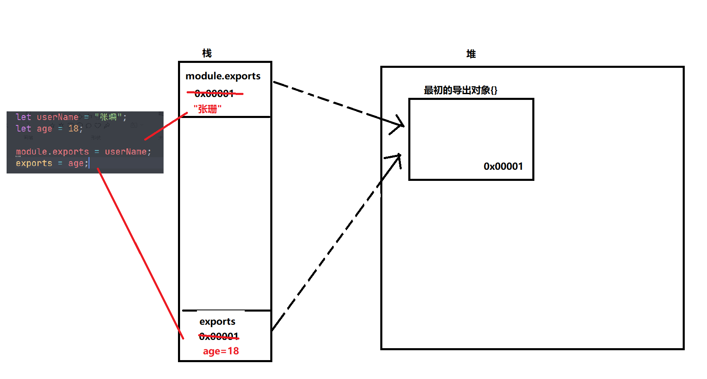
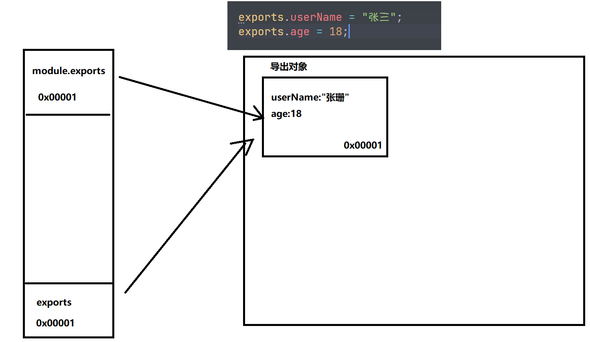

## node.js基础

### ndoe.js的运行

当我们安装好了ndoe.js的环境以后，我们就可以在控制台输入`node -v`来查看环境了，如果显示正常则代表安装成功

安装成功以后，如果我们要运行node.js需要使用一些命令去完成

```bash
$ node 文件名.js
```

如

```bash
$ node 01.js
```

在node.js里面，只能执行`ES`的代码，不能执行`DOM`与`BOM`

```javascript
console.log("hello node.js");
console.log("标哥哥");
window.alert("hello 标哥哥");           //报错，因为node.js没有包含BOM里面的
```

### CommonJs模块化

在之前的ES6里面，我们讲模块化的时候，提到过模块的分类应用

```mermaid
graph TD
A[模块化]-->B[过时标准]
A-->C[现行标准]
B-->B1(AMD规范)
B-->B2(CMD规范)
C-->|浏览器及通用ECMA|C1[ESModule规范]
C-->|node.js平台|C2[CommonJS规范]
```

在现行的模块化标准里面是有2个标准的，分为`ESModule`及`CommonJS`，`ESModule`主要针对的是`ECMA`及浏览器，而`CommonJS`主要针对的就j`node.js`

1. 在`ESModule`里面，我们使用`export`导出 ，使用`import`导入
2. 在`nodejs`里面，我们使用`module.exports`导出 ，使用`require`导入

|                |       导出       |      导入       |
| -------------- | :--------------: | :-------------: |
| `ESModule`规范 |  `export`关键字  | `import`关键字  |
| `CommonJS`规范 | `module.exports` | `require()`方法 |

现在我们先看下面的代码

**Person.js**

```javascript
class Person{
    constructor(userName){
        this.userName = userName;
    }
    sayHello(){
        console.log(`我叫${this.userName}`);
    }
}


// export default Person;
module.exports = Person;
```

**Student.js**

```javascript
// import Person from "./Person.js";
const Person = require("./Person.js");


class Student extends Person{
    constructor(userName,sex){
        super(userName);
        this.sex = sex;
    }
}


let s1 = new Student("张珊","女");
s1.sayHello();
```

当我们去执行`node Student.js`的时候，就不会报错了，因为我们已经改用`CommonJS`的规范来导出与导入 

### CommonJS的模块导入 

在上一个章节我们已经了解了基本的`CommonJS`的导出与导入，我们也知道了如果要导入一个JS文件我们可以使用`require()`方法，现在仔细看一下它的使用


require其实就相当于把一个JS文件拿到另一个JS文件里面去执行


同时我们发现一个特点，当我们执行多次导入的时候，最终`a.js`里面的代码也只会执行一次

**require()方法在导入一个模块以后会把这个模块缓存下来，下次再导入的时候就直接从缓存里面拿出来使用**，所以在上面的代码当中虽然我们导入了5次，但是真正导入的只有第一次导入 ，后面的几次导入都是直接从缓存里面在拿东西

### CommonJS的缓存

如果希望一个模块被导入以后，不要有缓存，可以在一个模块的最后面添加下在面的代码

```javascript
delete require.cache[module.filename];
```


### CommonJS模块导出

导入与导出是一对，在nodejs里面如果想导出可以使用下面的2种方式

1. `module.exports`直接导出
2. `exports`指针导出

首先我们先来看一下最基本的导入与导出


上图就是最基本的导入与导出

在每个`node.js`运行的文件里面，默认都会一个属性叫`module.exports`。这个是专门用于负责导出模块的，**同时还有一个`exports`指向了`module.exports`**

> 当前先不考虑`exports`

#### module.exports

在每个文件里面都会有这个东西，它是专门负责导出的对象，叫`module.exports`,我们直接打印`mdoule.exports`发现它是一个空对象`{}`



如果我们需要导出多个变量，我们可以把它封装成对象 ，然后再导出。但是这么做还不够简洁，我们进一步简化


如果要导出多个变量，我们可以使用解构的赋值与取值的方式快速的完成

---

#### exports

在CommonJS的模块化规范里面，负责导出的只有一个叫`module.exports`，但是**还有一个默认指向了**module.exports，这个就是`exports`

我们现在通过内存图来看下看



```javascript
console.log(module.exports === exports);
```

**场景一**


在上面的代码里面，我们通过`module.exports`导出，又通过`exports`导出，请问`b.js`导入的obj到底是谁？

为了弄清楚上面的东西，我们一定要谨记几个点

1. 真正负责导出的是`module.exports`
2. `exports`指向了最初的`module.exports`的堆里面的地址

现在我们根据上面的代码来画一个内存图



始终记得一句话，直接负责导出的是`module.exports`，所以b.js导入的其实就是`userName`的值，结果就是”张珊“

**场景二**


真正负责导出的仍然是`module.exports`，这个对象被修改了2次，第一次是通过`module.exports.userName`来修改的，第二次是通过`exports.age`来修改的

所以导入的obj结果就是有2个属性

**场景三**




**场景四**


真正负责导出的是`module.exports`，所以最终得到的结果是`hobby:看书`

为了避免后期开发的时候有岐意，我在后面的代码当中优先使用`module.exports`
