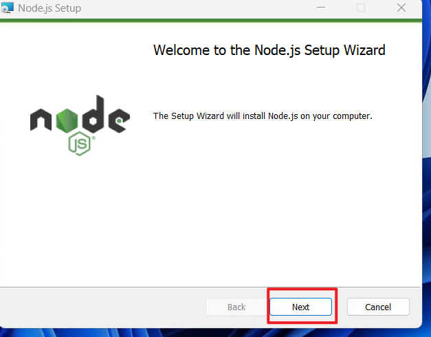
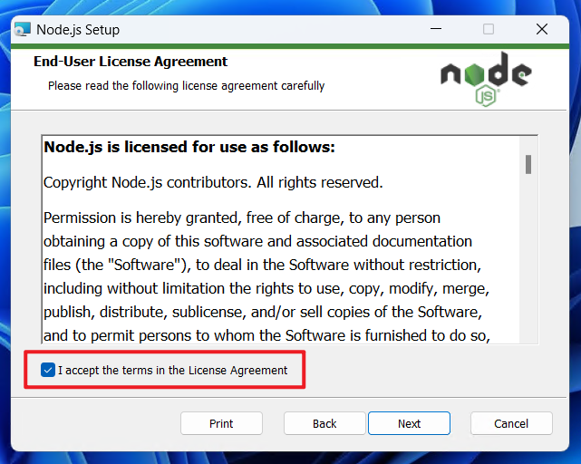
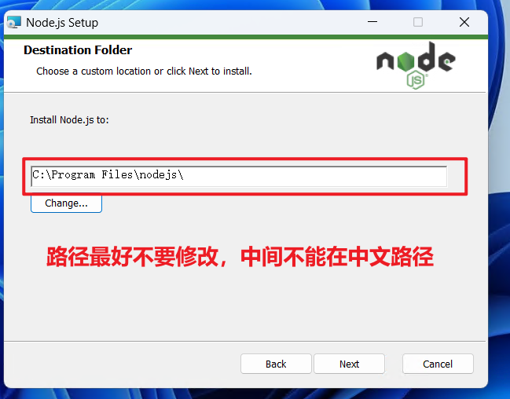
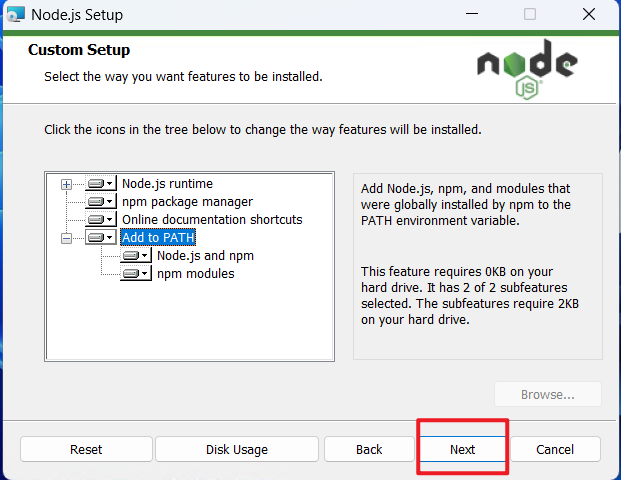
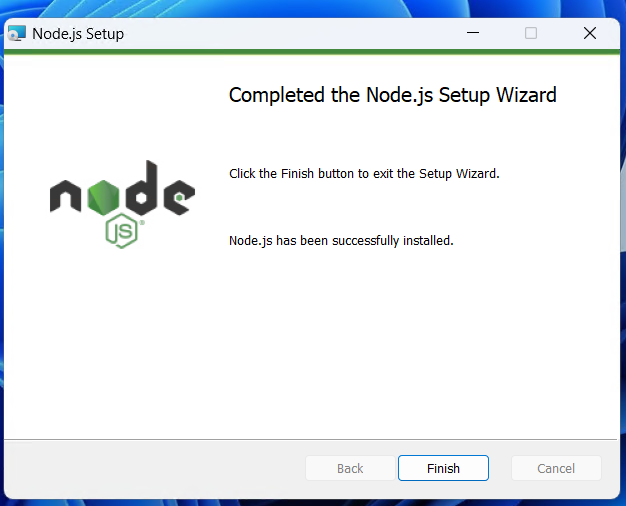
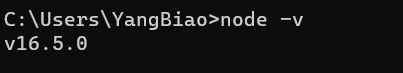

## nodejs介绍与安装

### 关于node.js

node.js其实就是运行在服务器的javascript(以前我们学习的js是运行在浏览器里面的)

在之前我们都认为JS只能运行在浏览器里面，这是不对的，现在的JS可以依托于`ndoe.js`的平台运行在服务器里面

Node.js发布于2009年5月，由Ryan Dahl开发，是一个基于[Chrome](https://baike.baidu.com/item/Chrome/5633839?fromModule=lemma_inlink) [V8](https://baike.baidu.com/item/V8/6178125?fromModule=lemma_inlink)引擎的[JavaScript](https://baike.baidu.com/item/JavaScript/321142?fromModule=lemma_inlink)运行环境，使用了一个[事件驱动](https://baike.baidu.com/item/事件驱动/9597519?fromModule=lemma_inlink)、非阻塞式I/O模型， [1] 让JavaScript 运行在[服务端](https://baike.baidu.com/item/服务端/6492316?fromModule=lemma_inlink)的开发平台，它让JavaScript成为与[PHP](https://baike.baidu.com/item/PHP/9337?fromModule=lemma_inlink)、[Python](https://baike.baidu.com/item/Python/407313?fromModule=lemma_inlink)、[Perl](https://baike.baidu.com/item/Perl/851577?fromModule=lemma_inlink)、[Ruby](https://baike.baidu.com/item/Ruby/11419?fromModule=lemma_inlink)等服务端语言平起平坐的[脚本语言](https://baike.baidu.com/item/脚本语言/1379708?fromModule=lemma_inlink)。 [2] 

node.js只它是一个运行平台 ，这个平台上面运行的是JS代码 ，所以无论是ES5的代码还是ES6的代码都可以在上面运行

### 为什么前端需要学习node.js

在平常的工作当中很我前端程序认为前端不需要去了解后端 ，因为现在的主流开发方式都是前后端分离开发，前端不需要太多的了解后端，但是真正的工作里面，前端是要参于后端的开发的，如服务器的搭建，http请求的处理，SQL语句的编写，缓存的应用,session与cookie的验证，JWT的使用这些都依托于后端。以前的前端并不是不应用后端 ，它们只是使用php来完成后端的操作，但是现在php已经慢慢的淡出了前端的视线，转而使用了另一种语言，这种技术就是`node.js`

node.js只是一个运行环境，也就是一个平台，它里面运行的是js代码，而js代码对于前端来说是非常熟悉的，所以相较于php来说，它不用重新花费精力去了解学习一个新的语言，真接使用就可以了

同时相较于php来说，nodejs提供了强大的第三方插件与模块。**同时nodejs还具备以下的几个优点**

1. 非阻涉的IO
2. 使用事件驱动
3. 天生的高并发能力
4. 单线程的执行

nodejs是让js运行在服务器的平台，所以一般情况下它是没有兼容性的，我们可以直接使用ES6、ES7都可以

**nodejs里面只有`ECMAScript`，没有DOM，更没有BOM**

### nodejs的安装

下载地址：[Index of /dist/ (nodejs.org)](https://nodejs.org/dist/)

1. 双击下载好的安装包

   

2. 点击next

   

3. 同意

   

4. 设置安装路径

   

5. 设置相关信息

   

6. 不要选C、c++的编译环境

   

7. 安装完成

   

   8. 验证是否安装成功

      通过`msi`格式安装的环境成功以后，会自动帮我们添加到系统的环境变量当中（就不需要我们再次去配置环境变量了）

      我们安装完成以后可以验证一下是否安装成功了

      * 按`win+r`在弹出的容器里面输入`cmd`

      * 在`cmd`的窗口里面输入`node -v`

        

        如果出现了版本号，就代表安装成功了

附加：如果电脑是win10/win11的，需要加载powershell的远程执行权限，具体参考下面的教程

[Windows上PowerShell默认禁止运行 *.ps1 脚本原因与解决方法 (softeem.xin)](http://www.softeem.xin:8090/archives/windows-shang-powershell-mo-ren-jin-zhi-yun-xing-ps1-jiao-ben-yuan-yin-yu-jie-jue-fang-fa)