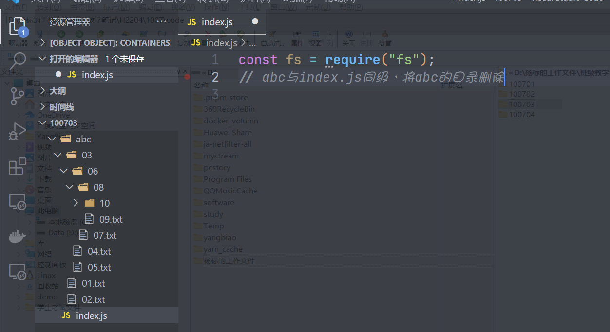
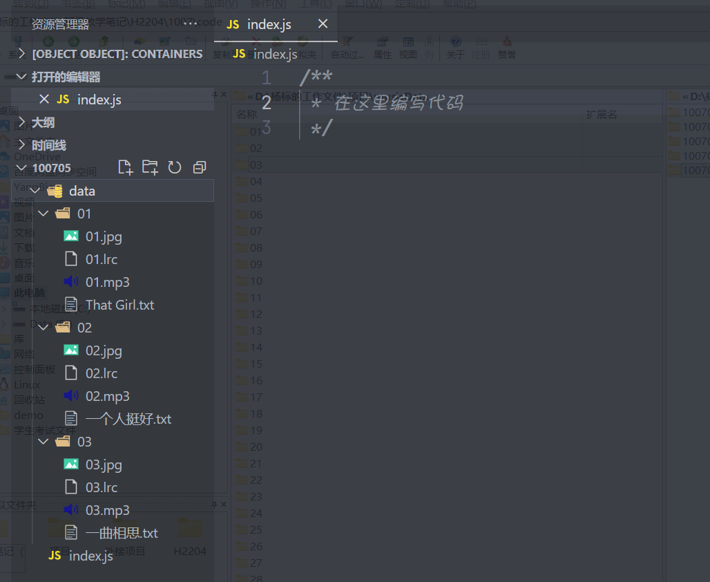

## nodejs内置模块

node.js做为了一个运行平台 ，它本身就内置了很多的模块，主要使用的模块有以下几个

1. `path`路径模块
2. `fs`文件系统模块
3. `os`系统模块
4. `http`网格请求模块
5. `net`网络模块

### path模块

这个模块主要是用于处理电脑上面的路径的，因为`node.js`是运行在本地的路径上面，所以每个js文件的路径都会不一样，所处的文件夹可能也不一样，如果要去处理这些路径的拼接，判断等问题就需要使用到这个模块

在使用这个模块之前，先了解2个内置的与路径相关的变量

1. `__dirname`代表当前js运行的目录的路径
2. `__filename`代表当前js运行的文件路径

```javascript
//__dirname代表当前js运行的文件夹的路径
console.log(__dirname);
//D:\杨标的工作文件\班级教学笔记\H2204\1007\code\100701

//__filename代表当前js运行文件路径
console.log(__filename);
//D:\杨标的工作文件\班级教学笔记\H2204\1007\code\100701\01.js
```

```javascript
const path = require("path");
```

1. `path.join()`方法，方法可以将路径进行拼接

   ```javascript
   let str1 = path.join(__dirname,"a.txt");
   console.log(str1);
   
   let str2 = path.join(__dirname, "../../");
   console.log(str2);
   ```

2. `path.extname()`方法，获取一个路径上面的文件的后缀名

   ```javascript
   let str1 =  path.extname(__filename);
   console.log(str1);          //.js
   
   let str2 = path.extname("D:\\杨标的工作文件\\班级教学笔记\\H2103\\笔记整理\\02DOM+BOM.pdf");
   console.log(str2);
   ```

3. `path.isAbsolute()`方法，判断某一个路径是否是绝对路径

   > 相对路径，相当于当前目录来进行设置
   > ./			 相当于当前目录的当前目录
   > ../			相当于当前目录的上级目录
   > ./img		  相当于当前目录下面的img目录
   > ../js         相当于当前目录的上级目录下面的js目录
   >
   > 
   >
   > 绝对路径，一定是一个完整的路径
   > C:\windows
   > D:\software\yangbiao

   ```javascript
   let flag = path.isAbsolute("../");
   console.log(flag);          //false
   
   let flag2 = path.isAbsolute("C:\\windows");
   console.log(flag2);         //true
   ```

4. `path.resolve()`方法，将一个相对路转换成绝对路径

   ```javascript
   //相对路径
   let flag = path.isAbsolute("../");         //false
   console.log(flag);
   //把相对路径转换成绝对路径
   let str1 = path.resolve("../");
   console.log(str1);
   ```

### fs模块 

> 重点，这个模块FS的全称有个意思 ，第一理解为`File System`文件系统，第二种理解叫`File Stream`文件流

这个模块也是nodejs的内置模块 ，专门用于处理路径下面的文件（有了路径，我们就可以操作文件与文件夹）

```javascript
const fs = require("fs");
```

1. `fs.existsSync()`方法，判断某一个文件或文件夹是否存在（判断某一个路径是否存在）,true代表在，false代表不存在

2. `fs.rmdirSync()`方法，删除一个文件夹，如果这个文件夹不为空，则不能删除

3. `fs.unlinkSync()`，删除一个文件，这个方法可以删除一个文件

4. `fs.copyFileSync()`方法，复制一个文件

5. `fs.renameSync()`方法，重命名一个文件

   `fs.renameSync()`方法本意是文件重命名，但是如果文件在重命名的时候不在同一个文件夹，则相当于剪切操作

6. `fs.mkdirSync()`创建一个文件夹

7. `fs.readdirSync()`读取一个文件夹的信息，它会返回一个数组，这个数组里面包含了所有的文件及文件夹的信息

8. `fs.statSync()`读取某一个路径的信息,结果如下

   ```javascript
   Stats {
     dev: 44114680,
     mode: 33206,
     nlink: 1,
     uid: 0,
     gid: 0,
     rdev: 0,
     blksize: 4096,
     ino: 2533274792094419,
     size: 245,								  //文件大小
     blocks: 0,
     atimeMs: 1665105588523.2388,
     mtimeMs: 1665104647159.5562,
     ctimeMs: 1665105593992.7217,
     birthtimeMs: 1665105588444.7112,
     atime: 2022-10-07T01:19:48.523Z,
     mtime: 2022-10-07T01:04:07.160Z,				//修改时间
     ctime: 2022-10-07T01:19:53.993Z,				//创建时间
     birthtime: 2022-10-07T01:19:48.445Z			//创建时间
   }
   ```

   在读取的结果里面，还有两个方法一定要注意

   * `isFile()`用于判断当前路径是否是文件
   * `isDirectory()`用于判断当前路径是否是文件夹

   ```javascript
   const fs = require("fs");
   let info1 = fs.statSync("./01.js");
   // console.log(info1);
   
   console.log(info1.isFile());            //判断是否是一个文件						true
   		
   console.log(info1.isDirectory());       //判断是否是一个文件夹					//false
   ```

9. `fs.readFileSync()`当前方法可以读取一个文件的内容

   ```javascript
   const fs = require("fs");
   // 读取abc.txt的文件
   
   //第一步：判断路径是否存在
   let p1 = path.join(__dirname, "./abc.txt");
   if (fs.existsSync(p1)) {
       //存在
       //第二步：判断这个路径是否是一个文件
       let p1Info = fs.statSync(p1);
       if (p1Info.isFile()) {
           //说明是文件，可以开始读了
           let result = fs.readFileSync(p1);
           console.log(result.toString());
       }
   }
   else {
       console.log("路径不存在");
   }
   ```

   > 在上面的代码里面，我们读的是文本文件

   如果我们读取是其它类型的文件，还可以把读取的结果转换为特定的要求

   ```javascript
   const path = require("path");
   
   //第一步：构建这个路径
   let p1 = path.join(__dirname, "./img/w08.jpg");
   //第二步：判断路径是否存在
   if (fs.existsSync(p1)) {
       //第三步：判断这个路径是否文件
       let p1Info = fs.statSync(p1);
       if (p1Info.isFile()) {
           let result = fs.readFileSync(p1);
           console.log(result.toString("base64"));    //将它转换成了base64
       }
   }
   else {
       console.log("路径不存在");
   }
   ```

10. `fs.writeFileSync()`将一个内容写入到文件

    这个文件与上面的方法是相对应的，一个是读，一个是写

    ```javascript
    const path = require("path");
    const fs = require("fs");
    
    //第一步：构建路径
    let p1 = path.join(__dirname, "./abc.txt");
    fs.writeFileSync(p1,"标哥哥在讲课....");
    console.log("写入完成");
    ```

    上面的代码是一个最基本的最入过程，我们还可以有更高级的写法

    ```javascript
    /**
     * 将bbb.txt里面的base64字符串转换成图片
     */
    
    const fs = require("fs");
    const path = require("path");
    
    //第一步：构建路径
    let p1 = path.join(__dirname, "./bbb.txt");                  //base64字符串
    let img1 = path.join(__dirname, "./img/dijia.png");          //最终要生成的图片的路径
    
    //第二步：判断路径是否存在
    if (fs.existsSync(p1)) {
        //第三步：判断这个路径是否是文件
        let p1Info = fs.statSync(p1);
        if (p1Info.isFile()) {
            let result = fs.readFileSync(p1);
            //第四步：将base64转换成图片
            fs.writeFileSync(img1, result.toString(), { encoding: "base64" });
            console.log("写入成功");
        }
    }
    else {
        console.log("路径不存在")
    }
    ```


### os模块

>  os:operation system操作系统

os模块是与系统相关的模块，可以通过调用里面的方法来实现获取系统的相关信息，如CPU，网卡，临时目录 ，内存等

1. `os.version()`返回当前系统的版本信息
2. `os.hostname()`返回录前电脑的主机名称
3. `os.cpus()`返回当前电脑的cpu信息
4. `os.totalmem()`返回当前电脑的总内存信息
5. `os.freemem()`返回当前电脑的剩余内容
6. `os.networkInterfaces()`返回当前电脑的网卡信息
7. `os.userInfo()`返回当前登录到系统的用户信息
8. `os.homedir()`返回家目录的地址
9. `os.tmpdir()`当前系统的临时目录

---

### 课堂练习

1. 现有如下的文件结构，请编写代码删除目录

   

> 提示：
>
> 1. 会用到递归
> 2. `fs.existsSync().fs.readdirSync(),fs.unlinkSync(),fs.rmdirSync(),path.join(),fs.statSync(),isFile()/isDirectory()`用到这些方法

```javascript
const fs = require("fs");
const path = require("path");

//我给一个路径你，你帮我删除
const deleteAll = p => {
    //第一步：先判断这个路径是否存在
    if (fs.existsSync(p)) {
        //第二步：判断这个路径是文件夹还是文件
        let pInfo = fs.statSync(p);
        if (pInfo.isFile()) {
            //第三步：如果是文件，我们就直接删除
            fs.unlinkSync(p);
        }
        else if (pInfo.isDirectory()) {
            let arr = fs.readdirSync(p);
            for (let item of arr) {
                // 把item和之前的路径接起来，形成一个的路径
                let newPath = path.join(p,item);
                deleteAll(newPath);    //递归
            }
            //把所有的文件都删除以后，我们就可以删除这个文件夹了
            fs.rmdirSync(p);
        }
    }
}

deleteAll(path.join(__dirname,"./abc"));
```


2. 根据下面的文件结构，生成指定的文件

   

 读取data目录 ，生成一个`musicData.txt`的文件 ，生成的内容如下

```javascript
[
    {
        "picPath": "01/01.jpg",
        "lrcPath": "01/01.lrc",
        "lrcText": "[00:00.000]That Girl - Olly Murs\n[00:00...",
        "musicPath": "01/01.mp3",
        "musicName": "That Girl"
    },
    {
        "picPath": "02/02.jpg",
        "lrcPath": "02/02.lrc",
        "lrcText": "[00:00.000]一个人挺好 - 孟颖\n[00:05.320]词：杨小壮.....",
        "musicPath": "02/02.mp3",
        "musicName": "一个人挺好"
    },
    {
        "picPath": "03/03.jpg",
        "lrcPath": "03/03.lrc",
        "lrcText": "[00:00.000]一曲相思 - 半阳\n[00:02.690]词：......",
        "musicPath": "03/03.mp3",
        "musicName": "一曲相思"
    }
]
```

> 提示
>
> 1. 会用到`fs.readdirSync(),fs.readFileSync(),fs.writeFileSync(),JSON,stringify()`

```javascript
/**
 * 在这里编写代码
 */

const path = require("path");
const fs = require("fs");


const getData = p => {
    let result = [];
    //第一步：判断路径是否存在，第二步：判断是否是一个文件夹
    if (fs.existsSync(p) && fs.statSync(p).isDirectory()) {
        let arr = fs.readdirSync(p);
        for (let item of arr) {
            let obj = {};
            // 得到了新路径
            let p2 = path.join(p, item);
            let arr2 = fs.readdirSync(p2);
            for (let item2 of arr2) {
                //要获取每一个文件的后缀名
                let extname = path.extname(item2);
                switch (extname) {
                    case ".jpg":
                        obj.picPath = `${item}/${item2}`;
                        break;
                    case ".lrc":
                        obj.lrcPath = `${item}/${item2}`;
                        obj.lrcText = fs.readFileSync(path.join(p, item, item2)).toString();
                        break;
                    case ".mp3":
                        obj.musicPath = `${item}/${item2}`;
                        break;
                    case ".txt":
                        obj.musicName = item2.replace(extname, "");
                        break;
                }
            }
            
            result.push(obj);
           
        }
    }
    return result;
}


let result = getData(path.join(__dirname, "./data"));
let resultJsonStr = JSON.stringify(result);
fs.writeFileSync(path.join(__dirname,"./musicData.txt"),resultJsonStr);
console.log("写入完成");
```

