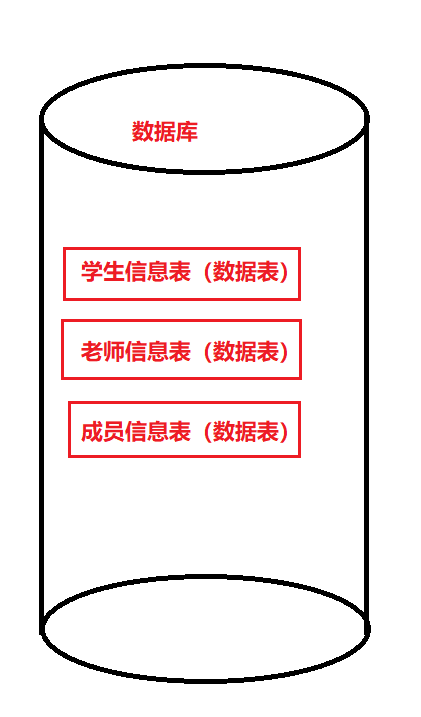
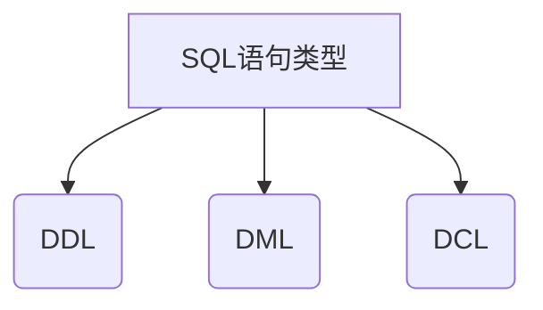
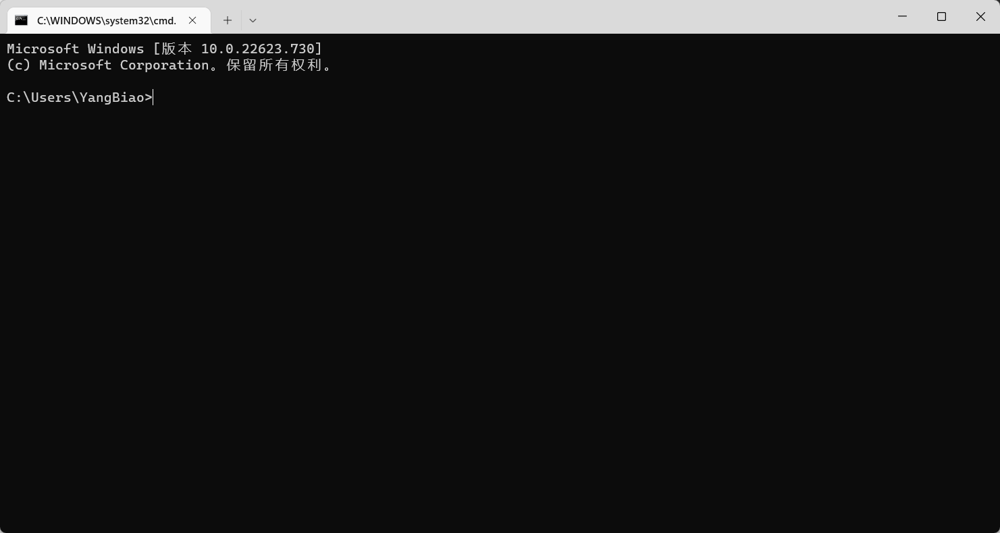
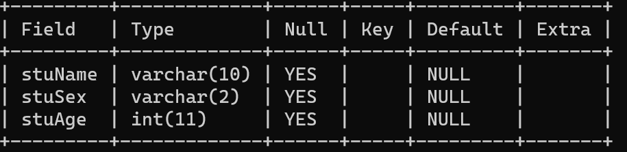
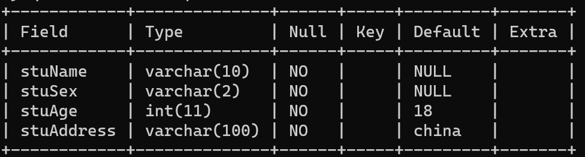
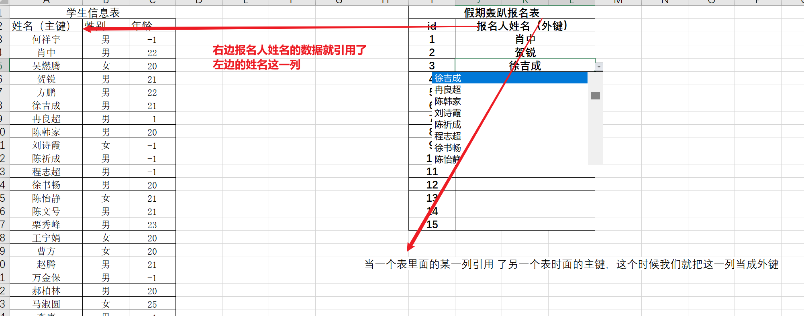
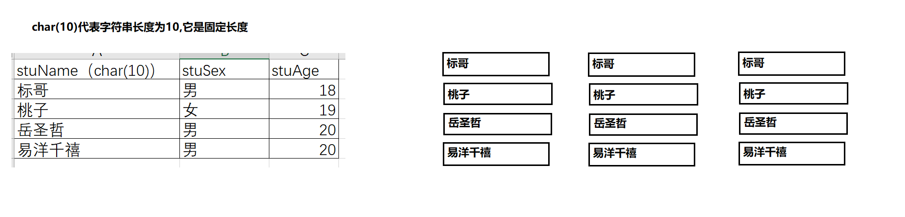
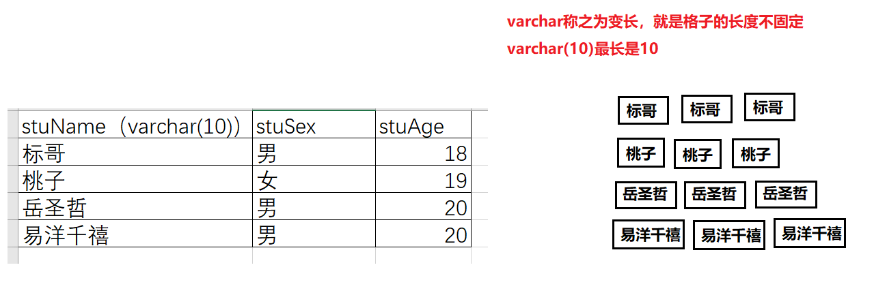
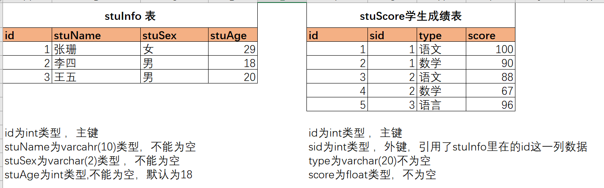

## MySql基础

什么是数据库？它就是一个存放数据的仓库，官方的说话叫数据持久化，数据库与我们之前所学习的`excel`非常相似，一个Excel工作薄里面有很多个工作表


一个Excel就可以看成是一个数据为，里面可以存放我们的数据，一个数据库里面也会有很多的数据表



现在的数据库一般都分为2大类型 

1. 关系型数据库
   * `mysql`
   * `sql server`
   * `oracle`
   * `db2`
   * `access`
2. 非关系型数据型(NoSQL)
   * `mongodb`
   * `redis`

MySql是一种**关系型**的**服务器**数据库，它可以使用面向对象的思维去理解它，运用它

一个数据库里面有很多个表，一个表里面应该会有很多个数据，如下所示

| 学生信息表                                                   | 老师信息表                                                   |
| ------------------------------------------------------------ | ------------------------------------------------------------ |
|  |  |

在上面的图片里面我们可以看到，**数据库**就是由很多个**数据表**来构成的，而在一个表里面，它应该有**行**和**列**的概念

在数据库的学习里面，如果要操作数据库的结构与数据，需要使用一种专门的技术 ，这种技术叫结构化查询语句`SQL(Structured Query Language)`

SQL功能强大，简单易学，使用方便，已经成为了数据库操作的基础。在学习SQL语句（命名）的时候 ，其实SQL也会为三在类




1. `DDL`语句

   全称叫数据库定义语句（`Database Define Language`），它用创建库，创建表，定义表的数据结构以及数据类型，不会操作数据库具体存放的数据。它主要的关键字有`create,drop,alter,modify,change,show,desc`等

   **DDL语句只有结构有关，不与数据相关**

2. `DML`语句

   全称叫数据库操作语句（`Database Manipulation Language`），它不与数据库的结构有关，只负责操作数据库当中存放的数据，它主要的关键字有`insert,delete,update,select,where,and,or`等

3. `DCL`语句

   全称叫数据库控制语句（`Database control language`），它主要负责控制数据库的权限，一般情况下是DBA使用这种语句

----

### 数据库连接

在使用数据库之前，我们要先连接数据库，但是在初学阶段我们不建议同学们直接使用数据库管理工具来管理自己的数据库，而是要通过命令行来操作自己的数据库（也就是DDL语句）

在每个电脑上面我们都可以使用DOS命令来操作连接自己的数据库，所以我们只需有DOS（linux系统叫终端工具）就可以了

1. 按`win+r`键

2. 输入`cmd`打开DOS窗口，如下所示

   

上在的窗口就是DOS界面的窗口，我们可以在里面执行一些常用的DOS命名

1. `dir`命令，列出当前目录下现的文件夹与文件

2. `cd`命令，切换文件夹，`cd .`切换当前文件夹，`cd ..`切换到上级目录,`cd yangbiao`切换到yangbiao这个文件夹，`cd \`直接切换到当前这个盘符的根目录

   `cd`命令的全称叫`change directory`切换文件夹

3. `ipconfig`查看当前网络配置信息，如果要拿所有的网卡人话上，我们可以使用`ipconfig /all`

4. `netstat -ano`查看当前正在使用的端口号

5. `ping` 向某一个服务器发起请求，看是否可以得到回应

有了这个DOS命令以后，我们就可以开始使用DOS命令来连接我们的数据库

```bash
$ mysql -h 127.0.0.1 -uroot -p
```

> -h代表的是host主机地址，也代表你要连接的mysql服务器地址，后面的127.0.0.1是本机IP,如果要连接其它的服务器，把这个IP换成其它服务器的IP，如果连接是自己的服务器，则可以把`-h 127.0.0.1`省略
>
> -u代表user用户名，后面的root代表我们使用这个用户名`root`是mysql数据库当中的超级管理员
>
> -p代表password，有这个东西代表我们要使用密码连接


当进入到这个界面的时候，我们就已经连接到数据库了，上面有个命令`Commands end with ; or \g.`代表`mysql`的命令以`;`结束，所以我们输入每一个sql句以后都要添加分号；`Your MySQL connection id is 6`你当前连接的编号是`6`

一旦连接到数据库以后，我们接下来所输入应该是`SQL`语句了

### 基础DDL语句

1. 退出mysql

   ```sql
   exit;
   -- 或
   quit;
   ```

2. 显示当前所有数据库

   ```sql
   show databases;
   ```

3. 创建数据库

   ```sql
   -- 创建一个test2的数据库
   create database 数据库名;
   create database test2;
   ```

4. 删除数据库

   ```sql
   -- 删除数据库test2;
   drop database 数据库名;
   drop database test2;
   ```

5. 切换数据库

   ```sql
   use 数据库名;
   use h2204;
   ```

   切换数据库就相当于打开了某一个数据库（在电脑上面的理解可以认为是打开了一个某一个Excel工作薄）

6. 显示数据库下面的所有的表

   ```sql
   show tables;
   ```

7. 创建数据库

   ```sql
   create table if not exists 表名(
   	列名1 列数据类型,
   	列名2 列数据类型
   ) engine = innodb default charset = UTF8;
   
   create table if not exists teacherInfo(
   	stuName varchar(10),
   	stuSex varchar(2),
   	stuAge int
   ) engine=innodb default charset = UTF8;
   ```

   > `engine=innodb`代表当前数据表的存储引擎使用的是`innodb`，这种存储引擎可以实现表与表之间的主外键关系

8. 重命名数据表

   ```sql
   alter table 原表名 rename 新表名;
   -- 将teacherinfo的表修改为 teacher
   alter table teacherinfo rename teacher;
   ```

9. 显示数据表列的信息

   ```sql
   show columns from 表名;
   -- 显示teacher表里面的列的信息
   show column from teacher;
   
   -- 它有一个简洁的命令
   desc 表名;
   desc teacher;
   ```

   

   上图就是显示的结果，`Field`代表列名，`Type`代表这名的数据类型，`Null`代表这列是否可以为空值，`Default`代表这一个如果在不输入的时候的默认值，`Extra`代表是否有外键或约束，索引等情况。`Key`代表这一列是否是主键

10. 修改数据表，添加数据列

    ```sql
    alter table 表名 add column 列名 列的类型及描述信息
    -- 如下，添加 stuAddress这一列，字符串长度为varchar(100)
    alter table teacher add column stuAddress varchar(100);
    ```

11. 修改数据表，删除数据列

    ```sql
    alter table 表名 drop column 列名;
    -- 删除stuAddress这一列
    alter table teacher drop column stuAddress;
    ```

12. 修改数据表，修改某一列的名称

    ```sql
    alter table 表名 change 原列名 新列名 数据类型及描述信息;
    -- 将stuAge的名称改为age 
    alter table teacher change stuAge age varchar(2);
    ```

    > 这里用到了一个关键字`change`，这个关键字用于修改名称

13. 修改列的**属性**信息

    ```sql
    -- 将 age的属性由varchar(2) 改为 int(11)  
    alter table 表名 modify 列名 类型及描述信息;
    alter table teacher modify sex int(11);
    ```

    > 修改列的名称我们使用`change`，修改列的属性我们使用`modify`

14. 删除数据表

    ```sql
    drop table 表名;
    -- 删除teacher
    drop table teacher;
    ```

15. 创建数据表，并指定数据列的特殊状态

    ```sql
    create table if not exists stuInfo(
    	stuName varchar(10) not null,
    	stuSex varchar(2) not null,
    	stuAge int not null default 18,
    	stuAddress varchar(100)
    )engine = innodb default charset = UTF8;
    ```

    > not null代表不能为空 default代表默认值

16. 在第15项的基础上面，进行修改，请将stuAddress 修改为不能为空，默认值为china

    ```sql
    -- 修改表stuinfo,修改列的属性
    ```

### 数据表的主键

**什么是数据表的主键**？

主键是数据表当中最重要的一个必不可少的一个关键技术，在数据表当中，如果某一列设置成了主键列，则这一列不能空，并且不能重复。

在日常生活当中，我们有一些信息都是主键信息。如学生的学号**不能重复（唯一），也不能为空**；每个人的身份证号不能重复，也不能为空，这种信息我们都会使用主键去表示

设置主键的方式有很多种

1. 如果一个表已经存在了，现在需要把某一列设置为主键

   

   在上图里面，我们想把`stuName`设置为主键，怎么办呢

   ```sql
   -- 修改表，添加主键
   alter table 表名 add primary key(列名);
   -- 如
   alter table stuinfo add primary key(stuName);
   ```

2. 怎么样直接在创建表的时候就把某一列设置为主键

   ```sql
   create table if not exists stuinfo(
   	id int primary key,
       stuName varchar(20) not null,
       stuSex varchar(2) not null,
       stuAge int not null default 18,
       stuAddress varchar(100)
   )engine = innodb default charset = UTF8;
   
   -- 第二种写法，直接放在最后
   create table if not exists stuinfo(
   	id int,
       stuName varchar(20) not null,
       stuSex varchar(2) not null,
       stuAge int not null default 18,
       stuAddress varchar(100),
       primary key(id)
   )engine = innodb default charset = UTF8;
   ```

### 删除主键

```sql
alter table 表名 drop primary key;
-- 如
alter table stuinfo drop primary key;
```

### 数据表的外键

**什么是外键？为什么需要外键**

当一个表引用了另一个表的主键去存储数据时候，这一列我们就称之为外键列，如下所示



```sql
create table is not exists 表名(
    列名 类型或描述信息....
    foreign key(当前表某一列) references 其它表(某一列)
)engine = innodb default charset = utf8;
```

现在我们根据下面的图来创建2个表，构建主外键的约束关系


```sql
create table if not exists booktype (
	id int primary key,
	type varchar(100) not null
)engine = innodb default charset = utf8;

------------------------------------

create table if not exists bookinfo (
	id int primary key,
	typeid int not null,
	bookname varchar(100) not null,
	price float not null,
	foreign key(typeid) references booktype(id)
)engine = innodb default charset = utf8;
```

在创建外键的要注意，你所创建的外键的数据类型要与引用的那个表的主键的数据类型保持一致，否则就会失败，同时键一般都是不能为空

### MySql数据类型简述

1. `varchar`与`char`的区别

   

​	

`char`的优点是存储与读取都非常快，它是对齐的存储格式，但是很消耗存储空间

`varchar`的优点是长度不固定，根据你的内容来决定长度，它不用占用很大的空间，但是因为在存储的时候内存没有对齐 ，所以查找与存储的时候速度稍微慢一点

这两种数据类型在后期都会用到


### 练习

1. 根据要求完成如下的表的创建及修改过程
   * 新建一个数据库，名为test1010
   * 进入到这个数据库test1010
   * 创建一个表，信息如下
     	tid int(11),
     	tname varchar(20),
     	tsex varchar(2),
     	t_mail varchar(255)
       表名为tinfo
   * 将表名修改为teacher_info
   * 新增一列 t_phone varchar(18)
   * 删除一列 t_mail
   * 将t_phone的列修改为 t_tel varchar(20)

2. 根据要求，创建如下的数据表

   