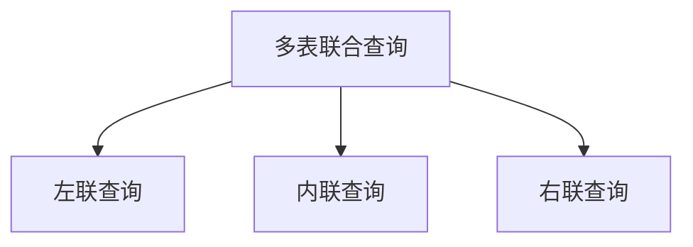
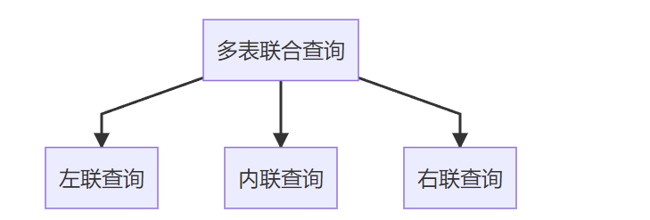
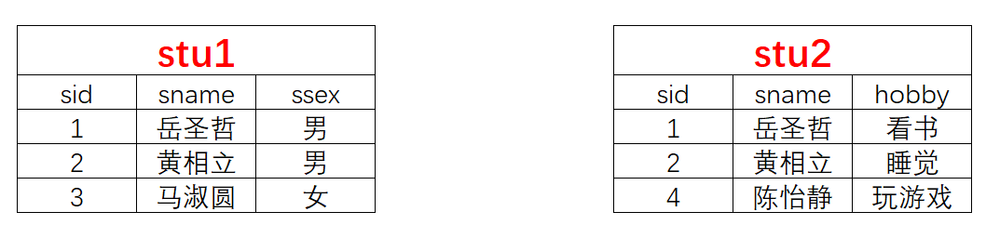
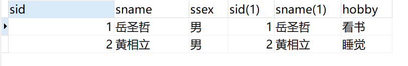
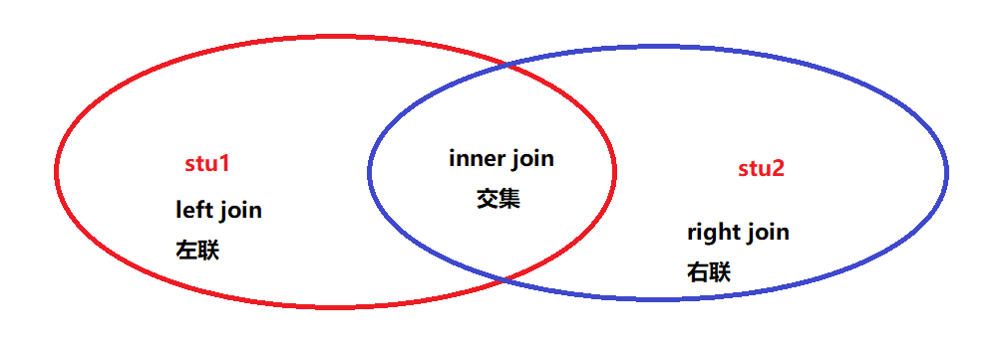
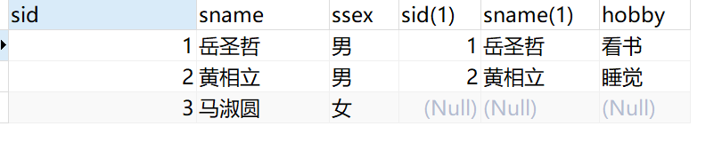
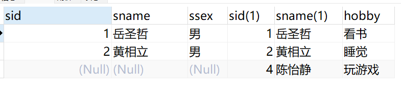

## 多表联查详细讲解

在明天我们讲解了多表联查，主要是使用2种语法

1. 旧的语法

   ```sql
   select 列名1,列名2 from 表1,表2
   where 表1.列 = 表2.列;
   ```

2. 新的写法：内联查询

   ```sql
   select 列名1,列名2 from 表1
   inner join 表2 on 表1.列 = 表2.列;
   ```

   > 这里面使用的`inner join`我们就叫内联查询







现在我们有了上面的两张表，然后我们去执行内联查询

```sql
select * from stu1 
inner join stu2 on stu1.sid = stu2.sid;
```



这个时候我们可以的睦到，我们得到的结果只有2条数据



* `left join` 左联查询，结果以左边的表为主 
* `inner join` 内联查询，取两个表的交集部分 
* `right join` 右联查询，结果以右边的表为主

**左联查询**

```sql
select * from stu1
left join stu2 on stu1.sid = stu2.sid;
```



**右联查询**

```sql
select * from stu1
right join stu2 on stu1.sid = stu2.sid;
```



