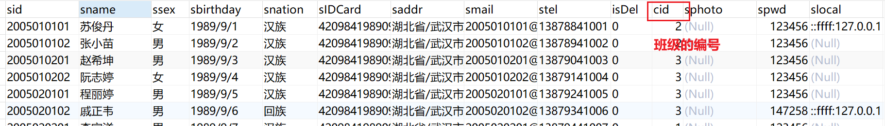
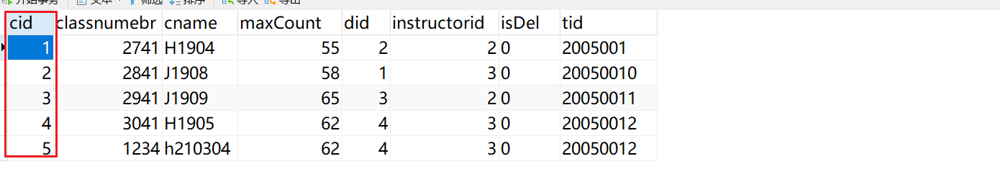
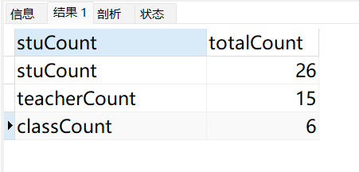
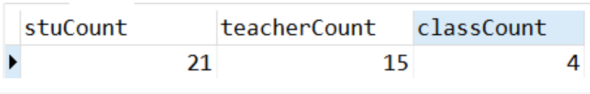
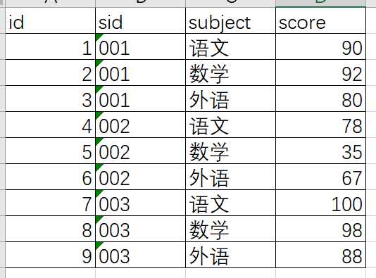
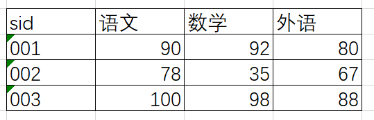

## MySql的DML语句

之前在进入到MySql的时候，我们就提到过,MySql需要使用专门的语句SQL语句来进行操作，SQL语句的 分类又分为三大类 

1. DDL语句，主要是用于控制数据库与数据表的结构 ，使用 `create,drop,alter,show` 等关键字， 它不与数据库的内容相关 
2. DML语句，主要是用于对数据表的内容进行增删改查，使用 `insert,delete,update,select` 等 关键字，这种类型的SQL语句只操作数据库的内容，不对数据库及数据表的结构进行操作 
3. DCL语句，主要是用数据库的权限进行操作

我们已经了解了数据库表的创建及表的特点，现在我们需要去习怎么向操作表里面的数据，这个时候就 需要学习DML这一个类型的语句（程序员的重点）

DML语句的学习主要是围绕“新增”，“删除”，“修改”，“查询”四个操作来完成，它分别会有一些特殊的关键字

| 操作 | 关键字   |
| ---- | -------- |
| 新增 | `insert` |
| 删除 | `delete` |
| 修改 | `update` |
| 查询 | `select` |

> 开发的时候经常所说的CRUD指的就是上面的四个操作

### 新增SQL语句

```sql
insert into  表名 (列名1,列名2....) values (值1,值2....);
```

上面的语句就是插入语句的SQL

```sql
insert into stuinfo (stuName,stuSex,stuAge) values ("标哥","男",18);
```

-----

### 修改的SQL语句

```sql
update 表名 set 列名1 = 值1,列名2=值2 where 条件;
```

上面就是修改的SQL语句，在修改的时候，我们如果要修改某些列，只需要单独的列出要修改的列就行了，不要修改的就不要列举，后面的where则代表限定条件

```sql
update stuinfo set stuAge = 99 WHERE stuName = "标哥";
```

我们的修改的时候 还可以同时修改多个列

```sql
update stuinfo SET stuSex = "保密", stuName = "标哥帅哥" where stuName = '标哥'
```

我们在修改的时候还可以直接在某一个列的基础上面修改，如我们希望在所有的姓名的后面追加一个666

```sql
update stuinfo set stuName = CONCAT(stuName,"888") WHERE stuName = '标哥帅哥666';
```

> 因为原来的`stuName`是一个字符串，所以这里我们使用了`concat`来拼接字符串

----

### 删除SQL语句

删除数据库是一个非常危险的操作，我们一定谨慎的处理，所以在执行语句之前一定要检测是否有添加限定条件 

```sql
delete from 表名 where 条件;
```

> 在执行删除操作的时候 ，一定要添加限定的where条件，如果不添加，会把整个数据表都删除

```sql
delete from stuinfo where stuName = '标哥帅哥666888';
```

----

上面的三种SQL语句属于新增，修改，删除的操作，它是DML语句当中最常见的，也是比较简单的。在DML里面，最复杂的还是查询语句

### 查询SQL语句

查询是DML语句里面比较复杂的一个SQL语句，但是本身的语法又很简单，只要遵守查询的语法就可以得到结果

```sql
select 列名1,列名2 from 表名 where 条件 ;
```

这个`select`的关键字后面跟的就是列名，如果想把某些列出来就加上某些列的名称

```sql
select sid,sname from stuinfo;
```

如果要显示所有列的名称，可以直接使用*

```sql
select * from stuinfo;
```

### 查询范例

1. 查询性别为“男”的学生信息

   ```sql
   select * from stuinfo where ssex = '男';
   ```

2. 查询cid小于4的学生

   ```sql
   select * from stuinfo where cid < 4;
   ```

3. 查询cid不等于2的学生

   ```sql
   select * from stuinfo where cid != 2;
   -- 或
   select * from stuinfo where cid <> 2;
   ```

4. 查询所有 sphoto 为 null 的学生

   ```sql
   select * from stuinfo where sphoto is null;
   ```

5. 查询所有 sphoto 不为 null 的学生

   ```sql
   select * from stuinfo where sphoto is not null;
   ```

6. 查询 cid在1~3之间的，包含1和3

   ```sql
   select * from stuinfo where cid >= 1 and cid <= 3;
   ```

   如果有多个条件限定，我们就要使用`and`的关键字来进行拼接

   **小技巧**：如果是数字表示的区间，我们还可以使用一个特殊的关键字`between... and `

   ```sql
   select * from stuinfo where cid between 1 and 3;
   ```

7. 查询性别为女，且cid为3的学生

   ```sql
   select * from stuinfo where ssex = '女' and cid = 3;
   ```

8. 查询cid为1或cid为4的学生

   ```sql
   select * from stuinfo where cid = 1 or cid = 4;
   ```

   > 上面的or就是或的条件使用

9. 查询cid为1或cid为4的且是女生

   ```sql
   select * from stuinfo where (cid = 1 or cid =4) and ssex = '女';
   ```

10. 查询stuinfo表里面一共有多少条数据

    ```sql
    select count(*) from stuinfo;
    ```

11. `as` 别名转换，可以将一个列或一个表或一个查询结果使用别名来表示

    ```sql
    select count(*) as 'totalCount' from stuinfo;
    ```

12. 当 `as` 去做别名转换的时候是可以省略掉的，所以上面的SQL语句可以转换为下面的写法

    ```sql
    select count(*) 'totalCount' from stuinfo;
    ```

13. 查询stuinfo表里面,统计里面的女生有多少人

    ```sql
    select count(*) 'girlCount' from stuinfo WHERE ssex  = '女';
    ```

14. 查询stuinfo表里面,统计里面的男生有多少人

    ```sql
    select count(*) 'boyCount' from stuinfo WHERE ssex  = '男';
    ```

15. 查询stuinfo表里面，男生与女生各有多少人【一条SQL语句完成】

    ```sql
    select ssex,count(*) 'totalCount' from stuinfo
    group by ssex;
    ```

16. 查询各民族各有多少人【分组聚合】

    ```sql
    select snation,count(*) from stuinfo
    group by snation;
    ```

17. 查询每个班的男生女生各有多？【分组聚合】

    ```sql
    select cid,ssex,count(*) 'totalCount' from stuinfo
    group by cid,ssex;
    ```

18. 查询汉族里面男生与女生各有多少?

    ```sql
    select ssex,count(*)  'totalCount' from stuinfo 
    where snation = '汉族'
    group by ssex;
    ```

    > 分组聚合其实就是group by 的使用 
    >
    > gropu by语句要放在where 语句的后面

19. 查询姓名为余珊珊,王静,李明的信息

    ```sql
    select * from stuinfo where sname = '余珊珊' or sname = '王静' or sname ='李明';
    ```

    上面的SQL语句虽然说是可以得到的结果的 ，但是我们发现这么写有一个问题：如果限定的人数越来越多，则后面的or条件也会越来越长。同时我们还发现一个点，它所有的or都只针对`sname`这个字段

    ```sql
    select * from stuinfo where sname in ('余珊珊','王静','李明');
    ```

20. 查询姓名不为余珊珊,且不为王静,且不为李明的信息

    ```sql
    select * from stuinfo where sname != '余珊珊' and sname != '王静' and sname != '李明';
    ```

    对于上面的情况 ，也是可以简写的

    ```sql
    select * from stuinfo where sname not in ('余珊珊','王静','李明')
    ```

    > 上面的2个语句是in与not in的使用结合

21. 查询stuinfo里面所有的信息，结果以cid为升序排列

    ```sql
    select * from stuinfo
    order by cid asc;
    ```

    > order by 是排序的意思 ，默认情部下是asc升序，如果想使用降序，那么就把asc换成desc

22. 查询成绩表里面最高分是多少

    ```sql
    select max(score) 'max_score' from gradeinfo;
    ```

23. 查询成绩表里面最低分是多少

    ```sql
    select min(score) 'min_score' from gradeinfo ;
    ```

24. 求成绩表里面的平均分

    ```sql
    select avg(score) 'avg_score' from gradeinfo;
    ```

    > 在上面的代码里面，`max`函数求最大，`min`函数求最小，`avg`函数求平均值

25. 查询每个学生的平均成绩【分组聚合】

    ```sql
    select sid,avg(score) 'avg_score' from gradeinfo
    group by sid;
    ```

> 上面的21条语句都是精确查询语句，使用`=,!=,<,>,in,not in`来执行过滤条件 ，其实在查询的时候还有一种查询方式叫模糊查询

### 模糊查询范例

模块查询以发以下2个点

1. 通配符`%`
2. 占位符`_`

模糊查询使用的匹配符号不再是之前精确查询的`=`之类的，它使用`like`来连接查询条件

1. 查询姓名以苏开头的学生

   ```sql
   select * from stuinfo where sname like '苏%';
   ```

2. 查询所有生日是15号的学生

   ```sql
   select * from stuinfo where sbirthday like '%15';
   ```

3. 查询所有sname包含"小"的学生信息

   ```sql
   select * from stuinfo where sname like '%小%';
   ```

   > 上面的3条语句就是模糊的中的典型代表

4. 查询姓“王”的学生，名子只有1个字的

   ```sql
   select * from stuinfo where sname like '王_';
   ```

5. 查询班级里面所有姓名是3个字的学生

   ```sql
   select * from stuinfo where sname like '___';
   ```

-----

### 多表联查【过渡方案】

多表联查就是多个表联合起来一起查询。

有些时候在存储数据的时候，我们的数据并不可能在同一张表里面，而是分别放在了多个表里面，如下所示



上面的表仅仅只显示了这个学生的信息，而没有显示出班级的信息，开始如果要找到班级信息我们应该去另一张表`classinfo`里面去查询信息。

如上面的`cid`中的字段值为1,2,3这到底代表的是什么意思我们需要通过`classinfo`这一张表来看



这个时候就产生了一个现象，如果我们查询学生的时候，需要展示这个学生的信息，还要展示这个班级的信息，那么，我们就要使用多表联合查询

```sql
select 列名1,列名2... from 表名1,表2...
```

1. 查询学生信息并显示所对应的班级名称

   ```sql
   select stuinfo.*,classinfo.cname from stuinfo,classinfo
   where stuinfo.cid = classinfo.cid;
   ```

2. 查询学生信息，并显示所对应的班级名称，但要求班级是H1904的学生

   ```sql
   select stuinfo.*,classinfo.cname from stuinfo,classinfo
   where stuinfo.cid = classinfo.cid
   and classinfo.cname = 'H1904';
   ```

3. 查询学生信息，并显示所对应的班级名称，但要求classnumber是2941的，并且性别是女的学生

   ```sql
   select stuinfo.*,classinfo.cname from stuinfo,classinfo
   where stuinfo.cid = classinfo.cid
   and classinfo.classnumebr = 2941
   and stuinfo.ssex = '女';
   ```

4. 查询班级信息，并追加列显示这个班级的实际学生人数

   ```sql
   select *,(select count(*) from stuinfo where stuinfo.cid = classinfo.cid) as 'totalCount' from classinfo;
   ```

   > 上面的SQL语句其实执行效率是非常低的，在正式的开发环境下面是很少使用的

整体上来说多表联查其实是很方便的，可以快速的获取我们想要的数据，但是在工作当中，这种多表联联查的写法都是很少去使用的，后面如查想使用多表联多，我们建议使用内联查询或子查询

### 内联查询与子查询

内联查询其实就是多表联查的另一种写法，这种写法很直观 ，很方便，并且很好理解，后期我们会使用 这一种写法来替代上面多表联查的写法

它的语法格式如下

```sql
select 列名... from 表1
inner join 表2 on 表1.列 =  表2.列
inner join 表3 on xx.xx = xx.xx;
```

1. 查询学生信息并显示所对应的班级名称

   ```sql
   select stuinfo.*,classinfo.cname from stuinfo
   inner join classinfo on stuinfo.cid = classinfo.cid
   ```

2. 查询学生信息，并显示所对应的班级名称，但要求班级是H1904的学生

   ```sql
   select stuinfo.*,classinfo.cname from stuinfo 
   inner join classinfo on stuinfo.cid = classinfo.cid
   where classinfo.cname = 'H1904';
   ```

3. 查询学生信息，并显示所对应的班级名称，但要求classnumber是2941的，并且性别是女的学生

   ```sql
   select a.*,b.cname from stuinfo a
   inner join classinfo b on a.cid = b.cid
   where b.classnumebr = 2941 and a.ssex = "女";
   ```

4. 查询班级信息，并追加列显示这个班级的实际学生人数

   ```sql
   select b.*,a.totalCount from classinfo b
   inner join 
   (select cid,count(*) 'totalCount' from stuinfo
   group by cid) as a on a.cid = b.cid;
   ```

5. 查询所有学生的信息，追加显示班级名称及系别名称【系别是departmentinfo,注意它与classinfo之间的关系】

   ```javascript
   select t1.*,t2.cname,t3.dname from stuinfo t1
   inner join classinfo t2 on t1.cid = t2.cid
   inner join departmentinfo t3 on t2.did = t3.did
   ```

6. 查询所有学生的信息，追加显示班级名称，系别名称及班主任姓名【系别是departmentinfo,班主任是instructor】

   ```sql
   select a.*,b.cname,c.dname,d.instructorname from stuinfo a
   inner join classinfo b on a.cid = b.cid
   inner join departmentinfo c on b.did = c.did
   inner join instructor d on d.did = c.did;
   ```

7. 查询学生成绩表，显示每个学生的平均成绩，同时显示这个学生的姓名【分组聚合 + 内联 + 子查询】

   ```sql
   select a.*,b.sname from 
   (select sid ,avg(score) 'avg_score' from gradeinfo
   group by sid) a
   inner join stuinfo b on a.sid = b.sid
   ```

8. 查询成绩最高分的学生的信息，显示学生的姓名

   ```sql
   select b.*,c.sname from
   (select max(score) 'max_score' from gradeinfo) a
   inner join gradeinfo b on a.max_score = b.score
   inner join stuinfo c on b.sid = c.sid;
   
   --  或
   
   select a.*,b.sname from gradeinfo a
   inner join stuinfo b on a.sid= b.sid
   where a.score  = (select max(score) from gradeinfo);
   ```

9. 查询每个学生的平均成绩高于85分的学生

   ```sql
   select * from 
   (select sid,avg(score) 'avg_score' from gradeinfo
   group by sid) a
   where a.avg_score > 85;
   
   -- 更好的写法
   -- 如果我们要在分组聚合以后，再去过滤，可以直接使用一个关键字having
   
   select sid,avg(score) 'avg_score' from gradeinfo
   group by sid
   having avg_score > 85;
   ```

   > 如果我们希望在分组聚合以后再次去过滤，有2个方法
   >
   > 1. 使用子查询
   > 2. 使用`having`来过滤

10. 在成绩信息表里面，求出每个学生的总成绩

    ```sql
    select sid,sum(score) 'sum_score' from gradeinfo
    group by sid;
    ```

11. 在成绩信息表里面，求总分最高的学生成绩，并显示学生姓名

    ```sql
    select b.*,c.sname from
    (select sid,max(sum_score) 'max_sum_score' from
    (select sid,sum(score) 'sum_score' from gradeinfo
    group by sid) a) b
    inner join stuinfo c on b.sid = c.sid
    ```

    > 上面的SQL语句里面就有使用2个嵌套的子查询，但是无论嵌套几个，子查询总是从最里面的括号优先执行

12. 在成绩信息表里，求出学生在期中考试与期末考试的总成绩【分组聚合，注意examinfo这个考试信息表】

    ```sql
    select sid,eid,sum(score) 'sum_score' from gradeinfo
    group by sid,eid;
    ```

13. 查询老师里面年龄大于“孙鹏”老师的年龄的

    ```sql
    select * from teacherinfo where tage > (select tage from teacherinfo where tname = '孙鹏');
    
    -- 或
    
    select b.* from
    (select tage from teacherinfo where tname = '孙鹏') a
    INNER JOIN teacherinfo b on b.tage > a.tage;
    ```

    > 这个例子与上面的第8个的例子情况是一样的，展示这个例子主要是为了带出内联查询里面的`on`后面进行链接的时候不仅仅可以只使用`=`还可以使用其它的符号

14.  查询老师里面年龄大于“孙鹏”老师的年龄的女老师

    ```sql
    select * from teacherinfo where tage > (select tage from teacherinfo where tname = '孙鹏') and tsex = "女";
    select * from
    (select tage from teacherinfo where tname ='孙鹏' ) a
    inner join teacherinfo b on b.tage> a.tage
    where b.tsex  = '女';
    ```

15. 查询辅导员为桃子的所有学生

    ```sql
    select a.*,c.instructorname from stuinfo a
    INNER JOIN classinfo b on a.cid = b.cid
    INNER JOIN instructor c on b.instructorid = c.instructorid
    where c.instructorname = '桃子';
    ```

16. 把班主任为“桃子”的所有学生分数+1

    ```sql
    update gradeinfo set score = score+1
    where sid in (
    select a.sid from stuinfo a
    INNER JOIN classinfo b on a.cid = b.cid
    INNER JOIN instructor c on b.instructorid = c.instructorid
    where c.instructorname = '桃子')
    ```

17. 把所有少数民族（非汉族）的学生的考试成绩都+1

    ```sql
    update gradeinfo set score = score + 0.1 
    where sid in (select sid from stuinfo where snation != "汉族")
    ```

18. 在老师信息表里面，加一个称呼，男老师显示小哥哥，女老师显示小姐姐

    ```sql
    select *,if(tsex = '男','小哥哥','小姐姐') 'nickName' from teacherinfo;
    
    -- 对于条件比较少的，我们可以使用if函数去完成
    
    select *,
    (case 
    		when tsex = "男" then "小哥哥"
    		when tsex = "女" then "小姐姐"
    		else "人妖"
    end) 'nickName'
    from teacherinfo;
    ```

19. 在学生信息表里面，对每个学生的平均成绩做一个评级（在平均成绩的后面追加一个列为评级列） 

    90分或以上为优秀，80~89为良好，70~79为中等，60~69为及格，否则为不及格`

    ```sql
    select * , 
    (case
    	when a.avg_score>=90 then '优秀'
    	when a.avg_score>=80 then '良好'
    	when a.avg_score>=70 then '中等'
    	when a.avg_score>=60 then '及格'
    	else '不及格'
    end) 'level'
    from 
    (select sid,avg(score) 'avg_score' from gradeinfo
    group by sid) a
    ```

20. 去重`distinct`

    ```sql
    select DISTINCT sid from gradeinfo;
    ```

    > 如果想单独显示某一列，并且这一列要去重，我们就可以使用DISTINCT

21. 查询一下有谁没有参加期中考试

    ```sql
    select * from stuinfo
    where sid not in 
    (select DISTINCT sid from gradeinfo where eid = '0801');
    ```

### 分页查询

当里面的数据非常多的时候 ，我们就应该要使用分页查询，MySql里面的分页查询非常简单，只要使用`limit`关键字就可以了

它的语法格式就是`limit offset,count`;offset代表要跳过多少条，count代表要取多少条

```sql
-- 分页查询
-- limit  offset,count;
-- offset代表跳过多少条，count代表取多少条
-- 查询学生信息 每页只显示5条
-- 第一页 1~5
select * from stuinfo limit 0,5;
-- 第二页：6~10,跳过5
select * from stuinfo limit 5,5;
-- 第三页：11~15，跳过10
select * from stuinfo limit 10,5;
-- 第四页：16~20 跳过15条
select * from stuinfo limit 15,5;
-- 第五页：21~25，跳过20条
select * from stuinfo limit 20,5;
-- 第六页：26~30，跳过25
select * from stuinfo limit 25,5;
```

> 其实后期的时候，我们做分页查询是有一个公式的，`pageIndex`代表第几页，`pageSize`代表每一页显示的数量。limit的公

```sql
select * from 表名 limit (pageIndex-1)*pageSize,pageSize;
-- 假设pageSize = 5 代表每页取5条，pageIndex就是页面
-- pageIndex = 1 ，SQL结果 select * from 表名 limit 0,5
-- pageIndex = 2 ，SQL的结果 select * from 表名 limit 5,5
```

### 结果集并联

```sql
-- 查询一共有多少学生
-- 查询一共有多少老师
-- 查询一共有多少班级

-- 查询一共有多少学生
-- 查询一共有多少老师
-- 查询一共有多少班级
select count(*) 'totalCount' from stuinfo
union all
select count(*) 'totalCount' from teacherinfo
union all
select count(*) 'totalCount' from classinfo;
```

当多条SQL语句的查询结果需要并联在一起的时候 ，我们就可以使用`union all`来完成

一般在并联的时候 ，我们都会在前面追加一列名称，如下所示

```sql
-- 查询一共有多少学生
-- 查询一共有多少老师
-- 查询一共有多少班级
select 'stuCount', count(*) 'totalCount' from stuinfo
union all
select 'teacherCount', count(*) 'totalCount' from teacherinfo
union all
select 'classCount', count(*) 'totalCount' from classinfo;
```



但是上面的显示结果并不好，我们要得到下面的结果



### 行转列

```sql
select
	max(if(stuCount='stuCount',totalCount,0)) 'stuCount',
	max(if(stuCount='classCount',totalCount,0)) 'classCount',
	max(if(stuCount='teacherCount',totalCount,0)) 'classCoount'
from 
(select 'stuCount', count(*)  'totalCount' from stuinfo 
union all 
select 'classCount', count(*)  'totalCount' from classinfo 
union all
select 'teacherCount', count(*)  'totalCount' from teacherinfo) a
```

上面的SQL语句运行以后，就可以得到我们所需要的结果

现在请看下面的2张图

| 图一                                                         | 图二                                                         |
| ------------------------------------------------------------ | ------------------------------------------------------------ |
|  |  |

```sql
select sid,
	max(if(subject = '语文',score,0)) '语文',
	max(if(subject ='数学',score,0)) '数学',
	max(if(subject ='外语',score,0)) '外语'
from abc
group by sid;

-- 还可以使用 case when去完成

select sid,
	max(case when subject = '语文' then score else 0 end) '语文',
	max(case when subject = '数学' then score else 0 end) '数学',
	max(case when subject = '外语' then score else 0 end) '外语'
from abc
group by sid;
```

### DML正则查询

在MySql里面也是支持正则表达式的，但是只支持基础的正则表达式，没有前瞻，没有后顾，也没有原子组编号

1. 查询一个学生，这个学生以蔡开头

   ```sql
   select * from stuinfo where sname like '蔡%';
   -- 以蔡开头 正则里面用^
   select * from stuinfo where sname regexp '^蔡'; 
   ```

   