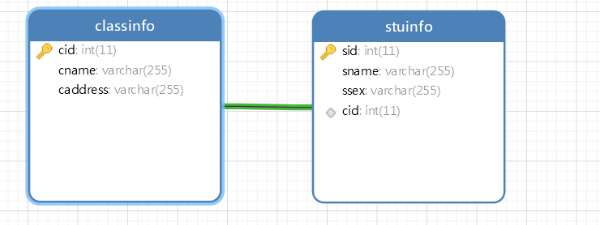

## 主外键与视图详细讲解

### 关于主键

什么是主键？

1. 不能为空
2. 不能重复

一个数据表如果有了主键以后，它的操作效率将会大大提升，正常情况下，同学们如果想设计数据表，都应该要设置主键

我们现在尝试创建一个没有主键的表


现在在上面的表格里面，我想删除杨标，年龄为20的这条记录，怎么办？

```sql
delete from stuinfo where sname = "杨标" and sage = 20;
```

这个时候我们就可以看到，操作起来会变得非常麻烦 ，因为我们要找到所需要的数据，需要使用2个条件，但是如果后期的列变多了，我们操作就会变得更加麻烦


如果现在我们想删除最后一条记录，这个时候使用上面的SQL语句就不能完在了

现在我们添加一个id列为主键列，再插入数据如下所示


现在有了id做主键，那么，我们如果需要删除最后一条记录，只需要执行下面的SQL即可

```sql
delete from stuinfo where id = 4;
```

但是现在又有一个问题，如果我们添加了一个主键id列以后，我们每次在插入数据的时候都要手动的填写这个id，很麻烦


有了这个自增的id以后，我们后面再添加数据的时候就不用再管这一项了，它会自动的递增

同时， 在执行新增的SQL语句的时候 ，这个自增的列就可以不用管了

```sql
insert into stuinfo (sname,ssex,sage) values ("小宝贝","女",18);
```

**使用DDL语句建表时设置自增的主键ID**

```sql
create table if not exists stuinfo (
	id int primary key auto_increment,
	sname varchar(20) not null,
	ssex varchar(2) not null,
	sage int not null
)engine = innodb default charset = utf8mb4;
```

> 关键就是`auto_increment`的设置

----

### 关于外键

当一个表的某一列引用了另一个表的主键存储，那么这个表的这一列我们就叫外键列


在上面的图里面，我们看到，当一个学生去存储信息的时候，我们在所属班级这个地方可以填写任意字段，这个时候就发现问题了，班级表里面没有`C2203`和`J2203`，这个时候的数据就出现冲突了

按照正常的逻辑 ，一个学生应该是属于一个班级，如果这个班级都不存在，那么这个学生应该了不能存在

现在我们就要换一种方式去存储（MySql关系型数据库），表与表之间是可以构建关系的（这个关系主要就是我们常说的主外键约束关系）


在上面的图里面，我们把学生信息表里面的**所班班级**改变了一下，这个表的这个字段引用了班级信息表里面的**班级编号**【现在我们就发现，一个表(学生信息表)引用了另一个表（班级信息表）的主键列，这个时候我们就把这一列**所属班级**叫外键列】

外键：引用了另一个表的主键存储



上面的数据表就形成主外键的约束关系，它们的约束主要在于以下几点

1. stuinfo表里面的cid必须来源于classinfo里面的cid

2. 主键表里面不能随意删除数据，因为可能会被另一张表使用，如果删除时会报错

   

3. 如果非要删除一个主键数据，则这一行数据还没有被引用就可以了

4. 要注意主外键的级联状态

   

   当我们去创建主外键的时候，默认它们之间的级联状态是上图的样式

   默认是`restrict`拒绝，约束状态

   

   当我们把这个状态换成`cascade`级联状态以后，这样在删除数据的时候 ，所有的外键数据自动删除

#### 构建主外键的前提条件 

1. 主键的数据类型与外键的数据类型必须保持一致

2. 数据冲突

   

3. 数据表的引擎`engine`必须是`innodb`，如果是`MyISAM`就不可以（这一种存储方式不支持主外键约束）

```sql
create table if not exists stuinfo(
	id int primary key auto_increment,
	sname varchar(20) not null,
	ssex varchar(2) not null,
	cid int not null,
	FOREIGN key(cid) REFERENCES classinfo(cid) on delete CASCADE on update CASCADE
)engine = innodb default charset = utf8mb4;
```

-----

### 数据库视图

视图是一个虚拟的表，它的本质上面就是一段SQL语句，至于视图有什么作用，我们先通过下面的场景来实现

**场景**：查询学生信息，显示这个学生的所有信息，追加显示班名名称，系统别名称，辅导员名称

```sql
select a.*,b.cname,c.dname,d.instructorname from stuinfo a
inner join classinfo b on a.cid = b.cid
inner join departmentinfo c on c.did = b.did
inner join instructor d on d.instructorid = b.instructorid
```


经过上面的SQL语句的执行以后，我们也得到我们想得到的结果，怎么样把这个结果保存起来做二次查询呢

**我们如果要将一个查询结果保存起来，有一个方法，主是把它变成一个视图（虚拟的表）**

#### 使用DDL语句来创建视图

> 视图是一个虚拟的表，它的本质上面就是一段SQL语句

````sql
create view stuinfoview
as
(select a.*,b.cname,c.dname,d.instructorname from stuinfo a
inner join classinfo b on a.cid = b.cid
inner join departmentinfo c on c.did = b.did
inner join instructor d on d.instructorid = b.instructorid)
````

当上面的代码执行完毕以后，我们可以看到下面的结果


当视图创建成功以后，我们就可以他使用表一样去使用视图图

```sql
select * from stuinfoview where instructorname = '桃子'
```

**注意事项：视图本质上面是一串SQL语句，它只能执行查询操作，不能执行insert/delete/update**

#### 使用navicate来创建视图

我要创建一个学生信息的视图，里面显示学生信息，追加显示班级名称，辅导员名称，系别名称


---

### 扩展

1. MySql里面有哪些内置函数
   * `max()`
   * `min()`
   * `count()`
   * `avg()`
   * `sum()`
   * `if()`
   * `year()/month()/day()`
   * `left()`左截取
   * `right`右截取
   * `mid()`中间截取
   * `concat()`拼接
   * `rand()`随机数
   * `floor()`向下取整
   * `ceil()`向上取整
   * `now()`当前日期时间
   * `CURRENT_TIMESTAMP`当前时间戳
   * `trim()/ltrim()/rtrim()`去除空格
   * `UUID()`生成一个uuid的全局唯一标识符

2. 如何在MySql里面创建新用户，并限定新用户的权限

