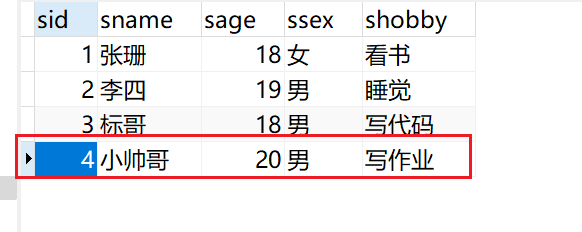
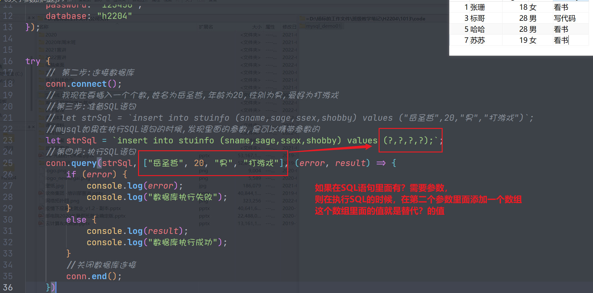
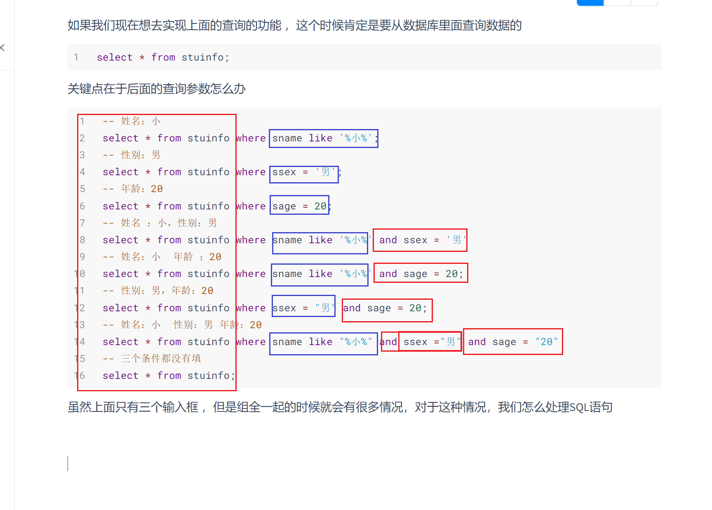
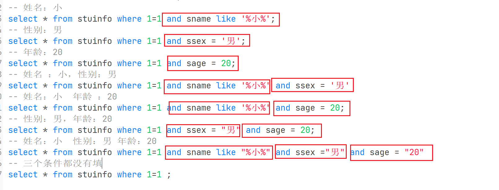

## nodejs连接mysql数据库

### 安装第三方模块 

在昨天的时候我们其实已到了，如果要使用ndoe.js连接mysql的数据库，我们需要使用到一个第三方的模块叫`mysql`或`mysql2`

* `mysql`适用于低版本
* `mysql2`适用于高版本，mysql7及以上

```bash
$ npm install mysql2 --save
```

> 当前我们使用的是msyql2,因为这个包既可以完成高版本的数据库操作，也支持低版本

### 1.创建数据库连接

当我们把包导入进去以后，我们就可以创建数据库的连接了

```javascript
/**
 * 数据库连接测试
 */
const mysql = require("mysql2");

//第一步：创建数据库的连接 
let conn = mysql.createConnection({
    host: "127.0.0.1",
    port: 3306,
    user: "sg",
    password: "123456",
    database: "h2204"
});

try {
    //第二步：开始连接数据库
    conn.connect();
    //第三步：准备要执行的SQL语句
} catch (error) {
    
}
```

当我们完成上面的代码以后，我们其实就可以实现数据库的连接，有了这个链接以后，我们就可以在这个连接上面执行相应的SQL语句 

在执行相应的SQL语句的时候，我们主要围绕的操作就是增删改查

### 2.新增操作

```sql
/**
 * 数据库连接测试
 */
const mysql = require("mysql2");

//第一步：创建数据库的连接 
let conn = mysql.createConnection({
    host: "127.0.0.1",
    port: 3306,
    user: "sg",
    password: "123456",
    database: "h2204"
});

try {
    //第二步：开始连接数据库
    conn.connect();
    //第三步：准备要执行的SQL语句
    let strSql = `insert into stuinfo (sname,sage,ssex,shobby) values ("小帅哥",20,"男","写作业");`;
    conn.query(strSql, (error, result) => {
        if (error) {
            console.log(error);
            console.log("数据库执行失败");
        }
        else {
            console.log(result);
            console.log("数据库执行成功");
            if (result.affectedRows > 0) {
                console.log("新增成功");
            }
            else {
                console.log("新增失败");
            }
        }
        //第五步：关闭数据库连接
        conn.end();
    });
} catch (error) {
    console.log(error);
    console.log("数据库连接失败");

}   
```

#### 分析新增结果

当新增的SQL语句执行成功以后，我们可以看到下面的结果

```javascript
ResultSetHeader {
  fieldCount: 0,
  affectedRows: 1,
  insertId: 4,
  info: '',
  serverStatus: 2,
  warningStatus: 0
}
```

在上面的结果里面，我们可以看到一个属性叫`affectedRows:1`这个代表受影响的行数为1，为什么是1呢，因为有1行数据插入到数据库去了。如果我们想知道这条SQL语句是否新增成功，我们只需要判断`affectedRows`是否大于0就可以了

同时在上面的结果里面我们还看了一个属性，这个属性叫`insertId:4`这是因为当前数据表的主键是一个自增的列，我们在插入的时候没有指定这一列的值，这一列的值就会自动生成，所以这个`insertId`就是mysql数据库自动生成的主键




### 3.删除操作

删除操作其实与上面的新增操作是一样的

```javascript
/**
 * 数据库的删除操作
 */
const mysql = require("mysql2");

//第一步：创建数据库的连接 
let conn = mysql.createConnection({
    host: "127.0.0.1",
    port: 3306,
    user: "sg",
    password: "123456",
    database: "h2204"
});

try {
    //第二步：开始连接数据库
    conn.connect();
    //第三步：准备删除的SQL语句
    let strSql = `delete from stuinfo where sid = 4;`
    conn.query(strSql,(error,result)=>{
        if(error){
            console.log(error);
            console.log("数据库执行失败");
        }
        else{
            console.log(result);
            console.log("数据库执行成功");
            if (result.affectedRows > 0) {
                console.log("删除成功");
            }
            else {
                console.log("删除失败");
            }
        }
        conn.end();
    })
} catch (error) {
    console.log(error);
    console.log("数据库连接失败");
}
```

#### 分析删除结果

```javascript
ResultSetHeader {
  fieldCount: 0,
  affectedRows: 1,
  insertId: 0,
  info: '',
  serverStatus: 2,
  warningStatus: 0
}
```

这个时候我们看到这个结果与上面的新增的结果的数据结构是相同的，里面的`affectedRows:1`也代表受影响的行数为1，这样我们也能通过这个属性来判断这个SQL语句是否执行成功

### 4.修改操作

```javascript
/**
 * 数据库的修改操作
 */
const mysql = require("mysql2");

//第一步：创建数据库的连接 
let conn = mysql.createConnection({
    host: "127.0.0.1",
    port: 3306,
    user: "sg",
    password: "123456",
    database: "h2204"
});

try {
    //第二步：开始连接数据库
    conn.connect();
    //第三步：准备删除的SQL语句
    let strSql = `update stuinfo set sage = 28 where sid = 3;`;
    conn.query(strSql,(error,result)=>{
        if(error){
            console.log(error);
            console.log("数据库执行失败");
        }
        else{
            console.log(result);
            console.log("数据库执行成功");
            if (result.affectedRows > 0) {
                console.log("修改成功");
            }
            else {
                console.log("修改失败");
            }
        }
        conn.end();
    })
} catch (error) {
    console.log(error);
    console.log("数据库连接失败");
}
```

#### 分析修改结果

```javascript
ResultSetHeader {
  fieldCount: 0,
  affectedRows: 1,
  insertId: 0,
  info: '(Rows matched: 1  Changed: 1  Warnings: 0',
  serverStatus: 2,
  warningStatus: 0,
  changedRows: 1
}
```

我们仍然看到了`affectedRows:1`代表有1行数据受影响 ，同时我们还看到另一个属性叫`info`，这个里面就说明 了你当前修改的基本信息

`Rows matched:1`代表where后面的条件匹配到了1条数据，`Change:1`代表修改了1条数据

**综上所述：我们可以看到在数据库的insert/update/delete的三个操作里面，最终返回的结果都是一个对象，我们都要根据这个对象里面的`affectedRows`来决定是否操作成功，如果有新增的 时候有自增的主键列，我们就要使用`insertId`来拿到这个自增的id**

----

### 5.查询操作

```javascript
/**
 * 数据库的查询操作
 */
 const mysql = require("mysql2");

 //第一步：创建数据库的连接 
 let conn = mysql.createConnection({
     host: "127.0.0.1",
     port: 3306,
     user: "sg",
     password: "123456",
     database: "h2204"
 });
 
 try {
     //第二步：开始连接数据库
     conn.connect();
     //第三步：准备删除的SQL语句
     let strSql = `select * from stuinfo`;
     conn.query(strSql, (error, result) => {
         if (error) {
             console.log(error);
             console.log("数据库执行失败");
         }
         else {
             console.log(result);
             console.log("数据库执行成功");
             
         }
         conn.end();
     })
 } catch (error) {
     console.log(error);
     console.log("数据库连接失败");
 }
```

#### 分析查询结果

当上面的代码执行完毕以后，要注意，这个地方的结果`result`就与之前的结果完全不一样了，如下所示

```javascript
[
  { sid: 1, sname: '张珊', sage: 18, ssex: '女', shobby: '看书' },
  { sid: 3, sname: '标哥', sage: 28, ssex: '男', shobby: '写代码' },
  { sid: 5, sname: '哈哈', sage: 28, ssex: '男', shobby: '看书' },
  { sid: 7, sname: '苏苏', sage: 19, ssex: '女', shobby: '看书' }
]
```

这个时候得到的是一个数组，数组里面包含了很多对象 ，这些对象到底是什么呢？


经过对比，我们发现上面数组里面的对象就是数据表当中的每一行数据

-----

### 6.带参数的查询

在上面的过程里面，我们无论是执行增，删，改，查的操作都是直接使用了一条SQL语句，但是这个时候要注意，如果我们在执行SQL语句的时候 ，SQL语句的的值不是固定的，怎么办呢？

```javascript
// 我现在要插入一个数据,姓名为岳圣哲,年龄为20,性别为男,爱好为打游戏
let strSql = `insert into stuinfo (sname,sage,ssex,shobby) values ("岳圣哲",20,"男","打游戏")`;
```

但是像上面这样写就有问题，因为这条SQL语句写死了，后面的值不能更改，如果要更改很麻烦，怎么办呢？

```javascript
let strSql = `insert into stuinfo (sname,sage,ssex,shobby) values (?,?,?,?);`;
```

我们将SQL语句里面需要替换的东西使用了`?`来表示，这代表这里有一个变量，后期直接替代



```javascript
/**
 * 数据库连接测试
 */
const mysql = require("mysql2");

//第一步：创建数据库的连接 
let conn = mysql.createConnection({
    host: "127.0.0.1",
    port: 3306,
    user: "sg",
    password: "123456",
    database: "h2204"
});


try {
    // 第二步:连接数据库
    conn.connect();
    // 我现在要插入一个个数,姓名为岳圣哲,年龄为20,性别为男,爱好为打游戏
    //第三步:准备SQL语句
    // let strSql = `insert into stuinfo (sname,sage,ssex,shobby) values ("岳圣哲",20,"男","打游戏")`;
    //mysql如果在执行SQL语句的时候,发现里面的参数,是可以携带参数的
    let strSql = `insert into stuinfo (sname,sage,ssex,shobby) values (?,?,?,?);`;
    //第四步:执行SQL语句 
    conn.query(strSql, ["岳圣哲", 20, "男", "打游戏"], (error, result) => {
        if (error) {
            console.log(error);
            console.log("数据库执行失败");
        }
        else {
            console.log(result);
            console.log("数据库执行成功");
        }
        //关闭数据库连接
        conn.end();
    })
} catch (error) {

}
```

经过上面代码以后，我们就发现这一条新增的SQL语句我们是可以实现了

现在我们再次做一次补充测试，我们看一下，其它的SQL语句是否也可以使用`?`来表示

```javascript
/**
 * 数据库参数的问题
 */
const mysql = require("mysql2");

//第一步：创建数据库的连接 
let conn = mysql.createConnection({
    host: "127.0.0.1",
    port: 3306,
    user: "sg",
    password: "123456",
    database: "h2204"
});


try {
    // 第二步:连接数据库
    conn.connect();
    // 第三步:准备SQL语句
    let strSql = `select * from stuinfo where sid = ?;`;
    conn.query(strSql,[3],(error,result)=>{
        if(error){
            console.log(error);
            console.log("数据库执行失败");
        }
        else{
            console.log(result);
            console.log("数据库执行成功");
        }
        //关闭数据库连接
        conn.end();
    })
    
} catch (error) {
    
}
```

:bookmark: 综合总结：在执行带参数`?`的SQL语语句的时候，要在`query()`函数的第二个参数上面使用数组去替代

```javascript
conn.query(要执行的SQL语,[具体的值],(error,result)=>{
    //执行以后的回调
})
```

----

### 7.数据库操作的封装

在之前的学习里面，我们发现，我们如果要执行一条SQL语句，应该是按照下面的步骤再进行


我们能不能简化上面的操作

**我给一个SQL语句你，你还我一个结果**


```javascript
/**
 * @author 杨标
 * @Date 2022-10-13
 * @description 数据库操作的封装
 */
const mysql = require("mysql2");

class DBUtils {
    /**
     * 获取数据库的连接
     * @returns {mysql.Connection}
     */
    getConn() {
        let conn = mysql.createConnection({
            host: "127.0.0.1",
            port: 3306,
            user: "sg",
            password: "123456",
            database: "h2204"
        });
        conn.connect();
        return conn;
    }
    /**
     * 
     * @param {string} strSql 要执行的SQL语句
     * @param {Array} params  SQL语句里面的参数
     * @returns {Promise<Array>} 返回一个Promise的执行结果
     */
    executeSql(strSql, params = []) {
        return new Promise((resolve, reject) => {
            //第一步：先获取数据库的连接
            let conn = this.getConn();
            //第二步：准备要执行的SQL语句，没有，从参数里面值（从外面传进来）
            conn.query(strSql, params, (error, result) => {
                if (error) {
                    //数据库执行失败
                    reject(error);
                }
                else {
                    //数据库执行成功
                    // 怎么样把result返回出去
                    resolve(result);
                }
                //关闭数据库连接
                conn.end();
            });
        })
    }
}

module.exports = DBUtils;
```

上面的代码就是封装了一个`DBUtils`的代码，它是数据库操作的核心对象 ，我们可以通过里面的`executeSql`这个函数来执行SQL语句 ，必得到结果

**测试封装的代码**

```javascript
/**
 * 测试一下DBUtils的封装
 */

const DBUtils = require("./DBUtils.js");

//创建数据库的帮助对象
let db = new DBUtils();
// 准备SQL语句
let strSql = `select * from stuinfo;`;
db.executeSql(strSql).then(result => {
    console.log(result);
    console.log("执行成功");
}).catch(error => {
    console.log(error);
    console.log("执行失败");
})
```

**再次测试封装的代码 **

```javascript
/**
 * 测试一下DBUtils的封装
 * 测试一下参数
 */

const DBUtils = require("./DBUtils.js");

const test = async () => {
    //创建数据库的帮助对象
    let db = new DBUtils();
    // 准备SQL语句
    let strSql = `select * from stuinfo where sid = ?`;

    try {
        let result = await db.executeSql(strSql, [3]);
        console.log(result);
        console.log("数据库执行成功");
    } catch (error) {
        console.log(error);
        console.log("数据库执行失败");
    }
}

test();
```

### 8.模糊查询

```javascript
const DBUtils = require("./DBUtils.js");

// 想查询带小字的
let strSql = 'select * from stuinfo where sname like ?;';
let db = new DBUtils();
db.executeSql(strSql,["%小%"]).then(result => {
    console.log(result);
    console.log("数据库执行成功");
}).catch(error => {
    console.log(error);
    console.log("数据库执行失败");
});
```

模糊查询里面得到的结果与我们之前所得到的结果是一样的，语法也是一样的

### 9.SQL语句的动态拼接

假设有下面这个界面


如果我们现在想去实现上面的查询的功能 ，这个时候肯定是要从数据库里面查询数据的

```sql
select * from stuinfo;
```

关键点在于后面的查询参数怎么办

```sql
-- 姓名：小
select * from stuinfo where sname like '%小%';
-- 性别：男
select * from stuinfo where ssex = '男';
-- 年龄：20
select * from stuinfo where sage = 20;
-- 姓名 ：小，性别：男
select * from stuinfo where sname like '%小%' and ssex = '男'
-- 姓名：小  年龄 ：20
select * from stuinfo where sname like '%小%' and sage = 20;
-- 性别：男，年龄：20
select * from stuinfo where ssex = "男" and sage = 20;
-- 姓名：小  性别：男 年龄：20
select * from stuinfo where sname like "%小%" and ssex ="男" and sage = "20"
-- 三个条件都没有填
select * from stuinfo;
```

虽然上面只有三个输入框 ，但是组全一起的时候就会有很多情况，对于这种情况，我们怎么处理SQL语句



通过分析我们可以得到一个点，SQL前面的前面部分是相同的，只有后面的条件是不一样的，同时我们还发现这个条件有一些规律、**where后面的第一个条件不要and,其它的都要**

```sql
select * from stuinfo;
select * from stuinfo where 1=1;
```

上面的2条SQL语句得到的结果是一样



我们现在在所有的参数前面都加了一个`where 1=1 `这样做的好处就在于如果要再去拼接条件 直接 使用`and 条件`就可以了

```javascript
/**
 * 动态SQL拼接
 */
const DBUtils = require("./DBUtils.js");

//我们在这里定义3个变量,分别代表输入框里面的3个值
let sname = "小";
let ssex = "男";
let sage = "";
//开始准备SQL语句
let strSql = `select * from stuinfo where 1=1 `;
//这个数组专门放参数,默认是空的
let ps = [];
if(sname){
    //如果用户在sname这个输入框里面输入了内容 
    strSql+= ` and sname like ? `;
    ps.push(`%${sname}%`);
}
if(ssex){
    //说明ssex也输入了内容
    strSql+=` and ssex = ? `;
    ps.push(ssex);
}
if(sage){
    strSql += ` and sage = ? `;
    ps.push(sage);
}
console.log(strSql);
console.log(ps);

let db =  new DBUtils();
db.executeSql(strSql,ps).then(result=>{
    console.log(result);
    console.log("数据库执行成功");
}).catch(error=>{
    console.log(error);
    console.log("数据库执行失败");
})
```

