## Express框架

在之前的时候，我们已经完成了node.js连接mysql的数据库，并且也已经搭建好了数据库项目的架构，但是这个项目仅仅只能够对数据库的东西进行手动的增删改查，并不能与页面形成链接，怎么办呢？

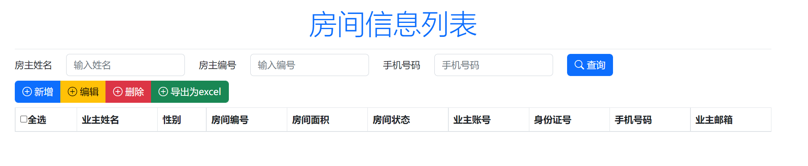

同时，我们自己也编写好了这一个页面，我们怎么样在这个页面上面，去获取数据，去接收数据

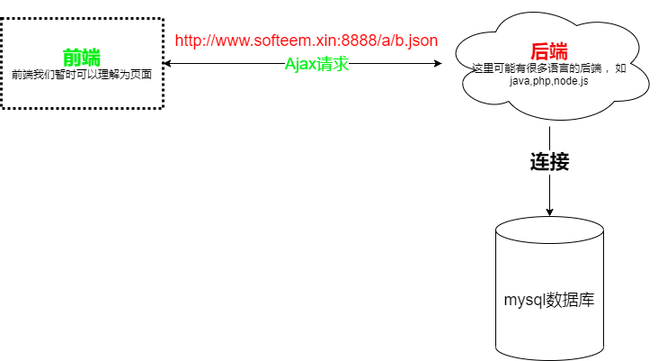

现在的问题的关键就在于，我们这个服务器，怎么构建。具体可以理解为怎么样去构建

```
http://www.softeem.xin:8888/DS918/getVideoList
```

这一种技术就叫web服务器的开发（也叫后端Web开发）

> 通俗一点讲就是：页面怎么发Ajax请求给后面，后面的服务器怎么接收这个请求，接收这个请求以后，怎么操作数据库，怎么从数据库里面获取数据


这个东西的本质地就在于我们怎么样去构建了个`http`的服务器，目录在nodejs里面构建http服务器的方法有很多

1. `Express`框架【基础入门型的框架，对标的是java里面的servlet技术】
2. `koa`框架
3. `egg`框架
4. `nest.js`框架【最高级的框架，对标的就是java的springboot】

### Express框架介绍


现在在nodejs里面我们就使用这一个框架来实现们的效果

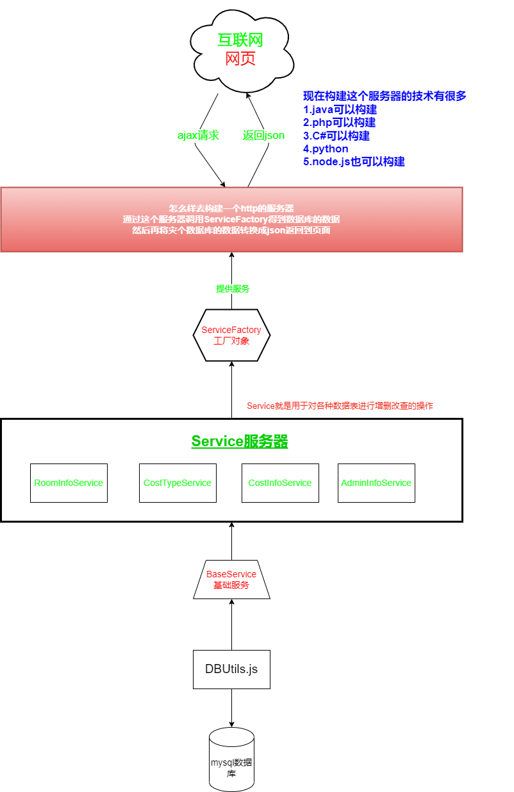

-----

### 安装

```bash
$ npm install express --save
```

### 创建应用程序 

express快速的安装完成以后，它是有一个框架 ，可以帮助我们快速的创建一个基于`express`的http服务器项目

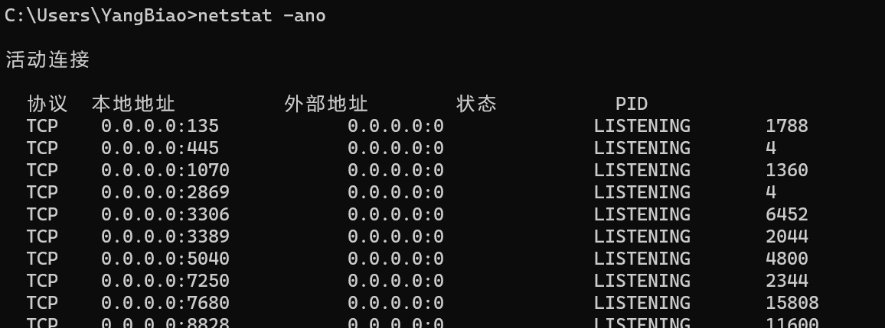

当我们使用`express`创建应用程序的时候 ，我们一定要先查看一下自己的电脑上面有哪些空闲的端口

```bash
$ netstat -ano
```

我们可以上面的命令来查看自己电脑上面的端口使用情况，上面的显示出来的就代表已民经使用了的端口，这个我们的`express`就不能再使用了，要使用了其它的，所以这里我随便使用了一个

```javascript
// 这个模块是nodejs自带的模块
const http = require("http");
const express = require("express");
// 利用express框架 生成一个app的服务器应用程序
const app = express();

//创建一个服务器，服务器上面应该运行了app这个程序
const server = http.createServer(app);

//启动这个服务器
//在启动服务器这前，一定要先检查一下自己的电脑上面有哪些空闲的端口
// 0.0.0.0代表的是自己电脑上面所有的ip地址
server.listen(16888, "0.0.0.0", () => {
    console.log("服务器启动成功......");
});
```

> 上面的代码就是创建了一个http的web应用程序，它监听了我们电脑上面的`16888`这个端口，我们查看端口信息，可以看到下面的效果
>
> 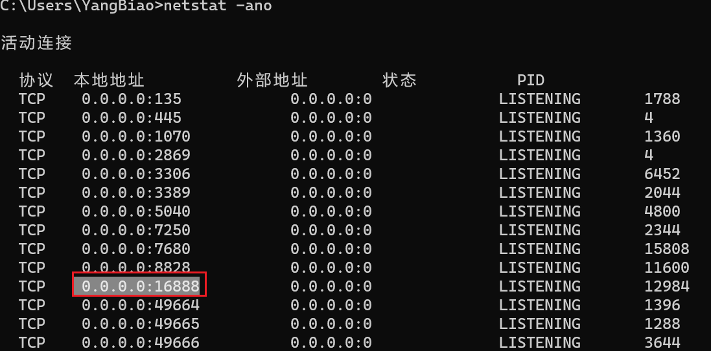
>
> 同时要注意，如果在启动服务器的时候 ，发现了下面的错误 ，则代表端口冲突了（这个端口号被别的程序使用了）
>
> 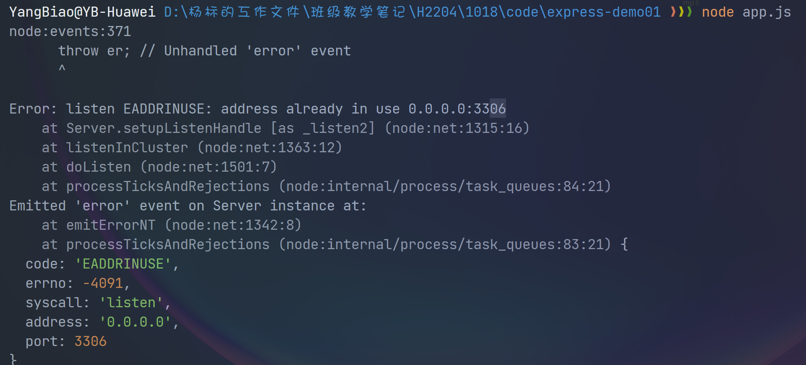

### 处理http请求

当我们构建一个服务器以后，其实的互联网上面的电脑就可以通过我们监听的IP址址及端口号访问到这 个服务器，但是服务器并没有处理这个http请求

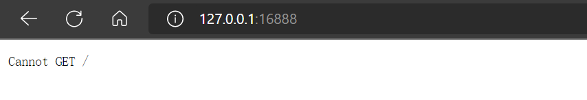

但是现在的问题就在于，我们在浏览器里面访问这个`http://127.0.0.1:16888`的时候，它会报一个小错误，它会报`Cannot GET /`。这个其实也代表我们的服务器已经创建成功了，但是就是不能处理`http`请求

之前在学习Ajax的时候 ，也给同学们讲过，Ajax是基于http请求协议 的，而HTTP的请求协议有以下几种

1. `get`请求，它是基于浏览器址栏的请求，适用于小量数据传递
2. `post`请求
3. `put`请求
4. `delete`请求
5. `options`请求

上面的这些请求都是http的请求，当我们通过浏览器打开 `http://127.0.0.1:16888`

当我们以默认的地址进入到服务器的时候，服务器报了一个 `Cannot GET /` 的信息，这说明服务器没有 处理你的 `/` 路径的get请求

在`server`的服务器上面运行的程序是一个由`express`生成的一个`app`程序

`express`针对不同的`http`的请求方式，它有以下几种方法专门用来处理这些请求

1. `app.get()`用于处理到达服务器的get请求
2. `app.post()`用于处理到达服务器的post请求
3. `app.put()`用于处理到达服务器的put请求
4. `app.delete()`用于处理到达服务器的delete请求
5. `app.options()`用于处理到达服务器的option请求

```javascript
app.get("/", (req, resp) => {
    console.log("我在处理你的/的请求......",req.ip);
    resp.send("我收到你的请求了，你的IP地址是："+req.ip);
});
```

> 1. 在上面的代码里面，我们可以看到`app.get()`就是用于处理一个`get`请求
>
> 2. 在处理请求的的时候 ，第一个参数是一个字符串，它代表我们的服务器后面的路径，第二个参数是一个回调函数 ，这个回调函数有2个参数，分别是`req`与`resp`
> 3. `req`的全称叫`request`，代表浏览器到服务器的对象 ，这个对象里面记录了访问者的相关信息
> 4. `resp`的全称叫`response`代表服务器返回给浏览器的对象


说明：如果我们想获取浏览器传递过来的信息，我们就可以使用`req`对象 

同样的，如果我们想把某些信息返回给浏览器，我们就可以使用`resp`对象

```javascript
app.get("/", (req, resp) => {
    console.log("我在处理你的/的请求......", req.ip);
    resp.send("我收到你的请求了，你的IP地址是：" + req.ip);
});

app.get("/abc", (req, resp) => {
    resp.send("我现在访问是的abc");
});

app.get("/login", (req, resp) => {
    resp.json({
        userName: "张三",
        sex: "男",
        age: 18
    })
})
```

上面的程序我们就处理了3个请求

| app路径             | 请求路径                       |
| ------------------- | ------------------------------ |
| `app.get("/")`      | `http://127.0.0.1:16888/`      |
| `app.get("/abc")`   | `http://127.0.0.1:16888/abc`   |
| `app.get("/login")` | `http://127.0.0.1:16888/login` |

> 在上面的代码里面，我们可以看到`app`里面处理了什么路径，我们就可以在浏览器使用什么路径去访问了
>
> 当然里面的ip地址是可以更改的，`127.0.0.1`代表的是本机IP，如果你的电脑上面还有其它的IP地址，也是可以的

### 使用路由

在上面的代码里面，我们可以看到一个点，就是`app`具备一个处理请求的能力

```javascript
//http://127.0.0.1:16888/
app.get("/", (req, resp) => {
    resp.send("这是一个主页")
});
//http://127.0.0.1:16888/login
app.get("/login", (req, resp) => {
    resp.send("这是一个登录的请求")
});
//http://127.0.0.1:16888/register
app.get("/register", (rep, resp) => {
    resp.send("这是一个注册页面")
})

//http://127.0.0.1:16888/getRoomInfoList
app.get("/getRoomInfoList", (req, resp) => {
    resp.send("获取所有的房间信息");
})
//http://127.0.0.1:16888/getCostTypeList
app.get("/getCostTypeList", (req, resp) => {
    resp.send("获取所有的费用类别");
});
//后期可能还会很多
app.get("/addRoomInfo",(req,resp)=>{
	//假设请求这个地址，就是想添加一个房间信息
});
app.get("/updateRoomInfo",(req,resp)=>{
	//假设请求这个地址，我们就想更新一个房间信息
});
```

我们现在往里面写了很多个请求，这么做就会有很大的问题，我们把所有的请求处理的代码都写在了`app.js`这个文件里面，这样这个文件就会显得很臃肿，并助功能也容易弄混 

为了解决这个问题，我们就要提出一个概念，叫路由

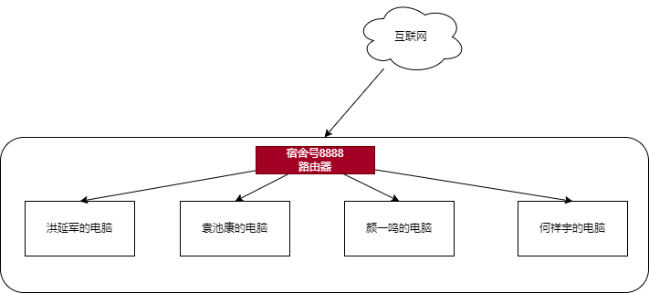

这个路由就可以理解为一个路由器，这个路由器可以接多个网线出来

在`express`里面，路由的功能与`app.js`的功能是保持一致的，它们都是用来处理`http`请求的

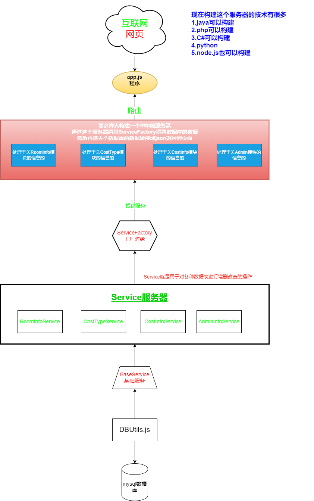

我们首先要在项目的目录下面创建一个`routes`的目录，每一个模块我们就可以认为是一个路由文件 ，这个路由文件的首字母要小写，并且以`Route.js`结尾

如我们的数据表是`roominfo`，则对应的路由就是`roomInfoRoute.js`，同时如果在做数据库项目，则对应的`Service`文件就叫`RoomInfoService.js`

> 规律：
>
> 1. 表名`roominfo`【数据库的表名没有大小写，所以这里没有使用驼峰命名】
> 2. service对象应该就叫`RoomInfoService.js`【这里的首字母为什么是大写，因为它是Class】
> 3. route对象应该就叫`roomInfoRoute.js`【这里的首字母小写因为它是变量】

| 表名        | 路由文件            | service文件名         | 说明           |
| ----------- | ------------------- | --------------------- | -------------- |
| `roominfo`  | `roomInfoRoute.js`  | `RoomInfoService.js`  | 房间信息模块   |
| `costtype`  | `costTypeRoute.js`  | `CostTypeService.js`  | 费用类别模块   |
| `costinfo`  | `costInfoRoute.js`  | `CostInfoService.js`  | 费用信息模块   |
| `admininfo` | `adminInfoRoute.js` | `AdminInfoService.js` | 管理员信息模块 |

路由其实可以理解为一个小型的app.js对象

```javascript
/**
 * 路由本身其实就是一个小型的app.js
 */
const express = require("express");
const router = express.Router();

module.exports = router;
```

> 上面的3行代码就是创建一个路由的代码

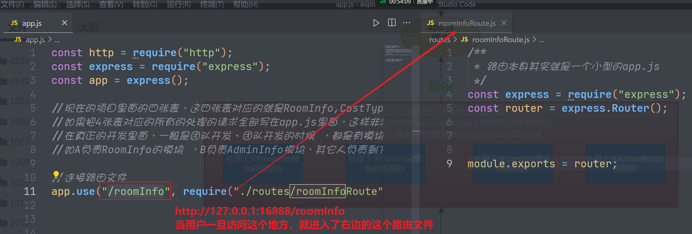

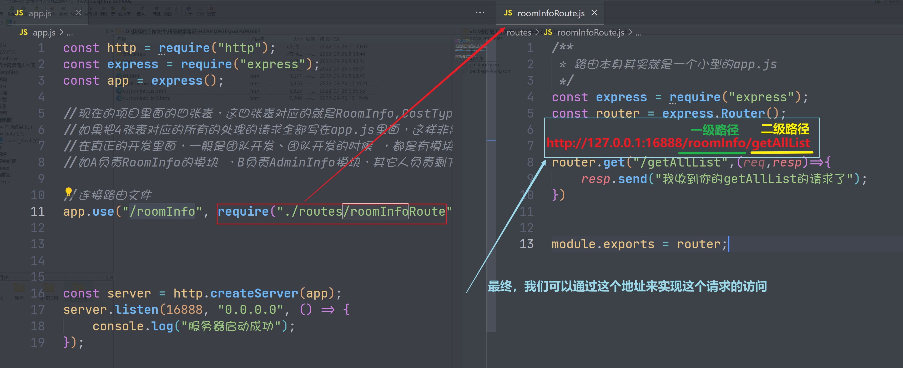

> **代码分析**
>
> 1. 在上面的代码里面，我们可以快速的创建一个路由，创建好路由以后，一定要在`app.js`里面通过 `app.use()`的方式来连接你的路由文件
>
> 2. 每个路由其实也可以看成是一个小型的`app.js`，所以它也可以处理浏览器的`http`请求，所以在上面的路由文件里面，我们通过`router.get()`方式在处理浏览器的`get`请求
>
> 3. 如果添加了路由以后，注意访问路径就会有变化
>
>    `http://127.0.0.1:16888/一级路径/二级路径`，如五
>
>    `http://127.0.0.1:16888/roomInfo/getAllList`
>
> **练一练**
>
> 1. 创建一个Express的程序，端口号自己选择
> 2. 根据模块创建不同的路由文件
> 3. 在`app.js`里面连接不同的路由文件 
> 4. 在每一个路由文件里面写上一个`getAllList()`的方法，然后通过`http://自己电脑的IP:端口号/一级路由/二级路由`来测试访问 ，看是否可以得到数据
> 5. 提示：自己电脑的ip一般都是`127.0.0.1`