## nodejs数据库项目搭建

* 项目名称：社区物业管理系统
* 开发平台：nodejs+mysql+es6+bootstrap+layer+jquery

* 授课方式：项目式授课

----

### 功能分析【思维导图】

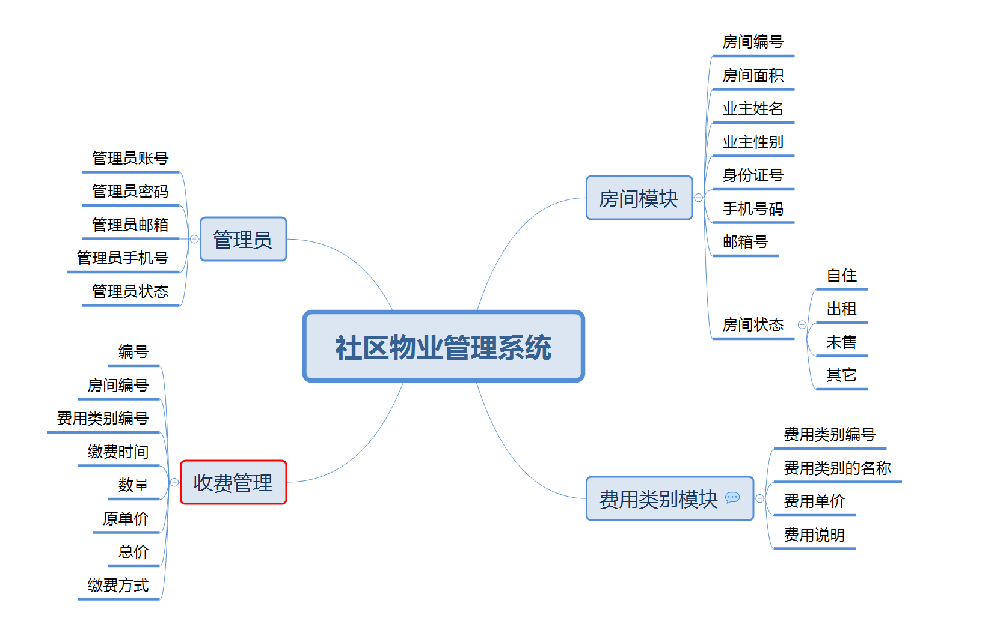

### 数据库设计 

正常的开发应该是根据功能图来实现数据库的建模操作，再根据建模来生成数据表，目前的主流的建模软件有很多，`PD/EA`等

**房间表roominfo**

| 列名       | 类型         | 说明                           |
| ---------- | ------------ | ------------------------------ |
| id         | int          | 主键,自增                      |
| roomname   | varchar(20)  | 房间名称                       |
| roomarea   | double       | 房间面积                       |
| ownername  | varchar(20)  | 业主姓名                       |
| ownersex   | varchar(2)   | 业主性别                       |
| IDCard     | varchar(18)  | 身份证号                       |
| telephone  | varchar(20)  | 手机号码                       |
| email      | varchar(255) | 邮箱                           |
| roomstatus | int          | 房间状态,[自住,出租,未售,其它] |

**费用类别costtype**

| 列名     | 类别         | 说明           |
| -------- | ------------ | -------------- |
| id       | int          | 主键，自增     |
| costname | varchar(255) | 费用类别的名称 |
| price    | decima(10,2) | 费用的单价     |
| desc     | text         | 费用的说明     |

**费用信息costinfo**

> 这个表就是收费信息表，也是当前系统的核心表

| 列名       | 类别      | 说明                                                         |
| ---------- | --------- | ------------------------------------------------------------ |
| id         | int       | 主键，自增                                                   |
| roomid     | int       | <span style="color:red">外键</span>，房间的编号，来源于roominfo表 |
| costid     | int       | <span style="color:red">外键</span>，费用类别编号，来源于costtype表 |
| paytime    | timestamp | 缴费时间，默认为当前时间                                     |
| count      | double    | 缴费的数量，有可能有小数                                     |
| price      | decima    | 费用类别里面的单价                                           |
| totalmoney | decima    | 总价，单价*数量                                              |
| paytype    | int       | 缴费方式[支付宝,微信,现金,转账]                              |

**管理员表admininfo**

| 列名        | 类型         | 说明                    |
| ----------- | ------------ | ----------------------- |
| id          | int          | 主键自增                |
| adminname   | varchar(50)  | 管理员账号              |
| adminpwd    | varchar(50)  | 管理员密码，md5加密存储 |
| adminemail  | varchar(255) | 管理员邮箱              |
| admintel    | varchar(20)  | 管理员手机号            |
| adminstatus | int          | 管理员状态[正常,禁用]   |

当我们的数据库设计完成了以后，我们就要开始在mysql里面创建数据库了

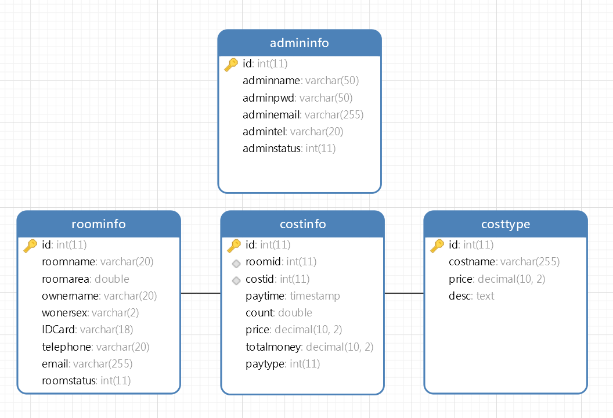

当数据库构建完成以后，我们一定要在在数据表上面构建主外键的约束关系 【一定是外键找主键】

> 这里要注意，把数据库建好了以后，一定要导出一个SQL有脚本文件

```sql
/*
 Navicat Premium Data Transfer

 Source Server         : 杨标
 Source Server Type    : MySQL
 Source Server Version : 50540
 Source Host           : 127.0.0.1:3306
 Source Schema         : community

 Target Server Type    : MySQL
 Target Server Version : 50540
 File Encoding         : 65001

 Date: 17/10/2022 09:12:47
*/

SET NAMES utf8mb4;
SET FOREIGN_KEY_CHECKS = 0;

-- ----------------------------
-- Table structure for admininfo
-- ----------------------------
DROP TABLE IF EXISTS `admininfo`;
CREATE TABLE `admininfo`  (
  `id` int(11) NOT NULL AUTO_INCREMENT,
  `adminname` varchar(50) CHARACTER SET utf8mb4 COLLATE utf8mb4_general_ci NOT NULL,
  `adminpwd` varchar(50) CHARACTER SET utf8mb4 COLLATE utf8mb4_general_ci NOT NULL,
  `adminemail` varchar(255) CHARACTER SET utf8mb4 COLLATE utf8mb4_general_ci NOT NULL,
  `admintel` varchar(20) CHARACTER SET utf8mb4 COLLATE utf8mb4_general_ci NOT NULL,
  `adminstatus` int(11) NOT NULL,
  PRIMARY KEY (`id`) USING BTREE
) ENGINE = InnoDB AUTO_INCREMENT = 1 CHARACTER SET = utf8mb4 COLLATE = utf8mb4_general_ci ROW_FORMAT = Compact;

-- ----------------------------
-- Records of admininfo
-- ----------------------------

-- ----------------------------
-- Table structure for costinfo
-- ----------------------------
DROP TABLE IF EXISTS `costinfo`;
CREATE TABLE `costinfo`  (
  `id` int(11) NOT NULL AUTO_INCREMENT,
  `roomid` int(11) NOT NULL,
  `costid` int(11) NOT NULL,
  `paytime` timestamp NOT NULL DEFAULT CURRENT_TIMESTAMP ON UPDATE CURRENT_TIMESTAMP,
  `count` double NOT NULL,
  `price` decimal(10, 2) NOT NULL,
  `totalmoney` decimal(10, 2) NOT NULL,
  `paytype` int(11) NOT NULL,
  PRIMARY KEY (`id`) USING BTREE,
  INDEX `roomid`(`roomid`) USING BTREE,
  INDEX `costid`(`costid`) USING BTREE,
  CONSTRAINT `costinfo_ibfk_1` FOREIGN KEY (`roomid`) REFERENCES `roominfo` (`id`) ON DELETE RESTRICT ON UPDATE RESTRICT,
  CONSTRAINT `costinfo_ibfk_2` FOREIGN KEY (`costid`) REFERENCES `costtype` (`id`) ON DELETE RESTRICT ON UPDATE RESTRICT
) ENGINE = InnoDB AUTO_INCREMENT = 1 CHARACTER SET = utf8mb4 COLLATE = utf8mb4_general_ci ROW_FORMAT = Compact;

-- ----------------------------
-- Records of costinfo
-- ----------------------------

-- ----------------------------
-- Table structure for costtype
-- ----------------------------
DROP TABLE IF EXISTS `costtype`;
CREATE TABLE `costtype`  (
  `id` int(11) NOT NULL AUTO_INCREMENT,
  `costname` varchar(255) CHARACTER SET utf8mb4 COLLATE utf8mb4_general_ci NOT NULL,
  `price` decimal(10, 2) NOT NULL,
  `desc` text CHARACTER SET utf8mb4 COLLATE utf8mb4_general_ci NOT NULL,
  PRIMARY KEY (`id`) USING BTREE
) ENGINE = InnoDB AUTO_INCREMENT = 1 CHARACTER SET = utf8mb4 COLLATE = utf8mb4_general_ci ROW_FORMAT = Compact;

-- ----------------------------
-- Records of costtype
-- ----------------------------

-- ----------------------------
-- Table structure for roominfo
-- ----------------------------
DROP TABLE IF EXISTS `roominfo`;
CREATE TABLE `roominfo`  (
  `id` int(11) NOT NULL AUTO_INCREMENT,
  `roomname` varchar(20) CHARACTER SET utf8mb4 COLLATE utf8mb4_general_ci NOT NULL,
  `roomarea` double NOT NULL,
  `ownername` varchar(20) CHARACTER SET utf8mb4 COLLATE utf8mb4_general_ci NOT NULL,
  `wonersex` varchar(2) CHARACTER SET utf8mb4 COLLATE utf8mb4_general_ci NOT NULL,
  `IDCard` varchar(18) CHARACTER SET utf8mb4 COLLATE utf8mb4_general_ci NOT NULL,
  `telephone` varchar(20) CHARACTER SET utf8mb4 COLLATE utf8mb4_general_ci NOT NULL,
  `email` varchar(255) CHARACTER SET utf8mb4 COLLATE utf8mb4_general_ci NOT NULL,
  `roomstatus` int(11) NOT NULL,
  PRIMARY KEY (`id`) USING BTREE
) ENGINE = InnoDB AUTO_INCREMENT = 1 CHARACTER SET = utf8mb4 COLLATE = utf8mb4_general_ci ROW_FORMAT = Compact;

-- ----------------------------
-- Records of roominfo
-- ----------------------------

SET FOREIGN_KEY_CHECKS = 1;

```

### 初始化项目

当前项目的名称使用的是`community`，所以我们系统的名称就叫`community manager`

新建完项目以后，我们就可以初始化了

```bash
$ npm init --yes
```

```json
{
  "name": "community-manager",
  "version": "1.0.0",
  "description": "社区物业管理系统",
  "main": "index.js",
  "scripts": {
    "test": "echo \"Error: no test specified\" && exit 1"
  },
  "keywords": ["node.js","mysql","express","community"],
  "author": "杨标",
  "license": "ISC"
}
```

### 安装依赖包

当前项目因为要使用mysql的数据库，所以我们首先需要安装一引起依赖包

```bash
$ npm install mysql2 --save
```

### 导入数据封装对象

之前的时候，我们已经学习过怎么样使用`node.js`去连接mysql的数据库

> 这里连接数据库的时候有一个小细节，一定要有一个账号去管理当前的数据库

我们在当前的项目下面新建了一个`config`的文件夹，创建了一个`DBConfig.js`的文件

```javascript
/**
 * 本地数据库连接的配置信息
 */
const localDBConfig = {
    host: "127.0.0.1",
    port: 3306,
    user: "sg",
    password: "123456",
    database: "community"
}

/**
 * 远程数据库的连接
 */
const remoteDBConfig = {
    host: "www.softeem.xin",
    port: 3306,
    user: "dev",
    password: "123456",
    database: "community"
}

module.exports = {
    localDBConfig,
    remoteDBConfig
}
```

当我们把数据库的配置信息写好了以后，我们就可以开始进行相应的数据库操作的封装了，我们在项目下面新建了一个`utils`的文件夹，然后在这个文件夹的下面新建了一个`DBUtils.js`的文件 ，代码封装如下

```javascript
/**
 * @author 杨标
 * @Date 2022-10-17
 * @desc mysql数据为操作的相关内容
 */
const mysql = require("mysql2");
const { localDBConfig } = require("../config/DBConfig.js");

class DBUtils {
    /**
     * 获取数据库连接
     * @returns {mysql.Connection} 获取的数据库连接
     */
    getConn() {
        let conn = mysql.createConnection(localDBConfig);
        conn.connect();
        return conn;
    }
    /**
     * 
     * @param {string} strSql 要执行的SQL语句
     * @param {Array} params SQL语句里面的参数
     * @returns {Promise<Array|mysql.ResultSetHeader>} 返回承诺携带的结果
     */
    executeSql(strSql, params = []) {
        return new Promise((resolve, reject) => {
            let conn = this.getConn();
            conn.query(strSql, params, (error, result) => {
                if (error) {
                    reject(error);
                }
                else {
                    resolve(result);
                }
                conn.end();
            });
        });
    }
}

module.exports = DBUtils;
```

### 编写服务层

> 服务层就是用于操作数据库的，为前面的程序提供的服务的

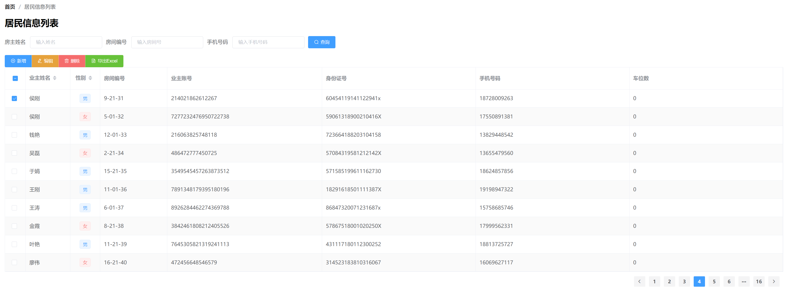

上面的图片就是我们最终要实现的效果图，我们可以在效果图上面看到一个非常显示的点就间每一个功能模块基本上都对应了数据表的四个操作，也就是增删改查

有了这些增删改查的操作以后，我们就可以对数据库里面的数据进行管理

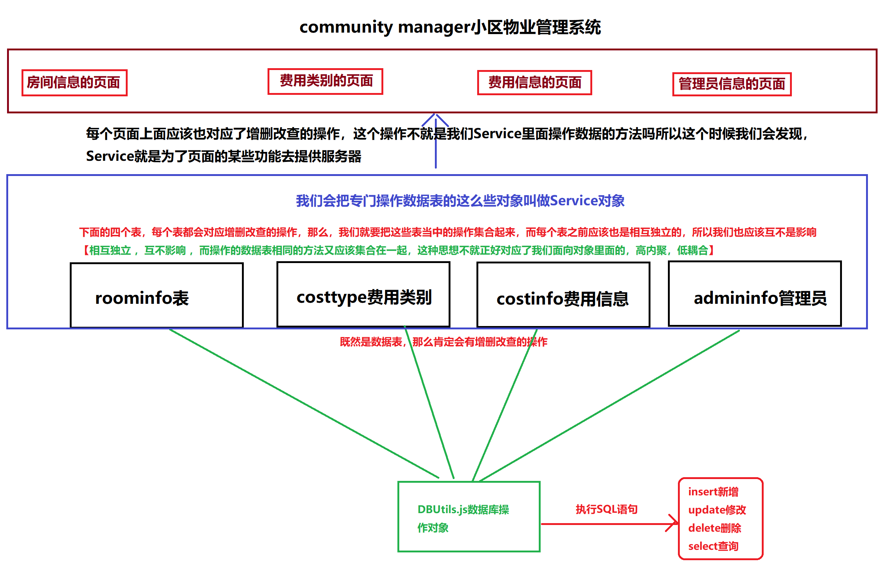

数据库的所有操作最终都是为了给页面提供服务的，所以我们一般把这一层操作操作叫做Service服务器

#### service文件夹的创建

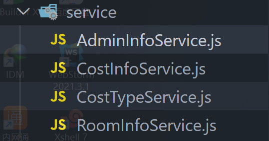

我们有四个数据表，所以我们根据每个数据表创建了不同的Service

1. `RoomInfoService`针对roominfo数据表的操作
2. `CostTypeService`针对costtype数据表的操作
3. `CostInfoService`针对costinfo数据表操作
4. `AdminInfoService`针对adminInfo的操作

我们可以看到每一个Service现在的首字终都是大写，因为它是一个`class`,构造函数的首字母就是大写，这个好区分，也是一个约定俗成的规范

#### 页面功能的分析 

当我们把四个`Service`的文件创建好了以后，我们怎么样去书写里面的代码呢？这个时候说法要注意，我们要根据页面的功能去来判断怎么书写

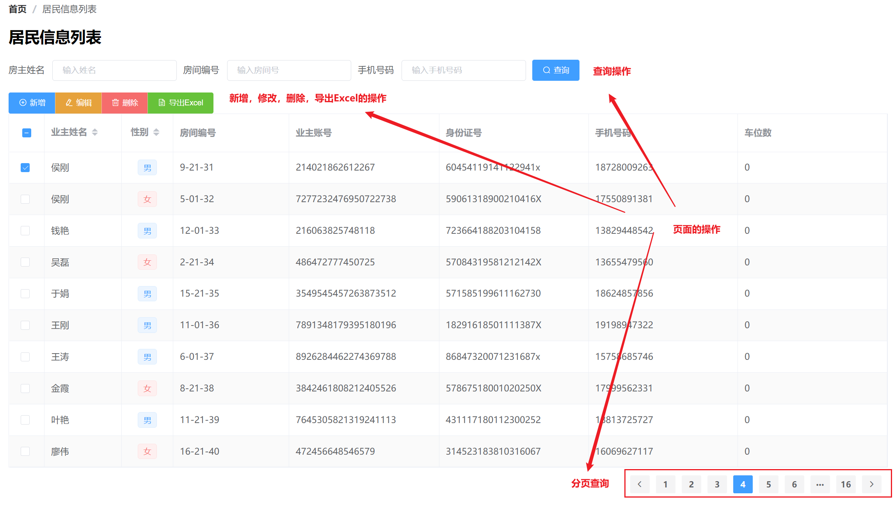

```javascript
/**
 * 对数据表roominfo的操作
 */
class RoomInfoService {
    add(){

    }
    deleteById(id){

    }
    update(){

    }
    getList(){
        
    }
}
module.exports = RoomInfoService;
```

刚刚在图片里面所列举出来的四个操作，我们可以对应`add()、deleteById()、update()、getList()`

**现在我们去编写add()的方法去测试一下**

```javascript
/**
 * 对数据表roominfo的操作
 */

const DBUtils = require("../utils/DBUtils.js");

class RoomInfoService extends DBUtils {
    async add(roomname, roomarea, ownername, onersex, IDCard, telephone, email, roomstatus) {
        let strSql = `INSERT INTO roominfo 
            (roomname, roomarea, ownername, onersex, IDCard, telephone, email, roomstatus) 
            VALUES (?, ?, ?, ?, ?, ?, ?, ?);`;
        let result = await this.executeSql(strSql, [roomname, roomarea, ownername, onersex, IDCard, telephone, email, roomstatus]);
        // 根据受影响的行数来看,它是否有新增成功
        // if(result.affectedRows>0){
        //     // 新增成功
        //     return true;
        // }
        // else{
        //     // 新增失败
        //     return false;
        // }
        return result.affectedRows > 0;
    }
}
module.exports = RoomInfoService;
```

在当前项目下面创建一个`test`的目录 ，然后去新建一个`testRoomInfoService.js`完成测试

```javascript
/**
 * 因为还没有学到单元测试,我们现在先在这里进行测试
 */
const RoomInfoService = require("../service/RoomInfoService.js");
//请注意,这里有一个命名规范的问题,小写的变量,大写的对象
const roominfoService = new RoomInfoService()

const testAdd = async () => {
    let result = await roominfoService.add("1-1-102", 90, "马淑圆", "女", "420965199910102323", "17627384758", "222@abc.com", 0);
    if (result) {
        console.log("新增成功");
    }
    else{
        console.log("新增失败");
    }
}

testAdd();
```

这个时候是新增成功

> **代码分析**：当我们在调用roomInfoService.add()的就去的时候 ，我们看到了很多参数传递进去了，这样非常不好，因为数据要集中管理 ，这样太散了

**改造一下**

```javascript
/**
 * 对数据表roominfo的操作
 */

const DBUtils = require("../utils/DBUtils.js");

class RoomInfoService extends DBUtils {
    async add({ roomname, roomarea, ownername, onersex, IDCard, telephone, email, roomstatus }) {
        let strSql = `INSERT INTO roominfo 
            (roomname, roomarea, ownername, onersex, IDCard, telephone, email, roomstatus) 
            VALUES (?, ?, ?, ?, ?, ?, ?, ?);`;
        let result = await this.executeSql(strSql, [roomname, roomarea, ownername, onersex, IDCard, telephone, email, roomstatus]);
        return result.affectedRows > 0;
    }
}


module.exports = RoomInfoService;
```

上面唯一变化的一个点就是把参数使用对象解构的方式来接收，这做的好处就是在传递参数的时候可以使用对象进行

```javascript
/**
 * 因为还没有学到单元测试,我们现在先在这里进行测试
 */

const RoomInfoService = require("../service/RoomInfoService.js");

//请注意,这里有一个命名规范的问题,小写的变量,大写的对象
const roominfoService = new RoomInfoService()

const testAdd = async () => {
    // 设置一个要新增的对象
    let roomInfo = {
        roomname:"1-1-102", 
        roomarea:100, 
        ownername:"肖中", 
        onersex:"男", 
        IDCard:"420999199909081716", 
        telephone:"18726374678", 
        email:"333@abc.com",
        roomstatus:0
    }
    //这里在传递的时候 ，就已经是一个对象了
    let result = await roominfoService.add(roomInfo);
    if (result) {
        console.log("新增成功");
    }
    else{
        console.log("新增失败");
    }
}
testAdd();
```

上面的代码 我们是完成了RoomInfoService，这个Service的操作主要是针对数据表当中roominfo表

如果我们现在要对其它的数据表进行操作，这个时候的思路也是一样的

```javascript
/**
 * 对数据表进行costtype进行操作
 */
const DBUtils = require("../utils/DBUtils.js");

class CostTypeService extends DBUtils {
    /**
     * 新增
     * @param {{ costname, price, description }} param 数据库的参数 
     * @return {Promise<Boolean>} true代表新增成功,false代表新增失败
     */
    async add({ costname, price, description }) {
        let strSql = `insert into costtype (costname, price, description) 
        values (?,?,?);`;
        let result = await this.executeSql(strSql, [costname, price, description])
        return result.affectedRows > 0;
    }
    /**
     * 根据id删除一条记录
     * @param {number} id 费用类别的id,主键
     * @return {Promise<Boolean>} true代表删除成功,false代表删除失败
     */
    async deleteById(id) {
        let strSql = `delete from costtype where id = ?;`;
        let result = await this.executeSql(strSql, [id]);
        return result.affectedRows > 0;
    }
}
module.exports = CostTypeService;
```

当我们把2个Service都写完了以后，我们再来回过头来看一下，总结一下它们的特点

1. 每一个Service里面应该都有对应的增删改查的操作

   * `add()`对应新增
   * `deleteById()`对应删除
   * `update()`对应后期的修改
   * `getList()`对应的就是后期的查询

2. 我们去对比的时候，还发现一个问题，在删除操作的时候 ，它们的SQL语句非常相似，除了表名不一样的以外，其它的地方都要同

   ```sql
   delete from costtype where id = ?;	 -- 删除费用
   delete from roominfo where id = ?;   -- 删除房间
   ```

3. 我们现在的Serivce对应的是每一个数据表，如果后期DBA要是把数据库的表名更换了，那么我们的所有的SQL语句都要更改表名，这样就很麻烦了

   为了解决这样的问题，我们首先考虑的是把表名当成一个参数固定下来

   ```javascript
   const DBUtils = require("../utils/DBUtils.js");
   
   class CostTypeService extends DBUtils {
       // 在new的时候自动执行
       constructor(){
           super();
           this.currentTableName = "costtype";
       }
       /**
        * 新增
        * @param {{ costname, price, description }} param 数据库的参数 
        * @return {Promise<Boolean>} true代表新增成功,false代表新增失败
        */
       async add({ costname, price, description }) {
           let strSql = `insert into ${this.currentTableName} (costname, price, description) 
           values (?,?,?);`;
           let result = await this.executeSql(strSql, [costname, price, description])
           return result.affectedRows > 0;
       }
       /**
        * 根据id删除一条记录
        * @param {number} id 费用类别的id,主键
        * @return {Promise<Boolean>} true代表删除成功,false代表删除失败
        */
       async deleteById(id) {
           let strSql = `delete from ${this.currentTableName} where id = ?;`;
           let result = await this.executeSql(strSql, [id]);
           return result.affectedRows > 0;
       }
       //省略代码 
   }
   module.exports = CostTypeService;
   ```

   在上面的代码里面，我们可以看到在构造函数里面添加了`this.currentTableName = "costtype";`

   这一段代码就用来设置当前的表名为`currentTableName`，后期只要调用这一个变量名就知道当前表的名称，如果后期数据库里面的表名发生了更改，我们也只需要改这里就可以了

   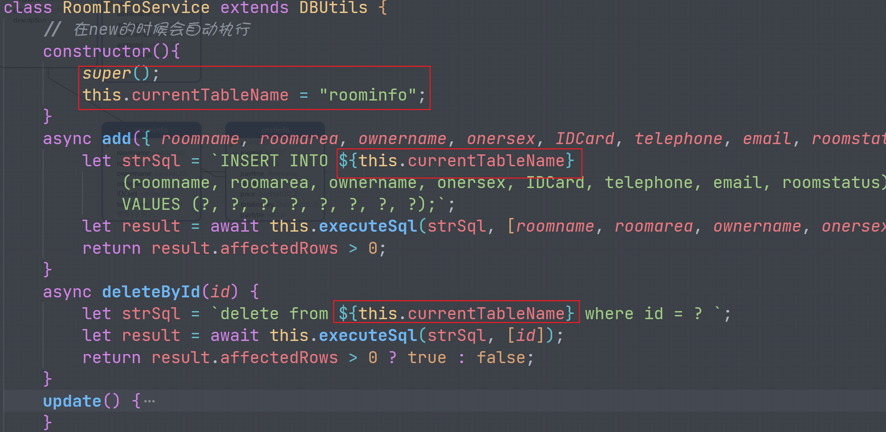

   同时，当我们完成一个表以后，其它的表也应该这样操作，这怎么办呢？

### BaseService的使用

针对上面的问题，我们不得不考虑一个现象，我们发现所有的Service里面都有一个共享的属性叫`currentTableName`，那么对于共同的东西，我们应该怎么办呢？

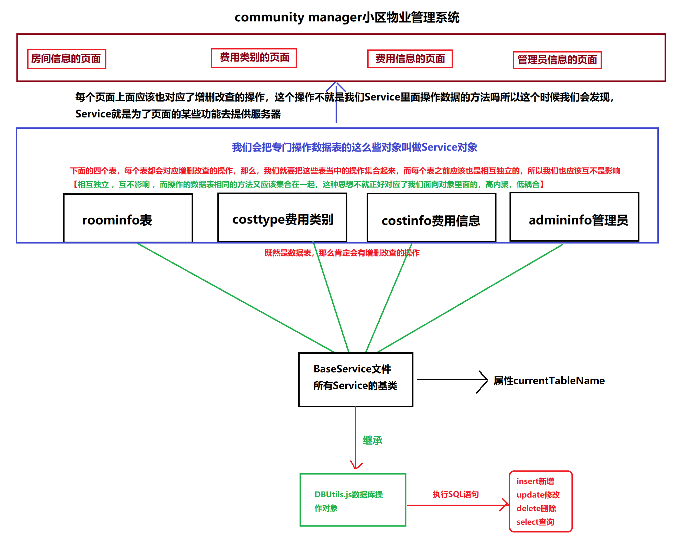

```javascript
/**
 * 所有Service的基类
 */
const DBUtils = require("../utils/DBUtils.js");

class BaseService extends DBUtils {
    constructor(currentTableName) {
        super();
        this.currentTableName = currentTableName;
    }
}

module.exports = BaseService;
```

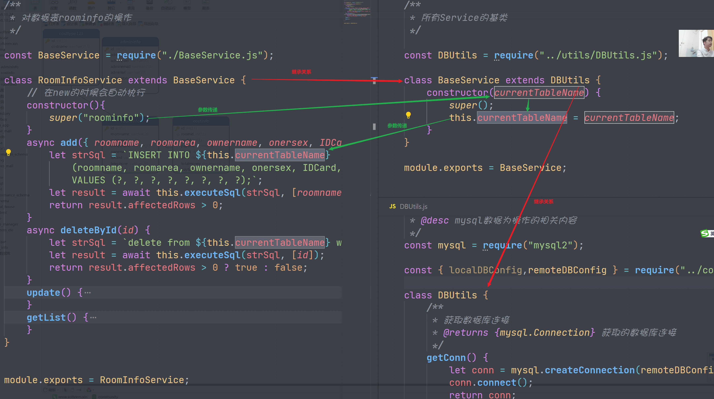

### BaseService的重构

BaseSerivce的功能大家也就都知道了，它可以把一些公共的放在这里，然后让所有的Serivce都继承自这个对象，这样如果有一些共同的方法，我们放在这里以后，其它所有的Service都可以使用

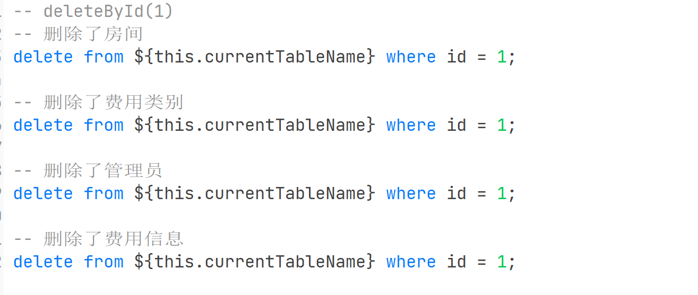

经过分析以后，我们可以看到，其实删除的功能是可以进行重构的

```javascript
/**
 * 所有Service的基类
 */

const DBUtils = require("../utils/DBUtils.js");

class BaseService extends DBUtils {
    constructor(currentTableName) {
        super();
        this.currentTableName = currentTableName;
    }
    /**
     * 根据id删除某一项数据
     * @param {number} id 要删除项的id主键 
     * @returns {Promise<boolean>} true代表成功，false代表失败
     */
    async deleteById(id) {
        let strSql = `delete from ${this.currentTableName} where id = ?`;
        let result = await this.executeSql(strSql, [id]);
        return result.affectedRows > 0;
    }
    /**
     * 获取所有记录
     * @returns {Promise<Array>}
     */
    async getAllList() {
        let strSql = `select * from ${this.currentTableName} ;`;
        let result = await this.executeSql(strSql);
        return result;
    }
}

module.exports = BaseService;
```

### Service里面的查询操作

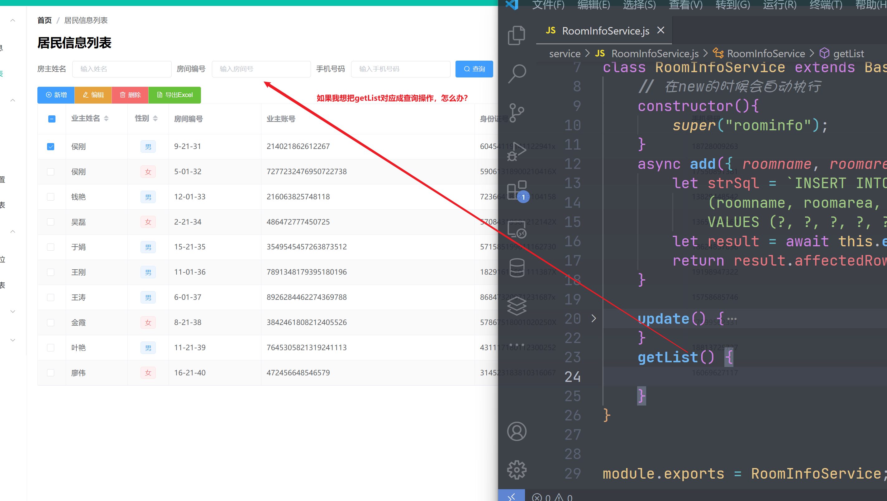

当我们重构以后，相同的功能可以放在BaseService里面，不同的功能，我们就要使用各自的Serivice

现在如果我们想完成页面上面的查询操作，应该怎么办呢？这个查询操作对应的就是`getList()`这个方法，怎么办呢？

1. 查询的时候是有三个条件的，房主姓名，房间编号 ，以及手机号这三个，怎么样动态拼接这三个条件
2. 这里是否会有页码的产生？【这个问题在这里先不解决，我们在项目当中解决】

```javascript
/**
 * 对数据表roominfo的操作
 */
const BaseService = require("./BaseService.js");
class RoomInfoService extends BaseService {
    // 在new的时候会自动执行
    constructor() {
        super("roominfo");
    }
  	//省略部分代码
    /**
     * 查询房间信息
     * @param {{ownername, roomname, telephone}} 查询参数 
     * @returns {Promise<Array>} 返回数据库的查询结果
     */
    async getList({ ownername, roomname, telephone }) {
        //这是最基本的一个SQL语句
        let strSql = `select * from ${this.currentTableName} where 1 = 1 `;
        //查询条件拼接的SQL语句
        let strWhere = ``;
        // 定义一个参数数组
        let ps = [];
        if (ownername) {
            strWhere += ` and ownername like ? `;
            ps.push(`%${ownername}%`);
        }
        if (roomname) {
            strWhere += ` and roomname like ? `;
            ps.push(`%${roomname}%`);
        }
        if (telephone) {
            strWhere += ` and telephone = ? `;
            ps.push(telephone);
        }
        //最后将2条SQL语句合在一起
        strSql += strWhere;
        let result = await this.executeSql(strSql, ps);
        return result;
    }
}
module.exports = RoomInfoService;
```

上面的`getList()`就是我们完成的功能 ，我们使用了三个参数，同时对这三个参数进行了判断拼接，同时得到了`strWhere`以及`ps`2个变量，这样做非常好

<span style="color:red">万一要是有10个参数要判断拼接呢？**同时我们还要考虑一个问题，应该是所有的数据表都会有查询 ，所以也就是所有的Service都应该会有这个操作**</span>

我们现在迫切希望将这个简化的操作放在父级里面，只要在父级里面有了这个方法，那所有的子级都可以使用这个方法

**DBUtils.js**

```javascript
/**
 * @author 杨标
 * @Date 2022-10-17
 * @desc mysql数据为操作的相关内容
 */
const mysql = require("mysql2");
const { localDBConfig, remoteDBConfig } = require("../config/DBConfig.js");

class DBUtils {
   	//省略部分代码 
    
    /**
     * 初始化参数的方法
     * @returns {{strWhere:string,ps:Array}} 
     */
    paramsInit() {
        let obj = {
            strWhere: "",
            ps: [],
            /**
             * 精确查询
             * @param {string|number|boolean} value 
             * @param {string} name 
             * @returns {obj}
             */
            equal(value, name) {
                if (value) {
                    this.strWhere += ` and ${name}  = ? `;
                    this.ps.push(value);
                }
                return this;
            },
            /**
             * 模糊查询
             * @param {string|number|any} value 
             * @param {string} name 
             * @returns {obj}
             */
            like(value, name) {
                if (value) {
                    this.strWhere += ` and ${name} like ? `;
                    this.ps.push(`%${value}%`);
                }
                return this;
            }
        }
        return obj;
    }
}

module.exports = DBUtils;
```

现在，我们在`DBUtils.js`里面添加了一个就去，这个方法就是用于拼接SQL语句的

同时，我们在`RoomInfoService.js`里在，也调用了这个方法去实现

```javascript
async getList2({ ownername, roomname, telephone }) {
    let strSql = `select * from ${this.currentTableName} where 1 = 1 `;
    let { strWhere, ps } = this.paramsInit()
    	.like(ownername,"ownername")
    	.like(roomname,"roomname")    
    	.equal(telephone,"telephone");

    //最后将2条SQL语句合在一起
    strSql += strWhere;
    let result = await this.executeSql(strSql, ps);
    return result;
}
```

当我们去完成了上面的操作以后，这个时候再去完成费用信息表的查询操作，它的代码如下

```javascript
class CostInfoServcie extends BaseService {
    //省略部分代码 ......
    getList({ownername,roomid,costid}){
        let strSql = `select costinfo.*,costtype.costname from ${this.currentTableName} 
            inner join roominfo on costinfo.roomid = roominfo.id
            inner join costtype on costtype.id = costinfo.costid
            where 1=1 `;
    }
}
```

在上面的SQL语句里面，我们只是通过`this.currentTableName`来获取当前查询的表的名称，但是这里有一个最大的问题就是它使用了内联查询，它的里面会有多个表名

还是一样的问题，如果在这个地方DBA要是把数据表的名子改了，怎么办？我们现在要尽量的去实现低耦合的关系 

我们可以在`BaseService`里面建一个对象 ，实现表名与对象的名的一一对应关系，如下所示

```javascript
class BaseService extends DBUtils {
    constructor(currentTableName) {
        super();
        this.currentTableName = currentTableName;
        this.tableMap = {
            admininfo: "admininfo",
            costinfo: "costinfo",
            costtype: "costtype",
            roominfo: "roominfo"
        }
    }
    //省略部分代码......
}
```

当我们去完成上面的操作以后，我们就可以实现下面的写法

```javascript
class CostInfoService extends BaseService {
    //省略部分代码 
    async getList({ ownername, roomid, costid }) {
        let strSql = `select a.*,b.ownername,c.costname from ${this.tableMap.costinfo} a
            inner join ${this.tableMap.roominfo} b on a.roomid = b.id
            inner join ${this.tableMap.costtype} c on c.id = a.costid
            where 1=1 `;
        let { strWhere, ps } = this.paramsInit()
            .like(ownername, "ownername")
            .equal(roomid, "roomid")
            .equal(costid, "costid");
        strSql += strWhere;
        let result = await this.executeSql(strSql, ps);
        return result;
    }
}
```

我们把里面的表名全部都使用上面的对象的形式去完成了

### 工厂模式

现在我们是有4张表，4张表里面全部实现了增删查改的操作，那么后续我们就可以直接使用这里面的Service来完成操作

现在我们来测试一下

```javascript
/**
 * 我要在这一个文件里面，同时使用三个Service
 */

const RoomInfoService = require("../service/RoomInfoService");
const CostTypeService = require("../service/CostTypeService");
const CostInfoService = require("../service/CostInfoService");
//现在我分别想获取三个数据表里面所有的数据
let roomInfoService = new RoomInfoService();
let costTypeService = new CostTypeService();
let costInfoService = new CostInfoService();

const testGetAllList = async () => {
    try {
        let roomInfoList = await roomInfoService.getAllList();
        let costTypeList = await costTypeService.getAllList();
        let costInfoList = await costInfoService.getAllList();
        console.log(roomInfoList);
        console.log(costTypeList);
        console.log(costInfoList);
    } catch (error) {
        console.log(error);
        console.log("数据库执行失败");
    }
}
testGetAllList();
```

在上面的代码里面，我们发现一个问题，我们每需要一个Service我们就要导入一个Service，后面如果有多个数据表就会有多个Service，这样可能会会导入的越来越多

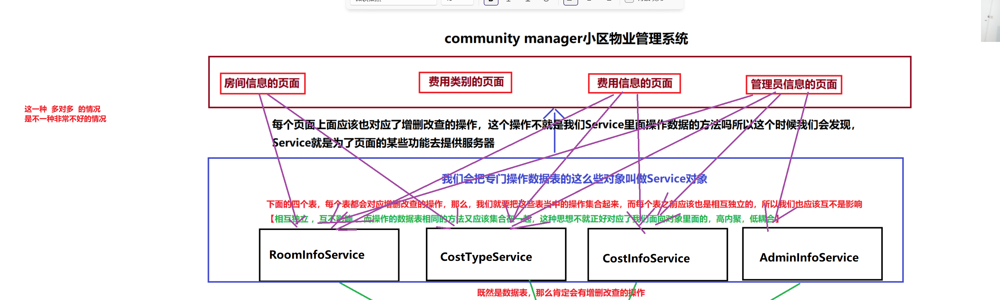

后面在做项目的时候可能会还遇到上面的问题，就是一个页面可能会有多个功能，所以要同时使用多个Service，这样就会照成上面图片当中的情况

现在我们把整个项目的架构改成如下的情况

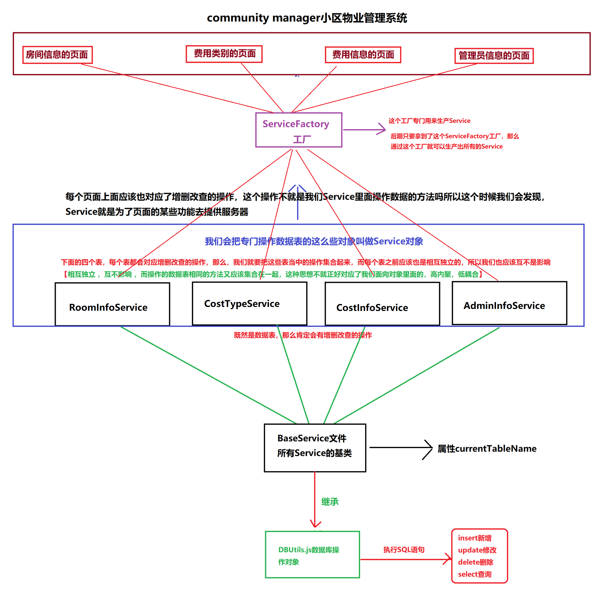

我们在`Service`的上面追加了一层叫做`ServiceFactory`，这个东西就是专门用于生产对象的

现在在当前的项目下面，我们创建一个`factory`的文件夹，然后在这个文件夹的下面创建一个`ServiceFactory.js`的文件 ，代码如下

```javascript
/**
 * @author 杨标
 * @date 2022-10-18
 * @description ServiceFactory生成服务的工厂
 */
class ServiceFactory {
    static createAdminInfoService() {
        const AdminInfoService = require("../service/AdminInfoService");
        return new AdminInfoService();
    }

    static createCostInfoService() {
        const CostInfoService = require("../service/CostInfoService");
        return new CostInfoService();
    }

    static createCostTypeService() {
        const CostTypeService = require("../service/CostTypeService");
        return new CostTypeService();
    }

    static createRoomInfoService() {
        const RoomInfoService = require("../service/RoomInfoService");
        return new RoomInfoService();
    }
}

module.exports = ServiceFactory;
```

> **代码分析**
>
> 1. 在这个对象里面，它全部都是static的就去，这么做的优点就是`class`不需要new就可以直接使用方法
> 2. 每一个方法都是一个独立的方法，它专门用于生产一个Service对象的实例出来，后面我们只需要拿到这个可以得到所有的Service

现在了工厂模式以后，我们再来测试一下调用过程

```javascript
/**
 * 测试一下ServiceFactory
 */

const ServiceFactory = require("../factory/ServiceFactory");


// 想得到所有的管理员列表
const testAdmin = async () => {
    try {
        let adminInfoService = ServiceFactory.createAdminInfoService();
        let adminInfoList = await adminInfoService.getAllList();
        console.log(adminInfoList);
    } catch (error) {
        console.log(error);
        console.log("服务器错误");
    }
}
// testAdmin();

ServiceFactory.createAdminInfoService().getAllList().then(adminInfoList => {
    console.log(adminInfoList);
}).catch(error=>{
    console.log(error);
    console.log("服务器错误");
});

ServiceFactory.createRoomInfoService().getAllList().then(roomInfoList=>{
    console.log(roomInfoList);
}).catch(error=>{
    console.log(error);
    console.log("服务器错误");
})
```

> 工厂模式解决了我们在使用Service要多次引用 的问题，也解决了Service与其它模块的高耦合问题
>
> 但是它还有一个最不好的现象就是如果有多个Service文件 ，那么，我们就要在`ServiceFactory`里面创建多个方法，这个操作起来也很麻烦
>
> 不过这点不用担心 后面我们可以使用抽象工厂模式来完成

### 抽象工厂模式

> TODO：恢复线下再讲


