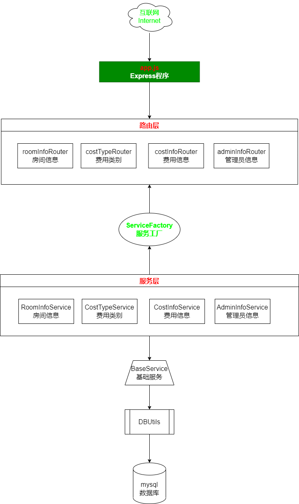
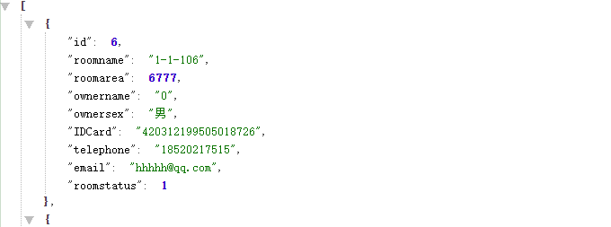
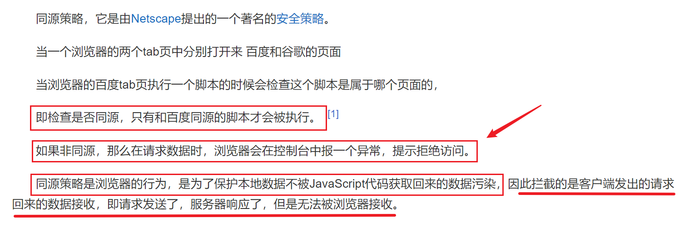

## Express与数据库项目整合

* 项目名称：社区物业管理系统
* 项目平台：nodejs+mysql+bootstrap+layer+jquery
* 项目技术：express
* 开发人员：杨标

------

### 项目架构图



### 一、项目初始始化

```bash
$ npm init --yes
```

### 二、安装项目的依赖信息

```bash
$ npm install mysql2 express --save
```

### 三、创建express 程序

```javascript
const http = require("http");
const express = require("express");
const app = express();


const server = http.createServer(app);
server.listen(16888,"0.0.0.0",()=>{
    console.log(`服务器启动成功`);
})
```

### 四、根据项目的模块创建路由

在上面的项里面创建`routes`目录 ，然后创建路由文件 

* `roomInfoRouter.js`
* `costTypeRouter.js`
* `costInfoRouter.js`
* `adminInfoRouter.js`

上面的四个路由文件分别对了四个路由模块 

```javascript
/**
 * @author 杨标
 * @description roomInfo路由模块
 */
const express = require("express");
const router = express.Router();

module.exports = router;
```

### 五、连接路由文件

每一个路由文件都要与app.js进行连接

```javascript
//连接路由文件 
app.use("/roomInfo", require("./routes/roomInfoRouter"));
app.use("/costType", require("./routes/costTypeRouter"));
app.use("/costInfo", require("./routes/costInfoRouter"));
app.use("/adminInfo", require("./routes/adminInfoRouter"));
```

### 六、创建mysql数据库连接的配置文件 

首先在项目下面创建一个`DBConfig.js`的文件。这个文件放在`config`的目录下面

```javascript
/**
 * 本地数据库连接的配置信息
 */
 const localDBConfig = {
    host: "127.0.0.1",
    port: 3306,
    user: "sg",
    password: "xxxxxxx",
    database: "community"
}
/**
 * 远程数据库的连接
 */
const remoteDBConfig = {
    host: "www.softeem.xin",
    port: 3306,
    user: "dev",
    password: "xxxxxx",
    database: "community"
}
module.exports = {
    localDBConfig,
    remoteDBConfig
}
```

> 后期把数据库的地址，用户名及密码换成自己的密码

### 七、根据数据表文件创建数据库

正常的开发应该是根据功能图来实现数据库的建模操作，再根据建模来生成数据表，目前的主流的建模软件有很多，`PD/EA`等

**房间表roominfo**

| 列名       | 类型         | 说明                           |
| ---------- | ------------ | ------------------------------ |
| id         | int          | 主键,自增                      |
| roomname   | varchar(20)  | 房间名称                       |
| roomarea   | double       | 房间面积                       |
| ownername  | varchar(20)  | 业主姓名                       |
| ownersex   | varchar(2)   | 业主性别                       |
| IDCard     | varchar(18)  | 身份证号                       |
| telephone  | varchar(20)  | 手机号码                       |
| email      | varchar(255) | 邮箱                           |
| roomstatus | int          | 房间状态,[自住,出租,未售,其它] |

**费用类别costtype**

| 列名     | 类别         | 说明           |
| -------- | ------------ | -------------- |
| id       | int          | 主键，自增     |
| costname | varchar(255) | 费用类别的名称 |
| price    | decima(10,2) | 费用的单价     |
| desc     | text         | 费用的说明     |

**费用信息costinfo**

> 这个表就是收费信息表，也是当前系统的核心表

| 列名       | 类别      | 说明                                                         |
| ---------- | --------- | ------------------------------------------------------------ |
| id         | int       | 主键，自增                                                   |
| roomid     | int       | <span style="color:red">外键</span>，房间的编号，来源于roominfo表 |
| costid     | int       | <span style="color:red">外键</span>，费用类别编号，来源于costtype表 |
| paytime    | timestamp | 缴费时间，默认为当前时间                                     |
| count      | double    | 缴费的数量，有可能有小数                                     |
| price      | decima    | 费用类别里面的单价                                           |
| totalmoney | decima    | 总价，单价*数量                                              |
| paytype    | int       | 缴费方式[支付宝,微信,现金,转账]                              |

**管理员表admininfo**

| 列名        | 类型         | 说明                    |
| ----------- | ------------ | ----------------------- |
| id          | int          | 主键自增                |
| adminname   | varchar(50)  | 管理员账号              |
| adminpwd    | varchar(50)  | 管理员密码，md5加密存储 |
| adminemail  | varchar(255) | 管理员邮箱              |
| admintel    | varchar(20)  | 管理员手机号            |
| adminstatus | int          | 管理员状态[正常,禁用]   |

当我们的数据库设计完成了以后，我们就要开始在mysql里面创建数据库了


当数据库构建完成以后，我们一定要在在数据表上面构建主外键的约束关系 【一定是外键找主键】

> 这里要注意，把数据库建好了以后，一定要导出一个SQL有脚本文件

```sql
/*
 Navicat Premium Data Transfer

 Source Server         : 杨标
 Source Server Type    : MySQL
 Source Server Version : 50540
 Source Host           : 127.0.0.1:3306
 Source Schema         : community

 Target Server Type    : MySQL
 Target Server Version : 50540
 File Encoding         : 65001

 Date: 17/10/2022 09:12:47
*/

SET NAMES utf8mb4;
SET FOREIGN_KEY_CHECKS = 0;

-- ----------------------------
-- Table structure for admininfo
-- ----------------------------
DROP TABLE IF EXISTS `admininfo`;
CREATE TABLE `admininfo`  (
  `id` int(11) NOT NULL AUTO_INCREMENT,
  `adminname` varchar(50) CHARACTER SET utf8mb4 COLLATE utf8mb4_general_ci NOT NULL,
  `adminpwd` varchar(50) CHARACTER SET utf8mb4 COLLATE utf8mb4_general_ci NOT NULL,
  `adminemail` varchar(255) CHARACTER SET utf8mb4 COLLATE utf8mb4_general_ci NOT NULL,
  `admintel` varchar(20) CHARACTER SET utf8mb4 COLLATE utf8mb4_general_ci NOT NULL,
  `adminstatus` int(11) NOT NULL,
  PRIMARY KEY (`id`) USING BTREE
) ENGINE = InnoDB AUTO_INCREMENT = 1 CHARACTER SET = utf8mb4 COLLATE = utf8mb4_general_ci ROW_FORMAT = Compact;

-- ----------------------------
-- Records of admininfo
-- ----------------------------

-- ----------------------------
-- Table structure for costinfo
-- ----------------------------
DROP TABLE IF EXISTS `costinfo`;
CREATE TABLE `costinfo`  (
  `id` int(11) NOT NULL AUTO_INCREMENT,
  `roomid` int(11) NOT NULL,
  `costid` int(11) NOT NULL,
  `paytime` timestamp NOT NULL DEFAULT CURRENT_TIMESTAMP ON UPDATE CURRENT_TIMESTAMP,
  `count` double NOT NULL,
  `price` decimal(10, 2) NOT NULL,
  `totalmoney` decimal(10, 2) NOT NULL,
  `paytype` int(11) NOT NULL,
  PRIMARY KEY (`id`) USING BTREE,
  INDEX `roomid`(`roomid`) USING BTREE,
  INDEX `costid`(`costid`) USING BTREE,
  CONSTRAINT `costinfo_ibfk_1` FOREIGN KEY (`roomid`) REFERENCES `roominfo` (`id`) ON DELETE RESTRICT ON UPDATE RESTRICT,
  CONSTRAINT `costinfo_ibfk_2` FOREIGN KEY (`costid`) REFERENCES `costtype` (`id`) ON DELETE RESTRICT ON UPDATE RESTRICT
) ENGINE = InnoDB AUTO_INCREMENT = 1 CHARACTER SET = utf8mb4 COLLATE = utf8mb4_general_ci ROW_FORMAT = Compact;

-- ----------------------------
-- Records of costinfo
-- ----------------------------

-- ----------------------------
-- Table structure for costtype
-- ----------------------------
DROP TABLE IF EXISTS `costtype`;
CREATE TABLE `costtype`  (
  `id` int(11) NOT NULL AUTO_INCREMENT,
  `costname` varchar(255) CHARACTER SET utf8mb4 COLLATE utf8mb4_general_ci NOT NULL,
  `price` decimal(10, 2) NOT NULL,
  `desc` text CHARACTER SET utf8mb4 COLLATE utf8mb4_general_ci NOT NULL,
  PRIMARY KEY (`id`) USING BTREE
) ENGINE = InnoDB AUTO_INCREMENT = 1 CHARACTER SET = utf8mb4 COLLATE = utf8mb4_general_ci ROW_FORMAT = Compact;

-- ----------------------------
-- Records of costtype
-- ----------------------------

-- ----------------------------
-- Table structure for roominfo
-- ----------------------------
DROP TABLE IF EXISTS `roominfo`;
CREATE TABLE `roominfo`  (
  `id` int(11) NOT NULL AUTO_INCREMENT,
  `roomname` varchar(20) CHARACTER SET utf8mb4 COLLATE utf8mb4_general_ci NOT NULL,
  `roomarea` double NOT NULL,
  `ownername` varchar(20) CHARACTER SET utf8mb4 COLLATE utf8mb4_general_ci NOT NULL,
  `onersex` varchar(2) CHARACTER SET utf8mb4 COLLATE utf8mb4_general_ci NOT NULL,
  `IDCard` varchar(18) CHARACTER SET utf8mb4 COLLATE utf8mb4_general_ci NOT NULL,
  `telephone` varchar(20) CHARACTER SET utf8mb4 COLLATE utf8mb4_general_ci NOT NULL,
  `email` varchar(255) CHARACTER SET utf8mb4 COLLATE utf8mb4_general_ci NOT NULL,
  `roomstatus` int(11) NOT NULL,
  PRIMARY KEY (`id`) USING BTREE
) ENGINE = InnoDB AUTO_INCREMENT = 1 CHARACTER SET = utf8mb4 COLLATE = utf8mb4_general_ci ROW_FORMAT = Compact;

-- ----------------------------
-- Records of roominfo
-- ----------------------------

SET FOREIGN_KEY_CHECKS = 1;
```

### 八、封装mysql操作方法文件DBUtils

在当前项目下面新建一个`DBUtils.js`的文件 ，代码如下

```javascript
/**
 * @author 杨标
 * @Date 2022-10-19
 * @desc mysql数据为操作的相关内容
 */
const mysql = require("mysql2");

const { localDBConfig, remoteDBConfig } = require("../config/DBConfig.js");

class DBUtils {
    /**
     * 获取数据库连接
     * @returns {mysql.Connection} 获取的数据库连接
     */
    getConn() {
        let conn = mysql.createConnection(remoteDBConfig);
        conn.connect();
        return conn;
    }
    /**
     * 
     * @param {string} strSql 要执行的SQL语句
     * @param {Array} params SQL语句里面的参数
     * @returns {Promise<Array|mysql.ResultSetHeader>} 返回承诺携带的结果
     */
    executeSql(strSql, params = []) {
        return new Promise((resolve, reject) => {
            let conn = this.getConn();
            conn.query(strSql, params, (error, result) => {
                if (error) {
                    reject(error);
                }
                else {
                    resolve(result);
                }
                conn.end();
            });
        });
    }
    /**
     * 初始化参数的方法
     */
    paramsInit() {
        let obj = {
            strWhere: "",
            ps: [],
            /**
             * 精确查询
             * @param {string|number|boolean} value 
             * @param {string} name 
             * @returns {obj}
             */
            equal(value, name) {
                if (value) {
                    this.strWhere += ` and ${name}  = ? `;
                    this.ps.push(value);
                }
                return this;
            },
            /**
             * 模糊查询
             * @param {string|number|any} value 
             * @param {string} name 
             * @returns {obj}
             */
            like(value, name) {
                if (value) {
                    this.strWhere += ` and ${name} like ? `;
                    this.ps.push(`%${value}%`);
                }
                return this;
            }
        }

        return obj;
    }

}

module.exports = DBUtils;
```

### 九、根据模块来完成Service的操作及BaseService的提取

之前我们都知道这里有4个数据表，所以应该至少有4个模块 ，这个Servcie的命名如下

1. `RoomInfoService.js`
2. `CostTypeService.js`
3. `CostInlfoService.js`
4. `AdminInfoService.js`

**BaseService.js**

```javascript
/**
 * @author 杨标
 * @description 所有Servcie的基础类
 * @date 2022-10-19
 */
const DBUtils = require("../utils/DBUtils");
class BaseService extends DBUtils {
    constructor(currentTableName) {
        super();
        this.currentTableName = currentTableName;
        this.tableMap = {
            roominfo: "roominfo",
            costinfo: "costinfo",
            costtype: "costtype",
            admininfo: "admininfo"
        }
    }

    /**
     * 根据id删除一项
     * @warn 后期这里要改成软删除【逻辑删除】
     * @param {number} id 
     * @returns {Promise<boolean>} true删除成功，false删除失败
     */
    async deleteById(id) {
        let strSql = `delete from ${this.currentTableName} where id  = ? `;
        let result = await this.executeSql(strSql, [id]);
        return result.affectedRows > 0;
    }

    /**
     * 获取所有数据
     * @returns {Promise<Array>}
     */
    async getAllList() {
        let strSql = ` select * from ${this.currentTableName} `;
        let result = await this.executeSql(strSql);
        return result;
    }
}

module.exports = BaseService;
```

**RoomInfoService.js**

```javascript
const BaseService = require("./BaseService");

class RoomInfoService extends BaseService{
    constructor(){
        super("roominfo");
    }
}


module.exports = RoomInfoService;
```

### 十、创建服务层工厂

在当前的项目的目录下面创建一个`factory`的文件夹，然后在这个文件夹下面创建`ServiceFactory.js`的文件

```javascript
/**
 * @author 杨标
 * @description 服务层工厂
 */

class ServiceFactory {
    static createAdminInfoService() {
        const AdminInfoServcie = require("../services/AdminInfoService");
        return new AdminInfoServcie();
    }

    static createRoomInfoServcie() {
        const RoomInfoService = require("../services/RoomInfoService");
        return new RoomInfoService();
    }

    static createCostTypeService() {
        const CostTypeService = require("../services/CostTypeServcie");
        return new CostTypeService();
    }

    static createCostInfoService() {
        const CostInfoService = require("../services/CostInfoServcie");
        return new CostInfoService();
    }
}
module.exports = ServiceFactory;
```

### 十一、完成下面页面的数据请求操作


在上面的页面里面，我们可以看到，首先就会有一个查询界面，同时还会有新增，修改，删除操作，这是一个房间的模块 ，所以我们要针对性对性的对房间来进行功能

#### 1. 完成查询的操作

这个查询的操作肯定是查询房间的信息，所以我们要针对性去找房间的模块`roomInfo`，与房间模块相关的联的主要有2个

* `roomInfoRouter.js`用于处理房间的请求的
* `RoomInfoService.js`用于操作房间表的数据库操作

**roomInfoRouter.js**

```javascript

router.get("/getList", async (req, resp) => {
    //我希望请求这个方法的时候 ，能够返回房间信息列表
    //数据在哪里，数据库
    //操作roominfo的表，roominfo表对应RoomInfoServcie
    try {
        let roomInfoService = ServiceFactory.createRoomInfoServcie();
        let roomInfoList = await roomInfoService.getAllList();
        resp.json(roomInfoList);
    } catch (error) {

    }
});

```

当我们请求数据的时候 ，这个时候就可以得以json数据，如下所示



但是这个做并不好，有一些问题

这样的格式其实并不好，我们希望返回一个固定的格式 

#### 2.返回固定格式的json

**成功的时候**

```javascript
{
    status:"success",
    msg:"获取数据成功",
    data:[
        //真正的数据
    ]
}
```

**失败的时候**

```javascript
{
    status:"fail",
    msg:"服务器错误",
    data:null
}
```

我们希望每次返回数据的时候都是一个固定的格式 ，这样前端在接收数据的时候 就会非常方便，直接判断某一个字段就知道这次的请求是否成功了

在当前的项目下面创建了一个`model`的文件夹，在下面创建一个`ResultJson.js`的文件 ，代码如下

> model有模型的意思 ，在java里面一般叫DTO，在MVC里面 ，指的就是M，它一般用于对象的统一格式传输

```javascript
/**
 * 定义统一的JSON返回格式
 * @author 杨标
 * @date 2022-10-20
 */

class ResultJson {
    /**
     * 
     * @param {boolean} status 
     * @param {*} msg 
     * @param {*} data 
     */
    constructor(flag, msg, data = []) {
        this.status = flag ? "success" : "fail";
        this.msg = msg;
        this.data = data;
    }
}
module.exports = ResultJson;
```

现在将代码更改如下

```javascript

router.get("/getList", async (req, resp) => {
    //我希望请求这个方法的时候 ，能够返回房间信息列表
    //数据在哪里，数据库
    //操作roominfo的表，roominfo表对应RoomInfoServcie
    try {
        let roomInfoService = ServiceFactory.createRoomInfoServcie();
        let roomInfoList = await roomInfoService.getAllList();
        let resultJson = new ResultJson(true, "房间信息获取成功", roomInfoList);
        resp.json(resultJson);
    } catch (error) {
        let resultJson = new ResultJson(false,"服务器错误");
        resp.json(resultJson);
    }
});
```

这个时候返回的数据格式就是固定的格式了，方便后期前端进行相应的操作

**请求失败的时候**


**请求成功的时候**


通过上面的对比 ，我们可以发现，无论是功了，还是失败了，我们都可以看到一个固定格式的`json`字符串

#### 3.根据查询条件完成查询操作


我们可以看到，我们真要做的功能是根据查询条件来查询内容，不是获取所有数据 ，而我们之前写的代码是调用了`let roomInfoList = await roomInfoService.getAllList();`获取了所有的数据，这是不对的，所以我们应该要重新写个方法，根据查询条件来获取结果

而数据库的操作应该在`service`里面，现在我们操作`roominfo`的数据表，那么应该找`RoomInfoServcie`

但是`RoomInfoService`没有根据查询条件获取数据的方法，所以我们要手动的写一个

```javascript
/**
 * @author 杨标
 * @description roomInfo模块的操作
 */

const BaseService = require("./BaseService");

class RoomInfoService extends BaseService {
    constructor() {
        super("roominfo");
    }

    /**
     * 根据条件查询
     * @param {{ roomname, ownername, telephone }} param0 查询参数
     * @returns {Promise<Array>} 查询结果
     */
    async getList({ roomname, ownername, telephone }) {
        let strSql = `select * from ${this.currentTableName} where 1=1 `;
        let { strWhere, ps } = this.paramsInit()
            .like(roomname, "roomname")
            .like(ownername, "ownername")
            .equal(telephone, "telephone");
        strSql += strWhere;
        let result = await this.executeSql(strSql, ps);
        return result;
    }
}


module.exports = RoomInfoService;
```

回到前端页面

```html
<script>
    $(function() {
        let url = "http://127.0.0.1:16888/roomInfo/getList";
        const getRoomInfoList = () => {
            //ajax向后台发请求
            $.get(url, result => {
                console.log(result);
            });
        }
        getRoomInfoList();
    })
</script>
```


当我们看到一个像这样的错误的时候，这个错误就是典型的**Ajax跨域错误**

### 十二、解决Ajax跨域的问题

要解决这个问题，我们先要弄清楚另一个问题，为什么为会Ajax跨域的错误？什么是ajax跨域

Ajax不能跨域是因为所有的BOM不能跨域，而BOM不能跨域的原因是因为浏览器不能跨域，浏览器不能跨域的原因是因为有一个<span style="color:red;font-size:22px">同源策略</span>


同源策略也叫同域策略



现在我们发现，当前网页的址是`http://127.0.0.1:5007/roomInfoList.html`，而`ajax`要请求的页面则是`http://127.0.0.1:16888/roomInfo/getList`，这个时候两个地址的域`origin`不是相同的，这样就存在一个跨域现象，跨域以后的访问是受到了浏览器**同源策略**的限制的，所以ajax的请求返回不了结果

要解决这个Ajax跨域的问题有很多办法 

1. `CORS`跨域资源共享

   `CORS`全称`corss origin resource share`跨域资源共享

   ```javascript
   resp.setHeader("Access-Control-Allow-Origin", "*");
   resp.setHeader("Access-Control-Allow-Methods", "GET,POST,PUT,DELETE,OPTIONS");
   resp.setHeader("Access-Control-Aloow-Headers", "Content-Type");
   ```

2. http反向代理【在vue里面讲】

3. `jsonp`【面试宝典了解就可以了，基本不用】

按照上面的方式，我们可以在返回数据之前，添加请求头来解决问题

```javascript

//http://127.0.0.1:16888/roomInfo/getList?roomname=1-1-201&ownername=0&telephone=18520217515
router.get("/getList", async (req, resp) => {
    //我希望请求这个方法的时候 ，能够返回房间信息列表
    //数据在哪里，数据库
    //操作roominfo的表，roominfo表对应RoomInfoServcie
    // 所有get请求的参数都在req.query
    // query就是?后面所有的参数形成的对象
    /**
     * {
     *     roomname:"1-1-201",
     *     ownername:"0",
     *     telephone:"18520217515"
     * }
     */
    try {
        let roomInfoService = ServiceFactory.createRoomInfoServcie();
        let roomInfoList = await roomInfoService.getList(req.query);
        let resultJson = new ResultJson(true, "房间信息获取成功", roomInfoList);
        //颁发跨域能行证
        resp.setHeader("Access-Control-Allow-Origin", "*");
        resp.setHeader("Access-Control-Allow-Methods", "GET,POST,PUT,DELETE,OPTIONS");
        resp.setHeader("Access-Control-Aloow-Headers", "Content-Type");
        resp.json(resultJson);
    } catch (error) {
        let resultJson = new ResultJson(false, "服务器错误");
        resp.json(resultJson);
    }
});
```

但是这会存在一个现象就是每次在每回数据的时候，我都要添加响应头，怎么办呢？

### 十三、拦截器


所有的请求最终都会经过`app.js`的，所以我们只要在`app.js`这个地方设置一个拦截，那第每次的请求都会被拦截

**app.js**

```javascript
//添加一个拦截器
app.use((req, resp, next) => {
    //req：浏览器到服务器的请求
    //resp:服务器返回浏览器的
    //next:是否放行
    console.log("我是拦截器，我在拦你， 你走不动了");
    //颁发跨域能行证
    resp.setHeader("Access-Control-Allow-Origin", "*");
    resp.setHeader("Access-Control-Allow-Methods", "GET,POST,PUT,DELETE,OPTIONS");
    resp.setHeader("Access-Control-Aloow-Headers", "Content-Type");
    next();
});
```

上图的代码就是通过器来实现添加请求头，以期达到`ajax`跨域访问

、
