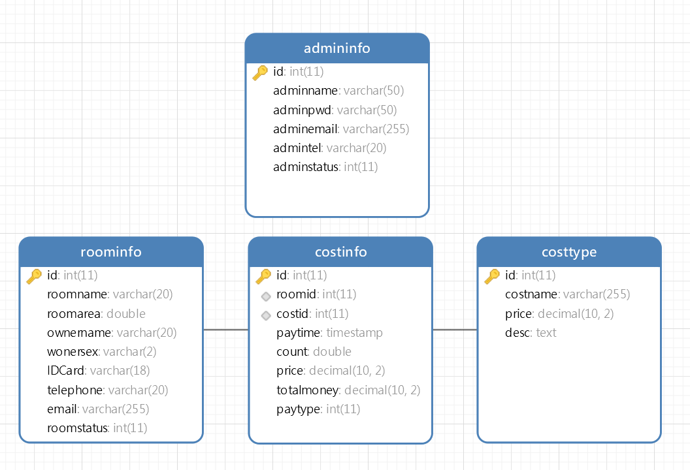
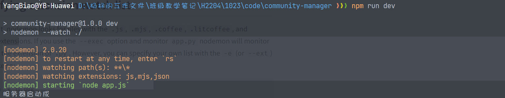

## Express与数据库项目整合

* 项目名称：社区物业管理系统
* 项目平台：nodejs+mysql+bootstrap+layer+jquery
* 项目技术：express
* 开发人员：杨标

------

### 项目架构图


### 一、项目初始始化

```bash
$ npm init --yes
```

### 二、安装项目的依赖信息

```bash
$ npm install mysql2 express --save
```

### 三、创建express 程序

```javascript
const http = require("http");
const express = require("express");
const app = express();


const server = http.createServer(app);
server.listen(16888,"0.0.0.0",()=>{
    console.log(`服务器启动成功`);
})
```

### 四、根据项目的模块创建路由

在上面的项里面创建`routes`目录 ，然后创建路由文件 

* `roomInfoRouter.js`
* `costTypeRouter.js`
* `costInfoRouter.js`
* `adminInfoRouter.js`

上面的四个路由文件分别对了四个路由模块 

```javascript
/**
 * @author 杨标
 * @description roomInfo路由模块
 */
const express = require("express");
const router = express.Router();

module.exports = router;
```

### 五、连接路由文件

每一个路由文件都要与app.js进行连接

```javascript
//连接路由文件 
app.use("/roomInfo", require("./routes/roomInfoRouter"));
app.use("/costType", require("./routes/costTypeRouter"));
app.use("/costInfo", require("./routes/costInfoRouter"));
app.use("/adminInfo", require("./routes/adminInfoRouter"));
```

### 六、创建mysql数据库连接的配置文件 

首先在项目下面创建一个`DBConfig.js`的文件。这个文件放在`config`的目录下面

```javascript
/**
 * 本地数据库连接的配置信息
 */
 const localDBConfig = {
    host: "127.0.0.1",
    port: 3306,
    user: "sg",
    password: "xxxxxxx",
    database: "community"
}
/**
 * 远程数据库的连接
 */
const remoteDBConfig = {
    host: "www.softeem.xin",
    port: 3306,
    user: "dev",
    password: "xxxxxx",
    database: "community"
}
module.exports = {
    localDBConfig,
    remoteDBConfig
}
```

> 后期把数据库的地址，用户名及密码换成自己的密码

### 七、根据数据表文件创建数据库

正常的开发应该是根据功能图来实现数据库的建模操作，再根据建模来生成数据表，目前的主流的建模软件有很多，`PD/EA`等

**房间表roominfo**

| 列名       | 类型         | 说明                           |
| ---------- | ------------ | ------------------------------ |
| id         | int          | 主键,自增                      |
| roomname   | varchar(20)  | 房间名称                       |
| roomarea   | double       | 房间面积                       |
| ownername  | varchar(20)  | 业主姓名                       |
| ownersex   | varchar(2)   | 业主性别                       |
| IDCard     | varchar(18)  | 身份证号                       |
| telephone  | varchar(20)  | 手机号码                       |
| email      | varchar(255) | 邮箱                           |
| roomstatus | int          | 房间状态,[自住,出租,未售,其它] |

**费用类别costtype**

| 列名     | 类别         | 说明           |
| -------- | ------------ | -------------- |
| id       | int          | 主键，自增     |
| costname | varchar(255) | 费用类别的名称 |
| price    | decima(10,2) | 费用的单价     |
| desc     | text         | 费用的说明     |

**费用信息costinfo**

> 这个表就是收费信息表，也是当前系统的核心表

| 列名       | 类别      | 说明                                                         |
| ---------- | --------- | ------------------------------------------------------------ |
| id         | int       | 主键，自增                                                   |
| roomid     | int       | <span style="color:red">外键</span>，房间的编号，来源于roominfo表 |
| costid     | int       | <span style="color:red">外键</span>，费用类别编号，来源于costtype表 |
| paytime    | timestamp | 缴费时间，默认为当前时间                                     |
| count      | double    | 缴费的数量，有可能有小数                                     |
| price      | decima    | 费用类别里面的单价                                           |
| totalmoney | decima    | 总价，单价*数量                                              |
| paytype    | int       | 缴费方式[支付宝,微信,现金,转账]                              |

**管理员表admininfo**

| 列名        | 类型         | 说明                    |
| ----------- | ------------ | ----------------------- |
| id          | int          | 主键自增                |
| adminname   | varchar(50)  | 管理员账号              |
| adminpwd    | varchar(50)  | 管理员密码，md5加密存储 |
| adminemail  | varchar(255) | 管理员邮箱              |
| admintel    | varchar(20)  | 管理员手机号            |
| adminstatus | int          | 管理员状态[正常,禁用]   |

当我们的数据库设计完成了以后，我们就要开始在mysql里面创建数据库了



当数据库构建完成以后，我们一定要在在数据表上面构建主外键的约束关系 【一定是外键找主键】

> 这里要注意，把数据库建好了以后，一定要导出一个SQL有脚本文件

```sql
/*
 Navicat Premium Data Transfer

 Source Server         : 杨标
 Source Server Type    : MySQL
 Source Server Version : 50540
 Source Host           : 127.0.0.1:3306
 Source Schema         : community

 Target Server Type    : MySQL
 Target Server Version : 50540
 File Encoding         : 65001

 Date: 17/10/2022 09:12:47
*/

SET NAMES utf8mb4;
SET FOREIGN_KEY_CHECKS = 0;

-- ----------------------------
-- Table structure for admininfo
-- ----------------------------
DROP TABLE IF EXISTS `admininfo`;
CREATE TABLE `admininfo`  (
  `id` int(11) NOT NULL AUTO_INCREMENT,
  `adminname` varchar(50) CHARACTER SET utf8mb4 COLLATE utf8mb4_general_ci NOT NULL,
  `adminpwd` varchar(50) CHARACTER SET utf8mb4 COLLATE utf8mb4_general_ci NOT NULL,
  `adminemail` varchar(255) CHARACTER SET utf8mb4 COLLATE utf8mb4_general_ci NOT NULL,
  `admintel` varchar(20) CHARACTER SET utf8mb4 COLLATE utf8mb4_general_ci NOT NULL,
  `adminstatus` int(11) NOT NULL,
  PRIMARY KEY (`id`) USING BTREE
) ENGINE = InnoDB AUTO_INCREMENT = 1 CHARACTER SET = utf8mb4 COLLATE = utf8mb4_general_ci ROW_FORMAT = Compact;

-- ----------------------------
-- Records of admininfo
-- ----------------------------

-- ----------------------------
-- Table structure for costinfo
-- ----------------------------
DROP TABLE IF EXISTS `costinfo`;
CREATE TABLE `costinfo`  (
  `id` int(11) NOT NULL AUTO_INCREMENT,
  `roomid` int(11) NOT NULL,
  `costid` int(11) NOT NULL,
  `paytime` timestamp NOT NULL DEFAULT CURRENT_TIMESTAMP ON UPDATE CURRENT_TIMESTAMP,
  `count` double NOT NULL,
  `price` decimal(10, 2) NOT NULL,
  `totalmoney` decimal(10, 2) NOT NULL,
  `paytype` int(11) NOT NULL,
  PRIMARY KEY (`id`) USING BTREE,
  INDEX `roomid`(`roomid`) USING BTREE,
  INDEX `costid`(`costid`) USING BTREE,
  CONSTRAINT `costinfo_ibfk_1` FOREIGN KEY (`roomid`) REFERENCES `roominfo` (`id`) ON DELETE RESTRICT ON UPDATE RESTRICT,
  CONSTRAINT `costinfo_ibfk_2` FOREIGN KEY (`costid`) REFERENCES `costtype` (`id`) ON DELETE RESTRICT ON UPDATE RESTRICT
) ENGINE = InnoDB AUTO_INCREMENT = 1 CHARACTER SET = utf8mb4 COLLATE = utf8mb4_general_ci ROW_FORMAT = Compact;

-- ----------------------------
-- Records of costinfo
-- ----------------------------

-- ----------------------------
-- Table structure for costtype
-- ----------------------------
DROP TABLE IF EXISTS `costtype`;
CREATE TABLE `costtype`  (
  `id` int(11) NOT NULL AUTO_INCREMENT,
  `costname` varchar(255) CHARACTER SET utf8mb4 COLLATE utf8mb4_general_ci NOT NULL,
  `price` decimal(10, 2) NOT NULL,
  `desc` text CHARACTER SET utf8mb4 COLLATE utf8mb4_general_ci NOT NULL,
  PRIMARY KEY (`id`) USING BTREE
) ENGINE = InnoDB AUTO_INCREMENT = 1 CHARACTER SET = utf8mb4 COLLATE = utf8mb4_general_ci ROW_FORMAT = Compact;

-- ----------------------------
-- Records of costtype
-- ----------------------------

-- ----------------------------
-- Table structure for roominfo
-- ----------------------------
DROP TABLE IF EXISTS `roominfo`;
CREATE TABLE `roominfo`  (
  `id` int(11) NOT NULL AUTO_INCREMENT,
  `roomname` varchar(20) CHARACTER SET utf8mb4 COLLATE utf8mb4_general_ci NOT NULL,
  `roomarea` double NOT NULL,
  `ownername` varchar(20) CHARACTER SET utf8mb4 COLLATE utf8mb4_general_ci NOT NULL,
  `onersex` varchar(2) CHARACTER SET utf8mb4 COLLATE utf8mb4_general_ci NOT NULL,
  `IDCard` varchar(18) CHARACTER SET utf8mb4 COLLATE utf8mb4_general_ci NOT NULL,
  `telephone` varchar(20) CHARACTER SET utf8mb4 COLLATE utf8mb4_general_ci NOT NULL,
  `email` varchar(255) CHARACTER SET utf8mb4 COLLATE utf8mb4_general_ci NOT NULL,
  `roomstatus` int(11) NOT NULL,
  PRIMARY KEY (`id`) USING BTREE
) ENGINE = InnoDB AUTO_INCREMENT = 1 CHARACTER SET = utf8mb4 COLLATE = utf8mb4_general_ci ROW_FORMAT = Compact;

-- ----------------------------
-- Records of roominfo
-- ----------------------------

SET FOREIGN_KEY_CHECKS = 1;
```

### 八、封装mysql操作方法文件DBUtils

在当前项目下面新建一个`DBUtils.js`的文件 ，代码如下

```javascript
/**
 * @author 杨标
 * @Date 2022-10-19
 * @desc mysql数据为操作的相关内容
 */
const mysql = require("mysql2");

const { localDBConfig, remoteDBConfig } = require("../config/DBConfig.js");

class DBUtils {
    /**
     * 获取数据库连接
     * @returns {mysql.Connection} 获取的数据库连接
     */
    getConn() {
        let conn = mysql.createConnection(remoteDBConfig);
        conn.connect();
        return conn;
    }
    /**
     * 
     * @param {string} strSql 要执行的SQL语句
     * @param {Array} params SQL语句里面的参数
     * @returns {Promise<Array|mysql.ResultSetHeader>} 返回承诺携带的结果
     */
    executeSql(strSql, params = []) {
        return new Promise((resolve, reject) => {
            let conn = this.getConn();
            conn.query(strSql, params, (error, result) => {
                if (error) {
                    reject(error);
                }
                else {
                    resolve(result);
                }
                conn.end();
            });
        });
    }
    /**
     * 初始化参数的方法
     */
    paramsInit() {
        let obj = {
            strWhere: "",
            ps: [],
            /**
             * 精确查询
             * @param {string|number|boolean} value 
             * @param {string} name 
             * @returns {obj}
             */
            equal(value, name) {
                if (value) {
                    this.strWhere += ` and ${name}  = ? `;
                    this.ps.push(value);
                }
                return this;
            },
            /**
             * 模糊查询
             * @param {string|number|any} value 
             * @param {string} name 
             * @returns {obj}
             */
            like(value, name) {
                if (value) {
                    this.strWhere += ` and ${name} like ? `;
                    this.ps.push(`%${value}%`);
                }
                return this;
            }
        }

        return obj;
    }

}

module.exports = DBUtils;
```

### 九、根据模块来完成Service的操作及BaseService的提取

之前我们都知道这里有4个数据表，所以应该至少有4个模块 ，这个Servcie的命名如下

1. `RoomInfoService.js`
2. `CostTypeService.js`
3. `CostInlfoService.js`
4. `AdminInfoService.js`

**BaseService.js**

```javascript
/**
 * @author 杨标
 * @description 所有Servcie的基础类
 * @date 2022-10-19
 */
const DBUtils = require("../utils/DBUtils");
class BaseService extends DBUtils {
    constructor(currentTableName) {
        super();
        this.currentTableName = currentTableName;
        this.tableMap = {
            roominfo: "roominfo",
            costinfo: "costinfo",
            costtype: "costtype",
            admininfo: "admininfo"
        }
    }

    /**
     * 根据id删除一项
     * @warn 后期这里要改成软删除【逻辑删除】
     * @param {number} id 
     * @returns {Promise<boolean>} true删除成功，false删除失败
     */
    async deleteById(id) {
        let strSql = `delete from ${this.currentTableName} where id  = ? `;
        let result = await this.executeSql(strSql, [id]);
        return result.affectedRows > 0;
    }

    /**
     * 获取所有数据
     * @returns {Promise<Array>}
     */
    async getAllList() {
        let strSql = ` select * from ${this.currentTableName} `;
        let result = await this.executeSql(strSql);
        return result;
    }
}

module.exports = BaseService;
```

**RoomInfoService.js**

```javascript
const BaseService = require("./BaseService");

class RoomInfoService extends BaseService{
    constructor(){
        super("roominfo");
    }
}


module.exports = RoomInfoService;
```

### 十、创建服务层工厂

在当前的项目的目录下面创建一个`factory`的文件夹，然后在这个文件夹下面创建`ServiceFactory.js`的文件

```javascript
/**
 * @author 杨标
 * @description 服务层工厂
 */

class ServiceFactory {
    static createAdminInfoService() {
        const AdminInfoServcie = require("../services/AdminInfoService");
        return new AdminInfoServcie();
    }

    static createRoomInfoServcie() {
        const RoomInfoService = require("../services/RoomInfoService");
        return new RoomInfoService();
    }

    static createCostTypeService() {
        const CostTypeService = require("../services/CostTypeServcie");
        return new CostTypeService();
    }

    static createCostInfoService() {
        const CostInfoService = require("../services/CostInfoServcie");
        return new CostInfoService();
    }
}
module.exports = ServiceFactory;
```

### 十一、完成下面页面的数据请求操作


在上面的页面里面，我们可以看到，首先就会有一个查询界面，同时还会有新增，修改，删除操作，这是一个房间的模块 ，所以我们要针对性对性的对房间来进行功能

#### 1. 完成查询的操作

这个查询的操作肯定是查询房间的信息，所以我们要针对性去找房间的模块`roomInfo`，与房间模块相关的联的主要有2个

* `roomInfoRouter.js`用于处理房间的请求的
* `RoomInfoService.js`用于操作房间表的数据库操作

**roomInfoRouter.js**

```javascript

router.get("/getList", async (req, resp) => {
    //我希望请求这个方法的时候 ，能够返回房间信息列表
    //数据在哪里，数据库
    //操作roominfo的表，roominfo表对应RoomInfoServcie
    try {
        let roomInfoService = ServiceFactory.createRoomInfoServcie();
        let roomInfoList = await roomInfoService.getAllList();
        resp.json(roomInfoList);
    } catch (error) {

    }
});

```

当我们请求数据的时候 ，这个时候就可以得以json数据，如下所示


但是这个做并不好，有一些问题

这样的格式其实并不好，我们希望返回一个固定的格式 

#### 2.返回固定格式的json

**成功的时候**

```javascript
{
    status:"success",
    msg:"获取数据成功",
    data:[
        //真正的数据
    ]
}
```

**失败的时候**

```javascript
{
    status:"fail",
    msg:"服务器错误",
    data:null
}
```

我们希望每次返回数据的时候都是一个固定的格式 ，这样前端在接收数据的时候 就会非常方便，直接判断某一个字段就知道这次的请求是否成功了

在当前的项目下面创建了一个`model`的文件夹，在下面创建一个`ResultJson.js`的文件 ，代码如下

> model有模型的意思 ，在java里面一般叫DTO，在MVC里面 ，指的就是M，它一般用于对象的统一格式传输

```javascript
/**
 * 定义统一的JSON返回格式
 * @author 杨标
 * @date 2022-10-20
 */

class ResultJson {
    /**
     * 
     * @param {boolean} status 
     * @param {*} msg 
     * @param {*} data 
     */
    constructor(flag, msg, data = []) {
        this.status = flag ? "success" : "fail";
        this.msg = msg;
        this.data = data;
    }
}
module.exports = ResultJson;
```

现在将代码更改如下

```javascript

router.get("/getList", async (req, resp) => {
    //我希望请求这个方法的时候 ，能够返回房间信息列表
    //数据在哪里，数据库
    //操作roominfo的表，roominfo表对应RoomInfoServcie
    try {
        let roomInfoService = ServiceFactory.createRoomInfoServcie();
        let roomInfoList = await roomInfoService.getAllList();
        let resultJson = new ResultJson(true, "房间信息获取成功", roomInfoList);
        resp.json(resultJson);
    } catch (error) {
        let resultJson = new ResultJson(false,"服务器错误");
        resp.json(resultJson);
    }
});
```

这个时候返回的数据格式就是固定的格式了，方便后期前端进行相应的操作

**请求失败的时候**


**请求成功的时候**


通过上面的对比 ，我们可以发现，无论是功了，还是失败了，我们都可以看到一个固定格式的`json`字符串

#### 3.根据查询条件完成查询操作


我们可以看到，我们真要做的功能是根据查询条件来查询内容，不是获取所有数据 ，而我们之前写的代码是调用了`let roomInfoList = await roomInfoService.getAllList();`获取了所有的数据，这是不对的，所以我们应该要重新写个方法，根据查询条件来获取结果

而数据库的操作应该在`service`里面，现在我们操作`roominfo`的数据表，那么应该找`RoomInfoServcie`

但是`RoomInfoService`没有根据查询条件获取数据的方法，所以我们要手动的写一个

```javascript
/**
 * @author 杨标
 * @description roomInfo模块的操作
 */

const BaseService = require("./BaseService");

class RoomInfoService extends BaseService {
    constructor() {
        super("roominfo");
    }

    /**
     * 根据条件查询
     * @param {{ roomname, ownername, telephone }} param0 查询参数
     * @returns {Promise<Array>} 查询结果
     */
    async getList({ roomname, ownername, telephone }) {
        let strSql = `select * from ${this.currentTableName} where 1=1 `;
        let { strWhere, ps } = this.paramsInit()
            .like(roomname, "roomname")
            .like(ownername, "ownername")
            .equal(telephone, "telephone");
        strSql += strWhere;
        let result = await this.executeSql(strSql, ps);
        return result;
    }
}


module.exports = RoomInfoService;
```

回到前端页面

```html
<script>
    $(function() {
        let url = "http://127.0.0.1:16888/roomInfo/getList";
        const getRoomInfoList = () => {
            //ajax向后台发请求
            $.get(url, result => {
                console.log(result);
            });
        }
        getRoomInfoList();
    })
</script>
```


当我们看到一个像这样的错误的时候，这个错误就是典型的**Ajax跨域错误**

### 十二、解决Ajax跨域的问题

要解决这个问题，我们先要弄清楚另一个问题，为什么为会Ajax跨域的错误？什么是ajax跨域

Ajax不能跨域是因为所有的BOM不能跨域，而BOM不能跨域的原因是因为浏览器不能跨域，浏览器不能跨域的原因是因为有一个<span style="color:red;font-size:22px">同源策略</span>


同源策略也叫同域策略


现在我们发现，当前网页的址是`http://127.0.0.1:5007/roomInfoList.html`，而`ajax`要请求的页面则是`http://127.0.0.1:16888/roomInfo/getList`，这个时候两个地址的域`origin`不是相同的，这样就存在一个跨域现象，跨域以后的访问是受到了浏览器**同源策略**的限制的，所以ajax的请求返回不了结果

要解决这个Ajax跨域的问题有很多办法 

1. `CORS`跨域资源共享

   `CORS`全称`corss origin resource share`跨域资源共享

   ```javascript
   resp.setHeader("Access-Control-Allow-Origin", "*");
   resp.setHeader("Access-Control-Allow-Methods", "GET,POST,PUT,DELETE,OPTIONS");
   resp.setHeader("Access-Control-Aloow-Headers", "Content-Type");
   ```

2. http反向代理【在vue里面讲】

3. `jsonp`【面试宝典了解就可以了，基本不用】

按照上面的方式，我们可以在返回数据之前，添加请求头来解决问题

```javascript

//http://127.0.0.1:16888/roomInfo/getList?roomname=1-1-201&ownername=0&telephone=18520217515
router.get("/getList", async (req, resp) => {
    //我希望请求这个方法的时候 ，能够返回房间信息列表
    //数据在哪里，数据库
    //操作roominfo的表，roominfo表对应RoomInfoServcie
    // 所有get请求的参数都在req.query
    // query就是?后面所有的参数形成的对象
    /**
     * {
     *     roomname:"1-1-201",
     *     ownername:"0",
     *     telephone:"18520217515"
     * }
     */
    try {
        let roomInfoService = ServiceFactory.createRoomInfoServcie();
        let roomInfoList = await roomInfoService.getList(req.query);
        let resultJson = new ResultJson(true, "房间信息获取成功", roomInfoList);
        //颁发跨域能行证
        resp.setHeader("Access-Control-Allow-Origin", "*");
        resp.setHeader("Access-Control-Allow-Methods", "GET,POST,PUT,DELETE,OPTIONS");
        resp.setHeader("Access-Control-Aloow-Headers", "Content-Type");
        resp.json(resultJson);
    } catch (error) {
        let resultJson = new ResultJson(false, "服务器错误");
        resp.json(resultJson);
    }
});
```

但是这会存在一个现象就是每次在每回数据的时候，我都要添加响应头，怎么办呢？

### 十三、拦截器


所有的请求最终都会经过`app.js`的，所以我们只要在`app.js`这个地方设置一个拦截，那第每次的请求都会被拦截

**app.js**

```javascript
//添加一个拦截器
app.use((req, resp, next) => {
    //req：浏览器到服务器的请求
    //resp:服务器返回浏览器的
    //next:是否放行
    console.log("我是拦截器，我在拦你， 你走不动了");
    //颁发跨域能行证
    resp.setHeader("Access-Control-Allow-Origin", "*");
    resp.setHeader("Access-Control-Allow-Methods", "GET,POST,PUT,DELETE,OPTIONS");
    resp.setHeader("Access-Control-Aloow-Headers", "Content-Type");
    next();
});
```

上图的代码就是通过器来实现添加请求头，以期达到`ajax`跨域访问

### 十四、热重启

node.js的项目在每次更改完代码以后，都需要手动的重启


这样做会很麻烦，我们希望当前的项目在更改完代码 以后 ，自动的重启，这样会极大的提高我们的效率 

要完成这个功能 ，我们需要借用于第三方的一个包，叫`nodemon`

**安装**

```bash
$ npm install nodemon --save-dev
```

> 这个地方与之前就不一样的，这前是`--save`代表生产依赖（相当于原材料）,而`--save-dev`代表的是开发依赖，这个时候它相当于工具
>
> 这个工具只是用于帮助我们开发项目的，它并不属于项目的一部分，有这个工具我们办事会更方便，没有这个工具也不影响我们

```javascript
{
  "name": "community-manager",
  "version": "1.0.0",
  "description": "",
  "main": "index.js",
  "scripts": {
    "start": "node app.js"
  },
  "keywords": [
    "社区物业管理系统",
    "express"
  ],
  "author": "杨标",
  "license": "ISC",
  "dependencies": {
    "express": "^4.18.2",
    "mysql2": "^2.3.3"
  },
  "devDependencies": {
    "nodemon": "^2.0.20"
  }
}
```

这个时候我们可以看到，依赖的信息记录在了`devDependencies`这个里在， 这个就代表开发依赖

**配置启动命令**


**执行命令**



当我们把命令配置好了以后，这个时候，我们就可以执行`npm run dev`来开始了

### 十五、重构前端的JS代码

**之前的代码**

```html
<script src="./bootstrap/js/bootstrap.bundle.min.js"></script>
<script src="./js/jquery-3.6.1.js"></script>
<script src="./js/template-web.js"></script>
<script>
    $(function() {
        var url = "http://127.0.0.1:16888/roomInfo/getList";

        function getRoomInfoList() {
            //ajax向后台发请求
            $.get(url, {
                roomname: $("#roomname").val(),
                ownername: $("#ownername").val(),
                telephone: $("#telephone").val()
            }, function(result){
                if (result.status === "success") {
                    let htmlStr = template("temp1", {
                        roomInfoList: result.data
                    });
                    $("#table1 tbody").html(htmlStr);
                } else {
                    alert("请求失败");
                }
            });
        }
        getRoomInfoList();

        $("#btn-query").click(function() {
            getRoomInfoList();
        })
    });
</script>
```

> * 我们现在将请求地址固定成了`http://127.0.0.1:16888`，大家知道这个代表的是后台的地址，如果后台的地址发生了变化，则所有请求的地址都要变化
> * `$.get()`它是`ajax`请求，它只有请求成功的回调函数，没有请求失败的回调函数，后期我们就不能够判断是否请求成功
> * 在之前我们已经固定了返回的JSON格式 ，如`status:"success"`就代表成功，如果`status:"fail"`就代表失败，所以现在的问题是我们每次请求回来了以后都要判断一下，我们能否把这一个判断过程提取出来

在js的目录下面，创建一个`base.js`的文件 ，然后代码如下

```javascript
/**
 * 基础的JS代码
 */

/**
 * 所有页面请求的Ajax的基础的地址
 */
const baseURL = "http://127.0.0.1:16888";

/**
 * 我要将jQuery里面的Ajax做二次封装
 * ajax请求有可能会成功，有可能会失败，并且，它是一个异步的
 * 所以我们应该使用ES6里面的哪个技术来完成
 */
const request = {
    get(str, data = {}) {
        return new Promise((resolve, reject) => {
            $.ajax({
                method: "GET",
                url: str,
                dataType: "json",
                data: data,
                success: result => {
                    resolve(result);
                },
                error: error => {
                    reject(error);
                },
                complete: () => {

                }
            })
        });
    },
    post(str, data = {}) {
        return new Promise((resolve, reject) => {
            $.ajax({
                method: "POST",
                url: str,
                dataType: "json",
                data: data,
                success: result => {
                    //这里的success只能代表请求回来了，并不能代码这个地方的请值是成功的
                    if(result.status==="success"){
                        resolve(result);
                    }
                    else{
                        reject(result);
                    }
                },
                error: error => {
                    reject(error);
                },
                complete: () => {

                }
            });
        });
    }
}
```

> **代码分析**：
>
> 在上面的代码里面，我们完成了以下几个点
>
> 1. 我们定义了一个`baseURL`地址，这就解决了请求地址的域如果在发生变化以后会怎么样
> 2. 我们在内部使用了`Promise`来返回承诺，这样后面就可以不再使用回调函数 ，直接使用`then`或`async/await`的方式来进行
> 3. 在`success`的回调里面， 我们可以看到一点，我们直接在封装的时候就判断了它的`status`是否为`success`，这样就不用每次都在外边判断了

**重构以后的代码**

```html
<script src="./bootstrap/js/bootstrap.bundle.min.js"></script>
<script src="./js/jquery-3.6.1.js"></script>
<script src="./js/template-web.js"></script>
<script src="./js/base.js"></script>
<script>
    $(function() {
        async function getRoomInfoList() {
            try {
                let result = await request.get(`${baseURL}/roomInfo/getList`, {
                    roomname: $("#roomname").val(),
                    ownername: $("#ownername").val(),
                    telephone: $("#telephone").val()
                });
                // 开始模糊引擎的渲染
                let htmlStr = template("temp1",{
                    roomInfoList:result.data
                });
                $("#table1>tbody").html(htmlStr);
            } catch (error) {
                console.log(error);
            }
        }

        getRoomInfoList();

        $("#btn-query").click(function(){
            getRoomInfoList();
        })
    });
</script>
```

----

### 十六、分页查询数据

```javascript
/**
* 根据条件来进行分页的查询
* @param {{roomname, ownername, telephone, pageIndex=1}} param0  参数
*/
async getListByPage({ roomname, ownername, telephone, pageIndex = 1 }) {
    let strSql = ` select * from ${this.currentTableName} where 1 = 1 `;
    let { strWhere, ps } = this.paramsInit()
    .like(roomname, "roomname")
    .like(ownername, "ownername")
    .like(telephone, "telephone");

    //第一条sql语句
    strSql += strWhere + ` limit ${(pageIndex - 1) * 10},10 ;`;
    //第二条sql语句
    let countSql = ` select count(*) 'totalCount' from ${this.currentTableName} where 1 = 1 `;
    countSql += strWhere;
    let result = await this.executeSql(strSql + countSql, [...ps, ...ps]);
    return result;
}
```

现在去测试一下这个方法

```javascript
const ServiceFactory = require("../factory/ServiceFactory")


ServiceFactory.createRoomInfoServcie().getListByPage({
    pageIndex: 1
}).then(result=>{
    console.log(result);
}).catch(error=>{
    console.log(error);
    console.log("失败了");
})
```

这个时候就出现了下面的错误 


我们把生成的sql语句在navicate上面去执行的时候 ，它没有错，但是为什么在`node.js`去执行的进修会报错，因为就是因为这里有多条的sql语句

**nodejs在默认情况下只允许执行一条sql语句**，我们现在就要去设置一下，让它可以执行多条SQL语句

**DBConfig.js文件下面**

```javascript
/**
 * 本地数据库连接的配置信息
 */
 const localDBConfig = {
    host: "127.0.0.1",
    port: 3306,
    user: "sg",
    password: "123456",
    database: "community",
    multipleStatements:true			//添加这一个配置，就代表可以执行多条sql语句
}
/**
 * 远程数据库的连接
 */
const remoteDBConfig = {
    host: "www.softeem.xin",
    port: 3306,
    user: "dev",
    password: "123456",
    database: "community"，
    multipleStatements:true		  //添加这一个配置，就代表可以执行多条sql语句
}

module.exports = {
    localDBConfig,
    remoteDBConfig
}
```

```javascript
/**
* 根据条件来进行分页的查询
* @param {{roomname, ownername, telephone, pageIndex=1}} param0  参数
*/
async getListByPage({ roomname, ownername, telephone, pageIndex = 1 }) {
    let strSql = ` select * from ${this.currentTableName} where 1 = 1 `;
    let { strWhere, ps } = this.paramsInit()
    .like(roomname, "roomname")
    .like(ownername, "ownername")
    .like(telephone, "telephone");

    //第一条sql语句
    strSql += strWhere + ` limit ${(pageIndex - 1) * 10},10 ;`;
    //第二条sql语句
    let countSql = ` select count(*) 'totalCount' from ${this.currentTableName} where 1 = 1 `;
    countSql += strWhere;
    //现在执行的是2条sql语句，所以result里面就会有2个结果
    let [listData, [{ totalCount }]] = await this.executeSql(strSql + countSql, [...ps, ...ps]);
    // listData就是第一条sql语句所执行的结果，它是一个列表 
    // totalCount就是第二条sql语句所执行的结果 ，它是一个totalCount总数
    //现在我要通过totalCount 得到pageCount,pageStart,pageEnd这几个值
}
```

### 十七、构建分页的结果集对象

```javascript
/**
 * 分页的结果集对象
 */
class PageResult {
    /**
     * @param {number} pageIndex 
     * @param {number} totalCount 
     * @param {Array} listData 
     */
    constructor(pageIndex, totalCount, listData) {
        this.pageIndex = pageIndex;
        this.totalCount = totalCount;
        this.listData = listData;
        this.pageCount = Math.ceil(totalCount / 10);
        this.pageStart = this.pageIndex - 2 < 0 ? 1 : this.pageIndex - 2;
        this.pageEnd = this.pageStart + 4 > this.pageCount ? this.pageCount : this.pageStart + 4;
    }
}

module.exports = PageResult;
```


我们现在将2条SQL语句所执行的结果构建成了一个`PageResult`的对象，现在去测试一下

----

### 十八、将页面换成分页查询的结果

```javascript

//http://127.0.0.1:16888/roomInfo/getListByPage
router.get("/getListByPage", async (req, resp) => {
    try {
        let roomInfoService = ServiceFactory.createRoomInfoServcie();
        let pageResult = await roomInfoService.getListByPage(req.query);
        //返回统一的JSON格式
        let resultJson = new ResultJson(true, "获取数据成功", pageResult);
        resp.json(resultJson);
    } catch (error) {
        let resultJson = new ResultJson(false, "服务器错误");
        resp.json(resultJson);
    }
});
```

```html
<!DOCTYPE html>
<html lang="zh">

<head>
    <meta charset="UTF-8">
    <meta http-equiv="X-UA-Compatible" content="IE=edge">
    <meta name="viewport" content="width=device-width, initial-scale=1.0">
    <title>房间信息列表</title>
    <link rel="stylesheet" href="./bootstrap/css/bootstrap.min.css">
    <link rel="stylesheet" href="./bootstrap/font/bootstrap-icons.css">
</head>

<body>
    <div class="container">
        <div class="display-5 text-center text-primary border-bottom py-3">房间信息列表</div>
        <div class="row my-2">
            <div class="col-auto">
                <label class="col-form-label">房主姓名</label>
            </div>
            <div class="col-auto">
                <input type="text" id="ownername" class="form-control" placeholder="输入姓名">
            </div>
            <div class="col-auto">
                <label class="col-form-label">房间编号</label>
            </div>
            <div class="col-auto">
                <input type="text" id="roomname" class="form-control" placeholder="输入编号">
            </div>
            <div class="col-auto">
                <label class="col-form-label">手机号码</label>
            </div>
            <div class="col-auto">
                <input type="text" id="telephone" class="form-control" placeholder="手机号码">
            </div>
            <div class="col-auto">
                <button type="button" class="btn btn-primary" id="btn-query">
                    <span class="bi bi-search"></span>
                    查询
                </button>
            </div>
        </div>
        <div class="btn-group">
            <button type="button" class="btn btn-primary">
                <i class="bi bi-plus-circle"></i>
                新增
            </button>
            <button type="button" class="btn btn-warning">
                <i class="bi bi-plus-circle"></i>
                编辑
            </button>
            <button type="button" class="btn btn-danger">
                <i class="bi bi-plus-circle"></i>
                删除
            </button>
            <button type="button" class="btn btn-success">
                <i class="bi bi-plus-circle"></i>
                导出为excel
            </button>
        </div>
        <div class="table-responsive my-2">
            <table id="table1" class="table table-hover table-bordered table-striped">
                <thead>
                    <tr>
                        <th>
                            <label>
                                <input type="checkbox">全选
                            </label>
                        </th>
                        <th>房间编号</th>
                        <th>业主姓名</th>
                        <th>性别</th>
                        <th>房间面积</th>
                        <th>房间状态</th>
                        <th>业主账号</th>
                        <th>身份证号</th>
                        <th>手机号码</th>
                        <th>业主邮箱</th>
                    </tr>
                </thead>
                <tbody></tbody>
            </table>
        </div>
        <div class="d-flex justify-content-between" id="bottom-bar">

        </div>
    </div>
    <script type="text/html" id="temp1">
    {{each roomInfoList item index}}
    <tr>
        <td>
            <input type="checkbox">
        </td>
        <td>{{item.id}}</td>
        <td>{{item.ownername}}</td>
        <td>{{item.ownersex}}</td>
        <td>{{item.roomname}}</td>
        <td>{{item.roomarea}}</td>
        <td>
            <%if(item.roomstatus>3)else%>
            </td>
            <td>{{item.IDCard}}</td>
            <td>
                <span>{{getMaskTelephone(item.telephone)}}</span>
                <i data-telephone="{{item.telephone}}" class="bi bi-eye-fill text-primary"></i>
            </td>
            <td>{{item.email}}</td>
        </tr>
        {{/each}}
    </script>
    <script type="text/html" id="temp2">
        <p>当前第{{pageIndex}}共，页{{pageCount}}页，共{{totalCount}}条数据</p>
        <ul class="pagination" id="bottom-pagination">
            <li class="page-item"><a data-index="1" class="page-link" href="#">首页</a></li>
            <%for(var i=pageStart;i<=pageEnd;i++)%>
            <li class="page-item"><a data-index="{{pageCount}}" class="page-link" href="#">尾页</a></li>
        </ul>
    </script>
</body>
<script src="./bootstrap/js/bootstrap.bundle.min.js"></script>
<script src="./js/jquery-3.6.1.js"></script>
<script src="./js/template-web.js"></script>
<script src="./js/base.js"></script>
<script>
    $(function() {
        let  pageIndex = 1;
        async function getRoomInfoList() {
            try {
                let result = await request.get(`${baseURL}/roomInfo/getListByPage`, {
                    roomname: $("#roomname").val(),
                    ownername: $("#ownername").val(),
                    telephone: $("#telephone").val(),
                    pageIndex
                });
                console.log(result);
                // 开始模糊引擎的渲染
                let htmlStr = template("temp1", {
                    roomInfoList: result.data.listData,
                    getRoomStatusType,
                    getMaskTelephone
                });
                $("#table1>tbody").html(htmlStr);

                //渲染页码
                let htmlStr2 = template("temp2",{
                    pageStart:result.data.pageStart,
                    pageEnd:result.data.pageEnd,
                    pageIndex:result.data.pageIndex,
                    pageCount:result.data.pageCount,
                    totalCount:result.data.totalCount
                })
                $("#bottom-bar").html(htmlStr2);
               
            } catch (error) {
                console.log(error);
            }
        }

        getRoomInfoList();

        $("#btn-query").click(function() {
            getRoomInfoList();
        })

        $("#table1").on("click","[data-telephone]",function(){
            let telephone = $(this).attr("data-telephone");
            // console.log(telephone);
            $(this).prev("span").text(telephone);
        });

        $("#bottom-pagination").on("click","a",function(){
            pageIndex = $(this).attr("data-index");
            getRoomInfoList();
            // 防止触发href的操作
            return false;
        })
        
    });
</script>


</html>
```

**总结分页查询的步骤**

1. 在服务层编写`getListByPage`的方法，准备要传入的参数
2. 构建sql语句，这里有2条sql语句要构建，一条是查询的结果的sql语句，还有一条是总记录数的sql语句
3. 将2条sql语句以`;`隔开一起执行，得到2个结果 ，然后将这两个结果解构出来得到`listData`与`totalCount`
4. 根据所要的数据构建`PageResult`对象，里面会有`pageIndex,listData,totalCount,pageStart,pageEnd,pageCount`
5. 在路由层里面编写路由，调用服务层的方法，返回JSON数据
6. 【前端】接收到`JSON`数据以后做数据渲染与事件绑定就可以了。事件在绑定的时候要使用<u>事件委托</u>

---

### 十九、新增房间信息

**前端页面**

```html
<!DOCTYPE html>
<html lang="zh">

<head>
    <meta charset="UTF-8">
    <meta http-equiv="X-UA-Compatible" content="IE=edge">
    <meta name="viewport" content="width=device-width, initial-scale=1.0">
    <title>新增房间信息</title>
    <link rel="stylesheet" href="./bootstrap/css/bootstrap.min.css">
    <link rel="stylesheet" href="./bootstrap/font/bootstrap-icons.css">
    <link rel="stylesheet" href="./js/layer/theme/default/layer.css">
</head>

<body>
    <div class="container">
        <div class="display-5 text-center text-primary border-bottom py-3">新增房间信息</div>
        <form id="addRoomInfoForm">
            <div class="form-floating mt-3 mb-3">
                <input type="text" class="form-control"
                    placeholder="请输入房间编号" id="roomname" name="roomname"
                    data-rule-required="true" data-msg-required="房间编号不能为空" ，
                    data-rule-regexp="^\d-\d-\d{3}$" data-msg-regexp="房间编号必须符合规则">
                <label for="pwd">房间编号</label>
            </div>
            <div class="form-floating mt-3 mb-3">
                <input type="text" class="form-control"
                    placeholder="请输入房间面积" id="roomarea" name="roomarea"
                    data-rule-required="true" data-msg-required="房间面积不能为空"
                    data-rule-regexp="^\d+(\.\d+)?$" data-msg-regexp="房间面积必须是数值">
                <label for="pwd">房间面积</label>
            </div>
            <div class="form-floating mt-3 mb-3">
                <input type="text" class="form-control"
                    placeholder="请输入业主姓名" id="ownername" name="ownername"
                    data-rule-required="true" data-msg-required="业主姓名不能为空">
                <label for="pwd">业主姓名</label>
            </div>
            <div class="form-floating mt-3 mb-3">
                <select class="form-select" name="ownersex" id="ownersex">
                    <option value="男">男</option>
                    <option value="女">女</option>
                </select>
                <label for="pwd">业主姓名</label>
            </div>
            <div class="form-floating mt-3 mb-3">
                <input type="text" class="form-control"
                    placeholder="请输入身份证号" id="IDCard" name="IDCard"
                    data-rule-required="true" data-msg-required="身份证号不能为空"
                    data-rule-regexp="^(^[1-9]\d{7}((0\d)|(1[0-2]))(([0|1|2]\d)|3[0-1])\d{3}$)|(^[1-9]\d{5}[1-9]\d{3}((0\d)|(1[0-2]))(([0|1|2]\d)|3[0-1])((\d{4})|\d{3}[Xx])$)$" data-msg-regexp="请输入正确的身份证号">
                <label for="pwd">身份证号</label>
            </div>
            <div class="form-floating mt-3 mb-3">
                <input type="text" class="form-control"
                    placeholder="请输入手机号码" id="telephone" name="telephone"
                    data-rule-required="true" data-msg-required="手机号不能为空"
                    data-rule-regexp="^(0|86|17951)?(13[0-9]|15[012356789]|166|17[3678]|18[0-9]|14[57])[0-9]{8}$" data-msg-regexp="请输入正确的手机号">
                <label for="pwd">手机号码</label>
            </div>
            <div class="form-floating mt-3 mb-3">
                <input type="text" class="form-control"
                    placeholder="请输入邮箱" id="email" name="email"
                    data-rule-required="true" data-msg-required="邮箱不能为空"
                    data-rule-regexp="\w+([-+.]\w+)*@\w+([-.]\w+)*\.\w+([-.]\w+)*" data-msg-regexp="请输入正确的邮箱格式">
                <label for="pwd">邮箱</label>
            </div>
            <div class="form-floating mt-3 mb-3">
                <select class="form-select" name="roomstatus" id="roomstatus">
                    <option value="0">自住</option>
                    <option value="1">出租</option>
                    <option value="2">未售</option>
                    <option value="3">其它</option>
                </select>
                <label for="pwd">房间状态</label>
            </div>
            <div class=" d-flex">
                <button type="button" class="btn btn-primary" id="btn-save">
                    <i class="bi bi-file-pdf"></i>
                    保存
                </button>
                <button type="button" class="btn btn-warning mx-3">
                    <i class="bi bi-arrow-90deg-down"></i>
                    重置
                </button>
            </div>
        </form>
    </div>
</body>
<script src="./bootstrap/js/bootstrap.bundle.min.js"></script>
<script src="./js/jquery-3.6.1.js"></script>
<script src="./js/template-web.js"></script>
<script src="./js/layer/layer.js"></script>
<script src="./js/jquery.validate.js"></script>
<script src="./js/messages_zh.js"></script>
<script src="./js/base.js"></script>
<script>
    $(function() {
        $.validator.addMethod("regexp", function(value, element, params) {
            var reg = new RegExp(params);
            return reg.test(value);
        });
        //表单验证
        var addRoomInfoFormResult = $("#addRoomInfoForm").validate({
            errorPlacement: function(error, element) {
                // error代表的就是这个错误提示的消息
                // element代表你当前正在验证的这个元素
                element.parent().after(error);
            },
            errorClass: "text-danger"
        });
        $("#btn-save").click(async function() {
            //第一步：表单验证
            if (addRoomInfoFormResult.form()) {
                //第二步，我们要将数提交到服务器保存
                //提交--->请求，现在要通过ajax请求后台
                try {
                    let result = await request.get(`${baseURL}/roomInfo/addRoomInfo`, {
                        roomname: $("#roomname").val(),
                        roomarea: $("#roomarea").val(),
                        ownername: $("#ownername").val(),
                        ownersex: $("#ownersex").val(),
                        IDCard: $("#IDCard").val(),
                        telephone: $("#telephone").val(),
                        email: $("#email").val(),
                        roomstatus: $("#roomstatus").val()
                    });
                    layer.alert("新增成功",function(){
                        location.replace("roomInfoList.html");
                    });
                } catch (error) {

                }
            } else {
                layer.alert("请输入正确的内容再保存");
            }

        });
    });
</script>

</html>
```

**后端路由roomInfoRouter.js**

```javascript
router.get("/addRoomInfo", async (req, resp) => {
    // 通过get请示过来的参数在`req.query`里面
    try {
        let roomInfoService = ServiceFactory.createRoomInfoServcie();
        let result = await roomInfoService.add(req.query);
        //返回统一的json格式
        let resultJson = new ResultJson(result, result ? "新增成功" : "新增失败");
        resp.json(resultJson);
    } catch (error) {
        let resultJson = new ResultJson(false, "服务器错误");
        resp.json(resultJson);
    }
});

```

**后端的服务层RoomInfoService.js**

```javascript
/**
* 新增房间信息
* @param {{roomname, roomarea, ownername, ownersex, IDCard, telephone, email, roomstatus}} param0 
* @returns {Promise<Boolean>} true代表新增成功，false代表新增失败
*/
async add({ roomname, roomarea, ownername, ownersex, IDCard, telephone, email, roomstatus }) {
    let strSql = ` INSERT INTO ${this.currentTableName} ( roomname, roomarea, ownername, ownersex, IDCard, telephone, email, roomstatus)  VALUES (?, ?, ?, ?, ?, ?, ?, ?) `;
    let result = await this.executeSql(strSql, [roomname, roomarea, ownername, ownersex, IDCard, telephone, email, roomstatus]);
    return result.affectedRows > 0;
}
```

----

### 二十、关于POST请求

 我们以前一直使用的都是GET请求，包括刚刚在新增房间的时候，我们使用的也是GET请求，但是到底什么是GET请求，它有什么特点呢？


上图就是GET请求以后的图，我们可以看到以下的几个特点

==GET请求会把参数通过`?`的形式拼接在请求地址的后面==

如果我们要是总是使用GET请求会有什么问题？

1. 有些进时候，我们不希望把一些敏感的数据暴露出来，如后期登录的时候账号与密码
2. 如果我现在想向后台提交一个文件（如后期要实现的文件上传功能），这个时候GET就无法实现，因为你不可以把一个文件放在地址栏上面
3. 因为是把参数拼接在了地址栏的后面，所以我们可以看到地址栏上面有很多的文字了，但是浏览器的地址栏并不是无限大的，它有大小限制。如果假设后期我们有人要开始一个博客系统，需要向后台提交一篇博客 ，这个博客有5000字，那么，这5000字在地址栏里面是不可能放得下的

为了解决上面的问题，我们需要采用另一种方式`POST`请求

`POST`请求就是为了解决GET请求存在的不足，它有以下几个特点

1. `POST`的参数不会拼接在地址栏上面，你在地址栏那个地方看不到，这样就可以提交机密的敏感信息
2. `POST`请求不依赖于地址栏，所以它提交的参数可以不用是文本，可以是任何类型的数据 ，如后期提交文件，上传音频，视频等
3. `POST`请求不依赖于地址栏，所以默认情况下是没有大小限制条件 的，可以提交无穷大的数据到后台服务器（只要服务器肯接收）

所以现在我们要将上面的**新增房间的模块换成是POST请示**

在`express`的框架里面，如果要接收`post`提交过来的参数，我们就需要加载一个第三方的插件`body-parser`

**安装依赖包**

```bash
$ npm install body-parser --save
```

**配置依赖包**

```javascript
const bodyParser = require("body-parser");
// 这个叁数有可能以json的格式提交到后台 
app.use(bodyParser.json({ limit: "20mb" }));
// 还可以像?的参数一下拼接在地址栏的后面
app.use(bodyParser.urlencoded({ limit: "20mb", extended: false }));
```

> 将上面的代码在`app.js`当中配置完成以后，我们就可以使用`post`了

**编写路由**

```javascript
router.post("/addRoomInfo", async (req, resp) => {
    // 通过get请示过来的参数在`req.query`里面
    // 通过post请求过来的参数在`req.body`里面
    try {
        let roomInfoService = ServiceFactory.createRoomInfoServcie();
        let result = await roomInfoService.add(req.body);
        let resultJson = new ResultJson(result, result ? "新增成功" : "新增失败");
        resp.json(resultJson);
    } catch (error) {
        let resultJson = new ResultJson(false, "服务器错误");
        resp.json(resultJson);
    }
});
```

> 1. 在上面的代码里面，我们使用了`router.post()`来处理`post`请求
> 2. `post`请求的参数在`req.body`里面，而`get`请求的参数是在`req.query`里面

:tipping_hand_man: **小技巧**：一般情况下，使用post的场景很少

1. 登录，注册，修改密码等这些比较敏感的数据提交的时候
2. 修改，新增这些大量的数据需要提交到后台的时候，我们使用`post`

3. 文件上传的时候会使用`post`

:question: **思考**：get请求与post请求有什么区别


### 二十一、删除与软删除

**roomInfoRouter.js**

```javascript

router.get("/deleteById", async (req, resp) => {
    let { id } = req.query;
    // 现在要操作数据库，让数据库根据这个id去删除
    try {
        let roomInfoService = ServiceFactory.createRoomInfoServcie();
        let result = await roomInfoService.deleteById(id);
        let resultJson = new ResultJson(result, result ? "删除成功" : "删除失败");
    } catch (error) {
        let resultJson = new ResultJson(false, "服务器错误");
        resp.json(resultJson);
    }
})
```

> 在上面的代码里面，我们编写一个路由的处理方法，处理`get`请求过来的`/deleteById`。并且接收到了参数id
>
> 当得到这个id以后，我们又调用了`Service`里面的`deleteById`的方法，这个方法在这里它使用的是`BaseService`之前封装好的方法
>
> 

**前端页面**

```html
 <span class="btn btn-danger btn-sm btn-delete" title="删除" data-id="{{item.id}}">
     <i class="bi bi-trash"></i>
</span>
```


```javascript
//删除
$("#table1").on("click",".btn-delete",async function(){
    let id = $(this).attr("data-id");
    console.log(id);
    // 现在我们就要通过ajax把这个id传递到后台去
    let index = layer.load();
    try {
        let result = await request.get(`${baseURL}/roomInfo/deleteById`,{
            id
        });
        layer.msg("删除成功",function(){
            //刷新数据  重新请求数据，重新渲染页面
            getRoomInfoList();
        });

    } catch (error) {
        layer.alert("删除失败");
    }
    finally{
        layer.close(index);
    }
});
```

>通过事件委托绑定了点击事件，然后点击以后得到了自定义属性`data-id`里面的值，将这个值通过`ajax`传递到了后台
>
>后台路由里面接收到了`id`以后，就调用了 `service`来操作数据库，删除了数据库里面的数据


当我们按照上面操作去完成的时候，我们发现有些数据是可以删除的，而有些数据又是不能删除的，这是为什么呢

> 

错误的原因我们也看到了，这是因为某一个列有外键被别的表使用了，所以不能随便删除

针对这种现象，我们就只能考虑另一种删除方式 ，叫**逻辑删除（也叫软删除）【只要是构建了主外键关系的表，一定会使用到软删除】**

> 

现在我如果想实现软删除，我会在每一个数据表的上面追加一列叫`isDel`，把它设置成布尔什值 ，如果这个列的值为`true`就代表它已经被删除了，如果它是`fasle`就代表它没有被删除


这个时候，我们再去修改一下`node.js`里面的`deleteById`的方法

```javascript

/**
* 根据id删除一项
* @warn 后期这里要改成软删除【逻辑删除】
* @param {number} id 
* @returns {Promise<boolean>} true删除成功，false删除失败
*/
async deleteById(id) {
    //  let strSql = `delete from ${this.currentTableName} where id  = ? `;
    // 这个时候原本真正的删除语句就变在修改语句`update`
    let strSql = ` update ${this.currentTableName} set isDel = true where id = ? `;
    let result = await this.executeSql(strSql, [id]);
    return result.affectedRows > 0;
}
```

> 将原来`delete`的语句就换成了`update`的语句


这个时候我们就可以通过后面的`isDel`来判断这个数据是否真的有删除

**注意事项**：所有删除的数据都是通过`isDel`来判断的，所以后期在查询的时候要排列这个删除的数据，所以原来的查询语句里面的`where 1=1 `换成`where isDel = false `就可以了


----

### 二十二、修改房间信息

> 修改的操作，本质上面就是通过 id从后台获取原来的数据 ，然后再将修改以后的数据重新传递给后台去进行数据库的修改操作

**roomInfoRouter.js**

```javascript
router.get("/findById", async (req, resp) => {
    let { id } = req.query;
    //应该要通过Service操作数据库，从数据库里面查询出相关的数据
    try {
        let result = await ServiceFactory.createRoomInfoService().findById(id);
        let resultJson = new ResultJson(Boolean(result), result ? "获取成功" : "获取失败", result);
        resp.json(resultJson);
    } catch (error) {
        console.log(error);
        let resultJson = new ResultJson(false, "服务器错误");
        resp.json(resultJson);
    }
})
```

**BaseService.js**

```javascript
 /**
* 根据id去查询
* @param {number} id 主键id 
* @returns {Promise<Object|undefined>}
*/
async findById(id) {
    let strSql = ` select * from ${this.currentTableName} where isDel = false and id = ? `;
    let result = await this.executeSql(strSql, [id]);
    return result[0];
}
```

接下来就是页面请求这个接口


点击以后就会跳转到编辑页面

```html
<!DOCTYPE html>
<html lang="zh">

<head>
    <meta charset="UTF-8">
    <meta http-equiv="X-UA-Compatible" content="IE=edge">
    <meta name="viewport" content="width=device-width, initial-scale=1.0">
    <title>编辑房间信息</title>
    <link rel="stylesheet" href="./bootstrap/css/bootstrap.min.css">
    <link rel="stylesheet" href="./bootstrap/font/bootstrap-icons.css">
    <link rel="stylesheet" href="./js/layer/theme/default/layer.css">
</head>

<body>
    <div class="container">
        <div class="display-5 text-center text-primary border-bottom py-3">编辑房间信息</div>
        <form id="addRoomInfoForm">
            <div class="form-floating mt-3 mb-3">
                <input type="text" class="form-control"
                    placeholder="ID" id="id" name="id">
                <label for="pwd">ID</label>
            </div>
            <div class="form-floating mt-3 mb-3">
                <input type="text" class="form-control"
                    placeholder="请输入房间编号" id="roomname" name="roomname"
                    data-rule-required="true" data-msg-required="房间编号不能为空" ，
                    data-rule-regexp="^\d-\d-\d{3}$" data-msg-regexp="房间编号必须符合规则">
                <label for="pwd">房间编号</label>
            </div>
            <div class="form-floating mt-3 mb-3">
                <input type="text" class="form-control"
                    placeholder="请输入房间面积" id="roomarea" name="roomarea"
                    data-rule-required="true" data-msg-required="房间面积不能为空"
                    data-rule-regexp="^\d+(\.\d+)?$" data-msg-regexp="房间面积必须是数值">
                <label for="pwd">房间面积</label>
            </div>
            <div class="form-floating mt-3 mb-3">
                <input type="text" class="form-control"
                    placeholder="请输入业主姓名" id="ownername" name="ownername"
                    data-rule-required="true" data-msg-required="业主姓名不能为空">
                <label for="pwd">业主姓名</label>
            </div>
            <div class="form-floating mt-3 mb-3">
                <select class="form-select" name="ownersex" id="ownersex">
                    <option value="男">男</option>
                    <option value="女">女</option>
                </select>
                <label for="pwd">业主性别</label>
            </div>
            <div class="form-floating mt-3 mb-3">
                <input type="text" class="form-control"
                    placeholder="请输入身份证号" id="IDCard" name="IDCard"
                    data-rule-required="true" data-msg-required="身份证号不能为空"
                    data-rule-regexp="^(^[1-9]\d{7}((0\d)|(1[0-2]))(([0|1|2]\d)|3[0-1])\d{3}$)|(^[1-9]\d{5}[1-9]\d{3}((0\d)|(1[0-2]))(([0|1|2]\d)|3[0-1])((\d{4})|\d{3}[Xx])$)$" data-msg-regexp="请输入正确的身份证号">
                <label for="pwd">身份证号</label>
            </div>
            <div class="form-floating mt-3 mb-3">
                <input type="text" class="form-control"
                    placeholder="请输入手机号码" id="telephone" name="telephone"
                    data-rule-required="true" data-msg-required="手机号不能为空"
                    data-rule-regexp="^(0|86|17951)?(13[0-9]|15[012356789]|166|17[3678]|18[0-9]|14[57])[0-9]{8}$" data-msg-regexp="请输入正确的手机号">
                <label for="pwd">手机号码</label>
            </div>
            <div class="form-floating mt-3 mb-3">
                <input type="text" class="form-control"
                    placeholder="请输入邮箱" id="email" name="email"
                    data-rule-required="true" data-msg-required="邮箱不能为空"
                    data-rule-regexp="\w+([-+.]\w+)*@\w+([-.]\w+)*\.\w+([-.]\w+)*" data-msg-regexp="请输入正确的邮箱格式">
                <label for="pwd">邮箱</label>
            </div>
            <div class="form-floating mt-3 mb-3">
                <select class="form-select" name="roomstatus" id="roomstatus">
                    <option value="0">自住</option>
                    <option value="1">出租</option>
                    <option value="2">未售</option>
                    <option value="3">其它</option>
                </select>
                <label for="pwd">房间状态</label>
            </div>
            <div class=" d-flex">
                <button type="button" class="btn btn-primary" id="btn-save">
                    <i class="bi bi-file-pdf"></i>
                    保存
                </button>
                <button type="button" class="btn btn-warning mx-3">
                    <i class="bi bi-arrow-90deg-down"></i>
                    重置
                </button>
            </div>
        </form>
    </div>
</body>
<script src="./bootstrap/js/bootstrap.bundle.min.js"></script>
<script src="./js/jquery-3.6.1.js"></script>
<script src="./js/template-web.js"></script>
<script src="./js/layer/layer.js"></script>
<script src="./js/jquery.validate.js"></script>
<script src="./js/messages_zh.js"></script>
<script src="./js/base.js"></script>
<script>
    $(function() {
        async function findById() {
            //第一步：要得到id
            let u = new URL(location.href);
            let id = u.searchParams.get("id");
            //有了这个id以后，我们就可以在后台去获取这个数据
            //现在要将这个id传递到后台
            try {
                let result = await request.get(`${baseURL}/roomInfo/findById`, {
                    id
                });
                console.log(result.data);
                $("#id").val(result.data.id);
                $("#roomname").val(result.data.roomname);
                $("#ownername").val(result.data.ownername);
                $("#ownersex").val(result.data.ownersex);
                $("#roomstatus").val(result.data.roomstatus);
                $("#IDCard").val(result.data.IDCard);
                $("#email").val(result.data.email);
                $("#telephone").val(result.data.telephone);
                $("#roomarea").val(result.data.roomarea);
            } catch (error) {
                console.log(error);
            }

        }

        findById();
    })
</script>

</html>
```

> 这里有2种方式去实现，还有一种是使用模板引擎渲染的试来生成页面
>
> 2种方式都可以，也都比较常用

**通过模板引擎渲染的方式**

```html
<!DOCTYPE html>
<html lang="zh">

<head>
    <meta charset="UTF-8">
    <meta http-equiv="X-UA-Compatible" content="IE=edge">
    <meta name="viewport" content="width=device-width, initial-scale=1.0">
    <title>编辑房间信息</title>
    <link rel="stylesheet" href="./bootstrap/css/bootstrap.min.css">
    <link rel="stylesheet" href="./bootstrap/font/bootstrap-icons.css">
    <link rel="stylesheet" href="./js/layer/theme/default/layer.css">
</head>

<body>
    <div class="container">
        <div class="display-5 text-center text-primary border-bottom py-3">编辑房间信息</div>
        <form id="editRoomInfoForm">

        </form>
    </div>

    <!-- 这里就是表单里面的模板 -->
    <script type="text/html" id="temp1">
        <div class="form-floating mt-3 mb-3">
            <input type="text" class="form-control"
                placeholder="id" id="id" name="id" value="{{roomInfo.id}}">
            <label for="id">ID</label>
        </div>
        <div class="form-floating mt-3 mb-3">
            <input type="text" class="form-control"
                placeholder="请输入房间编号" id="roomname" name="roomname"
                data-rule-required="true" data-msg-required="房间编号不能为空" ，
                data-rule-regexp="^\d-\d-\d{3}$" data-msg-regexp="房间编号必须符合规则"
                value="{{roomInfo.roomname}}">
            <label for="roomname">房间编号</label>
        </div>
        <div class="form-floating mt-3 mb-3">
            <input type="text" class="form-control"
                placeholder="请输入房间面积" id="roomarea" name="roomarea"
                data-rule-required="true" data-msg-required="房间面积不能为空"
                data-rule-regexp="^\d+(\.\d+)?$" data-msg-regexp="房间面积必须是数值"
                value="{{roomInfo.roomarea}}">
            <label for="roomarea">房间面积</label>
        </div>
        <div class="form-floating mt-3 mb-3">
            <input type="text" class="form-control"
                placeholder="请输入业主姓名" id="ownername" name="ownername"
                data-rule-required="true" data-msg-required="业主姓名不能为空"
                value="{{roomInfo.ownername}}">
            <label for="ownername">业主姓名</label>
        </div>
        <div class="form-floating mt-3 mb-3">
            <select class="form-select" name="ownersex" id="ownersex">
                <option value="男" {{roomInfo.ownersex=="男"?"selected":null}}>男</option>
                <option value="女" {{roomInfo.ownersex=="女"?"selected":null}}>女</option>
            </select>
            <label for="ownersex">业主性罗曼史</label>
        </div>
        <div class="form-floating mt-3 mb-3">
            <input type="text" class="form-control"
                placeholder="请输入身份证号" id="IDCard" name="IDCard"
                data-rule-required="true" data-msg-required="身份证号不能为空"
                data-rule-regexp="^(^[1-9]\d{7}((0\d)|(1[0-2]))(([0|1|2]\d)|3[0-1])\d{3}$)|(^[1-9]\d{5}[1-9]\d{3}((0\d)|(1[0-2]))(([0|1|2]\d)|3[0-1])((\d{4})|\d{3}[Xx])$)$" data-msg-regexp="请输入正确的身份证号"
                value="{{roomInfo.IDCard}}">
            <label for="IDCard">身份证号</label>
        </div>
        <div class="form-floating mt-3 mb-3">
            <input type="text" class="form-control"
                placeholder="请输入手机号码" id="telephone" name="telephone"
                data-rule-required="true" data-msg-required="手机号不能为空"
                data-rule-regexp="^(0|86|17951)?(13[0-9]|15[012356789]|166|17[3678]|18[0-9]|14[57])[0-9]{8}$" data-msg-regexp="请输入正确的手机号"
                value="{{roomInfo.telephone}}">
            <label for="telephone">手机号码</label>
        </div>
        <div class="form-floating mt-3 mb-3">
            <input type="text" class="form-control"
                placeholder="请输入邮箱" id="email" name="email"
                data-rule-required="true" data-msg-required="邮箱不能为空"
                data-rule-regexp="\w+([-+.]\w+)*@\w+([-.]\w+)*\.\w+([-.]\w+)*" data-msg-regexp="请输入正确的邮箱格式"
                value="{{roomInfo.email}}">
            <label for="email">邮箱</label>
        </div>
        <div class="form-floating mt-3 mb-3">
            <select class="form-select" name="roomstatus" id="roomstatus">
                <option value="0" {{roomInfo.roomstatus==0?"selected":null}}>自住</option>
                <option value="1" {{roomInfo.roomstatus==1?"selected":null}}>出租</option>
                <option value="2" {{roomInfo.roomstatus==2?"selected":null}}>未售</option>
                <option value="3" {{roomInfo.roomstatus==3?"selected":null}}>其它</option>
            </select>
            <label for="roomstatus">房间状态</label>
        </div>
        <div class=" d-flex">
            <button type="button" class="btn btn-primary" id="btn-save">
                <i class="bi bi-file-pdf"></i>
                保存
            </button>
            <button type="button" class="btn btn-warning mx-3">
                <i class="bi bi-arrow-90deg-down"></i>
                重置
            </button>
        </div>
    </script>
</body>
<script src="./bootstrap/js/bootstrap.bundle.min.js"></script>
<script src="./js/jquery-3.6.1.js"></script>
<script src="./js/template-web.js"></script>
<script src="./js/layer/layer.js"></script>
<script src="./js/jquery.validate.js"></script>
<script src="./js/messages_zh.js"></script>
<script src="./js/base.js"></script>
<script>
    $(function() {
        async function findById() {
            //第一步：要得到id
            let u = new URL(location.href);
            let id = u.searchParams.get("id");
            //有了这个id以后，我们就可以在后台去获取这个数据
            //现在要将这个id传递到后台
            try {
                let result = await request.get(`${baseURL}/roomInfo/findById`, {
                    id
                });
                console.log(result.data);
                //开始渲染模板
                let htmlStr = template("temp1",{
                    roomInfo:result.data
                });
                $("#editRoomInfoForm").html(htmlStr);
            } catch (error) {
                console.log(error);
            }

        }

        findById();
    })
</script>

</html>
```

> 上面的所有操作都是从后台获取原来的数据，接下来，我们就要将修改以后的数据提交到服务器

```javascript
 // 点击保存以后
$("#btn-save").click(async function() {
    //第一步：表单验证
    if (editRoomInfoFormResult.form()) {
        try {
            //第二步：表单验证通过以后，我们就可以向后台发送数据了
            let result = await request.post(`${baseURL}/roomInfo/update`, {
                id: $("#id").val(),
                roomname: $("#roomname").val(),
                ownername: $("#ownername").val(),
                ownersex: $("#ownersex").val(),
                roomstatus: $("#roomstatus").val(),
                IDCard: $("#IDCard").val(),
                email: $("#email").val(),
                telephone: $("#telephone").val(),
                roomarea: $("#roomarea").val()
            });
            layer.alert("修改成功",function(){
                // 这里用replace跳转就说明 不能再跳回到之前的页面
                location.replace("roomInfoList.html");
            })
        } catch (error) {
            console.log(error);
        }

    } else {
        layer.alert("请检查你的输入内容...");
    }
})
```

当前端点击保存按钮以后，将数据以`ajax`post的形式提交 到后台

**roomInfoRouter.js就要处理这个请求**

```javascript
//这里我就要写一个请求，去处理后台传递过来要修改的数据
router.post("/update", async (req, resp) => {
    // 因为是post过来的，所以我们要从req.body里面接收参数
    console.log(req.body);
    //现在我们接收到这些参数以后，我们就要修改数据库
    try {
        let result = await ServiceFactory.createRoomInfoService().update(req.body);
        let resultJson = new ResultJson(result, result ? "修改成功" : "修改失败");
        resp.json(resultJson);
    } catch (error) {
        console.log(error);
        let resultJson = new ResultJson(false, "服务器错误");
        resp.json(resultJson);
    }
})
```

路由接收到请求以后要去操作数据库，所以就会有Service的相关代码 

**RoomInfoService.js**

```javascript
/**
* 修改房间信息
* @param {{id, roomname, roomarea, ownername, ownersex, IDCard, telephone, email, roomstatus }} param0 
* @returns {Promise<boolean>} true修改成功，false修改失败
*/
async update({ id, roomname, roomarea, ownername, ownersex, IDCard, telephone, email, roomstatus }) {
    let strSql = ` UPDATE ${this.currentTableName} SET roomname = ?, roomarea = ?, ownername = ?, ownersex = ?, IDCard = ?, telephone = ?, email = ?, roomstatus = ? WHERE id = ?; `;
    let result = await this.executeSql(strSql, [roomname, roomarea, ownername, ownersex, IDCard, telephone, email, roomstatus, id]);
    return result.affectedRows > 0;
}
```


------

### 二十三、Excel的导出


### 二十四、管理员后台主页完成


### 二十五、express的全局异常处理

现在我们在每 个`router` 下面如果去使用`await、async`的时候就要去操作一次`try...catch`，这样做很麻烦 


所以在`express`有一个第三方插件叫`express-async-errors`，它可以直接帮我们全局处理异常

**安装**

```bash
$ npm install express-async-errors --save
```

**配置**

在`app.js`里面配置如下


----


> 上面的全局异常处理的代码要写在服务器启动之前
