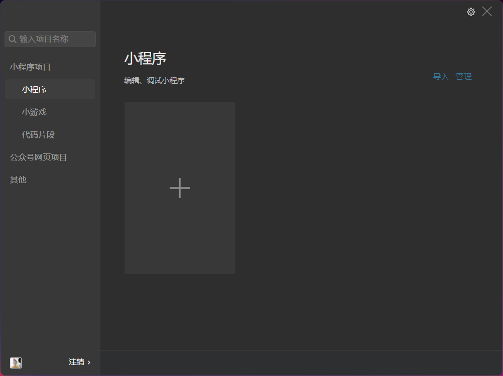
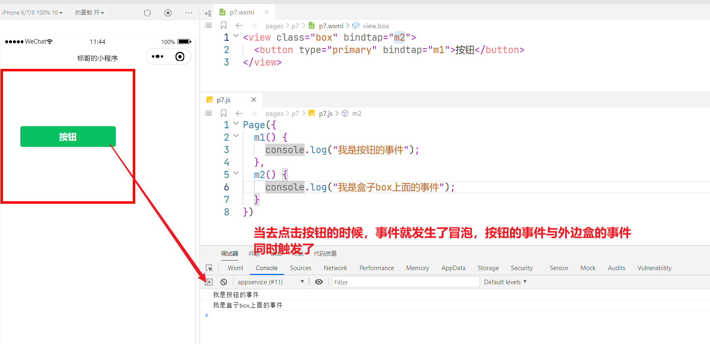

## 微信小程序开发

### 一、微信小程序文档

[微信开放文档 (qq.com)](https://developers.weixin.qq.com/miniprogram/dev/framework/)

```
https://developers.weixin.qq.com/miniprogram/dev/framework/
```

微信小程序有一套完整的开发文档，所有的内容全部都在里面，然后要注意，微信小程序是基于vue的生态的，所以只要是掌握了vue的开发，对于微信小程序来说是非常容易上手的

### 二、开发工具

https://servicewechat.com/wxa-dev-logic/download_redirect?type=win32_x64&from=mpwiki&download_version=1062210310&version_type=1


### 三、微信小程序的特点

> 一般情况下，如果碰到面试的时候面试到微信小程序，如果面试官问：“你是怎么看待微信小程序的，它有什么特点”

1. 微信小程序是界于webApp与原生APP之间的，它既具备webApp的传播快速的特点，也具备原生APP的的强大功能
2. 开发快速，相较于原生APP来说它只用开发一个版本就可以发，因为只要终端上面安装了微信就可以直接使用这个小程序；而如果要开发原生的webApp，这个时个就很麻烦，因为可能既要开发androidr的版本，还要开发ios的版本
3. 微信小程序也是基于组件化的开发，它也是一种类似于`mvvm`的开发方式,这一种开发方式与之前所学习的vue是一样的，所以有了vue的基础以后上手会非常快


> 上图就是微信小程序官网上面所说的小程序开发与普通网页开发的区别
>
> 在上图当有一个注意事项要说明，小程序没有DOM与BOM。

### 四、小程序的界面



上图就是小程序安装成功以后界面，我们可以在这个界面上面创建自己小程序

### 五、小程序的创建


上图就是小程序项目的创建，有几个点要说明一下

1. 小程序的AppID可以使用测试账号，也可以自己注册申请一个账号，如果使用测试账号，则不可以进行云开发【对于前端开发者而言，小程序的云开发还是非常有必要的】
2. 小程序里面有很多模块可以提供给我们使用，但明些模块会收费的，酌情使用

### 六、小程序的开发界面


### 七、小程序的项目文件

当一个小程序创建成功以后，它有如下的几个文件


1. `pages`相当于vue开发当中的`views`目录，存放所有的页面的，它的每一个页面都是一个文件夹，如上面的`index`就是一个文件夹
2. `.eslintrc.js`代表了当前代码的格式是什么样子，不用理会
3. `app.js`这是微信小程序的启动文件，小程序就是从这里启动的，也相当于我们vue开发里面的`main.js`文件
4. `app.json`是整个小程序的配置文件，它可以配置一基本小程序的基本信息，如`titleBar/tableBar`等相关信息的配置
5. `app.wxss`这一个是小程序的全局样式文件
6. `project.config.js`小程序的配置信息，相当于`webpack`配置，可理解为vue开当中的`vue.config.js`文件

### 八、小程序的页面结构

之前也讲过，小程序的所有页面都放在`pages`的目录下面，而每一个页面都会以一个文件夹的形式存在


这个时候我们可以看到`index`目录下在就会有4个文件，其实这4个文件非常好理解

| 小程序 | 网页   | vue          |
| ------ | ------ | ------------ |
| `wxml` | `html` | `<template>` |
| `wxss` | `css`  | `<style>`    |
| `js`   | `js`   | `<script>`   |
| `json` | `json` | `json`       |

通过上面的对比其实也可以发现一个特点，小程序就是将原来的文件的后缀名改了一下，也可以理解为它将`vue`文件里面的几个部分进行了拆分


### 九、小程序新建页面

小程序如果要新建页面，有2种常用的方法

**第一种方式**

* 先在`pages`的目录下面新建一个文件夹

* 在新建的文件夹上面点击鼠标右键，选择新建`Page`

  

  当我们支新建page以后，这个时候它会自动的帮我们去创建4个文件


每一个创建好以后的网页都会在`app.json`的这个文件下面`pages`的选项下面完成这个记录

**第二种方法**

这一种方法在工作当中我们经常使用

我们都知道了所有的页面最终都会在`app.json`的页面下面`pages`里面进行记录

所以，直接在`pages`的选项下面配置好以后，它会自动帮我们创建小程序以的页面

### 十、小程序的首页面设置

现在我们已经有了3个页面了，怎么样设置小程序的启动页面呢？


### 十一、app.json

这个文件是小程序的全局配置文件

```json
{
  "pages": [
    "pages/p1/p1",
    "pages/index/index",
    "pages/p2/p2"
  ],
  "window": {
    "backgroundTextStyle": "light",
    "navigationBarBackgroundColor": "#fff",
    "navigationBarTitleText": "Weixin",
    "navigationBarTextStyle": "black"
  },
  "style": "v2",
  "sitemapLocation": "sitemap.json"
}
```

在这个文件里面，我们已经看到了`pages`是用来配置页面的，而这个`window`就是用于配置整个

小程序的窗口的

具体可以参考官

[全局配置 | 微信开放文档 (qq.com)](https://developers.weixin.qq.com/miniprogram/dev/reference/configuration/app.html#window)

```
https://developers.weixin.qq.com/miniprogram/dev/reference/configuration/app.html#window
```

### 十二、小程序的组件wxml

小程序是基于组件化开发的，它不能定标签，它所有的一切都是虚拟DOM，也就是组件

```
https://developers.weixin.qq.com/miniprogram/dev/component/
```

```html
<!-- 轮播图 -->
<swiper indicator-dots 	indicator-active-color="#ff0000">
  <swiper-item>
    <image src="/images/item1.jpg"></image>
  </swiper-item>
  <swiper-item>
    <image src="/images/item2.jpg"></image>
  </swiper-item>
  <swiper-item>
    <image src="/images/item3.jpg"></image>
  </swiper-item>
  <swiper-item>
    <image src="/images/item4.jpg"></image>
  </swiper-item>
</swiper>
```

小程序本身就提供了很多的组件来供我们使用，这样我们就可以不信赖于其它第三方的组件库

> 在之前的vue的开发的时候，我们可以还需要借用于`vant`或`element-plus`来完成操作，现在的小程序已经有了自己的组件了

### 十三、小程序的样式wxss

小程序与以前的CSS是一样的，但是这里要注意，它的后缀名叫`wxss`，并且当前的样式文件wxss只作用于当前的网页文件wxml


目前的微信小程序的选择器只支持上面的几种，其它的暂时先不要使用。我们还是优先使用`class`选择器

```css
.box1{
  color: red;
  border: 1px solid black;
  height: 50px;
}
```


`wxss`里面扩展了2个新的东西，其中最麻烦的就是`rpx`的单位

在我们以前使用单位的时候，我们会使用`rem/px`等做为单位，但是微信小程序推荐使用`rpx`来做为单位

**尺寸单位**

- rpx（responsive pixel）: 可以根据屏幕宽度进行自适应。规定屏幕宽为750rpx。如在 iPhone6 上，屏幕宽度为375px，共有750个物理像素，则750rpx = 375px = 750物理像素，1rpx = 0.5px = 1物理像素。


所以我们在进行开的时候，尽量使用`iphone 6`来进行开发

### 十四、小程序的数据绑定「重点」

小程序执行也是也`mvvm`的原则，也就是数据驱动页面的原则

```javascript
/**
 * 小程序执行的也是数据驱动页面
 */
Page({
  // 这个data就是负责接管页面的数据
  data:{
	userName:"标哥哥",
    x:"box"
  }
});

```

 在当前而面的`js`文件里面，有一个`data` 属性，这个属性下面所定义的所有的数据都可以直接在页面上面使用

#### 1. 普通渲染

```html
<view>{{userName}}</view>
<!-- 这里就要注意，它所有的地方全部使用的都是是{{}} -->
<view id="{{x}}">属性也是使用花括号来进行的</view>
```

#### 2.条件渲染

> 这个东西在以前学习的vue里面，使用`v-if/v-show`来进行的，现在换了一个指令，叫`wx:if`

```html
<view wx:if="{{1<2}}">标哥哥</view>
<view wx:else>小姐姐</view>
```

当然，多个条件在一起也是可以的

```html
<view wx:if="{{1 > 5}}"> 1 </view>
<view wx:elif="{{3 > 2}}"> 2 </view>
<view wx:else> 3 </view>
```

#### 3.列表渲染

> 这个东西与之前在vue里面所学习的`v-for`保持一致

```js
Page({
  data: {
    userList: ["张三", "李四", "王五", "赵六", "田七"]
  }
})
```

现在将上面的`userList`进行渲染

```html
<!-- 
  在以前的vue里面v-for="(item , index) in userList"
 -->
<view wx:for="{{userList}}" wx:key="item">{{item}}----{{index}}</view>
```

> 代码说明：
>
> 1. 遍历出来的每一项默认叫`item`
> 2. 遍历出来的每一项的索引默认叫`index`
> 3. 在执行`wx:for`的列表渲染的时候，与`vue`是一样的，要有一个唯一的`key`来说明

如果希望改变默认遍历出来的每一项的名称或索引，可以通过下面的方式

```html
<view wx:for="{{userList}}" wx:for-item="a" wx:for-index="idx" wx:key="a">{{a}}----{{idx}}</view>
```

* 通过`wx:for-item`来实现对遍历出来的每一项的名称的更改
* 通过`wx:for-index`来实现对遍历出来的每一项的索引更改

同时几种渲染也可以结合在一起使用

```html
<view class="{{index%2!=0?'active':null}}" wx:for="{{userList}}">{{item}}</view>
```

### 十五、小程序里面的事件

小程序里面也有很多事件，它的事件绑定有2种方式

#### 1. 小程序的bind事件绑定

```html
<button type="primary" bindtap="sayHello">按钮一</button>
```

小程序在进行事件绑定的时候，后面的函数是一个函数名，不能添加括号

```js
Page({
  // 小程序页面里面的事件方法，不用写在methods里面，直接写在page下面就可以了
  sayHello(event) {
    console.log("hello world");
  }
})
```

> 通过上面的代码，我们可以得到，如果要绑定一个事件，我们可以使用`bind事件名`来进行。同时要注意，小程序里面的事件是直接写在`page`下面

这一种事件绑定会有一个缺点，它会形成事件冒泡



<span style="color:red;font-weight:bold;font-size:22px">如何去阻止事件冒泡</span>

在以前的dom里面，我们可以使用`event.stopPropagation()`来完成阻止事件冒泡，但是在微信小程序里面是可以的


根本的原则之前已经说过，微信小程序没有DOM，也没有BOM。所以就不能使用DOM的操作方法

#### 2. 小程序的catch事件绑定

> 联想记忆，在vue开发里面， 如果想进行阻止事件冒泡可以使用事件修饰符`@click.stop`这种方式

之前的事件绑定我们使用的是bind来进行的，但是bind的事件绑定是会有事件冒泡的，如果不想产生事件冒泡，则要使用`catch`进行事件绑定


当我们使用`catch`进行事件绑一定的时候，我们就发现已经没有事件冒泡的行为了

#### 3.事件对象event

小程序里面的事件与普通的DOM事件有一点相信，它们的事件方法上面都会默认接收一个`event`的事件对象


```javascript
m1(event) {
    console.log("我是按钮的事件");
    console.log(event);
},
```

这个事件对象目前阶段可以给我们带来的作用就是用于小程序的方法传参


小程序的事件方法里面如果要接收事件参数，则必须使用`event`对象


在事件对象里面，我们可以看到2个很熟悉的东西

1. `event.target`事件的触发者
2. `event.currentTarget`事件的绑定者


在上面的代码里面，我们可以看到，小程序的事件方法的参数传递采用的是`dataset`的形式完成

### 十六、小程序的数据data

 之前就跟同学们说过，微信小程序与我们之前所学习的`vue`非常的像，它里面都有一个`data`是用于页面的数据的

在之前提到MVVM的概念的时候，数据改变页面改变，页面改变，数据也改变，这是vue进行数据绑定的特点

**但是在微信小程序里面，这个地方有一点区别**


我们可以在调试工具里面看到所定义的`data`的数据

#### 1. 单向数据绑定

 这一种情况下面，如果我们要是改变了`data`里面的值，页面是并不会发生变化的


通过这一种方式直接赋值，值虽然变了，但是页面并不会重新渲染

#### 2.双向数据绑定

如果要实现双向的数据绑定，这个时候我们可以就要使用一种特殊的方法


通过`setData`这一种方式进行的赋值，它会改变值以后，再将页面重新渲染

:tipping_hand_man: **注意事项**：`setData`这个方法是异常的，它在赋值结束以后会有一个回调函数，如果希望某些操作在赋值结束以后再去进行，我们就可以使用回调函数

```javascript
//我们希望数据改变以后，页面也云改变
this.setData({
    userName: "我是雪公主，我今天在武汉下雪"
},()=>{
    console.log("我是回调函数，它会在赋值结束以后云执行");
    console.log(this.data.userName);
})
```

### 十七、案例一


我们希望在点击的时候，实现这一种切换效果

> 在这个案例里面，我们涉及到布局，涉及到样式，还有事件及数据渲染

```html
<view class="movie-type">
  <text class="{{currentIndex==0?'active':null}}" bindtap="changeCurrentIndex" data-index="0">热映</text>
  <text class="{{currentIndex==1?'active':null}}" bindtap="changeCurrentIndex" data-index="1">待映</text>
  <text class="{{currentIndex==2?'active':null}}" bindtap="changeCurrentIndex" data-index="2">经典电影</text>
</view>
```

```css
.movie-type{
  border-bottom: 2rpx solid gray;
  height: 80rpx;
  display: flex;
  flex-direction: row;
}
.movie-type text{
  display: flex;
  justify-content: center;
  align-items: center;
  font-size: 24rpx;
  font-weight: bold;
  color: gray;
  padding: 0 20rpx;
}
.movie-type text.active{
  color: black;
  position: relative;
}
.movie-type text.active::after{
  content: "";
  position: absolute;
  height: 4rpx;
  background-color: #f7504d;
  left: 0;
  right: 0;
  bottom: 0;
  width: 50rpx;
  margin: auto;
}
```

```js
Page({
  data: {
    currentIndex: 0
  },
  changeCurrentIndex(event) {
    //现在要拿到参数data-index
    let index = event.currentTarget.dataset.index;
    this.setData({
      currentIndex: index
    });
  }
})
```

### 十八、关于`tabBar`的配置


小程序是做app的，如果我们想配置类似于上面的东西，应该怎么办呢？ 在vue的开发下面，我们可以使用嵌套路由去完成，在微信小程序里面，做起来，更加简单


首先，我们准备所需要使用的图片

接下来，创建四个所需要使用的页面

```json 
{
  "pages": [
    "pages/movie/movie",
    "pages/cinema/cinema",
    "pages/plain/plain",
    "pages/my/my"
  ],
  "window": {
    "backgroundTextStyle": "light",
    "navigationBarBackgroundColor": "#fff",
    "navigationBarTitleText": "Weixin",
    "navigationBarTextStyle": "black"
  },
  "style": "v2",
  "sitemapLocation": "sitemap.json"
}
```

> pages里面就是我们所需要使用的页面

```json
{
  "pages": [
    "pages/movie/movie",
    "pages/cinema/cinema",
    "pages/plain/plain",
    "pages/my/my"
  ],
  "window": {
    "backgroundTextStyle": "light",
    "navigationBarBackgroundColor": "#fff",
    "navigationBarTitleText": "猫眼电影",
    "navigationBarTextStyle": "black"
  },
  "style": "v2",
  "sitemapLocation": "sitemap.json",
  "tabBar": {
    "selectedColor": "#f7504d",
    "list": [
      {
        "text": "影片",
        "pagePath": "pages/movie/movie",
        "iconPath": "/images/movie.png",
        "selectedIconPath": "/images/movie_selected.png"
      },{
        "text": "影院",
        "pagePath": "pages/cinema/cinema",
        "iconPath": "/images/cinema.png",
        "selectedIconPath": "/images/cinema_selected.png"
      },{
        "text": "排片",
        "pagePath": "pages/plain/plain",
        "iconPath": "/images/plain.png",
        "selectedIconPath": "/images/plain_selected.png"
      },{
        "text": "我的",
        "pagePath": "pages/my/my",
        "iconPath": "/images/my.png",
        "selectedIconPath": "/images/my_selected.png"
      }
    ]
  }
}
```

在上面的`app.json`的文件里面，我们可以看到，使用了`tabBar`这个选项，然后`list`就是用于配置的

具体的配置信息，可以参那下面

[全局配置 | 微信开放文档 (qq.com)](https://developers.weixin.qq.com/miniprogram/dev/reference/configuration/app.html#tabBar)

```
https://developers.weixin.qq.com/miniprogram/dev/reference/configuration/app.html#tabBar
```

----

### 十九、小程序的页面跳转

在之前进行vue的开发的时候，我们使用过`vue-router`进行页面的跳转，现在在微信小程序里面，我们可以使用内置的方法来完成跳转

1. `wx.navigateTo`跳转到某一个页面， 原页面是不会消失，并且，新的页面可以通过`titleBar`返回过来[这个相当于`router.push`]

   ```javascript
   wx.navigateTo({
       url:"/pages/p2/p2"
   });
   ```

2. `wx.navigateBack()`返回之前的页面[这个就相当于`router.back`]

3. `wx.redirectTo()`跳转到某一个页面，原页面会销毁，不能再返回到原页面了[这相相当于`router.replace()`]

   ```javascript
   wx.redirectTo({
       url: "/pages/p2/p2"
   });
   ```

4. `wx.switchTab()`这个方法是用于跳转`tabBar`里面的页面的

   

   简而言之就是如果想在下面的四个页面之间跳转，我们就只要使用`swtichTab`这一种方式


> **小说明**：虽然`redirectTo`可以跳`tabBar`的页面，但是我们建议这么种

### 二十、微信小程序界面反馈API

1. `wx.showLoading()`显示加载动画

2. `wx.hideLoading()`隐藏加载的动画

3. `wx.showToast()`显示轻消息提示

4. `wx.hideToast()`隐藏轻消息提示

5. `wx.showModel()`显示模块框

   ```javascript
   wx.showModal({
       title:"标哥提示",
       content:"标哥说，你们在睡觉",
       confirmText:"肯定一点",
       cancelText:"我取消了",
       // showCancel:false,
       success:result=>{
           //这里的success代表用户点击了确定或取消以后
           if(result.confirm){
               //代表用户点击的是确定
           }
           else{
               //用户点击的就是取消
           }
       }
   })
   ```

6. `wx.showActionSheet()`显示操作列表

   ```javascript
   wx.showActionSheet({
       itemList: ["登录", "注册"],
       success:result=>{
           if(result.tapIndex==0){
   
           }
           else if(result.tapIndex==1){
   
           }
       }
   })
   ```

7. `wx.previewImage()`预览图片

上面所展示的都是常用的，还有很多


### 二十一、系统相关API

1. `wx.getSystemInfoAsync()`获取系统信息

2. `wx.getNetworkType()`获取当前设置的网络状态

3. `wx.getLocation()`获取当前的定位信息，注意，新版本的微信小程序里面如果要使用定位则需要配置，并申请授权，在`app.json`里面进行如下配置

   ```javascript
   "requiredPrivateInfos": [
       "chooseAddress",
       "chooseLocation",
       "getLocation",
       "choosePoi"
   ]
   ```

4. `wx.openLocation()`打开地图，可以设置经度与纬度

   ```javascript
   wx.getLocation({
       isHighAccuracy:true,
       success:res=>{
           console.log("定位成功");
           console.log(res);
           //可以再将这个东西放在地图里面显示出来
           wx.openLocation({
               latitude: res.latitude,
               longitude: res.longitude,
           })
       },
       fail:error=>{
           console.log("定位失败");
           console.log(error);
       }
   })
   ```

5. `wx.setStorageSync(key,value)`设置一个缓存

   ```javascript
   // 设置一个缓存
   wx.setStorageSync('userName', "张三");
   //小程序里面的缓存是可以缓存对象的，如果是以前的浏览器，要缓存对象，必须转成JSON，但是小程序不用，直接缓存是
   let dog = {
       nickName: "大黄",
       age: 5
   }
   wx.setStorageSync('dog', dog);
   ```

   这个缓存，你不清理，它会一直存在，它和`localStorage`的特性是一样的

6. `wx.getStorageSync(key)`根据一个key去获取一个缓存，如果获取不到就是一个空的字符串

7. `wx.removeStorageSync(key)`根据一个key去删一个缓存

8. `wx.clearStorageSync()`清除一个缓存

   > 缓存在开发当中还是比较重要的，之前所讲过的`vuex`的持久化，或`pinia`的持久化，都是通过缓存去实现的，如果小程序也想实现持久化的操作，也应该是使用缓存